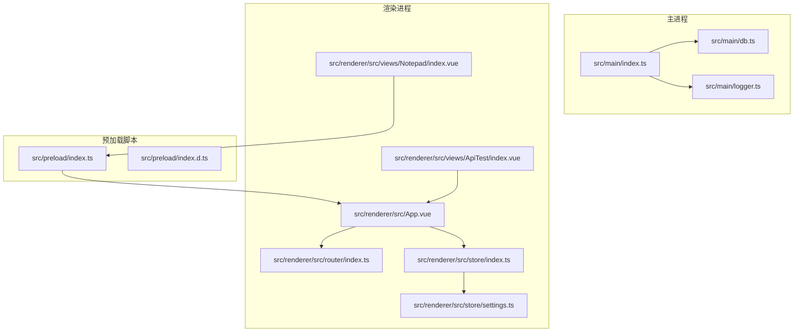
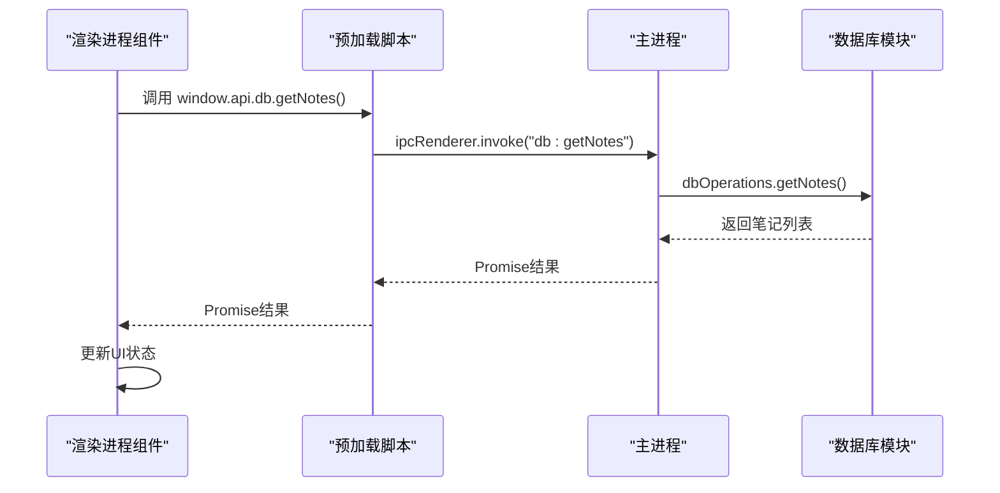
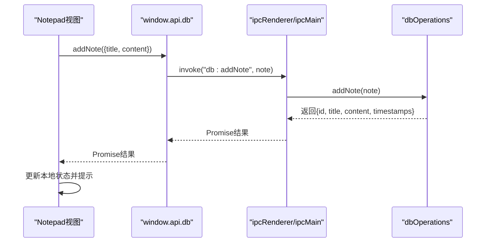
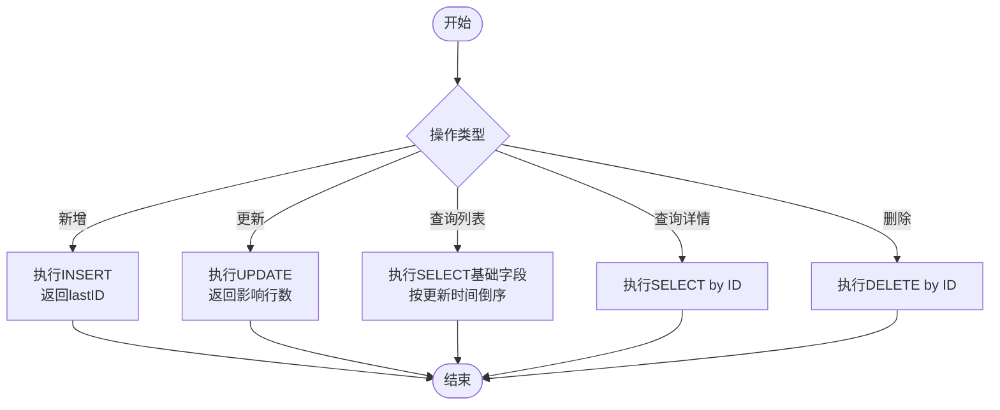
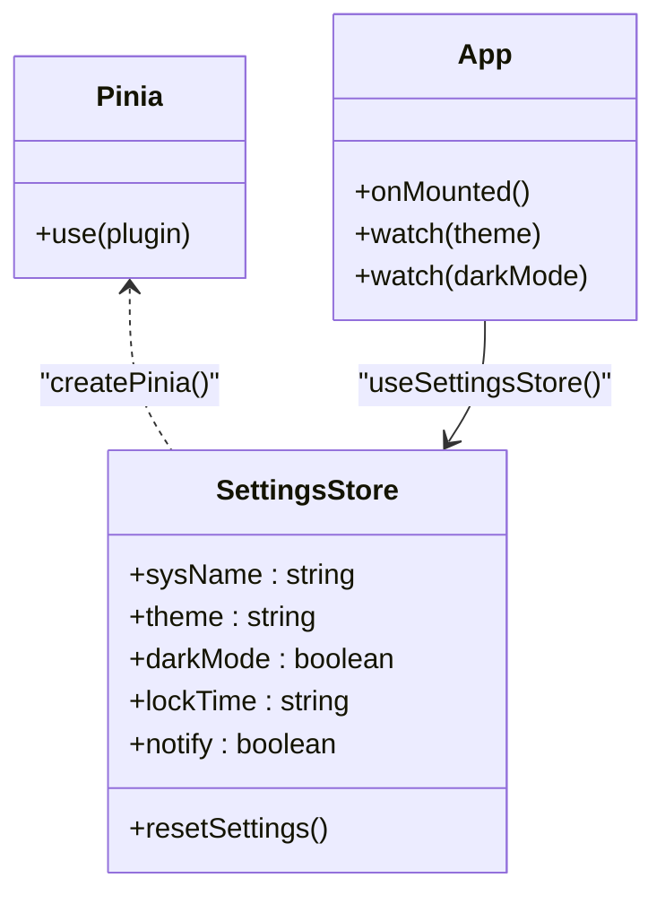
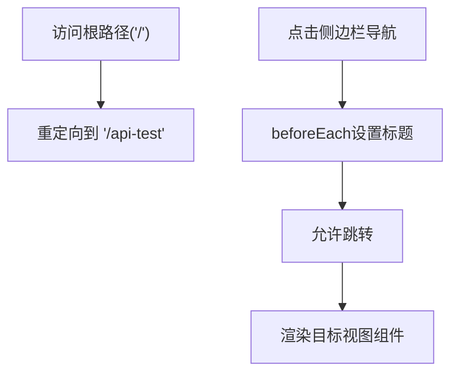
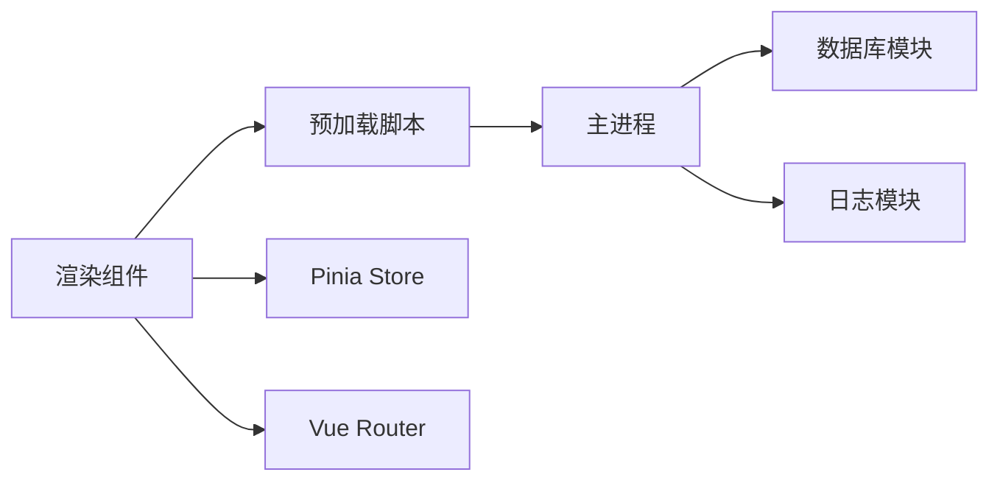

# API参考文档

<cite>
**本文档引用的文件**
- [src/main/index.ts](file://src/main/index.ts)
- [src/main/db.ts](file://src/main/db.ts)
- [src/main/logger.ts](file://src/main/logger.ts)
- [src/preload/index.ts](file://src/preload/index.ts)
- [src/preload/index.d.ts](file://src/preload/index.d.ts)
- [src/renderer/src/router/index.ts](file://src/renderer/src/router/index.ts)
- [src/renderer/src/store/index.ts](file://src/renderer/src/store/index.ts)
- [src/renderer/src/store/settings.ts](file://src/renderer/src/store/settings.ts)
- [src/renderer/src/views/Notepad/index.vue](file://src/renderer/src/views/Notepad/index.vue)
- [src/renderer/src/views/ApiTest/index.vue](file://src/renderer/src/views/ApiTest/index.vue)
- [src/renderer/src/App.vue](file://src/renderer/src/App.vue)
- [package.json](file://package.json)
</cite>

## 目录

1. [简介](#简介)
2. [项目结构](#项目结构)
3. [核心组件](#核心组件)
4. [架构总览](#架构总览)
5. [详细组件分析](#详细组件分析)
6. [依赖关系分析](#依赖关系分析)
7. [性能考虑](#性能考虑)
8. [故障排除指南](#故障排除指南)
9. [结论](#结论)
10. [附录](#附录)

## 简介

本API参考文档面向MyTool项目的开发者与集成者，系统性梳理以下四类API：

- IPC通信API：主进程与渲染进程之间的消息传递协议、参数格式与返回值规范
- 数据库操作API：SQLite封装的笔记数据CRUD接口、数据模型与错误处理机制
- 状态管理API：基于Pinia的Store接口设计、状态变更与持久化策略
- 路由API：页面导航、路由守卫与参数传递规则

文档同时提供各API的使用示例、参数说明、异常处理建议以及版本兼容性与迁移指南，帮助快速理解与正确使用。

## 项目结构

MyTool采用Electron + Vue 3 + TypeScript的典型桌面应用架构，主要分为三部分：

- 主进程（src/main）：负责应用生命周期、IPC注册、数据库初始化与日志管理
- 预加载脚本（src/preload）：通过contextBridge暴露受控API给渲染进程
- 渲染进程（src/renderer）：包含路由、状态管理、视图组件与业务逻辑

图表来源

- [src/main/index.ts:1-112](file://src/main/index.ts#L1-L112)
- [src/main/db.ts:1-100](file://src/main/db.ts#L1-L100)
- [src/main/logger.ts:1-42](file://src/main/logger.ts#L1-L42)
- [src/preload/index.ts:1-37](file://src/preload/index.ts#L1-L37)
- [src/preload/index.d.ts:1-22](file://src/preload/index.d.ts#L1-L22)
- [src/renderer/src/App.vue:1-47](file://src/renderer/src/App.vue#L1-L47)
- [src/renderer/src/router/index.ts:1-79](file://src/renderer/src/router/index.ts#L1-L79)
- [src/renderer/src/store/index.ts:1-10](file://src/renderer/src/store/index.ts#L1-L10)
- [src/renderer/src/store/settings.ts:1-34](file://src/renderer/src/store/settings.ts#L1-L34)
- [src/renderer/src/views/Notepad/index.vue:1-599](file://src/renderer/src/views/Notepad/index.vue#L1-L599)
- [src/renderer/src/views/ApiTest/index.vue:1-163](file://src/renderer/src/views/ApiTest/index.vue#L1-L163)

章节来源

- [src/main/index.ts:1-112](file://src/main/index.ts#L1-L112)
- [src/preload/index.ts:1-37](file://src/preload/index.ts#L1-L37)
- [src/renderer/src/router/index.ts:1-79](file://src/renderer/src/router/index.ts#L1-L79)
- [src/renderer/src/store/index.ts:1-10](file://src/renderer/src/store/index.ts#L1-L10)
- [src/renderer/src/store/settings.ts:1-34](file://src/renderer/src/store/settings.ts#L1-L34)

## 核心组件

本节概述四大API域的职责与边界：

- IPC通信API：通过ipcMain/ipcRenderer建立主/渲染双向通道，封装数据库与日志操作
- 数据库API：SQLite封装，提供笔记的增删改查与时间戳管理
- 状态管理API：Pinia Store + 持久化插件，管理主题、语言等系统设置
- 路由API：Vue Router配置，含页面元信息与简单路由守卫

章节来源

- [src/main/index.ts:58-92](file://src/main/index.ts#L58-L92)
- [src/main/db.ts:58-99](file://src/main/db.ts#L58-L99)
- [src/renderer/src/store/index.ts:1-10](file://src/renderer/src/store/index.ts#L1-L10)
- [src/renderer/src/store/settings.ts:4-33](file://src/renderer/src/store/settings.ts#L4-L33)
- [src/renderer/src/router/index.ts:3-79](file://src/renderer/src/router/index.ts#L3-L79)

## 架构总览

下图展示IPC通信、数据库与渲染层的交互流程，体现“预加载桥接 -> 主进程处理 -> 数据库访问”的标准链路。

图表来源

- [src/preload/index.ts:7-12](file://src/preload/index.ts#L7-L12)
- [src/main/index.ts:80-85](file://src/main/index.ts#L80-L85)
- [src/main/db.ts:82-86](file://src/main/db.ts#L82-L86)

## 详细组件分析

### IPC通信API

- 暴露范围
  - 预加载脚本通过contextBridge向渲染进程暴露window.api对象，包含db与log两个子域
  - 类型声明位于index.d.ts中，确保TypeScript静态校验
- 主进程注册
  - 在应用准备完成后动态导入数据库模块，并注册db系列IPC处理器
  - 同时注册日志相关IPC处理器（获取路径、打开目录、变更路径）
- 调用约定
  - 渲染进程使用ipcRenderer.invoke进行请求-响应式调用
  - 主进程使用ipcMain.handle处理请求并返回Promise结果
- 错误处理
  - 主进程加载数据库模块失败时记录错误并继续启动窗口
  - 渲染进程在调用失败时捕获异常并提示用户

章节来源

- [src/preload/index.ts:5-18](file://src/preload/index.ts#L5-L18)
- [src/preload/index.d.ts:6-18](file://src/preload/index.d.ts#L6-L18)
- [src/main/index.ts:75-92](file://src/main/index.ts#L75-L92)
- [src/main/index.ts:80-85](file://src/main/index.ts#L80-L85)
- [src/main/logger.ts:25-39](file://src/main/logger.ts#L25-L39)

#### IPC接口清单

- db:addNote
  - 参数：笔记对象（标题、内容）
  - 返回：包含新增记录ID与时间戳的对象
  - 异常：数据库写入失败抛出错误
- db:updateNote
  - 参数：包含ID与更新字段的笔记对象
  - 返回：更新后的笔记对象（含更新时间）
  - 异常：数据库更新失败抛出错误
- db:getNotes
  - 参数：无
  - 返回：笔记列表（仅包含基础字段）
  - 异常：查询失败抛出错误
- db:getNoteById
  - 参数：笔记ID
  - 返回：单条笔记详情或null
  - 异常：查询失败抛出错误
- db:deleteNote
  - 参数：笔记ID
  - 返回：布尔值（删除成功）
  - 异常：删除失败抛出错误
- log:getPath
  - 参数：无
  - 返回：当前日志文件路径
- log:openFolder
  - 参数：无
  - 返回：void（打开日志所在目录）
- log:changePath
  - 参数：无
  - 返回：新的日志文件路径（用户选择目录后生效）

章节来源

- [src/preload/index.ts:7-12](file://src/preload/index.ts#L7-L12)
- [src/main/index.ts:80-85](file://src/main/index.ts#L80-L85)
- [src/main/index.ts:61-73](file://src/main/index.ts#L61-L73)
- [src/main/db.ts:60-98](file://src/main/db.ts#L60-L98)

#### IPC调用序列示例

图表来源

- [src/renderer/src/views/Notepad/index.vue:312-344](file://src/renderer/src/views/Notepad/index.vue#L312-L344)
- [src/preload/index.ts:7-12](file://src/preload/index.ts#L7-L12)
- [src/main/index.ts:80-85](file://src/main/index.ts#L80-L85)
- [src/main/db.ts:60-67](file://src/main/db.ts#L60-L67)

### 数据库操作API

- 数据库类型与位置
  - SQLite，文件位于应用用户数据目录下的mytool_notes.db
- 表结构
  - notes表：id（自增主键）、title、content、create_time、update_time
- 操作接口
  - 新增：插入标题、内容与时间戳，返回包含ID与时间戳的新记录
  - 更新：按ID更新标题、内容与更新时间，返回更新后的记录
  - 查询：获取笔记列表（仅基础字段，按更新时间倒序），按ID获取详情
  - 删除：按ID删除记录，返回布尔值
- 错误处理
  - 数据库初始化失败时记录错误日志
  - 所有数据库操作均包装为Promise，失败时抛出错误供上层捕获

章节来源

- [src/main/db.ts:15-35](file://src/main/db.ts#L15-L35)
- [src/main/db.ts:58-99](file://src/main/db.ts#L58-L99)

#### 数据库操作流程图

图表来源

- [src/main/db.ts:58-99](file://src/main/db.ts#L58-L99)

### 状态管理API（Pinia）

- Store创建与持久化
  - 在应用入口创建Pinia实例并启用持久化插件
  - settings store通过defineStore定义，包含系统名称、主题色、暗黑模式、锁屏时间、通知开关等状态
  - 通过persist: true启用持久化，重启后自动恢复
- 响应式联动
  - App组件监听settings store变化，动态设置页面标题、主题色与暗黑模式
- 使用示例
  - 在组件中通过useSettingsStore获取store实例，读取/修改状态
  - 通过resetSettings重置默认配置

章节来源

- [src/renderer/src/store/index.ts:1-10](file://src/renderer/src/store/index.ts#L1-L10)
- [src/renderer/src/store/settings.ts:4-33](file://src/renderer/src/store/settings.ts#L4-L33)
- [src/renderer/src/App.vue:8-37](file://src/renderer/src/App.vue#L8-L37)

#### Store类图

图表来源

- [src/renderer/src/store/index.ts:1-10](file://src/renderer/src/store/index.ts#L1-L10)
- [src/renderer/src/store/settings.ts:4-33](file://src/renderer/src/store/settings.ts#L4-L33)
- [src/renderer/src/App.vue:1-47](file://src/renderer/src/App.vue#L1-L47)

### 路由API

- 路由配置
  - 使用createRouter与createWebHashHistory
  - 定义登录页与布局页，布局页内嵌多个功能页（接口测试、格式转换、本地记事本、系统设置）
- 页面元信息
  - 每个路由可设置标题、图标、隐藏等元信息
- 路由守卫
  - beforeEach中设置页面标题；预留鉴权逻辑（如token检查）
- 参数传递
  - 通过路由参数与查询字符串传递；当前实现未使用动态参数

章节来源

- [src/renderer/src/router/index.ts:3-79](file://src/renderer/src/router/index.ts#L3-L79)

#### 路由流程图

图表来源

- [src/renderer/src/router/index.ts:17-17](file://src/renderer/src/router/index.ts#L17-L17)
- [src/renderer/src/router/index.ts:65-76](file://src/renderer/src/router/index.ts#L65-L76)

## 依赖关系分析

- 外部依赖
  - Electron、Vue 3、TypeScript、Pinia、Element Plus、@wangeditor/editor等
  - sqlite3用于本地数据库，electron-log用于日志管理
- 内部耦合
  - 预加载脚本与主进程通过IPC紧密耦合
  - 渲染组件依赖预加载API与路由/Store
  - 数据库模块被主进程统一注册，避免跨模块重复初始化

图表来源

- [src/preload/index.ts:1-37](file://src/preload/index.ts#L1-L37)
- [src/main/index.ts:1-112](file://src/main/index.ts#L1-L112)
- [src/main/db.ts:1-100](file://src/main/db.ts#L1-L100)
- [src/main/logger.ts:1-42](file://src/main/logger.ts#L1-L42)
- [src/renderer/src/store/index.ts:1-10](file://src/renderer/src/store/index.ts#L1-L10)
- [src/renderer/src/router/index.ts:1-79](file://src/renderer/src/router/index.ts#L1-L79)

章节来源

- [package.json:23-37](file://package.json#L23-L37)

## 性能考虑

- 数据库查询优化
  - 列表查询仅返回必要字段，减少网络/传输开销
  - 按更新时间倒序，便于热点数据优先展示
- UI交互优化
  - 富文本编辑器使用shallowRef避免深层响应式开销
  - 保存状态通过isSaved与checkIsModified控制，减少不必要的提示
- 日志管理
  - 按日切分日志文件，避免单文件过大
  - 支持用户自定义日志目录，便于运维定位

[本节为通用指导，无需特定文件来源]

## 故障排除指南

- 数据库无法初始化
  - 现象：应用启动但数据库未创建或报错
  - 排查：检查用户数据目录权限与磁盘空间；查看日志输出
  - 参考：数据库初始化与错误日志记录
- IPC调用超时或失败
  - 现象：渲染进程调用window.api.db.\*无响应或报错
  - 排查：确认主进程已注册对应handle；检查预加载脚本暴露的API是否正确
  - 参考：主进程IPC注册与预加载API暴露
- 日志目录变更无效
  - 现象：选择新目录后日志仍写入默认路径
  - 排查：确认对话框未取消；检查setLogPath返回路径
  - 参考：日志路径变更逻辑
- 路由标题未更新
  - 现象：切换页面后document.title未变
  - 排查：确认beforeEach守卫已执行；检查meta.title配置
  - 参考：路由守卫与元信息

章节来源

- [src/main/db.ts:20-35](file://src/main/db.ts#L20-L35)
- [src/main/index.ts:75-92](file://src/main/index.ts#L75-L92)
- [src/preload/index.ts:5-18](file://src/preload/index.ts#L5-L18)
- [src/main/logger.ts:34-39](file://src/main/logger.ts#L34-L39)
- [src/renderer/src/router/index.ts:65-76](file://src/renderer/src/router/index.ts#L65-L76)

## 结论

本API参考文档系统性地梳理了MyTool的IPC通信、数据库、状态管理与路由四大API域，明确了接口规范、数据模型与错误处理策略。通过预加载桥接与主进程统一处理，渲染层以简洁的API完成复杂的数据操作与界面交互。建议在后续迭代中：

- 为IPC接口补充更完善的错误码与异常类型
- 为数据库操作增加事务与批量操作能力
- 为路由守卫补充鉴权与权限控制
- 为Store增加类型约束与单元测试

[本节为总结性内容，无需特定文件来源]

## 附录

### 版本兼容性与迁移指南

- 当前版本
  - 应用版本：1.0.0
  - 依赖：Electron、Vue 3、TypeScript、Pinia、Element Plus、@wangeditor/editor、sqlite3、electron-log等
- 兼容性建议
  - Electron与Node版本升级需验证sqlite3编译与electron-log行为
  - Vue生态升级需同步更新@wangeditor/editor-for-vue与Element Plus版本
  - Pinia升级需检查持久化插件兼容性
- 迁移步骤
  - 升级依赖：npm install
  - 类型检查：npm run typecheck
  - 功能回归：运行单元测试与端到端测试
  - 性能评估：对比数据库查询与UI渲染性能

章节来源

- [package.json:1-61](file://package.json#L1-L61)

### 使用示例索引

- IPC调用示例
  - 新增笔记：调用window.api.db.addNote(note)
  - 更新笔记：调用window.api.db.updateNote(note)
  - 获取列表：调用window.api.db.getNotes()
  - 获取详情：调用window.api.db.getNoteById(id)
  - 删除笔记：调用window.api.db.deleteNote(id)
- 状态管理示例
  - 读取主题色：settingsStore.theme
  - 修改系统名称：settingsStore.sysName = newValue
  - 重置设置：settingsStore.resetSettings()
- 路由导航示例
  - 编程式导航：router.push('/notepad')
  - 设置标题：router.beforeEach中设置document.title

章节来源

- [src/renderer/src/views/Notepad/index.vue:217-344](file://src/renderer/src/views/Notepad/index.vue#L217-L344)
- [src/renderer/src/store/settings.ts:21-28](file://src/renderer/src/store/settings.ts#L21-L28)
- [src/renderer/src/router/index.ts:65-76](file://src/renderer/src/router/index.ts#L65-L76)
