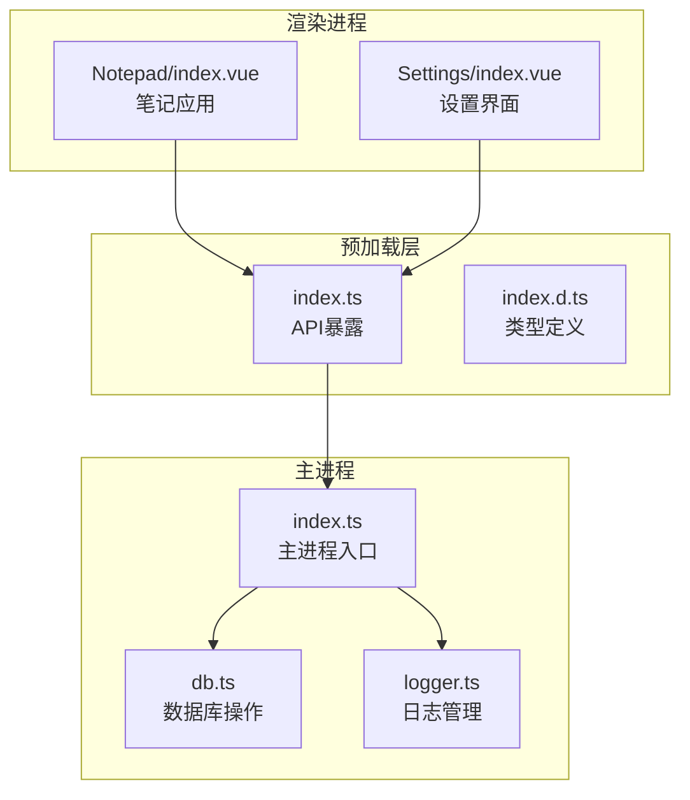
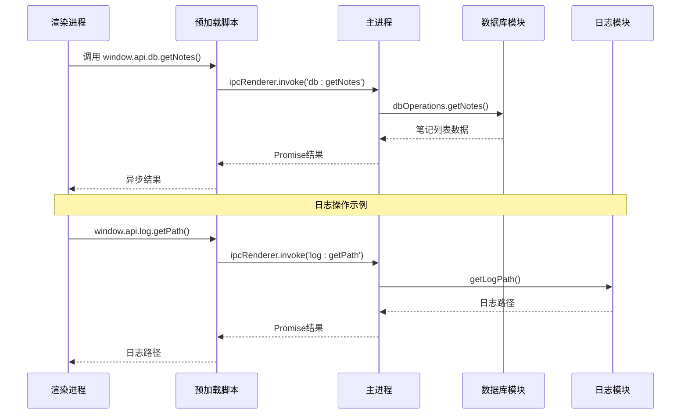
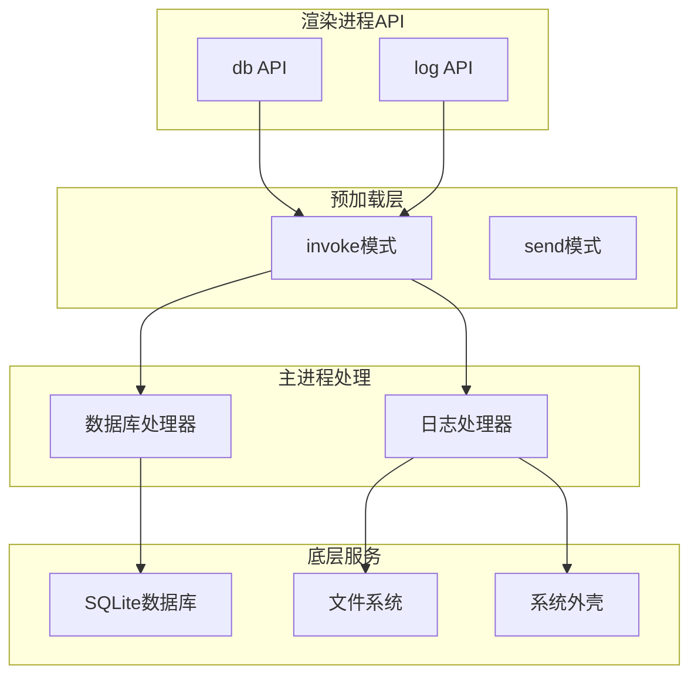
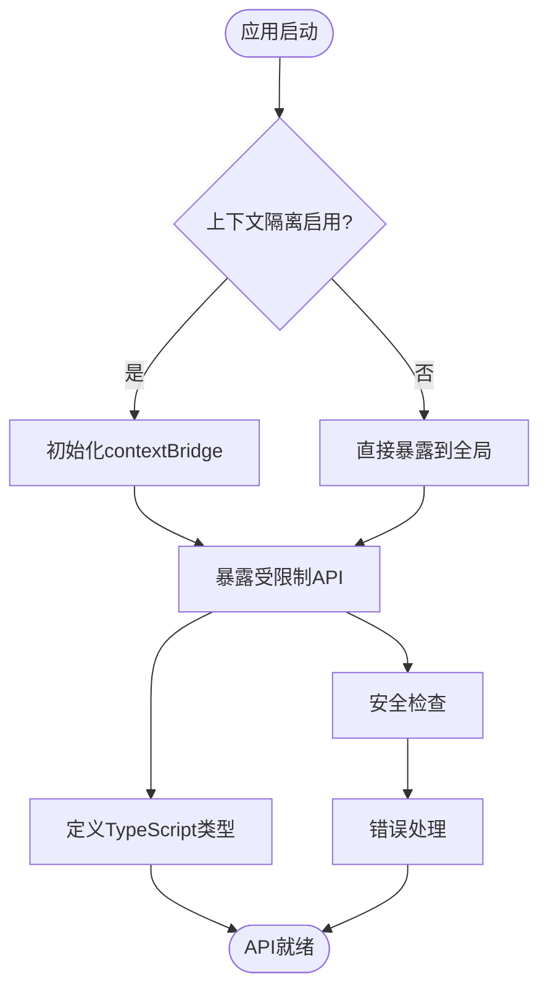
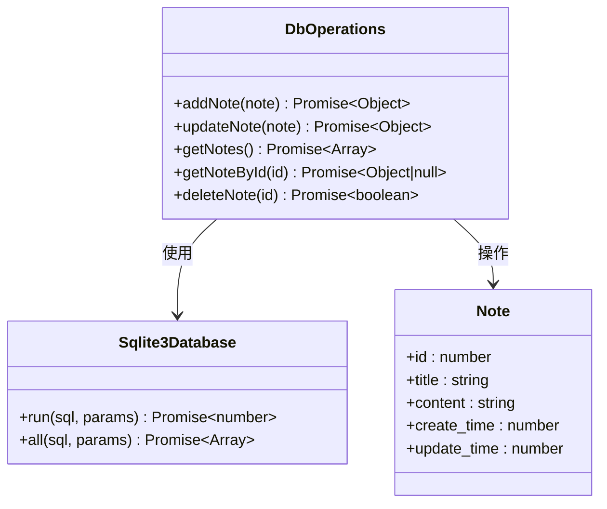
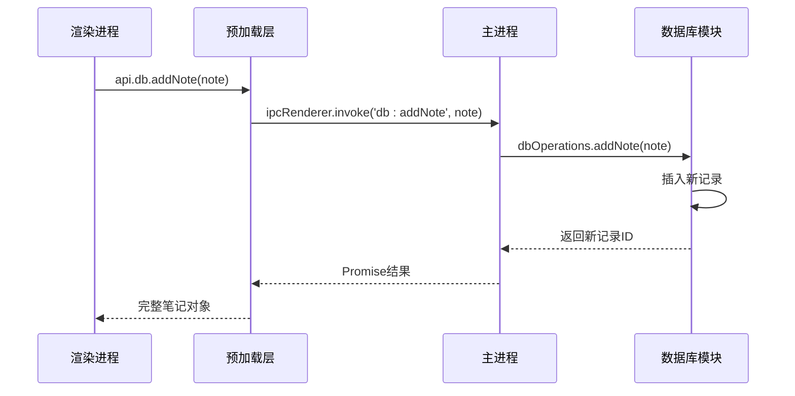
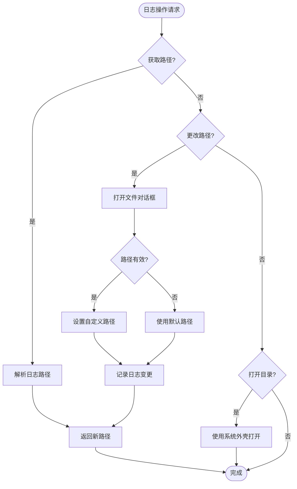
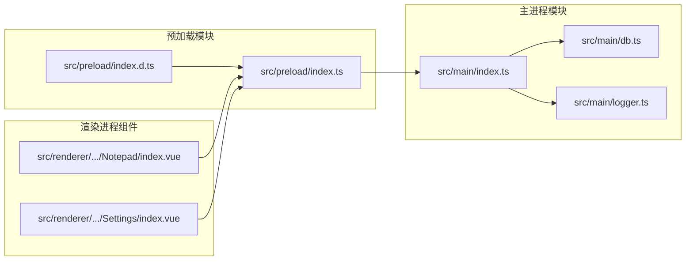
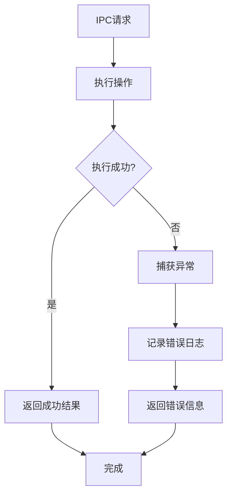

# IPC通信API

<cite>
**本文档引用的文件**
- [src/main/index.ts](file://src/main/index.ts)
- [src/preload/index.ts](file://src/preload/index.ts)
- [src/preload/index.d.ts](file://src/preload/index.d.ts)
- [src/main/db.ts](file://src/main/db.ts)
- [src/main/logger.ts](file://src/main/logger.ts)
- [src/renderer/src/views/Notepad/index.vue](file://src/renderer/src/views/Notepad/index.vue)
- [src/renderer/src/views/Settings/index.vue](file://src/renderer/src/views/Settings/index.vue)
- [package.json](file://package.json)
</cite>

## 目录

1. [简介](#简介)
2. [项目结构](#项目结构)
3. [核心组件](#核心组件)
4. [架构概览](#架构概览)
5. [详细组件分析](#详细组件分析)
6. [依赖关系分析](#依赖关系分析)
7. [性能考虑](#性能考虑)
8. [故障排除指南](#故障排除指南)
9. [结论](#结论)

## 简介

MyTool项目采用Electron框架构建，实现了主进程与渲染进程之间的安全IPC通信机制。本文档详细说明了数据库操作IPC和日志管理IPC的完整API规范，包括消息传递协议、参数格式、返回值规范和错误处理机制。

项目使用了现代的Electron开发模式，通过`contextBridge` API在渲染进程中暴露受限制的Electron功能，确保了上下文隔离的安全性。

## 项目结构

MyTool项目的IPC通信架构基于以下核心文件组织：



**图表来源**

- [src/main/index.ts:1-112](file://src/main/index.ts#L1-L112)
- [src/preload/index.ts:1-37](file://src/preload/index.ts#L1-L37)

**章节来源**

- [src/main/index.ts:1-112](file://src/main/index.ts#L1-L112)
- [src/preload/index.ts:1-37](file://src/preload/index.ts#L1-L37)

## 核心组件

### IPC通信协议

MyTool项目实现了两种主要的IPC通信方式：

1. **invoke模式**：用于需要返回值的异步操作
2. **send模式**：用于不需要返回值的通知型操作

### API暴露机制

通过`contextBridge` API在渲染进程中暴露受限的Electron功能：



**图表来源**

- [src/preload/index.ts:5-18](file://src/preload/index.ts#L5-L18)
- [src/main/index.ts:80-85](file://src/main/index.ts#L80-L85)

**章节来源**

- [src/preload/index.ts:1-37](file://src/preload/index.ts#L1-L37)
- [src/main/index.ts:58-92](file://src/main/index.ts#L58-L92)

## 架构概览

### IPC通道架构



**图表来源**

- [src/main/index.ts:80-85](file://src/main/index.ts#L80-L85)
- [src/main/db.ts:58-99](file://src/main/db.ts#L58-L99)
- [src/main/logger.ts:25-39](file://src/main/logger.ts#L25-L39)

### 上下文隔离安全机制

项目采用了严格的上下文隔离安全策略：



**图表来源**

- [src/preload/index.ts:24-36](file://src/preload/index.ts#L24-L36)
- [src/preload/index.d.ts:1-22](file://src/preload/index.d.ts#L1-L22)

**章节来源**

- [src/preload/index.ts:24-36](file://src/preload/index.ts#L24-L36)
- [src/preload/index.d.ts:1-22](file://src/preload/index.d.ts#L1-L22)

## 详细组件分析

### 数据库操作IPC API

#### API定义

数据库操作通过`window.api.db`对象提供，支持以下方法：

| 方法名        | 参数                                             | 返回值                                                                                                      | 描述               |
| ------------- | ------------------------------------------------ | ----------------------------------------------------------------------------------------------------------- | ------------------ |
| `addNote`     | `{ title: string; content: string }`             | `Promise<{ id: number; title: string; content: string; create_time: number; update_time: number }>`         | 添加新笔记         |
| `updateNote`  | `{ id: number; title: string; content: string }` | `Promise<{ id: number; title: string; content: string; update_time: number }>`                              | 更新现有笔记       |
| `getNotes`    | 无                                               | `Promise<Array<{ id: number; title: string; create_time: number; update_time: number }>>`                   | 获取笔记列表       |
| `getNoteById` | `number`                                         | `Promise<{ id: number; title: string; content: string; create_time: number; update_time: number } \| null>` | 根据ID获取笔记详情 |
| `deleteNote`  | `number`                                         | `Promise<boolean>`                                                                                          | 删除指定ID的笔记   |

#### 数据库实现细节



**图表来源**

- [src/main/db.ts:58-99](file://src/main/db.ts#L58-L99)

#### 主进程注册

主进程通过`ipcMain.handle`注册数据库相关IPC处理器：



**图表来源**

- [src/main/index.ts:81-85](file://src/main/index.ts#L81-L85)
- [src/main/db.ts:60-67](file://src/main/db.ts#L60-L67)

**章节来源**

- [src/main/db.ts:58-99](file://src/main/db.ts#L58-L99)
- [src/main/index.ts:80-85](file://src/main/index.ts#L80-L85)

### 日志管理IPC API

#### API定义

日志管理通过`window.api.log`对象提供，支持以下方法：

| 方法名       | 参数 | 返回值            | 描述                         |
| ------------ | ---- | ----------------- | ---------------------------- |
| `getPath`    | 无   | `Promise<string>` | 获取当前日志文件路径         |
| `openFolder` | 无   | `Promise<void>`   | 打开日志文件所在目录         |
| `changePath` | 无   | `Promise<string>` | 更改日志存储目录并返回新路径 |

#### 日志实现机制



**图表来源**

- [src/main/logger.ts:25-39](file://src/main/logger.ts#L25-L39)

**章节来源**

- [src/main/logger.ts:1-42](file://src/main/logger.ts#L1-L42)
- [src/main/index.ts:61-73](file://src/main/index.ts#L61-L73)

### 类型安全定义

项目提供了完整的TypeScript类型定义，确保编译时类型检查：

```mermaid
classDiagram
class ElectronAPI {
<<interface>>
+os : string
+arch : string
+platform : string
+versions : Object
}
class DbAPI {
<<interface>>
+addNote(note) Promise~any~
+updateNote(note) Promise~any~
+getNotes() Promise~any[]~
+getNoteById(id) Promise~any~
+deleteNote(id) Promise~boolean~
}
class LogAPI {
<<interface>>
+getPath() Promise~string~
+openFolder() Promise~void~
+changePath() Promise~string~
}
class WindowAPI {
<<interface>>
+electron : ElectronAPI
+api : {
db : DbAPI
log : LogAPI
}
}
WindowAPI --> ElectronAPI
WindowAPI --> DbAPI
WindowAPI --> LogAPI
```

**图表来源**

- [src/preload/index.d.ts:4-19](file://src/preload/index.d.ts#L4-L19)

**章节来源**

- [src/preload/index.d.ts:1-22](file://src/preload/index.d.ts#L1-L22)

## 依赖关系分析

### 外部依赖

项目的主要外部依赖包括：

| 依赖包                      | 版本    | 用途             |
| --------------------------- | ------- | ---------------- |
| `electron`                  | ^39.2.6 | Electron框架核心 |
| `electron-log`              | ^5.4.3  | 日志记录功能     |
| `sqlite3`                   | ^6.0.1  | SQLite数据库驱动 |
| `@electron-toolkit/preload` | ^3.0.2  | 预加载工具包     |
| `@electron-toolkit/utils`   | ^4.0.0  | 工具函数集合     |

### 内部模块依赖



**图表来源**

- [package.json:23-38](file://package.json#L23-L38)

**章节来源**

- [package.json:1-61](file://package.json#L1-L61)

## 性能考虑

### 异步处理优化

1. **Promise链式调用**：所有IPC操作都返回Promise，避免阻塞主线程
2. **数据库查询优化**：笔记列表查询仅返回必要字段，减少传输数据量
3. **延迟加载**：数据库模块在应用准备完成后才加载，避免早期I/O操作

### 错误处理策略



**章节来源**

- [src/main/index.ts:89-92](file://src/main/index.ts#L89-L92)
- [src/main/db.ts:21-23](file://src/main/db.ts#L21-L23)

## 故障排除指南

### 常见问题及解决方案

#### 数据库连接失败

**症状**：应用启动时报数据库连接错误
**原因**：应用数据目录尚未创建或权限不足
**解决方案**：

1. 确认应用具有写入用户数据目录的权限
2. 检查磁盘空间是否充足
3. 重启应用以重新初始化数据库连接

#### IPC调用超时

**症状**：渲染进程长时间等待IPC响应
**原因**：主进程处理逻辑阻塞或数据库操作耗时过长
**解决方案**：

1. 检查数据库查询是否过于复杂
2. 优化SQL查询语句
3. 考虑添加适当的索引

#### 类型定义错误

**症状**：TypeScript编译时报类型错误
**原因**：预加载API类型定义与实际实现不匹配
**解决方案**：

1. 确保预加载脚本中的API定义与TypeScript声明一致
2. 重新编译TypeScript类型定义文件

**章节来源**

- [src/main/db.ts:20-35](file://src/main/db.ts#L20-L35)
- [src/preload/index.d.ts:1-22](file://src/preload/index.d.ts#L1-L22)

## 结论

MyTool项目的IPC通信API设计体现了现代Electron应用的最佳实践：

1. **安全性**：通过上下文隔离和受限制的API暴露，确保渲染进程只能访问必要的功能
2. **类型安全**：完整的TypeScript类型定义提供编译时类型检查
3. **异步设计**：基于Promise的异步架构确保UI响应性
4. **错误处理**：完善的错误处理机制提供可靠的用户体验

该架构为数据库操作和日志管理提供了清晰、安全且高效的IPC通信接口，为后续功能扩展奠定了良好的基础。
