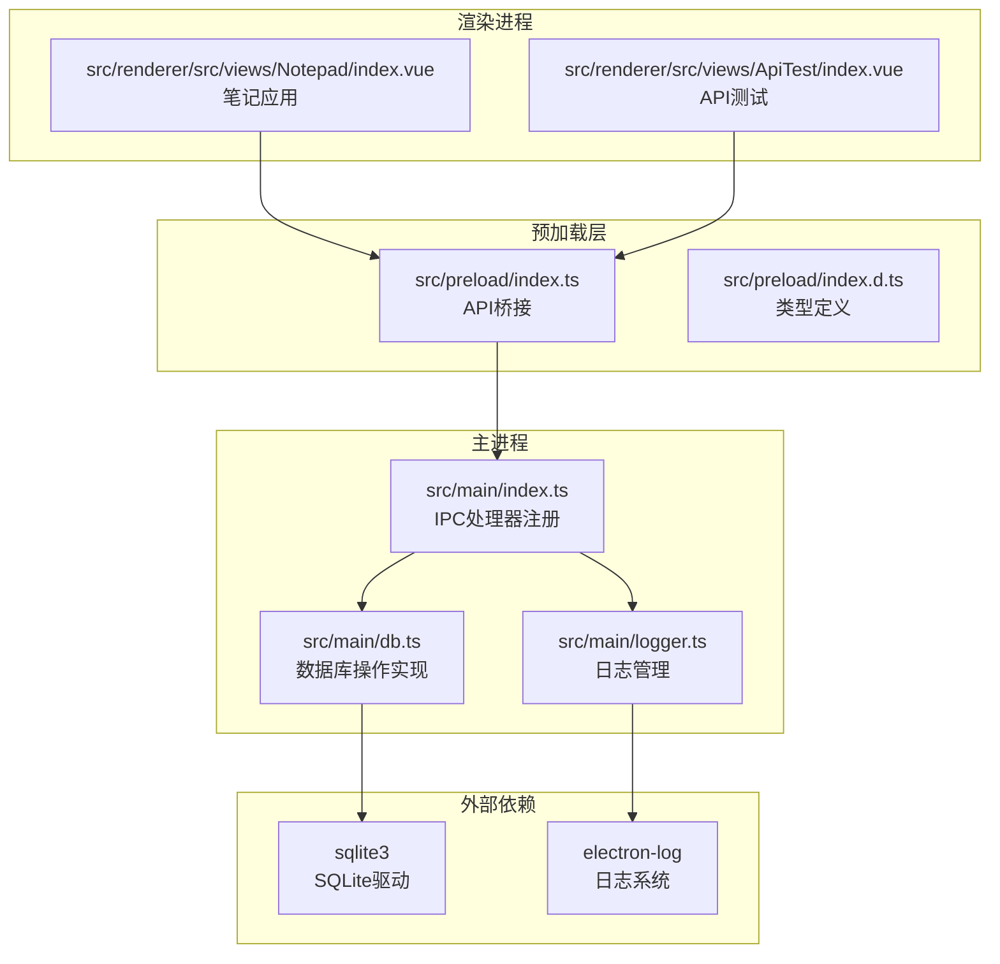
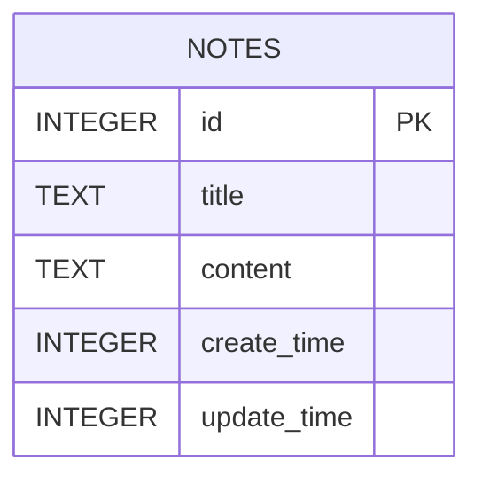
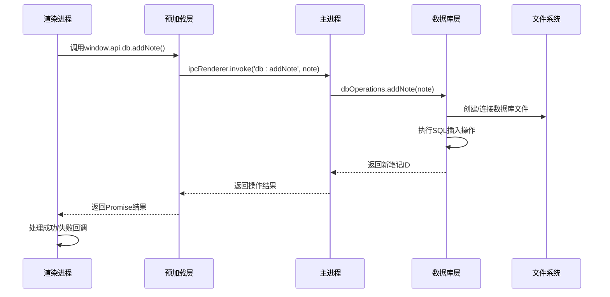
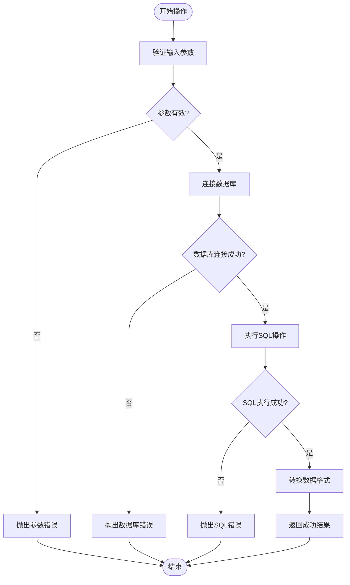
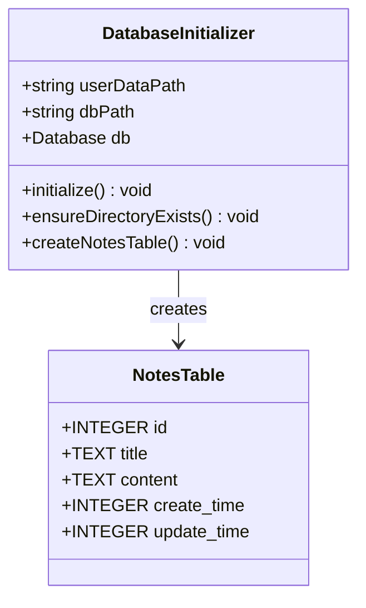
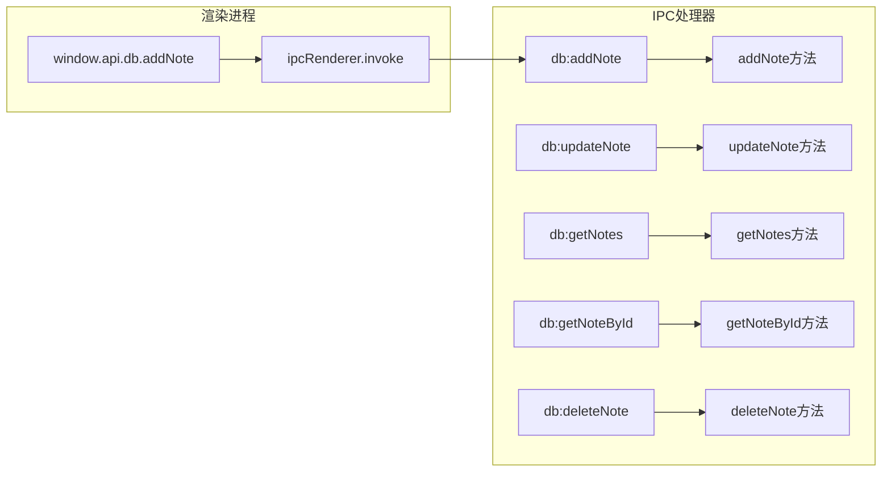
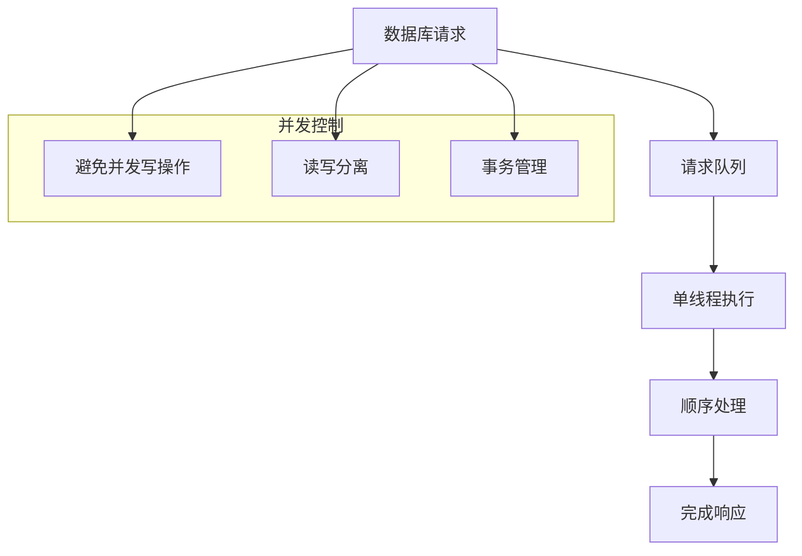

# 数据库操作API

<cite>
**本文档引用的文件**
- [db.ts](file://src/main/db.ts)
- [index.ts](file://src/main/index.ts)
- [index.ts](file://src/preload/index.ts)
- [index.d.ts](file://src/preload/index.d.ts)
- [logger.ts](file://src/main/logger.ts)
- [package.json](file://package.json)
- [index.vue](file://src/renderer/src/views/Notepad/index.vue)
- [index.vue](file://src/renderer/src/views/ApiTest/index.vue)
</cite>

## 目录

1. [简介](#简介)
2. [项目结构](#项目结构)
3. [核心组件](#核心组件)
4. [架构概览](#架构概览)
5. [详细组件分析](#详细组件分析)
6. [依赖关系分析](#依赖关系分析)
7. [性能考虑](#性能考虑)
8. [故障排除指南](#故障排除指南)
9. [结论](#结论)

## 简介

MyTool是一个基于Electron + Vue + TypeScript构建的桌面应用程序，内置了SQLite数据库操作API，专门用于管理笔记数据。该API提供了完整的CRUD（创建、读取、更新、删除）功能，支持本地数据持久化存储。

本API采用IPC（进程间通信）机制，通过Electron的主进程与渲染进程之间的安全通信实现数据库操作。所有数据操作都经过Promise封装，确保异步操作的可靠性和可维护性。

## 项目结构

MyTool的数据库操作API主要分布在以下关键文件中：



**图表来源**

- [index.ts:1-112](file://src/main/index.ts#L1-L112)
- [db.ts:1-100](file://src/main/db.ts#L1-L100)
- [index.ts:1-36](file://src/preload/index.ts#L1-L36)

**章节来源**

- [index.ts:1-112](file://src/main/index.ts#L1-L112)
- [db.ts:1-100](file://src/main/db.ts#L1-L100)
- [package.json:23-38](file://package.json#L23-L38)

## 核心组件

MyTool数据库操作API的核心组件包括：

### 数据库连接管理

- **数据库路径**: 使用Electron的`userData`目录存储数据库文件
- **自动初始化**: 应用启动时自动创建数据库和表结构
- **目录管理**: 自动创建必要的目录结构

### 数据模型定义

数据库采用SQLite存储，核心数据模型如下：



**图表来源**

- [db.ts:25-33](file://src/main/db.ts#L25-L33)

### API操作对象

导出的`dbOperations`对象包含以下核心方法：

- `addNote`: 添加新笔记
- `updateNote`: 更新现有笔记
- `getNotes`: 获取笔记列表
- `getNoteById`: 根据ID获取笔记详情
- `deleteNote`: 删除指定笔记

**章节来源**

- [db.ts:57-99](file://src/main/db.ts#L57-L99)

## 架构概览

MyTool的数据库操作采用分层架构设计，确保数据访问的安全性和效率：



**图表来源**

- [index.ts:80-85](file://src/main/index.ts#L80-L85)
- [index.ts:7-12](file://src/preload/index.ts#L7-L12)

### 数据流处理



**图表来源**

- [db.ts:38-55](file://src/main/db.ts#L38-L55)
- [db.ts:59-99](file://src/main/db.ts#L59-L99)

## 详细组件分析

### 数据库初始化组件

数据库初始化过程包含以下关键步骤：

1. **路径解析**: 使用Electron的`app.getPath('userData')`获取用户数据目录
2. **目录创建**: 自动创建不存在的目录结构
3. **数据库创建**: 初始化SQLite数据库文件
4. **表结构创建**: 自动创建`notes`表结构



**图表来源**

- [db.ts:7-35](file://src/main/db.ts#L7-L35)

**章节来源**

- [db.ts:7-35](file://src/main/db.ts#L7-L35)

### 数据库操作封装

数据库操作通过两个核心函数进行封装：

#### run函数（写操作）

- **功能**: 封装`db.run`为Promise
- **参数**: SQL语句和参数数组
- **返回值**: Promise<number>（返回最后插入的ID）
- **错误处理**: 直接reject错误

#### all函数（读操作）

- **功能**: 封装`db.all`为Promise
- **参数**: SQL语句和参数数组
- **返回值**: Promise<any[]>（返回查询结果数组）
- **错误处理**: 直接reject错误

**章节来源**

- [db.ts:38-55](file://src/main/db.ts#L38-L55)

### 核心API方法详解

#### addNote方法

**功能**: 添加新的笔记记录

**参数定义**:

- `note`: 对象类型，包含以下属性
  - `title`: 字符串，笔记标题（可选，默认'无标题笔记'）
  - `content`: 字符串，笔记内容

**返回值**: Promise对象，包含以下属性

- `id`: 数字，新创建笔记的ID
- `title`: 字符串，笔记标题
- `content`: 字符串，笔记内容
- `create_time`: 数字，创建时间戳
- `update_time`: 数字，更新时间戳

**SQL查询语句**:

```sql
INSERT INTO notes (title, content, create_time, update_time)
VALUES (?, ?, ?, ?)
```

**错误处理机制**:

- 参数验证失败：抛出TypeError
- 数据库连接失败：抛出Error
- SQL执行失败：抛出Error

**章节来源**

- [db.ts:60-67](file://src/main/db.ts#L60-L67)

#### updateNote方法

**功能**: 更新现有笔记记录

**参数定义**:

- `note`: 对象类型，包含以下属性
  - `id`: 数字，要更新笔记的ID
  - `title`: 字符串，笔记标题（可选，默认'无标题笔记'）
  - `content`: 字符串，笔记内容

**返回值**: Promise对象，包含以下属性

- `id`: 数字，更新笔记的ID
- `title`: 字符串，更新后的标题
- `content`: 字符串，更新后的内容
- `update_time`: 数字，更新时间戳

**SQL查询语句**:

```sql
UPDATE notes SET title = ?, content = ?, update_time = ? WHERE id = ?
```

**错误处理机制**:

- 参数验证失败：抛出TypeError
- 数据库连接失败：抛出Error
- SQL执行失败：抛出Error

**章节来源**

- [db.ts:70-79](file://src/main/db.ts#L70-L79)

#### getNotes方法

**功能**: 获取笔记列表（高性能版本）

**参数定义**: 无参数

**返回值**: Promise<any[]>，包含以下属性的对象数组

- `id`: 数字，笔记ID
- `title`: 字符串，笔记标题
- `create_time`: 数字，创建时间戳
- `update_time`: 数字，更新时间戳

**SQL查询语句**:

```sql
SELECT id, title, create_time, update_time FROM notes ORDER BY update_time DESC
```

**性能优化**:

- 只返回必要字段，避免传输大量富文本内容
- 按更新时间降序排列，便于快速获取最新笔记

**错误处理机制**:

- 数据库连接失败：抛出Error
- SQL执行失败：抛出Error

**章节来源**

- [db.ts:82-86](file://src/main/db.ts#L82-L86)

#### getNoteById方法

**功能**: 根据ID获取单条笔记详情

**参数定义**:

- `id`: 数字，笔记ID

**返回值**: Promise对象或null

- 如果找到笔记：返回包含完整信息的对象
- 如果未找到：返回null

**SQL查询语句**:

```sql
SELECT * FROM notes WHERE id = ?
```

**错误处理机制**:

- 参数类型错误：抛出TypeError
- 数据库连接失败：抛出Error
- SQL执行失败：抛出Error

**章节来源**

- [db.ts:89-92](file://src/main/db.ts#L89-L92)

#### deleteNote方法

**功能**: 删除指定ID的笔记

**参数定义**:

- `id`: 数字，要删除笔记的ID

**返回值**: Promise<boolean>，始终返回true

**SQL查询语句**:

```sql
DELETE FROM notes WHERE id = ?
```

**错误处理机制**:

- 参数类型错误：抛出TypeError
- 数据库连接失败：抛出Error
- SQL执行失败：抛出Error

**章节来源**

- [db.ts:95-98](file://src/main/db.ts#L95-L98)

### IPC通信机制

#### 主进程IPC处理器

主进程通过`ipcMain.handle`注册了五个数据库相关的IPC处理器：



**图表来源**

- [index.ts:80-85](file://src/main/index.ts#L80-L85)

#### 预加载层API桥接

预加载层通过`contextBridge`暴露安全的API给渲染进程：

**章节来源**

- [index.ts:80-85](file://src/main/index.ts#L80-L85)
- [index.ts:5-18](file://src/preload/index.ts#L5-L18)

## 依赖关系分析

MyTool数据库操作API的依赖关系如下：

```mermaid
graph TB
subgraph "核心依赖"
A[sqlite3] --> B[SQLite数据库驱动]
C[electron] --> D[Electron框架]
E[electron-log] --> F[日志系统]
end
subgraph "应用层"
G[src/main/db.ts] --> A
G --> E
H[src/main/index.ts] --> C
H --> G
I[src/preload/index.ts] --> H
J[src/renderer/src/views/Notepad/index.vue] --> I
end
subgraph "开发依赖"
K[@types/sqlite3] --> A
L[typescript] --> M[类型检查]
end
G --> N[数据库操作API]
H --> O[IPC通信]
I --> P[API桥接]
J --> Q[用户界面]
```

**图表来源**

- [package.json:23-44](file://package.json#L23-L44)

### 外部依赖分析

| 依赖包         | 版本    | 用途             | 类型     |
| -------------- | ------- | ---------------- | -------- |
| sqlite3        | ^6.0.1  | SQLite数据库驱动 | 生产依赖 |
| electron       | ^39.2.6 | Electron框架     | 生产依赖 |
| electron-log   | ^5.4.3  | 日志系统         | 生产依赖 |
| @types/sqlite3 | ^3.1.11 | SQLite类型定义   | 开发依赖 |
| typescript     | ^5.9.3  | 类型检查         | 开发依赖 |

**章节来源**

- [package.json:23-58](file://package.json#L23-L58)

## 性能考虑

### 数据库性能优化策略

1. **字段选择优化**
   - `getNotes`方法仅选择必要字段，避免传输大量富文本内容
   - 减少网络传输和内存占用

2. **索引优化**
   - 当前表结构包含主键索引（id）
   - 建议考虑为`update_time`字段添加索引以优化排序查询

3. **连接池管理**
   - 当前实现使用单个数据库连接
   - 对于高并发场景，建议实现连接池管理

4. **缓存策略**
   - 可考虑在应用层实现简单的查询结果缓存
   - 避免重复查询相同数据

### 内存管理

1. **大数据处理**
   - 富文本内容通过懒加载方式获取
   - 列表页面不加载完整内容，仅显示摘要信息

2. **垃圾回收**
   - 及时清理不再使用的数据库连接
   - 避免内存泄漏

### 并发控制



## 故障排除指南

### 常见错误类型及解决方案

#### 数据库连接错误

**症状**: 应用启动时报数据库打开失败
**原因**:

- 用户数据目录权限问题
- 数据库文件损坏
- 权限不足

**解决方案**:

1. 检查用户数据目录权限
2. 删除损坏的数据库文件重新创建
3. 以管理员权限运行应用

#### 参数验证错误

**症状**: 调用API时抛出TypeError
**原因**:

- 传入的参数类型不正确
- 缺少必需的参数

**解决方案**:

1. 确保传入正确的参数类型
2. 检查参数是否完整

#### SQL执行错误

**症状**: 数据库操作失败但没有明确错误信息
**原因**:

- SQL语法错误
- 数据约束冲突
- 数据库锁定

**解决方案**:

1. 检查SQL语句语法
2. 验证数据完整性约束
3. 实现重试机制

### 日志记录和调试

应用使用`electron-log`进行日志记录，支持以下功能：

1. **日志文件管理**: 按日期分割日志文件
2. **自定义日志目录**: 支持用户自定义日志存储位置
3. **实时日志查看**: 提供日志文件夹打开功能

**章节来源**

- [logger.ts:1-42](file://src/main/logger.ts#L1-L42)

### 最佳实践建议

1. **错误处理**: 始终在调用API时使用try-catch包装
2. **参数验证**: 在调用API前验证参数的有效性
3. **资源清理**: 及时释放数据库连接和内存资源
4. **备份策略**: 定期备份数据库文件
5. **监控告警**: 实现数据库操作的监控和告警机制

## 结论

MyTool的数据库操作API提供了完整、可靠的本地数据存储解决方案。通过Electron的IPC机制实现了安全的数据访问，通过Promise封装确保了异步操作的可靠性。

### 主要优势

1. **安全性**: 通过预加载层实现安全的API桥接
2. **可靠性**: 完善的错误处理和日志记录机制
3. **性能**: 针对笔记应用特点的优化设计
4. **易用性**: 简洁的API接口和完善的类型定义

### 技术特色

1. **自动初始化**: 应用启动时自动完成数据库初始化
2. **类型安全**: 完整的TypeScript类型定义
3. **错误处理**: 统一的错误处理和日志记录
4. **性能优化**: 针对笔记应用的性能优化策略

### 发展建议

1. **事务支持**: 添加数据库事务处理机制
2. **连接池**: 实现数据库连接池管理
3. **索引优化**: 为常用查询字段添加索引
4. **备份恢复**: 实现自动备份和数据恢复功能
5. **并发控制**: 增强多线程环境下的数据一致性

该API为MyTool应用提供了坚实的数据存储基础，能够满足日常笔记管理的需求，并为未来的功能扩展奠定了良好的技术基础。
