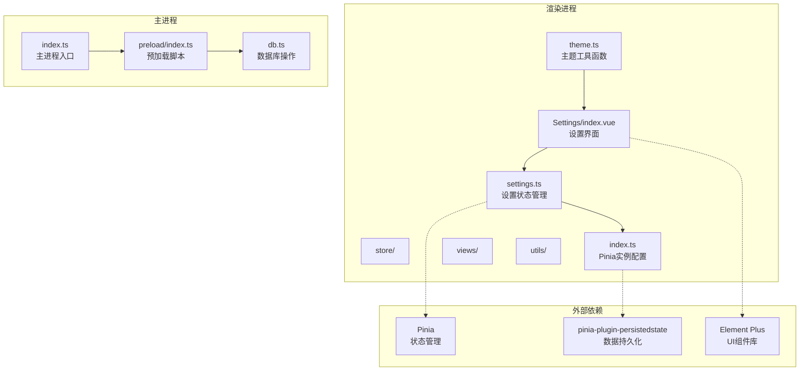
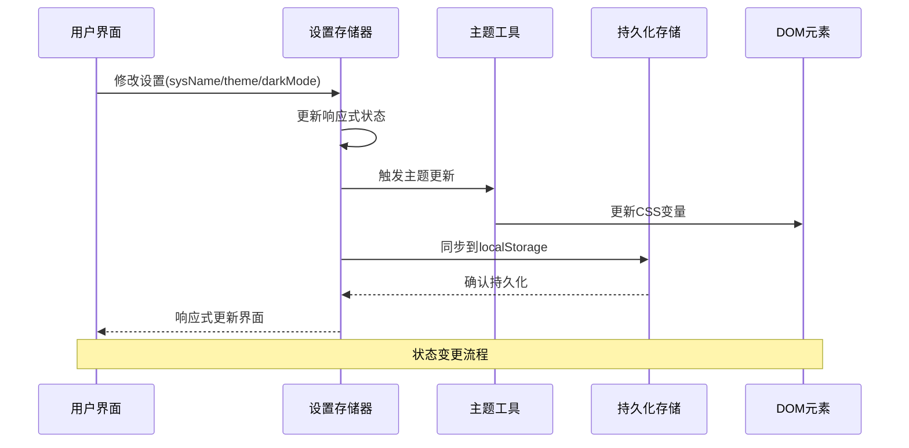
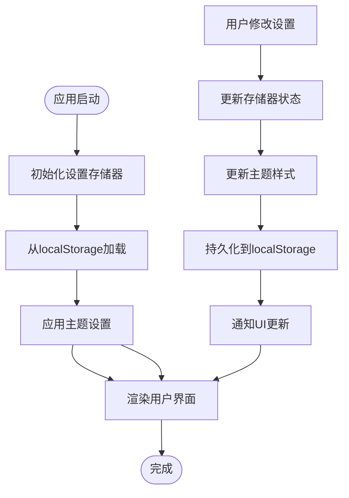
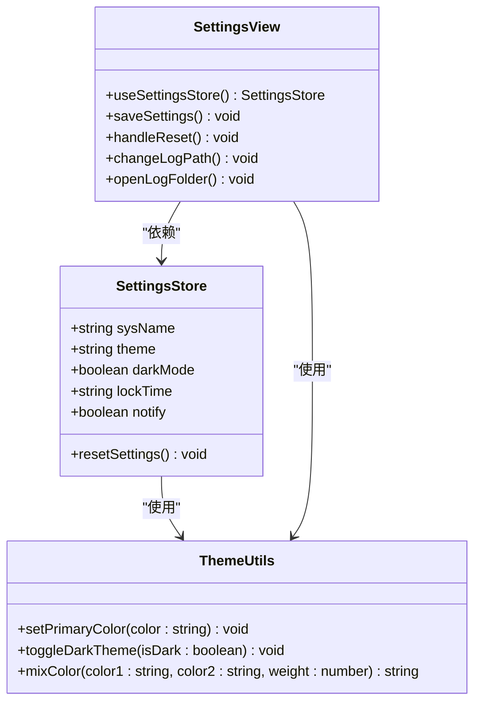
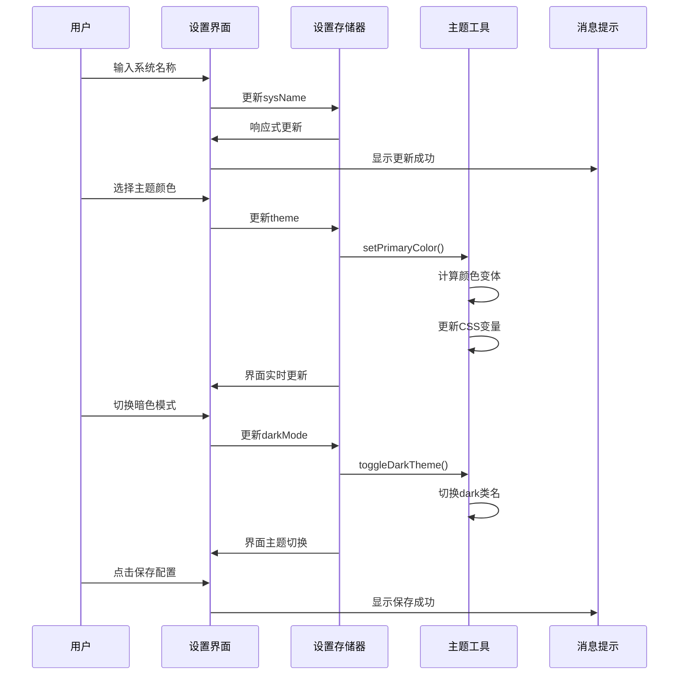
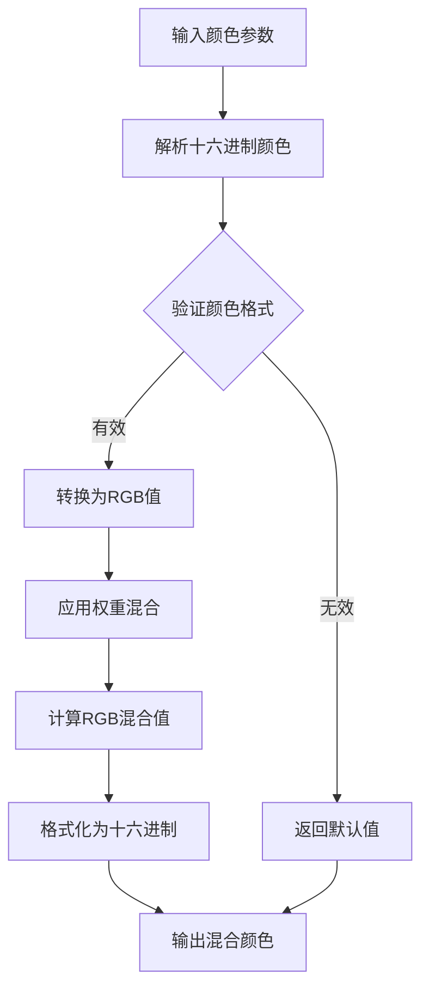
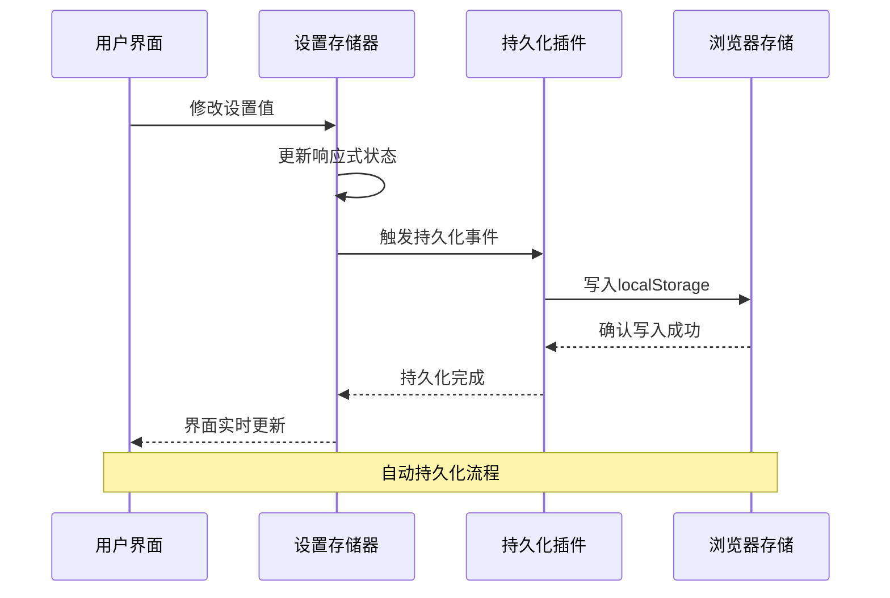
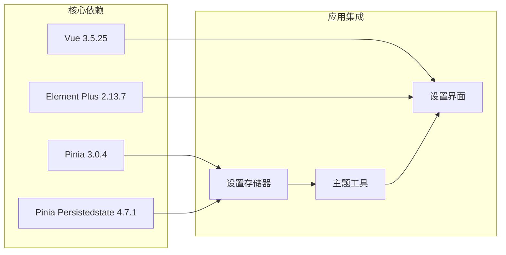
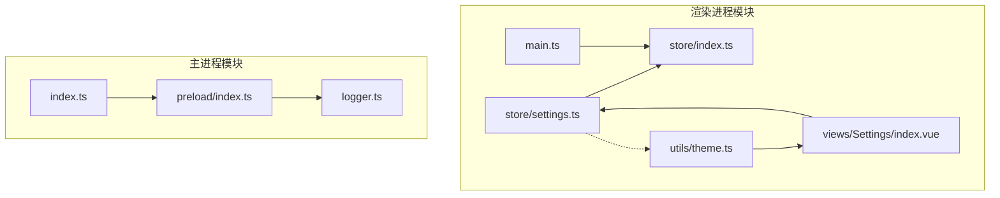

# 设置状态管理API

<cite>
**本文档引用的文件**
- [settings.ts](file://src/renderer/src/store/settings.ts)
- [index.ts](file://src/renderer/src/store/index.ts)
- [theme.ts](file://src/renderer/src/utils/theme.ts)
- [index.vue](file://src/renderer/src/views/Settings/index.vue)
- [index.ts](file://src/main/index.ts)
- [index.ts](file://src/preload/index.ts)
- [main.ts](file://src/renderer/src/main.ts)
- [package.json](file://package.json)
</cite>

## 目录

1. [简介](#简介)
2. [项目结构](#项目结构)
3. [核心组件](#核心组件)
4. [架构概览](#架构概览)
5. [详细组件分析](#详细组件分析)
6. [依赖关系分析](#依赖关系分析)
7. [性能考虑](#性能考虑)
8. [故障排除指南](#故障排除指南)
9. [结论](#结论)

## 简介

MyTool的设置状态管理API基于Pinia状态管理库构建，提供了完整的应用配置管理功能。该系统支持主题切换、暗色模式、配置保存等核心功能，采用数据持久化机制确保用户设置在应用重启后能够保持。

本API设计遵循现代化的状态管理模式，通过响应式数据绑定实现UI与状态的自动同步，同时提供了灵活的主题定制和配置管理能力。

## 项目结构

MyTool的设置状态管理位于渲染进程的store目录中，采用模块化设计：

**图表来源**

- [settings.ts:1-34](file://src/renderer/src/store/settings.ts#L1-L34)
- [index.ts:1-10](file://src/renderer/src/store/index.ts#L1-L10)
- [index.vue:1-198](file://src/renderer/src/views/Settings/index.vue#L1-L198)

**章节来源**

- [settings.ts:1-34](file://src/renderer/src/store/settings.ts#L1-L34)
- [index.ts:1-10](file://src/renderer/src/store/index.ts#L1-L10)
- [index.vue:1-198](file://src/renderer/src/views/Settings/index.vue#L1-L198)

## 核心组件

### 设置状态存储器

设置状态存储器是整个系统的核心组件，负责管理应用的所有用户配置信息。它使用Pinia的组合式API模式，提供了简洁而强大的状态管理能力。

#### 状态定义

设置状态存储器包含以下核心状态属性：

| 属性名   | 类型    | 默认值    | 描述                     |
| -------- | ------- | --------- | ------------------------ |
| sysName  | string  | 'My Tool' | 系统显示名称             |
| theme    | string  | '#1677ff' | 主题颜色代码（十六进制） |
| darkMode | boolean | false     | 暗色模式开关             |
| lockTime | string  | '30'      | 自动锁屏时间设置         |
| notify   | boolean | true      | 系统通知开关             |

#### 状态变更方法

设置状态存储器提供了以下状态变更方法：

- **resetSettings()**: 将所有设置重置为默认值
- 内置的响应式属性：sysName、theme、darkMode、lockTime、notify

#### 数据持久化策略

系统采用pinia-plugin-persistedstate插件实现数据持久化，配置为：

- 持久化类型：localStorage
- 实时同步：数据变更立即同步到持久化存储
- 自动恢复：应用启动时自动从localStorage恢复状态

**章节来源**

- [settings.ts:4-33](file://src/renderer/src/store/settings.ts#L4-L33)

### Pinia实例配置

Pinia实例在应用启动时进行全局配置，启用了数据持久化插件以确保状态的持久化存储。

**章节来源**

- [index.ts:1-10](file://src/renderer/src/store/index.ts#L1-L10)

### 主题工具函数

主题工具模块提供了完整的主题管理功能，包括颜色混合算法和CSS变量动态更新。

**章节来源**

- [theme.ts:1-70](file://src/renderer/src/utils/theme.ts#L1-L70)

## 架构概览

MyTool的设置状态管理采用分层架构设计，实现了清晰的关注点分离：

**图表来源**

- [settings.ts:13-19](file://src/renderer/src/store/settings.ts#L13-L19)
- [theme.ts:44-57](file://src/renderer/src/utils/theme.ts#L44-L57)

### 状态流图

**图表来源**

- [settings.ts:30-32](file://src/renderer/src/store/settings.ts#L30-L32)
- [index.ts:6-7](file://src/renderer/src/store/index.ts#L6-L7)

## 详细组件分析

### 设置存储器类图

**图表来源**

- [settings.ts:4-29](file://src/renderer/src/store/settings.ts#L4-L29)
- [theme.ts:44-69](file://src/renderer/src/utils/theme.ts#L44-L69)
- [index.vue:66-114](file://src/renderer/src/views/Settings/index.vue#L66-L114)

### 设置界面交互流程

**图表来源**

- [index.vue:9-40](file://src/renderer/src/views/Settings/index.vue#L9-L40)
- [settings.ts:21-28](file://src/renderer/src/store/settings.ts#L21-L28)
- [theme.ts:44-69](file://src/renderer/src/utils/theme.ts#L44-L69)

### 主题颜色混合算法

主题工具模块实现了复杂的颜色混合算法，用于生成Element Plus组件所需的颜色变体：

**图表来源**

- [theme.ts:4-38](file://src/renderer/src/utils/theme.ts#L4-L38)

**章节来源**

- [index.vue:66-114](file://src/renderer/src/views/Settings/index.vue#L66-L114)
- [theme.ts:1-70](file://src/renderer/src/utils/theme.ts#L1-L70)

### 配置保存机制

配置保存采用自动持久化策略，无需手动调用保存方法：

**图表来源**

- [settings.ts:30-32](file://src/renderer/src/store/settings.ts#L30-L32)
- [index.ts:6-7](file://src/renderer/src/store/index.ts#L6-L7)

**章节来源**

- [index.vue:104-108](file://src/renderer/src/views/Settings/index.vue#L104-L108)
- [settings.ts:30-32](file://src/renderer/src/store/settings.ts#L30-L32)

## 依赖关系分析

### 外部依赖关系

MyTool设置状态管理API依赖以下关键外部库：

**图表来源**

- [package.json:23-37](file://package.json#L23-L37)
- [settings.ts:1-2](file://src/renderer/src/store/settings.ts#L1-L2)

### 内部模块依赖

**图表来源**

- [settings.ts:1-34](file://src/renderer/src/store/settings.ts#L1-L34)
- [index.ts:1-10](file://src/renderer/src/store/index.ts#L1-L10)
- [theme.ts:1-70](file://src/renderer/src/utils/theme.ts#L1-L70)

**章节来源**

- [package.json:23-37](file://package.json#L23-L37)
- [main.ts:19](file://src/renderer/src/main.ts#L19)

## 性能考虑

### 响应式更新优化

设置状态管理采用了Vue的响应式系统，实现了高效的UI更新机制：

- **细粒度更新**：每个状态属性独立响应式，避免不必要的全局更新
- **自动追踪**：Vue的依赖追踪系统确保只有使用到的状态才会触发更新
- **批量更新**：多个状态变更会被批处理，减少DOM操作次数

### 持久化性能

数据持久化采用异步策略，避免阻塞主线程：

- **异步写入**：状态变更后异步写入localStorage，不影响UI流畅性
- **去抖处理**：频繁的状态变更会被合并，减少存储写入次数
- **增量更新**：只更新发生变化的部分，而非整个状态对象

### 主题切换性能

主题切换优化了CSS变量更新策略：

- **批量更新**：一次主题变更更新所有相关的CSS变量
- **缓存机制**：颜色混合结果被缓存，避免重复计算
- **最小化DOM操作**：通过CSS变量而非直接DOM操作实现主题切换

## 故障排除指南

### 常见问题及解决方案

#### 状态未持久化

**问题描述**：应用重启后设置丢失

**可能原因**：

- localStorage权限问题
- 浏览器隐私设置阻止localStorage
- 应用版本升级导致存储格式变化

**解决方案**：

1. 检查浏览器localStorage功能是否正常
2. 确认应用具有访问localStorage的权限
3. 清除浏览器缓存和localStorage数据

#### 主题切换失效

**问题描述**：主题颜色或暗色模式切换后界面未更新

**可能原因**：

- CSS变量未正确更新
- Element Plus组件未重新渲染
- 主题工具函数执行异常

**解决方案**：

1. 检查控制台是否有JavaScript错误
2. 验证CSS变量是否正确设置
3. 确认Element Plus主题类名正确添加/移除

#### 设置界面不响应

**问题描述**：设置界面无法编辑或保存

**可能原因**：

- Pinia存储器初始化失败
- Vue组件挂载问题
- 事件监听器未正确绑定

**解决方案**：

1. 检查控制台错误信息
2. 验证Pinia存储器是否正确创建
3. 确认Vue组件生命周期钩子正常执行

**章节来源**

- [settings.ts:30-32](file://src/renderer/src/store/settings.ts#L30-L32)
- [theme.ts:44-69](file://src/renderer/src/utils/theme.ts#L44-L69)

## 结论

MyTool的设置状态管理API展现了现代前端应用的最佳实践，通过以下关键特性实现了优秀的用户体验：

### 设计优势

1. **模块化架构**：清晰的职责分离，便于维护和扩展
2. **响应式设计**：自动化的状态-视图同步，提供流畅的用户体验
3. **持久化存储**：透明的数据持久化，确保用户设置的一致性
4. **主题灵活性**：完整的主题定制能力，支持丰富的视觉效果

### 技术亮点

- **Pinia组合式API**：现代化的状态管理方式，提供更好的TypeScript支持
- **自动持久化**：通过插件实现零样板代码的数据持久化
- **主题工具链**：完整的颜色管理和CSS变量更新机制
- **组件化设计**：可复用的设置界面组件，支持快速开发

### 扩展建议

未来可以考虑的功能增强：

- 支持设置导入/导出功能
- 添加设置版本控制和迁移机制
- 实现多用户配置管理
- 增加设置模板和预设功能

该API为MyTool提供了坚实的基础，支持应用的持续发展和功能扩展。
