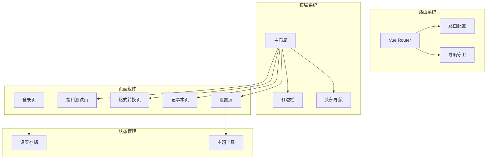
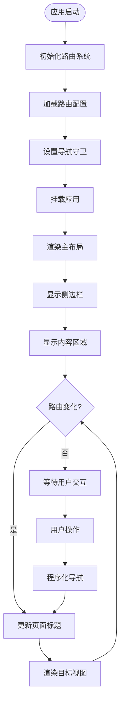
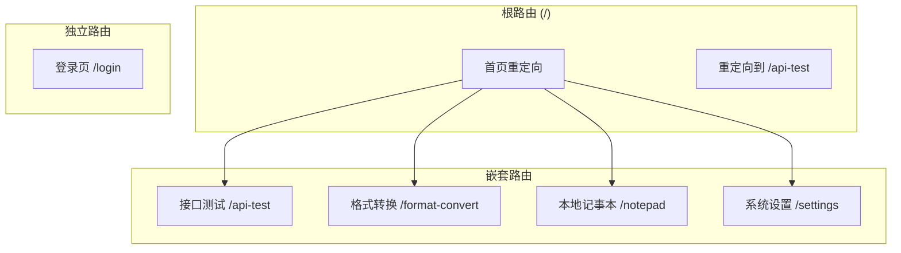
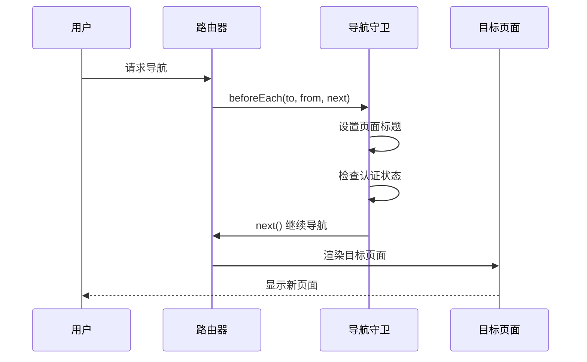
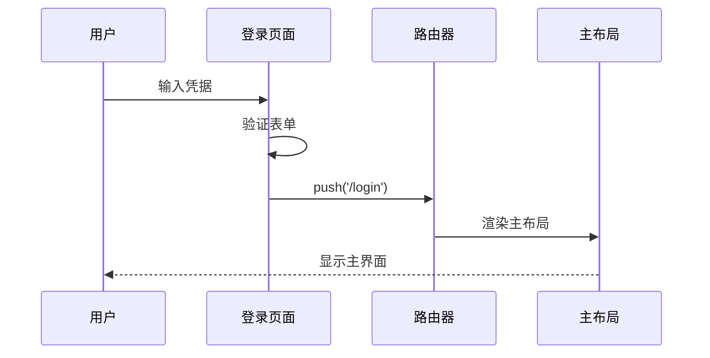
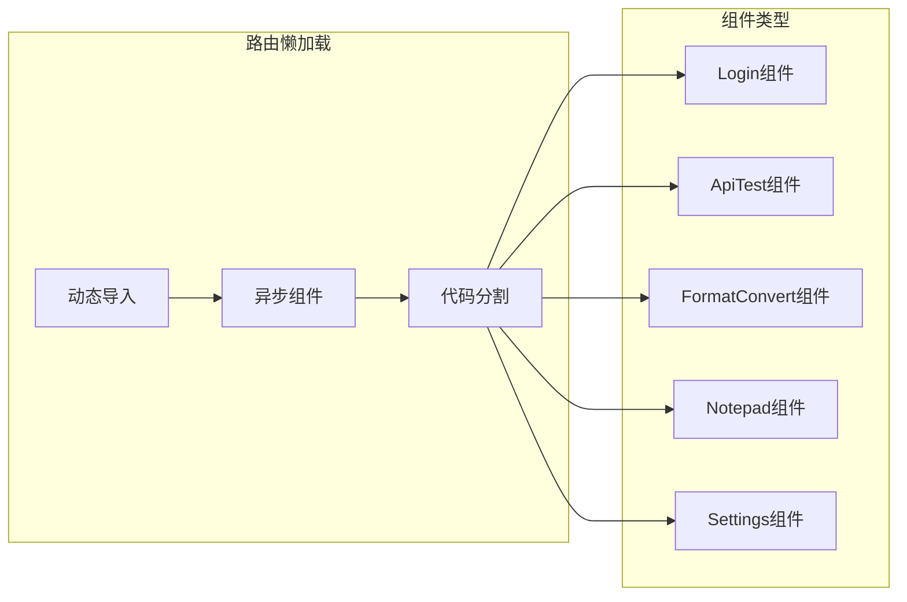
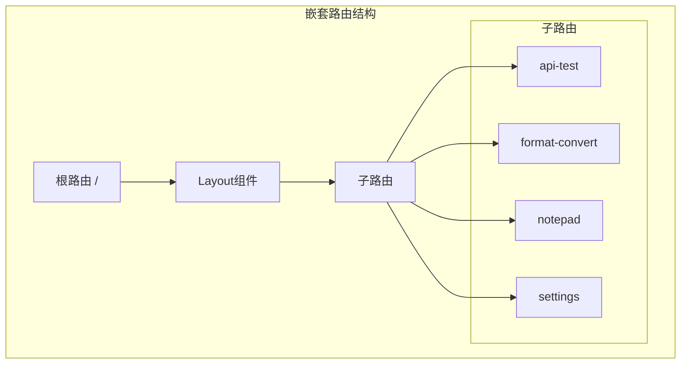
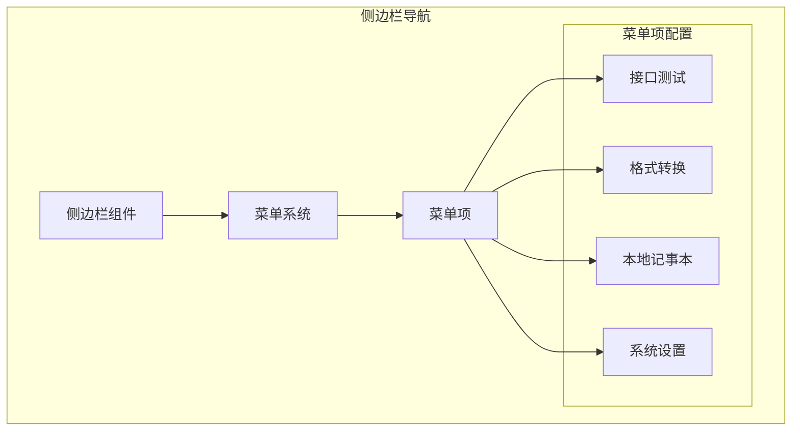
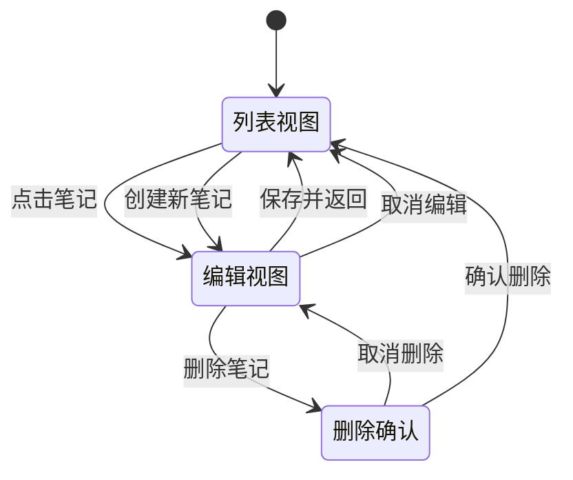
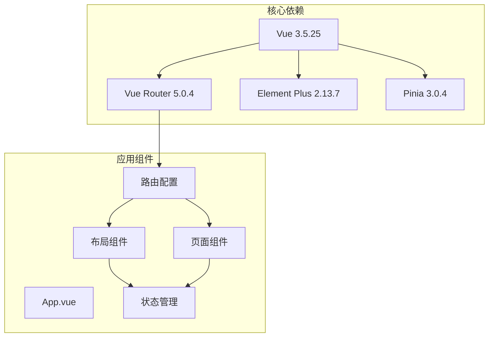

# 路由导航API

<cite>
**本文档引用的文件**
- [src/renderer/src/router/index.ts](file://src/renderer/src/router/index.ts)
- [src/renderer/src/main.ts](file://src/renderer/src/main.ts)
- [src/renderer/src/App.vue](file://src/renderer/src/App.vue)
- [src/renderer/src/layout/index.vue](file://src/renderer/src/layout/index.vue)
- [src/renderer/src/layout/components/Sidebar.vue](file://src/renderer/src/layout/components/Sidebar.vue)
- [src/renderer/src/views/Login/index.vue](file://src/renderer/src/views/Login/index.vue)
- [src/renderer/src/views/ApiTest/index.vue](file://src/renderer/src/views/ApiTest/index.vue)
- [src/renderer/src/views/FormatConvert/index.vue](file://src/renderer/src/views/FormatConvert/index.vue)
- [src/renderer/src/views/Notepad/index.vue](file://src/renderer/src/views/Notepad/index.vue)
- [src/renderer/src/views/Settings/index.vue](file://src/renderer/src/views/Settings/index.vue)
- [src/renderer/src/store/settings.ts](file://src/renderer/src/store/settings.ts)
- [src/renderer/src/utils/theme.ts](file://src/renderer/src/utils/theme.ts)
- [package.json](file://package.json)
</cite>

## 目录

1. [简介](#简介)
2. [项目结构](#项目结构)
3. [核心组件](#核心组件)
4. [架构概览](#架构概览)
5. [详细组件分析](#详细组件分析)
6. [依赖关系分析](#依赖关系分析)
7. [性能考虑](#性能考虑)
8. [故障排除指南](#故障排除指南)
9. [结论](#结论)

## 简介

MyTool是一个基于Electron + Vue + TypeScript构建的桌面应用程序，采用Vue Router进行路由管理。该应用提供了多个实用工具功能，包括接口测试、格式转换、本地记事本和系统设置等模块。本文档详细说明了MyTool的路由导航API配置和使用方法，包括路由定义、导航守卫、参数传递机制以及各种路由特性。

## 项目结构

MyTool的路由系统采用模块化设计，主要包含以下关键组件：

**图表来源**

- [src/renderer/src/router/index.ts:1-79](file://src/renderer/src/router/index.ts#L1-L79)
- [src/renderer/src/layout/index.vue:1-232](file://src/renderer/src/layout/index.vue#L1-L232)

**章节来源**

- [src/renderer/src/router/index.ts:1-79](file://src/renderer/src/router/index.ts#L1-L79)
- [src/renderer/src/main.ts:1-24](file://src/renderer/src/main.ts#L1-L24)

## 核心组件

### 路由配置系统

MyTool使用Vue Router 5.0.4版本，采用哈希历史模式（createWebHashHistory）以确保在Electron环境中正常工作。路由系统采用嵌套路由设计，提供清晰的页面层次结构。

### 导航守卫系统

应用实现了全局前置导航守卫，用于设置页面标题和未来的认证逻辑。守卫系统具有良好的扩展性，可以轻松添加认证、权限验证等功能。

### 布局系统

主布局组件提供了完整的应用框架，包括侧边栏导航、头部区域和主要内容区域。布局系统支持响应式设计和主题切换功能。

**章节来源**

- [src/renderer/src/router/index.ts:59-76](file://src/renderer/src/router/index.ts#L59-L76)
- [src/renderer/src/layout/index.vue:1-232](file://src/renderer/src/layout/index.vue#L1-L232)

## 架构概览

MyTool的路由架构采用分层设计，确保了良好的可维护性和扩展性：

**图表来源**

- [src/renderer/src/router/index.ts:65-76](file://src/renderer/src/router/index.ts#L65-L76)
- [src/renderer/src/main.ts:19-21](file://src/renderer/src/main.ts#L19-L21)

## 详细组件分析

### 路由配置详解

#### 基础路由结构

MyTool的路由配置采用嵌套路由设计，提供清晰的页面层次结构：

**图表来源**

- [src/renderer/src/router/index.ts:3-56](file://src/renderer/src/router/index.ts#L3-L56)

#### 路由元信息配置

每个路由都配置了丰富的元信息，用于控制页面行为和外观：

| 路由名称      | 路径              | 标题       | 图标         | 隐藏属性 |
| ------------- | ----------------- | ---------- | ------------ | -------- |
| Login         | `/login`          | 登录系统   | -            | true     |
| Layout        | `/`               | MyTool     | -            | false    |
| ApiTest       | `/api-test`       | 接口测试   | Connection   | false    |
| FormatConvert | `/format-convert` | 格式转换   | DocumentCopy | false    |
| Notepad       | `/notepad`        | 本地记事本 | Edit         | false    |
| Settings      | `/settings`       | 系统设置   | Setting      | false    |

**章节来源**

- [src/renderer/src/router/index.ts:4-56](file://src/renderer/src/router/index.ts#L4-L56)

### 导航守卫系统

#### 全局前置守卫

应用实现了全局前置导航守卫，用于统一处理页面标题设置和未来的认证逻辑：

**图表来源**

- [src/renderer/src/router/index.ts:65-76](file://src/renderer/src/router/index.ts#L65-L76)

#### 守卫执行流程

导航守卫的执行顺序遵循Vue Router的标准流程：

1. **全局前置守卫**：在每次路由导航前执行
2. **路由独享守卫**：在目标路由上执行
3. **全局解析守卫**：在导航被确认之前执行
4. **组件内守卫**：在组件生命周期中执行
5. **全局后置钩子**：在导航完成后执行

**章节来源**

- [src/renderer/src/router/index.ts:65-76](file://src/renderer/src/router/index.ts#L65-L76)

### 程序化导航

#### 登录页面导航

登录页面使用程序化导航实现用户认证后的页面跳转：

**图表来源**

- [src/renderer/src/views/Login/index.vue:65-66](file://src/renderer/src/views/Login/index.vue#L65-L66)

#### 退出登录导航

主布局中的退出登录功能展示了如何使用程序化导航：

**章节来源**

- [src/renderer/src/views/Login/index.vue:56-69](file://src/renderer/src/views/Login/index.vue#L56-L69)
- [src/renderer/src/layout/index.vue:86-97](file://src/renderer/src/layout/index.vue#L86-L97)

### 路由懒加载

MyTool充分利用了Vue Router的路由懒加载特性，通过动态导入实现按需加载：

**图表来源**

- [src/renderer/src/router/index.ts:7-50](file://src/renderer/src/router/index.ts#L7-L50)

**章节来源**

- [src/renderer/src/router/index.ts:7-50](file://src/renderer/src/router/index.ts#L7-L50)

### 嵌套路由系统

#### 主布局结构

MyTool的嵌套路由系统提供了清晰的页面层次结构：

**图表来源**

- [src/renderer/src/router/index.ts:13-56](file://src/renderer/src/router/index.ts#L13-L56)

#### 布局组件集成

主布局组件通过`router-view`插槽实现嵌套路由的渲染：

**章节来源**

- [src/renderer/src/layout/index.vue:51-55](file://src/renderer/src/layout/index.vue#L51-L55)

### 侧边栏导航

#### 菜单系统

侧边栏使用Element Plus的菜单组件实现导航功能，支持折叠和展开：

**图表来源**

- [src/renderer/src/layout/components/Sidebar.vue:7-34](file://src/renderer/src/layout/components/Sidebar.vue#L7-L34)

**章节来源**

- [src/renderer/src/layout/components/Sidebar.vue:1-149](file://src/renderer/src/layout/components/Sidebar.vue#L1-L149)

### 页面组件分析

#### 登录页面

登录页面实现了基本的用户认证功能，展示了如何使用程序化导航：

#### 接口测试页面

接口测试页面提供了API调用功能，展示了如何处理异步操作：

#### 格式转换页面

格式转换页面实现了JSON格式化功能，展示了数据处理和错误处理：

#### 本地记事本页面

本地记事本页面是最复杂的页面，实现了完整的CRUD操作：

**图表来源**

- [src/renderer/src/views/Notepad/index.vue:124-290](file://src/renderer/src/views/Notepad/index.vue#L124-L290)

**章节来源**

- [src/renderer/src/views/Notepad/index.vue:1-599](file://src/renderer/src/views/Notepad/index.vue#L1-L599)

#### 系统设置页面

系统设置页面展示了如何与Pinia状态管理结合使用：

**章节来源**

- [src/renderer/src/views/Settings/index.vue:1-198](file://src/renderer/src/views/Settings/index.vue#L1-L198)

## 依赖关系分析

### 核心依赖

MyTool的路由系统依赖于以下关键库：

**图表来源**

- [package.json:23-37](file://package.json#L23-L37)

### 版本兼容性

应用使用了兼容的版本组合，确保路由系统的稳定运行：

| 包名         | 版本    | 用途     |
| ------------ | ------- | -------- |
| vue          | ^3.5.25 | 核心框架 |
| vue-router   | ^5.0.4  | 路由管理 |
| element-plus | ^2.13.7 | UI组件库 |
| pinia        | ^3.0.4  | 状态管理 |

**章节来源**

- [package.json:23-37](file://package.json#L23-L37)

## 性能考虑

### 代码分割策略

MyTool采用了有效的代码分割策略，通过路由懒加载减少初始包大小：

1. **按需加载**：每个页面组件都通过动态导入实现
2. **并行加载**：Vue Router支持异步组件的并行加载
3. **缓存优化**：浏览器缓存机制提高重复访问速度

### 导航性能优化

1. **守卫优化**：导航守卫只执行必要的逻辑
2. **组件复用**：Vue Router的组件复用机制减少DOM操作
3. **过渡动画**：使用CSS过渡动画提升用户体验

## 故障排除指南

### 常见问题及解决方案

#### 路由无法匹配

**问题描述**：访问特定URL时页面不显示或显示空白

**可能原因**：

1. 路由配置错误
2. 组件导入路径问题
3. 历史模式配置问题

**解决方案**：

1. 检查路由配置中的路径和组件映射
2. 验证组件文件路径的正确性
3. 确认使用了正确的历史模式

#### 导航守卫问题

**问题描述**：导航守卫逻辑不生效或死循环

**可能原因**：

1. `next()`函数调用错误
2. 无限重定向循环
3. 异步逻辑处理不当

**解决方案**：

1. 确保每个分支都有`next()`调用
2. 检查重定向逻辑避免循环
3. 使用Promise正确处理异步操作

#### 嵌套路由问题

**问题描述**：嵌套页面不显示或布局异常

**可能原因**：

1. `router-view`标签缺失
2. 布局组件配置错误
3. 子路由路径配置问题

**解决方案**：

1. 确保布局组件包含`router-view`插槽
2. 检查嵌套路由的`children`配置
3. 验证子路由的相对路径

**章节来源**

- [src/renderer/src/router/index.ts:65-76](file://src/renderer/src/router/index.ts#L65-L76)
- [src/renderer/src/layout/index.vue:51-55](file://src/renderer/src/layout/index.vue#L51-L55)

## 结论

MyTool的路由导航API展现了现代Vue应用的最佳实践，具有以下特点：

1. **清晰的架构设计**：采用嵌套路由和模块化组织
2. **良好的扩展性**：支持动态路由和权限控制
3. **优秀的用户体验**：提供流畅的导航和过渡效果
4. **完善的错误处理**：具备健壮的故障排除机制

该路由系统为开发者提供了坚实的基础，可以轻松扩展新的功能模块和页面。通过合理的配置和最佳实践，MyTool展示了如何构建一个既功能丰富又易于维护的桌面应用程序。
