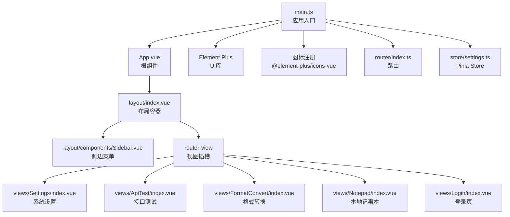
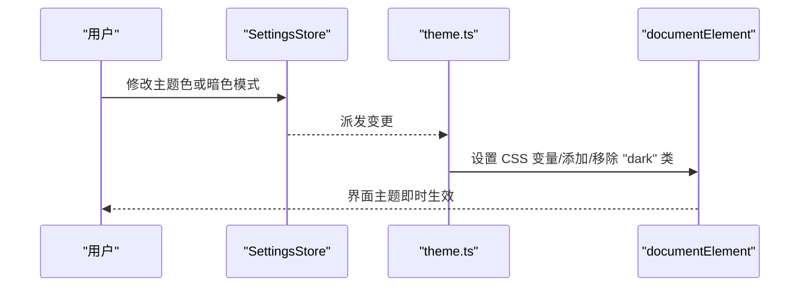
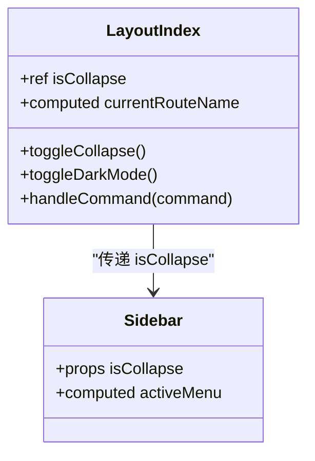
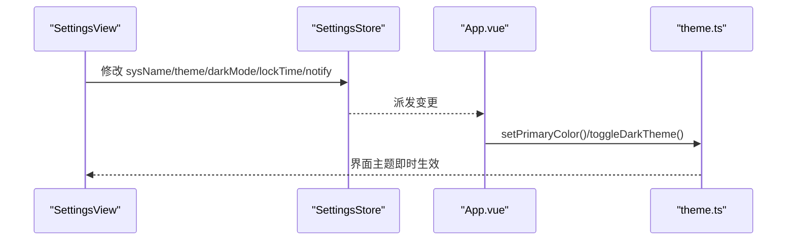
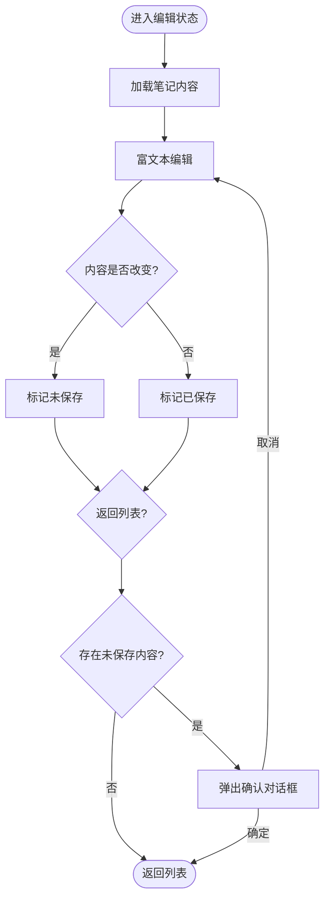
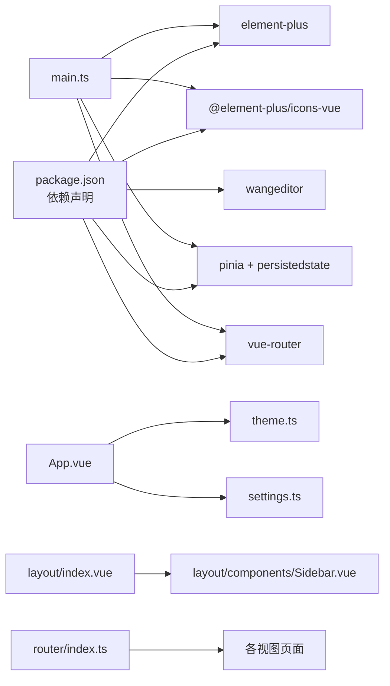

# UI组件系统

<cite>
**本文引用的文件**
- [src/renderer/src/main.ts](file://src/renderer/src/main.ts)
- [src/renderer/src/App.vue](file://src/renderer/src/App.vue)
- [src/renderer/src/utils/theme.ts](file://src/renderer/src/utils/theme.ts)
- [src/renderer/src/store/settings.ts](file://src/renderer/src/store/settings.ts)
- [src/renderer/src/assets/main.css](file://src/renderer/src/assets/main.css)
- [src/renderer/src/layout/index.vue](file://src/renderer/src/layout/index.vue)
- [src/renderer/src/layout/components/Sidebar.vue](file://src/renderer/src/layout/components/Sidebar.vue)
- [src/renderer/src/views/Settings/index.vue](file://src/renderer/src/views/Settings/index.vue)
- [src/renderer/src/views/ApiTest/index.vue](file://src/renderer/src/views/ApiTest/index.vue)
- [src/renderer/src/views/FormatConvert/index.vue](file://src/renderer/src/views/FormatConvert/index.vue)
- [src/renderer/src/views/Notepad/index.vue](file://src/renderer/src/views/Notepad/index.vue)
- [src/renderer/src/views/Login/index.vue](file://src/renderer/src/views/Login/index.vue)
- [src/renderer/src/router/index.ts](file://src/renderer/src/router/index.ts)
- [package.json](file://package.json)
</cite>

## 目录

1. [简介](#简介)
2. [项目结构](#项目结构)
3. [核心组件](#核心组件)
4. [架构总览](#架构总览)
5. [详细组件分析](#详细组件分析)
6. [依赖关系分析](#依赖关系分析)
7. [性能考量](#性能考量)
8. [故障排查指南](#故障排查指南)
9. [结论](#结论)
10. [附录](#附录)

## 简介

本文件系统性梳理 MyTool 的 UI 组件体系，围绕基于 Element Plus 的组件库使用、自定义组件设计与主题系统展开，重点说明组件架构模式、组件通信机制与状态管理模式；解释主题切换机制、暗色模式实现与响应式设计策略；提供组件使用示例、属性配置与事件处理说明；并给出样式架构、CSS-in-JS（通过 CSS 变量）实现与样式定制指南，帮助开发者进行组件扩展与复用，并兼顾无障碍访问与跨浏览器兼容性。

## 项目结构

MyTool 的渲染层采用 Vue 3 + TypeScript + Element Plus + Pinia + Vue Router 的组合，整体结构清晰，按功能域划分：

- 应用入口与全局样式：入口文件注册 Element Plus、图标、路由与状态管理；全局样式统一字体与视口。
- 布局与导航：顶部 Header、侧边栏菜单、主内容区与面包屑导航。
- 视图页面：登录、设置、接口测试、格式转换、本地记事本等。
- 主题与状态：Pinia Store 管理系统名称、主题色、暗色模式、自动锁屏时间与通知开关；主题工具负责动态修改 Element Plus CSS 变量与暗色类名。

图表来源

- [src/renderer/src/main.ts:1-24](file://src/renderer/src/main.ts#L1-L24)
- [src/renderer/src/App.vue:1-47](file://src/renderer/src/App.vue#L1-L47)
- [src/renderer/src/layout/index.vue:1-232](file://src/renderer/src/layout/index.vue#L1-L232)
- [src/renderer/src/layout/components/Sidebar.vue:1-149](file://src/renderer/src/layout/components/Sidebar.vue#L1-L149)
- [src/renderer/src/router/index.ts:1-79](file://src/renderer/src/router/index.ts#L1-L79)
- [src/renderer/src/store/settings.ts:1-34](file://src/renderer/src/store/settings.ts#L1-L34)

章节来源

- [src/renderer/src/main.ts:1-24](file://src/renderer/src/main.ts#L1-L24)
- [src/renderer/src/assets/main.css:1-18](file://src/renderer/src/assets/main.css#L1-L18)
- [src/renderer/src/router/index.ts:1-79](file://src/renderer/src/router/index.ts#L1-L79)

## 核心组件

- 应用入口与全局初始化
  - 在入口中引入全局样式与 Element Plus 样式，注册所有图标组件，挂载路由、状态与 Element Plus 插件。
- 根组件与主题联动
  - 首次挂载时从 Store 读取主题与暗色模式配置并应用；监听 Store 中的主题与暗色模式变化，动态更新 CSS 变量与类名。
- 布局容器与侧边菜单
  - 布局容器包含 Header（面包屑、快捷暗黑模式切换、用户下拉）、Main（滚动容器与过渡动画）与侧边栏菜单。
  - 侧边菜单使用 Element Plus Menu，支持折叠、高亮当前路由、主题色激活态。
- 设置页
  - 使用 Element Plus 表单控件展示与编辑系统配置，包括系统名称、主题色选择器、暗黑模式开关、自动锁屏时间、通知开关与日志路径。
- 视图页面
  - 登录页：基础表单校验与按钮交互。
  - 接口测试：请求方法选择、URL 输入、发送请求与响应展示。
  - 格式转换：JSON 输入/输出对比与格式化。
  - 本地记事本：笔记列表与富文本编辑器集成，支持新建、编辑、保存、删除与未保存提示。

章节来源

- [src/renderer/src/main.ts:1-24](file://src/renderer/src/main.ts#L1-L24)
- [src/renderer/src/App.vue:1-47](file://src/renderer/src/App.vue#L1-L47)
- [src/renderer/src/layout/index.vue:1-232](file://src/renderer/src/layout/index.vue#L1-L232)
- [src/renderer/src/layout/components/Sidebar.vue:1-149](file://src/renderer/src/layout/components/Sidebar.vue#L1-L149)
- [src/renderer/src/views/Settings/index.vue:1-198](file://src/renderer/src/views/Settings/index.vue#L1-L198)
- [src/renderer/src/views/ApiTest/index.vue:1-163](file://src/renderer/src/views/ApiTest/index.vue#L1-L163)
- [src/renderer/src/views/FormatConvert/index.vue:1-176](file://src/renderer/src/views/FormatConvert/index.vue#L1-L176)
- [src/renderer/src/views/Notepad/index.vue:1-599](file://src/renderer/src/views/Notepad/index.vue#L1-L599)
- [src/renderer/src/views/Login/index.vue:1-100](file://src/renderer/src/views/Login/index.vue#L1-L100)

## 架构总览

MyTool 的 UI 架构以“入口初始化 + 布局容器 + 视图页面 + 主题与状态”为核心，采用以下模式：

- 组件架构模式：布局容器聚合子组件（侧边栏、头部、主内容），视图页面独立封装业务能力。
- 组件通信机制：父子组件通过 props 传递状态（如侧边栏折叠状态），兄弟/跨级通过 Pinia Store 共享状态（如主题色、暗色模式）。
- 状态管理模式：Pinia Store 持久化存储系统配置，组件通过响应式引用与 watch 监听变更，驱动主题与界面更新。
- 主题系统：通过 CSS 变量覆盖 Element Plus 设计变量与暗色类名，实现主题色与暗色模式的即时切换。

图表来源

- [src/renderer/src/store/settings.ts:1-34](file://src/renderer/src/store/settings.ts#L1-L34)
- [src/renderer/src/utils/theme.ts:1-70](file://src/renderer/src/utils/theme.ts#L1-L70)
- [src/renderer/src/App.vue:1-47](file://src/renderer/src/App.vue#L1-L47)

章节来源

- [src/renderer/src/store/settings.ts:1-34](file://src/renderer/src/store/settings.ts#L1-L34)
- [src/renderer/src/utils/theme.ts:1-70](file://src/renderer/src/utils/theme.ts#L1-L70)
- [src/renderer/src/App.vue:1-47](file://src/renderer/src/App.vue#L1-L47)

## 详细组件分析

### 布局容器与侧边菜单

- 布局容器
  - 提供 Header（面包屑、快捷暗黑模式切换、用户下拉）、Main（滚动容器与过渡动画）与侧边栏。
  - 通过折叠状态控制侧边栏宽度与菜单样式，支持路由级页面标题设置。
- 侧边菜单
  - 使用 Element Plus Menu，支持折叠、高亮当前路由、主题色激活态。
  - 菜单项通过路由跳转，图标来自 Element Plus Icons。

图表来源

- [src/renderer/src/layout/index.vue:63-98](file://src/renderer/src/layout/index.vue#L63-L98)
- [src/renderer/src/layout/components/Sidebar.vue:38-53](file://src/renderer/src/layout/components/Sidebar.vue#L38-L53)

章节来源

- [src/renderer/src/layout/index.vue:1-232](file://src/renderer/src/layout/index.vue#L1-L232)
- [src/renderer/src/layout/components/Sidebar.vue:1-149](file://src/renderer/src/layout/components/Sidebar.vue#L1-L149)

### 设置页组件

- 功能点
  - 系统名称输入、主题色预设选择、暗黑模式开关、自动锁屏时间选择、通知开关、日志路径查看与修改。
  - 使用 Element Plus 表单组件与消息反馈，保存与重置均通过 Store 完成。
- 主题色与暗色模式联动
  - Store 中的 theme 与 darkMode 变化会触发 App.vue 中的 watch，进而调用主题工具函数更新 CSS 变量与类名。

图表来源

- [src/renderer/src/views/Settings/index.vue:66-114](file://src/renderer/src/views/Settings/index.vue#L66-L114)
- [src/renderer/src/store/settings.ts:1-34](file://src/renderer/src/store/settings.ts#L1-L34)
- [src/renderer/src/App.vue:8-37](file://src/renderer/src/App.vue#L8-L37)
- [src/renderer/src/utils/theme.ts:44-70](file://src/renderer/src/utils/theme.ts#L44-L70)

章节来源

- [src/renderer/src/views/Settings/index.vue:1-198](file://src/renderer/src/views/Settings/index.vue#L1-L198)
- [src/renderer/src/store/settings.ts:1-34](file://src/renderer/src/store/settings.ts#L1-L34)
- [src/renderer/src/App.vue:1-47](file://src/renderer/src/App.vue#L1-L47)
- [src/renderer/src/utils/theme.ts:1-70](file://src/renderer/src/utils/theme.ts#L1-L70)

### 接口测试与格式转换

- 接口测试
  - 使用 Element Plus 表单与输入组件，支持请求方法选择、URL 输入与发送请求，响应区域使用滚动容器与只读文本域。
- 格式转换
  - 两列布局，左侧输入 JSON，右侧展示格式化结果，中间按钮提供转换动作，异常时通过消息提示。

章节来源

- [src/renderer/src/views/ApiTest/index.vue:1-163](file://src/renderer/src/views/ApiTest/index.vue#L1-L163)
- [src/renderer/src/views/FormatConvert/index.vue:1-176](file://src/renderer/src/views/FormatConvert/index.vue#L1-L176)

### 本地记事本（富文本编辑器集成）

- 功能点
  - 列表视图：网格卡片展示笔记标题与创建时间，支持新建、编辑、删除与空状态占位。
  - 编辑视图：集成富文本编辑器，支持工具栏与内容编辑，保存状态提示与未保存检测。
- 技术要点
  - 使用 shallowRef 存储编辑器实例并在卸载时销毁，避免内存泄漏。
  - 通过比较初始内容与当前内容判断是否需要保存，减少误提示。
  - 暗色模式下对编辑器容器进行额外样式覆盖，确保一致性。

图表来源

- [src/renderer/src/views/Notepad/index.vue:116-348](file://src/renderer/src/views/Notepad/index.vue#L116-L348)

章节来源

- [src/renderer/src/views/Notepad/index.vue:1-599](file://src/renderer/src/views/Notepad/index.vue#L1-L599)

### 登录页

- 功能点
  - 用户名与密码输入、表单校验、回车提交、加载状态与成功提示。
- 交互流程
  - 校验通过后模拟登录成功，跳转至布局页。

章节来源

- [src/renderer/src/views/Login/index.vue:1-100](file://src/renderer/src/views/Login/index.vue#L1-L100)

## 依赖关系分析

- 外部依赖
  - Element Plus：UI 组件库与暗色样式。
  - @element-plus/icons-vue：图标库，入口处批量注册。
  - @wangeditor/editor 与 @wangeditor/editor-for-vue：富文本编辑器。
  - Pinia 与 pinia-plugin-persistedstate：状态管理与持久化。
  - vue-router：路由与面包屑标题设置。
- 内部依赖
  - main.ts 作为唯一入口，集中初始化与注册。
  - App.vue 作为根组件，负责主题与 Store 的联动。
  - layout/index.vue 作为布局容器，聚合侧边栏与视图。
  - 各视图页面独立，仅通过 Store 与主题工具交互。

图表来源

- [package.json:23-37](file://package.json#L23-L37)
- [src/renderer/src/main.ts:1-24](file://src/renderer/src/main.ts#L1-L24)
- [src/renderer/src/App.vue:1-47](file://src/renderer/src/App.vue#L1-L47)
- [src/renderer/src/utils/theme.ts:1-70](file://src/renderer/src/utils/theme.ts#L1-L70)
- [src/renderer/src/store/settings.ts:1-34](file://src/renderer/src/store/settings.ts#L1-L34)
- [src/renderer/src/layout/index.vue:1-232](file://src/renderer/src/layout/index.vue#L1-L232)
- [src/renderer/src/layout/components/Sidebar.vue:1-149](file://src/renderer/src/layout/components/Sidebar.vue#L1-L149)
- [src/renderer/src/router/index.ts:1-79](file://src/renderer/src/router/index.ts#L1-L79)

章节来源

- [package.json:1-61](file://package.json#L1-L61)
- [src/renderer/src/main.ts:1-24](file://src/renderer/src/main.ts#L1-L24)

## 性能考量

- 组件懒加载与路由分块
  - 路由中使用异步组件导入，减少首屏体积与初次渲染时间。
- 图标批量注册
  - 在入口一次性注册所有图标组件，避免重复注册与运行时开销。
- 富文本编辑器生命周期管理
  - 使用 shallowRef 存储编辑器实例并在卸载时销毁，降低内存占用与泄漏风险。
- 滚动容器优化
  - 主内容区使用 Element Plus Scrollbar 并隐藏原生滚动条，提升滚动体验与一致性。
- 主题切换开销
  - 通过 CSS 变量与类名切换，避免重绘与布局抖动，切换流畅。

章节来源

- [src/renderer/src/router/index.ts:1-79](file://src/renderer/src/router/index.ts#L1-L79)
- [src/renderer/src/main.ts:14-17](file://src/renderer/src/main.ts#L14-L17)
- [src/renderer/src/views/Notepad/index.vue:157-162](file://src/renderer/src/views/Notepad/index.vue#L157-L162)
- [src/renderer/src/layout/index.vue:191-215](file://src/renderer/src/layout/index.vue#L191-L215)

## 故障排查指南

- 主题不生效或闪烁
  - 确认入口已引入 Element Plus 样式与暗色样式文件。
  - 检查 App.vue 中的 watch 是否正确调用主题工具函数。
  - 确保 Store 的 theme 与 darkMode 数据持久化正常。
- 暗色模式切换无效
  - 检查 toggleDarkTheme 是否正确添加/移除 "dark" 类。
  - 确认 CSS 变量覆盖顺序与作用域。
- 富文本编辑器无法输入或报错
  - 确认编辑器实例在卸载时被销毁。
  - 检查编辑器配置与模式参数是否正确。
- 路由标题未更新
  - 检查路由元信息中的 title 字段是否设置。
  - 确认路由守卫中是否正确设置 document.title。
- 登录页表单校验不触发
  - 确认表单引用与规则对象正确绑定。
  - 检查回车事件绑定与按钮加载状态逻辑。

章节来源

- [src/renderer/src/main.ts:1-4](file://src/renderer/src/main.ts#L1-L4)
- [src/renderer/src/App.vue:8-37](file://src/renderer/src/App.vue#L8-L37)
- [src/renderer/src/utils/theme.ts:63-69](file://src/renderer/src/utils/theme.ts#L63-L69)
- [src/renderer/src/views/Notepad/index.vue:157-162](file://src/renderer/src/views/Notepad/index.vue#L157-L162)
- [src/renderer/src/router/index.ts:64-76](file://src/renderer/src/router/index.ts#L64-L76)
- [src/renderer/src/views/Login/index.vue:56-69](file://src/renderer/src/views/Login/index.vue#L56-L69)

## 结论

MyTool 的 UI 组件系统以 Element Plus 为基础，结合 Pinia 状态管理与自定义主题工具，实现了主题色与暗色模式的灵活切换；布局容器与视图页面职责清晰，组件间通过 Props 与 Store 协作；通过 CSS 变量与类名切换实现高性能主题切换；富文本编辑器集成完善，具备良好的可维护性与扩展性。建议后续在无障碍与跨浏览器兼容方面持续优化，进一步提升用户体验。

## 附录

### 主题系统实现要点

- 动态主题色
  - 通过设置 CSS 变量与派生浅色/深色变体，保证交互态与背景态的一致性。
- 暗色模式
  - 通过添加/移除 "dark" 类，配合 Element Plus 暗色样式文件实现全站暗色。
- Store 驱动
  - Store 中的 theme 与 darkMode 作为单一事实来源，组件通过 watch 或直接引用响应式数据消费。

章节来源

- [src/renderer/src/utils/theme.ts:44-70](file://src/renderer/src/utils/theme.ts#L44-L70)
- [src/renderer/src/store/settings.ts:7-9](file://src/renderer/src/store/settings.ts#L7-L9)
- [src/renderer/src/App.vue:23-37](file://src/renderer/src/App.vue#L23-L37)

### 样式架构与定制指南

- 全局样式
  - 统一字体与视口尺寸，隐藏滚动条，保证页面一致性。
- 组件内样式
  - 使用 :deep 选择器覆盖 Element Plus 子组件样式，确保主题变量生效。
  - 在暗色模式下对第三方组件（如富文本编辑器）进行额外样式覆盖。
- 响应式设计
  - 使用 Element Plus Grid 与媒体查询适配多端显示，保证在不同屏幕下的可用性。

章节来源

- [src/renderer/src/assets/main.css:1-18](file://src/renderer/src/assets/main.css#L1-L18)
- [src/renderer/src/layout/components/Sidebar.vue:55-149](file://src/renderer/src/layout/components/Sidebar.vue#L55-L149)
- [src/renderer/src/views/Notepad/index.vue:585-593](file://src/renderer/src/views/Notepad/index.vue#L585-L593)

### 组件使用示例与最佳实践

- 使用 Element Plus 表单组件时，建议：
  - 明确 label-width 与 label-position，保证对齐与可读性。
  - 对重要字段提供预定义选项与校验规则。
- 使用颜色选择器时：
  - 提供一组高质量预设色，便于用户快速选择。
- 使用 Switch/Select/ColorPicker 等控件时：
  - 将 v-model 绑定到 Store 响应式数据，实现持久化与联动。
- 富文本编辑器：
  - 使用 shallowRef 存储实例并在卸载时销毁。
  - 提供未保存检测与确认对话框，避免数据丢失。

章节来源

- [src/renderer/src/views/Settings/index.vue:8-40](file://src/renderer/src/views/Settings/index.vue#L8-L40)
- [src/renderer/src/views/Notepad/index.vue:119-120](file://src/renderer/src/views/Notepad/index.vue#L119-L120)

### 无障碍访问与跨浏览器兼容性

- 无障碍访问
  - 为交互元素提供语义化标签与可访问名称；为图标提供 title 属性；确保键盘可聚焦与可操作。
- 跨浏览器兼容性
  - 使用 CSS 变量与标准属性，避免过时特性；在必要时提供降级方案；测试主流浏览器的滚动条与阴影效果一致性。

[本节为通用指导，无需列出具体文件来源]
