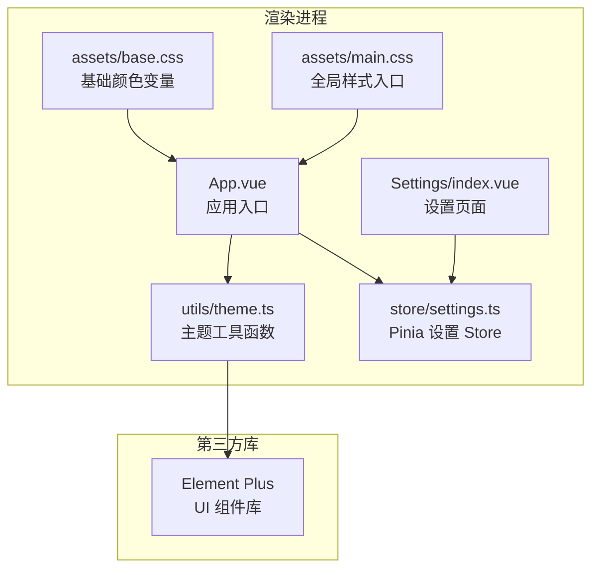
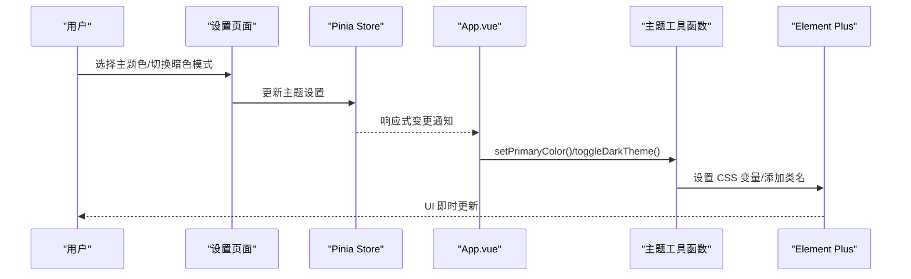
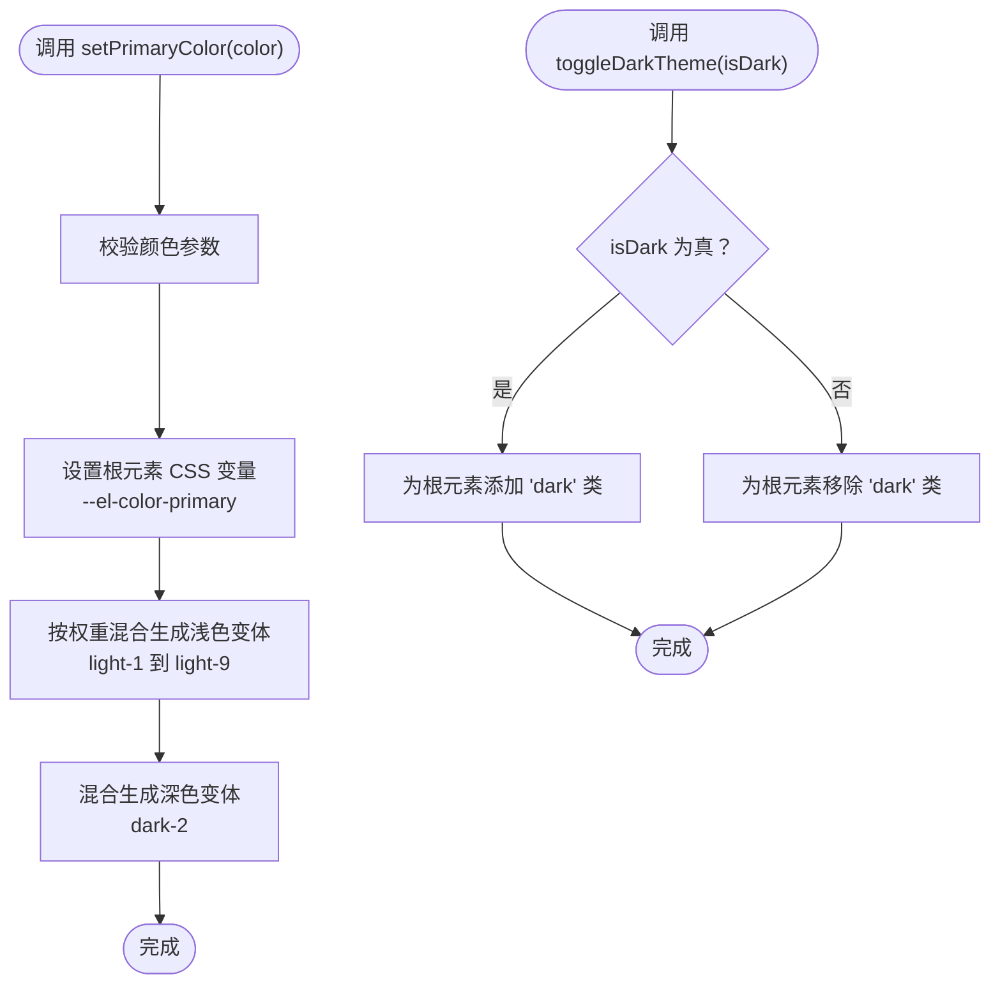
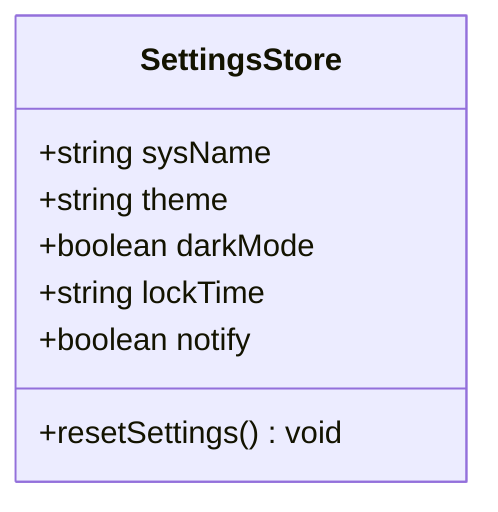
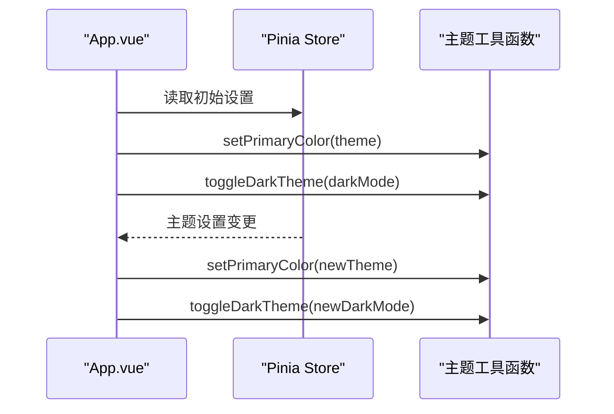
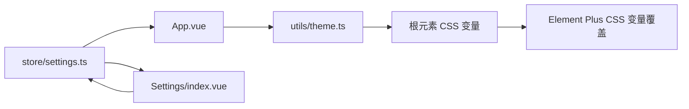

# 主题系统

<cite>
**本文档引用的文件**
- [theme.ts](file://src/renderer/src/utils/theme.ts)
- [settings.ts](file://src/renderer/src/store/settings.ts)
- [App.vue](file://src/renderer/src/App.vue)
- [index.vue](file://src/renderer/src/views/Settings/index.vue)
- [base.css](file://src/renderer/src/assets/base.css)
- [main.css](file://src/renderer/src/assets/main.css)
- [Versions.vue](file://src/renderer/src/components/Versions.vue)
- [package.json](file://package.json)
</cite>

## 目录

1. [简介](#简介)
2. [项目结构](#项目结构)
3. [核心组件](#核心组件)
4. [架构总览](#架构总览)
5. [详细组件分析](#详细组件分析)
6. [依赖关系分析](#依赖关系分析)
7. [性能考量](#性能考量)
8. [故障排除指南](#故障排除指南)
9. [结论](#结论)
10. [附录](#附录)

## 简介

本文件为 MyTool 应用的主题系统技术文档，聚焦于主题切换机制的实现原理与最佳实践，涵盖以下方面：

- CSS 变量系统与动态样式注入
- 主题状态管理与持久化
- 暗色模式实现策略与样式适配
- 主题工具函数的使用方法与扩展指南
- 跨组件主题一致性保证与性能优化建议
- 浏览器兼容性考虑

## 项目结构

MyTool 的主题系统围绕渲染进程的 Vue 应用展开，核心文件分布如下：

- 工具层：主题工具函数位于 utils 目录，负责动态设置 Element Plus 主题色与暗色模式开关
- 状态层：Pinia Store 管理主题色、暗色模式等设置，并通过持久化插件实现本地存储
- 视图层：App.vue 在挂载时应用初始主题；Settings 页面提供主题色与暗色模式的交互入口
- 样式层：base.css 定义基础颜色变量；main.css 引入基础样式；Element Plus 提供暗色模式的 CSS 变量覆盖

图表来源

- [App.vue:1-47](file://src/renderer/src/App.vue#L1-L47)
- [index.vue:1-198](file://src/renderer/src/views/Settings/index.vue#L1-L198)
- [theme.ts:1-70](file://src/renderer/src/utils/theme.ts#L1-L70)
- [settings.ts:1-34](file://src/renderer/src/store/settings.ts#L1-L34)
- [base.css:1-68](file://src/renderer/src/assets/base.css#L1-L68)
- [main.css:1-18](file://src/renderer/src/assets/main.css#L1-L18)

章节来源

- [App.vue:1-47](file://src/renderer/src/App.vue#L1-L47)
- [index.vue:1-198](file://src/renderer/src/views/Settings/index.vue#L1-L198)
- [theme.ts:1-70](file://src/renderer/src/utils/theme.ts#L1-L70)
- [settings.ts:1-34](file://src/renderer/src/store/settings.ts#L1-L34)
- [base.css:1-68](file://src/renderer/src/assets/base.css#L1-L68)
- [main.css:1-18](file://src/renderer/src/assets/main.css#L1-L18)

## 核心组件

- 主题工具函数（utils/theme.ts）
  - 提供 Element Plus 主题色动态设置能力，基于颜色混合算法生成浅色/深色变体
  - 提供暗色模式切换函数，通过为根元素添加/移除类名实现
- 设置 Store（store/settings.ts）
  - 管理主题色、暗色模式、系统名称等设置项
  - 使用 Pinia 插件实现持久化，确保刷新后主题状态不丢失
- 应用入口（App.vue）
  - 在挂载时读取持久化设置并应用主题
  - 通过响应式监听设置变化，实时更新主题
- 设置页面（views/Settings/index.vue）
  - 提供主题色选择器与暗色模式开关
  - 内置预定义主题色集合，便于快速切换

章节来源

- [theme.ts:1-70](file://src/renderer/src/utils/theme.ts#L1-L70)
- [settings.ts:1-34](file://src/renderer/src/store/settings.ts#L1-L34)
- [App.vue:1-47](file://src/renderer/src/App.vue#L1-L47)
- [index.vue:1-198](file://src/renderer/src/views/Settings/index.vue#L1-L198)

## 架构总览

主题系统采用“状态驱动 + CSS 变量 + 第三方库覆盖”的架构：

- 状态驱动：Pinia Store 存储主题设置，组件通过响应式监听实现联动更新
- CSS 变量：通过动态设置 CSS 自定义属性实现主题色与暗色模式的即时生效
- 第三方库覆盖：Element Plus 提供暗色模式的 CSS 变量覆盖，确保组件样式一致

图表来源

- [index.vue:1-198](file://src/renderer/src/views/Settings/index.vue#L1-L198)
- [settings.ts:1-34](file://src/renderer/src/store/settings.ts#L1-L34)
- [App.vue:1-47](file://src/renderer/src/App.vue#L1-L47)
- [theme.ts:1-70](file://src/renderer/src/utils/theme.ts#L1-L70)

## 详细组件分析

### 主题工具函数（utils/theme.ts）

- 颜色混合算法
  - 将输入的颜色值转换为 RGB 分量，按权重混合生成中间色
  - 支持 3/6 位十六进制颜色格式，自动扩展为 6 位
  - 生成浅色变体（light-1 到 light-9）与深色变体（dark-2），用于不同交互状态
- 动态设置 Element Plus 主题色
  - 通过设置根元素的 CSS 变量实现主题色的统一替换
  - 自动计算并注入 Element Plus 所需的浅色/深色变体，保证组件状态色一致
- 暗色模式切换
  - 通过为根元素添加/移除类名触发 Element Plus 的暗色模式样式覆盖
  - 该类名由第三方库提供，无需手动维护暗色模式下的大量 CSS 变量

图表来源

- [theme.ts:1-70](file://src/renderer/src/utils/theme.ts#L1-L70)

章节来源

- [theme.ts:1-70](file://src/renderer/src/utils/theme.ts#L1-L70)

### 设置 Store（store/settings.ts）

- 数据模型
  - sysName：系统名称，用于同步窗口标题
  - theme：主题色，默认值为十六进制颜色码
  - darkMode：布尔值，控制暗色模式开关
  - lockTime：自动锁屏时间
  - notify：是否接收系统通知
- 持久化策略
  - 使用 Pinia 插件实现持久化，数据自动写入本地存储
  - 应用启动时从持久化存储读取设置，避免每次刷新丢失主题状态

图表来源

- [settings.ts:1-34](file://src/renderer/src/store/settings.ts#L1-L34)

章节来源

- [settings.ts:1-34](file://src/renderer/src/store/settings.ts#L1-L34)

### 应用入口（App.vue）

- 初始化流程
  - 在挂载时读取持久化设置并应用主题色与暗色模式
  - 同步系统名称到窗口标题
- 响应式监听
  - 监听主题色变化，实时调用工具函数更新 Element Plus 主题
  - 监听暗色模式变化，动态切换根元素类名以启用/禁用暗色模式

图表来源

- [App.vue:1-47](file://src/renderer/src/App.vue#L1-L47)
- [settings.ts:1-34](file://src/renderer/src/store/settings.ts#L1-L34)
- [theme.ts:1-70](file://src/renderer/src/utils/theme.ts#L1-L70)

章节来源

- [App.vue:1-47](file://src/renderer/src/App.vue#L1-L47)

### 设置页面（views/Settings/index.vue）

- 用户交互
  - 主题色选择器：支持预定义颜色与自定义颜色
  - 暗色模式开关：一键切换明/暗色主题
- 数据绑定
  - 使用双向绑定与 Pinia Store 同步，无需手动保存
  - 内置预定义主题色集合，覆盖多种设计风格

章节来源

- [index.vue:1-198](file://src/renderer/src/views/Settings/index.vue#L1-L198)

### 样式层（assets/base.css 与 assets/main.css）

- 基础颜色变量
  - 定义基础色板与文本颜色变量，作为应用整体视觉的基础
  - 通过 CSS 变量映射到背景、文本等通用属性
- 全局样式入口
  - 引入基础样式，统一字体、间距与视口尺寸
  - 为应用容器提供全屏布局基线

章节来源

- [base.css:1-68](file://src/renderer/src/assets/base.css#L1-L68)
- [main.css:1-18](file://src/renderer/src/assets/main.css#L1-L18)

### 组件示例（components/Versions.vue）

- 组件内部未直接使用主题变量，但会继承应用级样式
- 展示了组件如何在主题切换下保持一致的视觉风格

章节来源

- [Versions.vue:1-14](file://src/renderer/src/components/Versions.vue#L1-L14)

## 依赖关系分析

- 主题工具函数依赖 Element Plus 的 CSS 变量规范，通过设置根元素的 CSS 变量实现主题色与暗色模式的统一控制
- 设置 Store 通过 Pinia 插件实现持久化，确保主题状态在重启后仍可恢复
- 应用入口与设置页面共同构成主题状态的读取与写入路径，形成闭环

图表来源

- [theme.ts:1-70](file://src/renderer/src/utils/theme.ts#L1-L70)
- [settings.ts:1-34](file://src/renderer/src/store/settings.ts#L1-L34)
- [App.vue:1-47](file://src/renderer/src/App.vue#L1-L47)
- [index.vue:1-198](file://src/renderer/src/views/Settings/index.vue#L1-L198)

章节来源

- [theme.ts:1-70](file://src/renderer/src/utils/theme.ts#L1-L70)
- [settings.ts:1-34](file://src/renderer/src/store/settings.ts#L1-L34)
- [App.vue:1-47](file://src/renderer/src/App.vue#L1-L47)
- [index.vue:1-198](file://src/renderer/src/views/Settings/index.vue#L1-L198)

## 性能考量

- 动态样式注入成本低
  - 仅设置根元素 CSS 变量与切换类名，避免重排与重绘的额外开销
- 颜色混合算法复杂度
  - 每次主题色变更时进行固定次数的颜色混合计算，复杂度为 O(1)，开销极小
- 持久化策略
  - Pinia 持久化插件仅在设置变更时写入本地存储，避免频繁 I/O
- 建议
  - 避免在高频事件中重复触发主题切换
  - 对于复杂场景，可考虑缓存当前主题色与变体，减少重复计算

## 故障排除指南

- 主题色未生效
  - 检查根元素 CSS 变量是否正确设置
  - 确认 Element Plus 版本与 CSS 变量命名一致
- 暗色模式无效
  - 确认根元素类名包含暗色模式类
  - 检查第三方库提供的暗色模式覆盖是否加载
- 设置未持久化
  - 确认 Pinia 持久化插件已正确安装与配置
  - 检查本地存储权限与容量

章节来源

- [theme.ts:1-70](file://src/renderer/src/utils/theme.ts#L1-L70)
- [settings.ts:1-34](file://src/renderer/src/store/settings.ts#L1-L34)
- [App.vue:1-47](file://src/renderer/src/App.vue#L1-L47)

## 结论

MyTool 的主题系统通过简洁的工具函数与 Pinia Store 实现了主题色与暗色模式的动态切换，结合 Element Plus 的 CSS 变量覆盖，确保了跨组件的一致性与良好的用户体验。该方案具备较低的实现复杂度与良好的性能表现，适合在 Electron + Vue 应用中推广使用。

## 附录

### 主题工具函数使用方法

- 设置主题色
  - 调用工具函数设置根元素的主色变量，并自动计算浅/深色变体
- 切换暗色模式
  - 通过切换根元素类名启用/禁用 Element Plus 的暗色模式样式

章节来源

- [theme.ts:1-70](file://src/renderer/src/utils/theme.ts#L1-L70)

### 主题配置选项

- 主题色：十六进制颜色码，支持 3/6 位格式
- 暗色模式：布尔值，控制暗色模式开关
- 系统名称：用于同步窗口标题
- 自动锁屏时间：支持分钟数或“永不”
- 接收系统通知：布尔值，控制通知开关

章节来源

- [settings.ts:1-34](file://src/renderer/src/store/settings.ts#L1-L34)
- [index.vue:1-198](file://src/renderer/src/views/Settings/index.vue#L1-L198)

### 自定义主题创建流程

- 定义新的颜色变量
  - 在基础样式中新增颜色变量，确保与业务语义匹配
- 注入到主题工具函数
  - 在工具函数中为新变量设置对应的 CSS 变量映射
- 在组件中使用
  - 通过 CSS 变量在组件中引用新颜色，实现主题一致性

章节来源

- [base.css:1-68](file://src/renderer/src/assets/base.css#L1-L68)
- [theme.ts:1-70](file://src/renderer/src/utils/theme.ts#L1-L70)

### 跨组件主题一致性保证

- 使用 CSS 变量统一管理颜色
  - 在基础样式中集中定义颜色变量，组件通过变量引用
- 依赖 Element Plus 的 CSS 变量覆盖
  - 通过根元素类名切换，确保第三方组件样式随主题变化
- 在 Store 中集中管理主题状态
  - 通过 Pinia Store 的响应式特性，确保主题状态在全局范围内一致

章节来源

- [base.css:1-68](file://src/renderer/src/assets/base.css#L1-L68)
- [theme.ts:1-70](file://src/renderer/src/utils/theme.ts#L1-L70)
- [settings.ts:1-34](file://src/renderer/src/store/settings.ts#L1-L34)

### 浏览器兼容性考虑

- CSS 变量支持
  - 现代浏览器均支持 CSS 变量，无需额外 polyfill
- Element Plus 暗色模式
  - 依赖第三方库提供的暗色模式覆盖，确保在 Electron 环境下的兼容性
- 颜色混合算法
  - 使用原生 JavaScript 数学运算，无特殊 API 依赖

章节来源

- [theme.ts:1-70](file://src/renderer/src/utils/theme.ts#L1-L70)
- [package.json:1-61](file://package.json#L1-L61)
