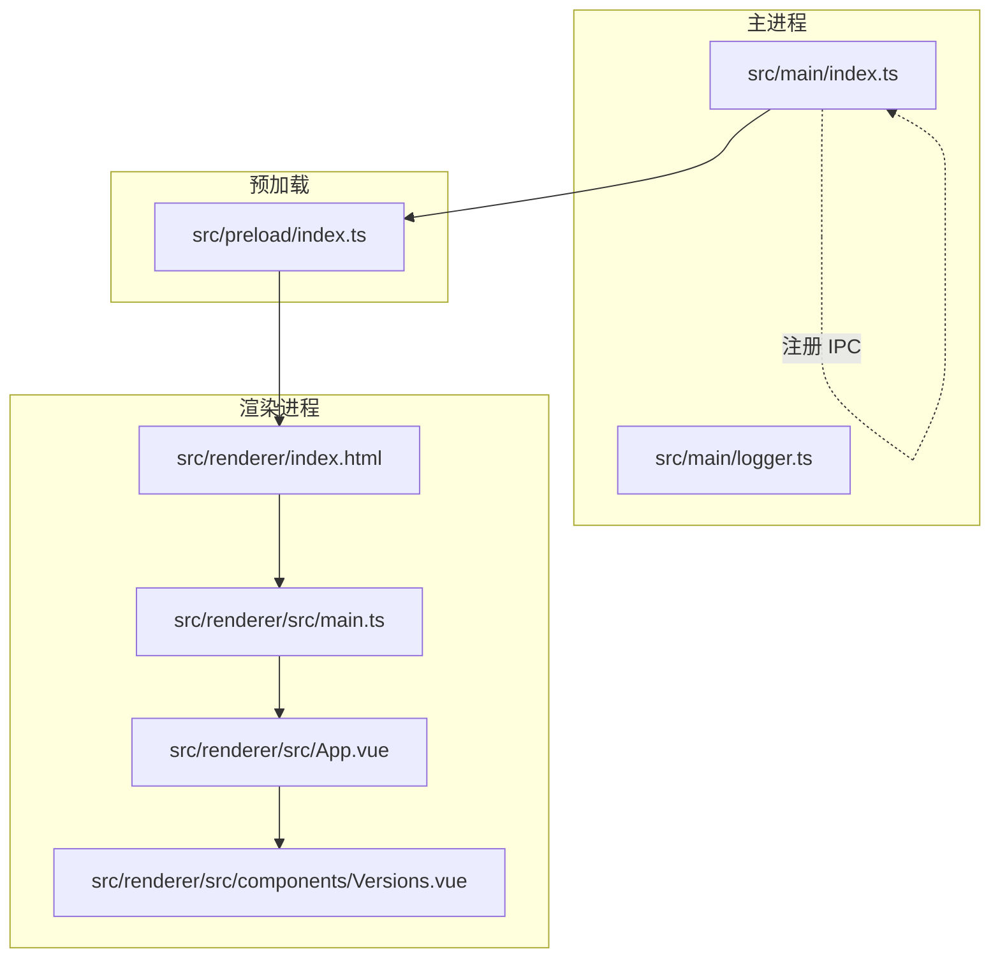
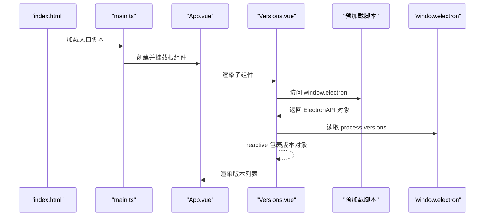
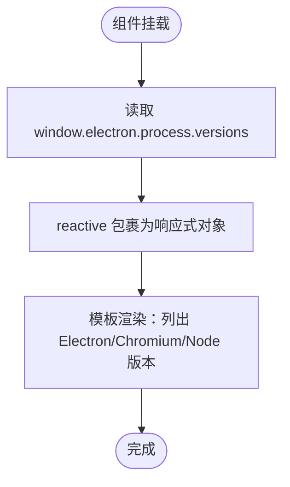
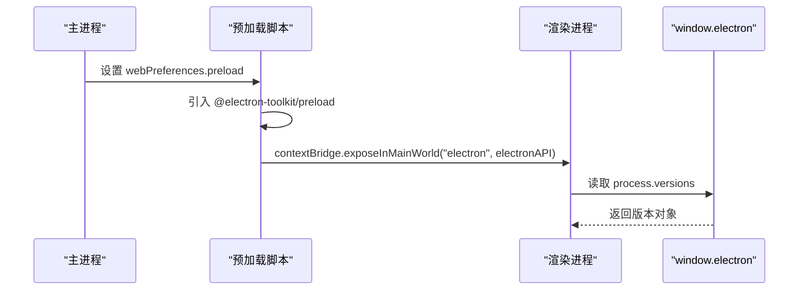
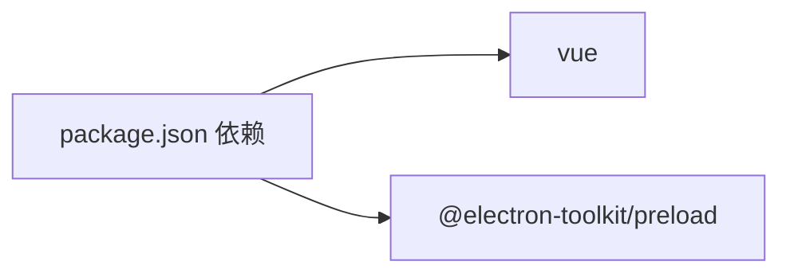

# 基础组件

<cite>
**本文引用的文件**
- [Versions.vue](file://src/renderer/src/components/Versions.vue)
- [index.ts（预加载脚本）](file://src/preload/index.ts)
- [index.ts（主进程入口）](file://src/main/index.ts)
- [index.html（渲染进程入口）](file://src/renderer/index.html)
- [main.ts（渲染进程应用入口）](file://src/renderer/src/main.ts)
- [App.vue（根组件）](file://src/renderer/src/App.vue)
- [settings.ts（设置状态管理）](file://src/renderer/src/store/settings.ts)
- [base.css（基础样式）](file://src/renderer/src/assets/base.css)
- [main.css（全局样式）](file://src/renderer/src/assets/main.css)
- [package.json](file://package.json)
- [tsconfig.json](file://tsconfig.json)
</cite>

## 目录

1. [简介](#简介)
2. [项目结构](#项目结构)
3. [核心组件](#核心组件)
4. [架构总览](#架构总览)
5. [组件详解](#组件详解)
6. [依赖关系分析](#依赖关系分析)
7. [性能考量](#性能考量)
8. [故障排查指南](#故障排查指南)
9. [结论](#结论)
10. [附录](#附录)

## 简介

本章节面向 MyTool 的基础组件，重点围绕 Versions 组件展开，系统性说明其设计思路、实现原理与使用方法。内容涵盖：

- 版本信息展示：Electron、Chromium、Node 的版本来源与显示逻辑
- 响应式数据绑定：如何通过 reactive 将 window.electron.process.versions 转为可观察对象
- 模板结构：简洁列表展示三类运行时版本
- 与主进程的 IPC 通信：通过 @electron-toolkit/preload 提供的 ElectronAPI 暴露 window.electron，从而在渲染进程中读取 process.versions
- 使用示例、样式定制与扩展建议
- 在应用中的定位与与其他组件的协作关系

## 项目结构

MyTool 采用 Electron + Vue 3 + TypeScript 的典型分层结构：

- 主进程负责窗口创建、IPC 注册与系统级能力（如日志路径变更）
- 预加载脚本通过 contextBridge 暴露受控 API 到渲染进程
- 渲染进程以 Vue 应用启动，按需挂载组件

图表来源

- [index.ts（主进程入口）:12-42](file://src/main/index.ts#L12-L42)
- [index.ts（预加载脚本）:1-37](file://src/preload/index.ts#L1-L37)
- [index.html（渲染进程入口）:1-17](file://src/renderer/index.html#L1-L17)
- [main.ts（渲染进程应用入口）:1-24](file://src/renderer/src/main.ts#L1-L24)
- [App.vue（根组件）:1-47](file://src/renderer/src/App.vue#L1-L47)
- [Versions.vue:1-14](file://src/renderer/src/components/Versions.vue#L1-L14)

章节来源

- [index.ts（主进程入口）:12-42](file://src/main/index.ts#L12-L42)
- [index.ts（预加载脚本）:1-37](file://src/preload/index.ts#L1-L37)
- [index.html（渲染进程入口）:1-17](file://src/renderer/index.html#L1-L17)
- [main.ts（渲染进程应用入口）:1-24](file://src/renderer/src/main.ts#L1-L24)
- [App.vue（根组件）:1-47](file://src/renderer/src/App.vue#L1-L47)
- [Versions.vue:1-14](file://src/renderer/src/components/Versions.vue#L1-L14)

## 核心组件

本节聚焦 Versions 组件，它是应用中展示当前运行时版本信息的基础组件，职责单一且稳定。

- 组件职责
  - 读取 window.electron.process.versions 并将其转为响应式对象
  - 在模板中以列表形式展示 Electron、Chromium、Node 的版本号
- 数据来源
  - 通过 @electron-toolkit/preload 暴露的 ElectronAPI，在预加载阶段注入到 window.electron
  - window.electron.process.versions 是标准的 Electron 运行时版本集合
- 响应式绑定
  - 使用 reactive 包裹解构后的版本对象，确保模板中的版本号变化时自动更新
- 模板结构
  - 单一无序列表，包含三个版本项，分别对应 Electron、Chromium、Node

章节来源

- [Versions.vue:1-14](file://src/renderer/src/components/Versions.vue#L1-L14)
- [index.ts（预加载脚本）:24-36](file://src/preload/index.ts#L24-L36)

## 架构总览

Versions 组件的运行链路如下：

- 预加载脚本在渲染进程上下文中暴露 window.electron（包含 process.versions）
- 渲染进程应用启动后，Versions 组件在挂载时读取该对象并建立响应式绑定
- 模板基于响应式数据进行渲染；由于版本号通常在应用启动时固定，一般不会频繁变化

图表来源

- [index.html（渲染进程入口）:13-16](file://src/renderer/index.html#L13-L16)
- [main.ts（渲染进程应用入口）:12-24](file://src/renderer/src/main.ts#L12-L24)
- [App.vue（根组件）:40-42](file://src/renderer/src/App.vue#L40-L42)
- [Versions.vue:4-12](file://src/renderer/src/components/Versions.vue#L4-L12)
- [index.ts（预加载脚本）:24-36](file://src/preload/index.ts#L24-L36)

## 组件详解

### 组件属性与数据模型

- 输入
  - 无外部 props，直接消费 window.electron.process.versions
- 内部状态
  - versions：响应式对象，包含 electron、chrome、node 等键值
- 模板
  - 一个无序列表，每个 li 展示对应版本号

图表来源

- [Versions.vue:4-12](file://src/renderer/src/components/Versions.vue#L4-L12)

章节来源

- [Versions.vue:1-14](file://src/renderer/src/components/Versions.vue#L1-L14)

### IPC 通信与数据来源

- 预加载脚本通过 contextBridge 将 @electron-toolkit/preload 的 ElectronAPI 暴露到 window.electron
- 渲染进程直接访问 window.electron.process.versions 获取版本信息
- 该流程不涉及自定义 IPC，属于安全的 API 暴露与使用

图表来源

- [index.ts（主进程入口）:20-24](file://src/main/index.ts#L20-L24)
- [index.ts（预加载脚本）:1-37](file://src/preload/index.ts#L1-L37)
- [Versions.vue:4-4](file://src/renderer/src/components/Versions.vue#L4-L4)

章节来源

- [index.ts（主进程入口）:20-24](file://src/main/index.ts#L20-L24)
- [index.ts（预加载脚本）:24-36](file://src/preload/index.ts#L24-L36)
- [Versions.vue:4-4](file://src/renderer/src/components/Versions.vue#L4-L4)

### 使用示例

- 在任意页面或布局中引入 Versions 组件即可展示版本信息
- 若需在特定区域显示，可在父组件模板中插入该组件标签
- 示例路径参考：[Versions.vue:7-12](file://src/renderer/src/components/Versions.vue#L7-L12)

章节来源

- [Versions.vue:7-12](file://src/renderer/src/components/Versions.vue#L7-L12)

### 样式定制与扩展

- 当前样式来自全局基础样式与组件内类名
  - 容器类名：versions
  - 子项类名：electron-version、chrome-version、node-version
- 建议在业务样式文件中针对上述类名进行覆盖，以适配主题色、字号、间距等
- 基础样式参考：
  - [base.css:42-67](file://src/renderer/src/assets/base.css#L42-L67)
  - [main.css:1-18](file://src/renderer/src/assets/main.css#L1-L18)

章节来源

- [Versions.vue:7-12](file://src/renderer/src/components/Versions.vue#L7-L12)
- [base.css:42-67](file://src/renderer/src/assets/base.css#L42-L67)
- [main.css:1-18](file://src/renderer/src/assets/main.css#L1-L18)

### 与其他组件的协作关系

- 与根组件 App.vue 的关系
  - App.vue 负责全局主题与标题联动，Versions 组件作为页面内容的一部分被渲染
- 与 Element Plus 的关系
  - 应用已全局注册 Element Plus，Versions 组件未直接使用 Element Plus 组件，但可按需扩展
- 与设置状态管理的关系
  - 设置状态（如主题色、暗黑模式）由 Pinia 管理并通过 App.vue 应用，与 Versions 组件无直接耦合

章节来源

- [App.vue（根组件）:1-47](file://src/renderer/src/App.vue#L1-L47)
- [settings.ts（设置状态管理）:1-34](file://src/renderer/src/store/settings.ts#L1-L34)
- [main.ts（渲染进程应用入口）:1-24](file://src/renderer/src/main.ts#L1-L24)

## 依赖关系分析

- 外部依赖
  - @electron-toolkit/preload：提供 window.electron 的 ElectronAPI
  - vue：提供 reactive 与模板渲染能力
- 内部依赖
  - 预加载脚本依赖 @electron-toolkit/preload，并通过 contextBridge 暴露 API
  - Versions 组件依赖 window.electron.process.versions 的可用性

图表来源

- [package.json:23-37](file://package.json#L23-L37)

章节来源

- [package.json:23-37](file://package.json#L23-L37)
- [index.ts（预加载脚本）:1-2](file://src/preload/index.ts#L1-L2)
- [Versions.vue:2-2](file://src/renderer/src/components/Versions.vue#L2-L2)

## 性能考量

- Versions 组件仅做一次性读取与渲染，开销极低
- reactive 包裹的对象为只读版本信息，不会产生额外的计算或副作用
- 若未来需要动态刷新版本信息，应评估是否需要重新读取 window.electron.process.versions 或通过 IPC 查询主进程（当前实现无需 IPC）

## 故障排查指南

- 无法读取 window.electron
  - 确认预加载脚本已正确注入 window.electron
  - 确认 index.html 已加载渲染进程入口脚本
  - 参考：[index.ts（预加载脚本）:24-36](file://src/preload/index.ts#L24-L36)、[index.html（渲染进程入口）:13-16](file://src/renderer/index.html#L13-L16)
- 版本号为空或未更新
  - 确认组件已挂载且模板中存在对应占位符
  - 参考：[Versions.vue:7-12](file://src/renderer/src/components/Versions.vue#L7-L12)
- 样式异常
  - 检查全局样式是否正确引入
  - 参考：[main.ts（渲染进程应用入口）:1-10](file://src/renderer/src/main.ts#L1-L10)、[main.css:1-18](file://src/renderer/src/assets/main.css#L1-L18)

章节来源

- [index.ts（预加载脚本）:24-36](file://src/preload/index.ts#L24-L36)
- [index.html（渲染进程入口）:13-16](file://src/renderer/index.html#L13-L16)
- [main.ts（渲染进程应用入口）:1-10](file://src/renderer/src/main.ts#L1-L10)
- [Versions.vue:7-12](file://src/renderer/src/components/Versions.vue#L7-L12)
- [main.css:1-18](file://src/renderer/src/assets/main.css#L1-L18)

## 结论

Versions 组件以最小实现完成运行时版本信息的展示，借助 @electron-toolkit/preload 的安全 API 暴露与 Vue 的响应式系统，实现了简洁可靠的版本展示功能。其与主进程无直接 IPC 交互，降低了复杂度与维护成本；同时具备良好的可扩展性，便于在后续需求中增加动态刷新或更多版本维度。

## 附录

- 关键实现路径
  - 版本读取与响应式绑定：[Versions.vue:4-4](file://src/renderer/src/components/Versions.vue#L4-L4)
  - 模板渲染：[Versions.vue:7-12](file://src/renderer/src/components/Versions.vue#L7-L12)
  - API 暴露与注入：[index.ts（预加载脚本）:24-36](file://src/preload/index.ts#L24-L36)
  - 应用入口与全局样式：[main.ts（渲染进程应用入口）:1-10](file://src/renderer/src/main.ts#L1-L10)、[main.css:1-18](file://src/renderer/src/assets/main.css#L1-L18)
- 相关配置
  - 路径别名与编译配置：[tsconfig.json:4-9](file://tsconfig.json#L4-L9)
