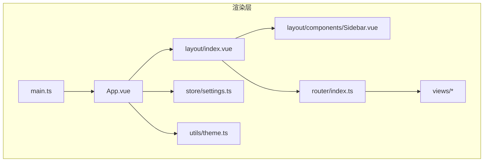
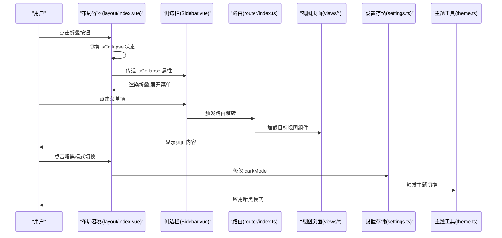
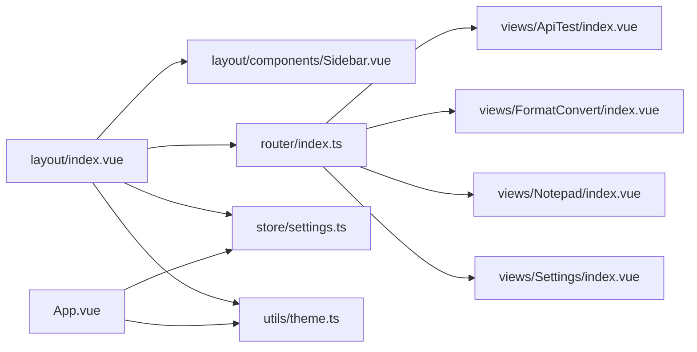

# 布局组件

<cite>
**本文引用的文件**
- [layout/index.vue](file://src/renderer/src/layout/index.vue)
- [layout/components/Sidebar.vue](file://src/renderer/src/layout/components/Sidebar.vue)
- [router/index.ts](file://src/renderer/src/router/index.ts)
- [store/settings.ts](file://src/renderer/src/store/settings.ts)
- [App.vue](file://src/renderer/src/App.vue)
- [utils/theme.ts](file://src/renderer/src/utils/theme.ts)
- [views/ApiTest/index.vue](file://src/renderer/src/views/ApiTest/index.vue)
- [views/FormatConvert/index.vue](file://src/renderer/src/views/FormatConvert/index.vue)
- [views/Notepad/index.vue](file://src/renderer/src/views/Notepad/index.vue)
- [views/Settings/index.vue](file://src/renderer/src/views/Settings/index.vue)
- [main.ts](file://src/renderer/src/main.ts)
- [assets/base.css](file://src/renderer/src/assets/base.css)
- [assets/main.css](file://src/renderer/src/assets/main.css)
</cite>

## 目录

1. [简介](#简介)
2. [项目结构](#项目结构)
3. [核心组件](#核心组件)
4. [架构总览](#架构总览)
5. [详细组件分析](#详细组件分析)
6. [依赖分析](#依赖分析)
7. [性能考虑](#性能考虑)
8. [故障排查指南](#故障排查指南)
9. [结论](#结论)
10. [附录](#附录)

## 简介

本文件面向 MyTool 的布局组件系统，重点围绕侧边栏组件的设计理念与实现方式进行深入解析。内容涵盖：

- 导航菜单结构与路由链接配置
- 响应式布局适配策略
- 布局组件层级关系、组件通信机制与状态管理
- 页面导航、功能模块切换与用户体验优化
- 布局定制指南、样式覆盖方法与移动端适配策略
- 布局组件的扩展方法与最佳实践建议

## 项目结构

MyTool 采用基于 Vue 3 + Element Plus 的渲染层架构，布局系统位于渲染端，通过路由嵌套实现主框架与子页面的组合。关键目录与文件如下：

- 布局框架：layout/index.vue
- 侧边栏组件：layout/components/Sidebar.vue
- 路由配置：router/index.ts
- 状态管理：store/settings.ts
- 主题工具：utils/theme.ts
- 视图页面：views 下各模块页面
- 应用入口：main.ts
- 全局样式：assets/base.css、assets/main.css

图表来源

- [main.ts:1-24](file://src/renderer/src/main.ts#L1-L24)
- [App.vue:1-47](file://src/renderer/src/App.vue#L1-L47)
- [layout/index.vue:1-232](file://src/renderer/src/layout/index.vue#L1-L232)
- [layout/components/Sidebar.vue:1-149](file://src/renderer/src/layout/components/Sidebar.vue#L1-L149)
- [router/index.ts:1-79](file://src/renderer/src/router/index.ts#L1-L79)
- [store/settings.ts:1-34](file://src/renderer/src/store/settings.ts#L1-L34)
- [utils/theme.ts:1-70](file://src/renderer/src/utils/theme.ts#L1-L70)

章节来源

- [main.ts:1-24](file://src/renderer/src/main.ts#L1-L24)
- [assets/main.css:1-18](file://src/renderer/src/assets/main.css#L1-L18)
- [assets/base.css:1-68](file://src/renderer/src/assets/base.css#L1-L68)

## 核心组件

- 布局容器（layout/index.vue）：负责整体布局、头部区域、面包屑、主内容区与路由视图的承载，并提供侧边栏折叠控制与暗黑模式切换。
- 侧边栏（layout/components/Sidebar.vue）：提供垂直导航菜单，支持根据路由高亮选中项，支持折叠与展开，集成图标与主题色。
- 路由系统（router/index.ts）：定义主框架与子页面的嵌套关系，设置页面标题与重定向规则。
- 状态管理（store/settings.ts）：集中管理主题色、暗黑模式、系统名称等全局配置，并持久化存储。
- 主题工具（utils/theme.ts）：动态设置 Element Plus 主题色与暗黑模式开关。
- 视图页面（views/\*）：具体业务页面，作为路由视图在布局容器中渲染。

章节来源

- [layout/index.vue:1-232](file://src/renderer/src/layout/index.vue#L1-L232)
- [layout/components/Sidebar.vue:1-149](file://src/renderer/src/layout/components/Sidebar.vue#L1-L149)
- [router/index.ts:1-79](file://src/renderer/src/router/index.ts#L1-L79)
- [store/settings.ts:1-34](file://src/renderer/src/store/settings.ts#L1-L34)
- [utils/theme.ts:1-70](file://src/renderer/src/utils/theme.ts#L1-L70)

## 架构总览

布局系统采用“主框架 + 子页面”的嵌套路由模式，侧边栏与头部区域在主框架内固定，子页面通过路由视图动态切换。状态管理通过 Pinia 提供，主题与暗黑模式通过全局监听与 CSS 变量生效。

图表来源

- [layout/index.vue:63-98](file://src/renderer/src/layout/index.vue#L63-L98)
- [layout/components/Sidebar.vue:38-53](file://src/renderer/src/layout/components/Sidebar.vue#L38-L53)
- [router/index.ts:59-79](file://src/renderer/src/router/index.ts#L59-L79)
- [store/settings.ts:1-34](file://src/renderer/src/store/settings.ts#L1-L34)
- [utils/theme.ts:63-69](file://src/renderer/src/utils/theme.ts#L63-L69)

## 详细组件分析

### 布局容器（layout/index.vue）

- 设计理念
  - 使用 Element Plus 容器组件构建三段式布局：侧边栏、头部、主内容区。
  - 通过响应式折叠控制与面包屑导航提升信息层级与可发现性。
  - 顶部快捷切换暗黑模式，结合 Pinia 状态与主题工具实现即时生效。
- 关键实现点
  - 折叠控制：通过本地状态 isCollapse 控制侧边栏宽度与图标切换。
  - 面包屑：基于路由元信息 title 或 name 动态展示当前页面路径。
  - 登录退出：通过消息框确认后跳转至登录页。
  - 路由视图：使用过渡动画承载子页面切换，提升视觉连贯性。
- 样式与交互
  - 头部阴影与圆角，右侧用户信息与下拉菜单，暗黑模式图标高亮。
  - 主内容区自适应高度，隐藏原生滚动条，统一使用 Element Plus 滚动条。
- 性能与体验
  - 路由视图过渡动画轻量化，避免大体积组件频繁切换带来的卡顿。
  - 头部固定高度，主内容区高度计算精确，减少重排。

章节来源

- [layout/index.vue:1-232](file://src/renderer/src/layout/index.vue#L1-L232)

### 侧边栏组件（layout/components/Sidebar.vue）

- 设计理念
  - 垂直菜单与 Logo 区域分离，支持折叠以节省空间。
  - 菜单项与路由 index 对齐，自动高亮当前激活项。
  - 主题色与图标颜色与全局设置联动，确保视觉一致性。
- 关键实现点
  - 属性接收：接收父组件传入的 isCollapse 状态，动态调整宽度与图标布局。
  - 菜单高亮：基于当前路由路径计算 activeMenu，实现自动选中。
  - 图标与文案：使用 Element Plus 图标库，折叠状态下仅显示图标。
- 样式与兼容
  - 深度作用选择器修复折叠时菜单项对齐与间距问题。
  - 菜单项圆角与悬停效果，激活态强调突出。
- 性能与体验
  - 菜单高度随屏幕自适应，避免滚动条出现。
  - 折叠动画平滑，图标与文字过渡自然。

章节来源

- [layout/components/Sidebar.vue:1-149](file://src/renderer/src/layout/components/Sidebar.vue#L1-L149)

### 路由系统（router/index.ts）

- 设计理念
  - 采用嵌套路由：根路径指向布局容器，子路由承载各功能页面。
  - 在布局容器中设置重定向，访问根路径即进入第一个功能模块。
  - 页面标题通过 meta.title 动态设置，路由守卫中统一处理。
- 关键实现点
  - 路由表：定义登录页与布局容器，布局容器包含多个子页面。
  - meta 信息：为每个子页面设置标题与图标，便于面包屑与菜单展示。
  - 路由守卫：设置页面标题，预留鉴权逻辑扩展点。
- 性能与体验
  - 按需加载子页面组件，减少首屏体积。
  - 重定向简化用户入口，提升首次使用效率。

章节来源

- [router/index.ts:1-79](file://src/renderer/src/router/index.ts#L1-L79)

### 状态管理（store/settings.ts）

- 设计理念
  - 使用 Pinia 管理全局设置，包含系统名称、主题色、暗黑模式、自动锁屏时间、通知开关等。
  - 开启持久化插件，保证设置跨会话保留。
- 关键实现点
  - 设置项：sysName、theme、darkMode、lockTime、notify。
  - 重置方法：resetSettings 将设置恢复为默认值。
- 性能与体验
  - 持久化避免每次启动重新配置。
  - 与主题工具联动，实现即时主题切换。

章节来源

- [store/settings.ts:1-34](file://src/renderer/src/store/settings.ts#L1-L34)

### 主题工具（utils/theme.ts）

- 设计理念
  - 通过 CSS 变量与颜色混合算法动态生成 Element Plus 的主色与浅色/深色变体。
  - 提供暗黑模式开关，通过添加/移除 dark 类名实现。
- 关键实现点
  - 颜色混合：将十六进制颜色转换为 RGB 后按权重混合，生成 light-1 到 light-9 与 dark-2。
  - 主题色设置：为 --el-color-primary 与相关变体赋值。
  - 暗黑模式：为 documentElement 添加/移除 dark 类名。
- 性能与体验
  - 一次性注入变量，避免重复计算。
  - 暗黑模式切换即时生效，无闪烁。

章节来源

- [utils/theme.ts:1-70](file://src/renderer/src/utils/theme.ts#L1-L70)

### 应用入口（main.ts）

- 设计理念
  - 注册 Element Plus、图标组件与路由、状态管理，挂载应用。
  - 引入 Element Plus 样式与暗黑模式 CSS 变量。
- 关键实现点
  - 图标注册：遍历图标集合并全局注册，便于模板中直接使用。
  - 插件安装：按顺序安装路由、状态管理与 Element Plus。
- 性能与体验
  - 按需加载视图组件，首屏加载更快。
  - 全局样式引入确保主题与暗黑模式基础样式可用。

章节来源

- [main.ts:1-24](file://src/renderer/src/main.ts#L1-L24)

### 全局样式（assets/base.css、assets/main.css）

- 设计理念
  - 定义基础 CSS 变量与全局字体、背景、文本颜色。
  - 设置 body 与 #app 的尺寸与溢出策略，确保布局占满全屏。
- 关键实现点
  - 变量定义：基础颜色与文本颜色变量，便于主题扩展。
  - 全局样式：重置盒模型、列表样式，设置字体与抗锯齿。
  - 应用尺寸：body 与 #app 高宽 100%，隐藏滚动条。
- 性能与体验
  - 变量化便于统一风格与快速切换。
  - 隐藏原生滚动条，统一使用 Element Plus 滚动条。

章节来源

- [assets/base.css:1-68](file://src/renderer/src/assets/base.css#L1-L68)
- [assets/main.css:1-18](file://src/renderer/src/assets/main.css#L1-L18)

### 视图页面示例

- 接口测试（views/ApiTest/index.vue）
  - 表单结构清晰，请求地址与方法选择、发送请求与响应展示一体化。
  - 使用滚动条包裹响应区域，避免页面溢出。
- 格式转换（views/FormatConvert/index.vue）
  - 左右分栏输入与输出，中间箭头按钮触发转换。
  - 输入输出均使用滚动条包裹，聚焦态高亮主题色。
- 本地记事本（views/Notepad/index.vue）
  - 列表视图与编辑视图双态切换，富文本编辑器集成。
  - 保存状态提示、删除确认、自动锁屏时间等设置联动。
- 系统设置（views/Settings/index.vue）
  - 主题色预设、暗黑模式开关、日志路径管理、配置保存与重置。
  - 与 Pinia 设置存储双向绑定，持久化生效。

章节来源

- [views/ApiTest/index.vue:1-163](file://src/renderer/src/views/ApiTest/index.vue#L1-L163)
- [views/FormatConvert/index.vue:1-176](file://src/renderer/src/views/FormatConvert/index.vue#L1-L176)
- [views/Notepad/index.vue:1-599](file://src/renderer/src/views/Notepad/index.vue#L1-L599)
- [views/Settings/index.vue:1-198](file://src/renderer/src/views/Settings/index.vue#L1-L198)

## 依赖分析

- 组件耦合与协作
  - layout/index.vue 依赖 Sidebar.vue、router、store 与 utils/theme。
  - Sidebar.vue 依赖 router、store 与 Element Plus 菜单组件。
  - App.vue 依赖 store 与 utils/theme，负责全局主题与暗黑模式初始化。
  - router/index.ts 依赖各视图组件，定义嵌套路由与页面标题。
  - store/settings.ts 与 utils/theme.ts 协同实现主题与暗黑模式。
- 外部依赖
  - Element Plus：容器、菜单、表单、滚动条、对话框等组件。
  - Vue Router：路由导航与嵌套路由。
  - Pinia：状态管理与持久化。
  - @element-plus/icons-vue：图标库。
- 潜在循环依赖
  - 当前结构为单向依赖（布局 -> 子组件/路由/状态），无循环依赖风险。

图表来源

- [layout/index.vue:63-98](file://src/renderer/src/layout/index.vue#L63-L98)
- [layout/components/Sidebar.vue:38-53](file://src/renderer/src/layout/components/Sidebar.vue#L38-L53)
- [router/index.ts:3-57](file://src/renderer/src/router/index.ts#L3-L57)
- [store/settings.ts:1-34](file://src/renderer/src/store/settings.ts#L1-L34)
- [utils/theme.ts:44-69](file://src/renderer/src/utils/theme.ts#L44-L69)
- [App.vue:1-47](file://src/renderer/src/App.vue#L1-L47)

章节来源

- [layout/index.vue:63-98](file://src/renderer/src/layout/index.vue#L63-L98)
- [layout/components/Sidebar.vue:38-53](file://src/renderer/src/layout/components/Sidebar.vue#L38-L53)
- [router/index.ts:3-57](file://src/renderer/src/router/index.ts#L3-L57)
- [store/settings.ts:1-34](file://src/renderer/src/store/settings.ts#L1-L34)
- [utils/theme.ts:44-69](file://src/renderer/src/utils/theme.ts#L44-L69)
- [App.vue:1-47](file://src/renderer/src/App.vue#L1-L47)

## 性能考虑

- 路由懒加载：子页面通过动态导入按需加载，降低首屏资源压力。
- 组件复用：布局容器与侧边栏作为通用组件，减少重复渲染。
- 样式隔离：使用深度作用选择器与 CSS 变量，避免全局污染与重绘。
- 动画优化：路由视图过渡动画参数合理，避免过度消耗 GPU/CPU。
- 滚动条统一：隐藏原生滚动条，统一使用 Element Plus 滚动条，减少平台差异导致的性能波动。

## 故障排查指南

- 侧边栏不响应折叠
  - 检查布局容器是否正确传递 isCollapse 属性。
  - 确认 Element Plus 菜单组件的 collapse 属性是否生效。
- 菜单项未高亮
  - 确认路由 meta.index 与菜单 index 是否一致。
  - 检查 activeMenu 计算属性是否正确映射当前路由路径。
- 暗黑模式切换无效
  - 确认 App.vue 中是否调用 toggleDarkTheme 并监听 darkMode。
  - 检查 utils/theme.ts 中是否正确添加/移除 dark 类名。
- 主题色不生效
  - 确认 setPrimaryColor 是否被调用且传入有效颜色值。
  - 检查 CSS 变量是否被 Element Plus 正确识别。
- 页面标题未更新
  - 检查路由守卫中是否正确设置 document.title。
  - 确认 meta.title 是否在路由表中正确配置。

章节来源

- [layout/index.vue:74-84](file://src/renderer/src/layout/index.vue#L74-L84)
- [layout/components/Sidebar.vue:51-52](file://src/renderer/src/layout/components/Sidebar.vue#L51-L52)
- [router/index.ts:65-76](file://src/renderer/src/router/index.ts#L65-L76)
- [utils/theme.ts:63-69](file://src/renderer/src/utils/theme.ts#L63-L69)
- [App.vue:32-37](file://src/renderer/src/App.vue#L32-L37)

## 结论

MyTool 的布局组件系统以简洁、可扩展为核心设计原则，通过布局容器与侧边栏的职责分离、路由嵌套与状态管理的协同配合，实现了良好的页面导航、功能模块切换与用户体验。主题与暗黑模式通过 CSS 变量与工具函数实现即时生效，具备良好的可维护性与可扩展性。建议在后续迭代中进一步完善路由守卫与权限控制、增强移动端适配与无障碍支持。

## 附录

### 布局定制指南

- 自定义菜单项
  - 在侧边栏菜单中新增 el-menu-item，设置 index 与图标、标题模板。
  - 在路由表中为对应页面添加 meta.title 与图标，确保面包屑与菜单一致。
- 修改主题色
  - 在系统设置页面选择或自定义主题色，Pinia 状态变更后自动触发主题工具更新。
  - 如需扩展颜色混合策略，可在主题工具中调整权重与范围。
- 暗黑模式开关
  - 通过布局头部的快捷切换或系统设置页面进行切换，状态持久化。
- 菜单折叠行为
  - 根据业务需要调整折叠宽度与图标布局，注意深度选择器的兼容性。

章节来源

- [layout/components/Sidebar.vue:15-34](file://src/renderer/src/layout/components/Sidebar.vue#L15-L34)
- [router/index.ts:23-54](file://src/renderer/src/router/index.ts#L23-L54)
- [views/Settings/index.vue:8-40](file://src/renderer/src/views/Settings/index.vue#L8-L40)
- [utils/theme.ts:44-69](file://src/renderer/src/utils/theme.ts#L44-L69)

### 样式覆盖方法

- 全局样式
  - 在 assets/base.css 中定义基础变量，确保主题与暗黑模式变量一致。
  - 在 assets/main.css 中统一设置 body 与 #app 的尺寸与溢出策略。
- 组件级样式
  - 使用深度作用选择器覆盖 Element Plus 组件样式，如菜单折叠后的间距与对齐。
  - 通过 CSS 变量统一颜色体系，避免硬编码颜色值。
- 暗黑模式适配
  - 在全局样式中为 .dark 类名提供变量覆盖，确保第三方组件样式一致。

章节来源

- [assets/base.css:1-68](file://src/renderer/src/assets/base.css#L1-L68)
- [assets/main.css:1-18](file://src/renderer/src/assets/main.css#L1-L18)
- [layout/components/Sidebar.vue:127-147](file://src/renderer/src/layout/components/Sidebar.vue#L127-L147)

### 移动端适配策略

- 布局适配
  - 侧边栏在移动端建议改为抽屉式菜单，或提供汉堡菜单按钮触发折叠/展开。
  - 头部区域在窄屏下可合并用户信息与操作按钮，减少空间占用。
- 交互优化
  - 菜单项在移动端建议增大点击热区，折叠状态下使用 Tooltip 提示标题。
  - 路由视图切换增加手势支持，提升移动端浏览体验。
- 性能优化
  - 移动端禁用不必要的动画效果，优先保证流畅度。
  - 图片与富文本编辑器在移动端适当压缩与简化。

[本节为概念性指导，无需代码来源]
