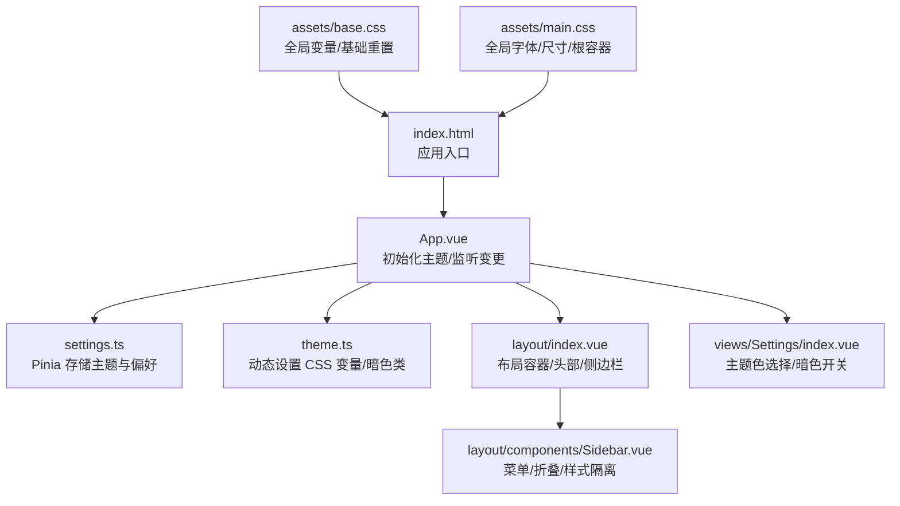
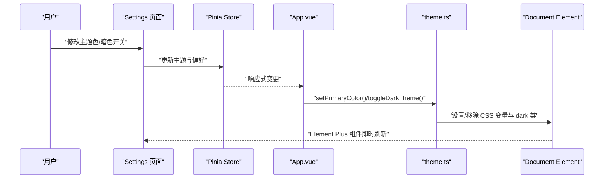
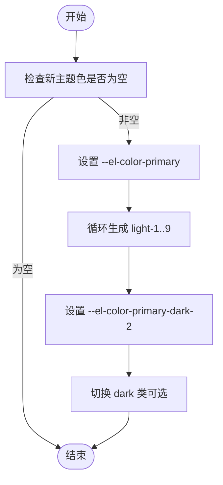
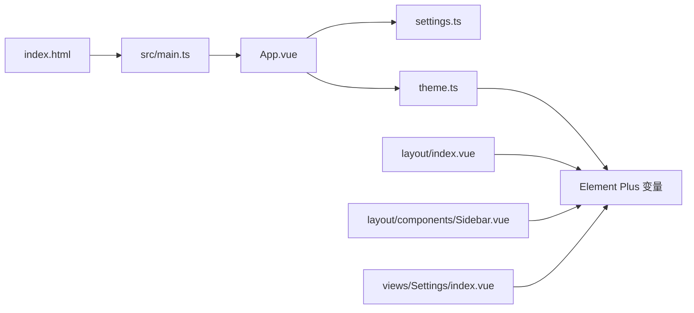

# 样式架构

<cite>
**本文引用的文件**
- [base.css](file://src/renderer/src/assets/base.css)
- [main.css](file://src/renderer/src/assets/main.css)
- [theme.ts](file://src/renderer/src/utils/theme.ts)
- [App.vue](file://src/renderer/src/App.vue)
- [settings.ts](file://src/renderer/src/store/settings.ts)
- [index.vue（布局）](file://src/renderer/src/layout/index.vue)
- [Sidebar.vue](file://src/renderer/src/layout/components/Sidebar.vue)
- [Settings/index.vue](file://src/renderer/src/views/Settings/index.vue)
- [index.html](file://src/renderer/index.html)
- [package.json](file://package.json)
- [electron.vite.config.ts](file://electron.vite.config.ts)
- [router/index.ts](file://src/renderer/src/router/index.ts)
</cite>

## 目录

1. [简介](#简介)
2. [项目结构](#项目结构)
3. [核心组件](#核心组件)
4. [架构总览](#架构总览)
5. [详细组件分析](#详细组件分析)
6. [依赖分析](#依赖分析)
7. [性能考虑](#性能考虑)
8. [故障排查指南](#故障排查指南)
9. [结论](#结论)
10. [附录](#附录)

## 简介

本文件系统性梳理 MyTool 的样式架构，涵盖 CSS 文件组织、样式模块化策略、命名规范、基础与全局样式、组件样式隔离、CSS-in-JS 实现、动态样式生成与缓存策略、主题变量与定制、响应式设计、性能优化、浏览器兼容与调试方法，并说明样式与组件系统的集成与维护最佳实践。

## 项目结构

- 渲染进程采用 Vite + Vue 3 + SCSS，通过 Electron-Vite 配置别名与插件。
- 样式分层：
  - 基础层：全局变量与基础重置，位于 assets/base.css。
  - 主题层：基于 CSS 变量的主题色与暗色模式开关，位于 utils/theme.ts 与 App.vue 监听器中。
  - 组件层：每个组件内使用 scoped SCSS，结合 Element Plus 变量实现样式隔离与一致性。
  - 视图层：Settings 等页面通过 Element Plus 表单组件与 SCSS 变量统一风格。
- 关键入口：index.html 引入渲染入口；App.vue 初始化主题与监听变更；布局组件承载导航与主内容区。

图表来源

- [index.html:1-18](file://src/renderer/index.html#L1-L18)
- [App.vue:1-47](file://src/renderer/src/App.vue#L1-L47)
- [settings.ts:1-34](file://src/renderer/src/store/settings.ts#L1-L34)
- [theme.ts:1-70](file://src/renderer/src/utils/theme.ts#L1-L70)
- [index.vue（布局）:1-232](file://src/renderer/src/layout/index.vue#L1-L232)
- [Sidebar.vue:1-149](file://src/renderer/src/layout/components/Sidebar.vue#L1-L149)
- [Settings/index.vue:1-198](file://src/renderer/src/views/Settings/index.vue#L1-L198)
- [base.css:1-68](file://src/renderer/src/assets/base.css#L1-L68)
- [main.css:1-18](file://src/renderer/src/assets/main.css#L1-L18)

章节来源

- [index.html:1-18](file://src/renderer/index.html#L1-L18)
- [App.vue:1-47](file://src/renderer/src/App.vue#L1-L47)
- [settings.ts:1-34](file://src/renderer/src/store/settings.ts#L1-L34)
- [theme.ts:1-70](file://src/renderer/src/utils/theme.ts#L1-L70)
- [index.vue（布局）:1-232](file://src/renderer/src/layout/index.vue#L1-L232)
- [Sidebar.vue:1-149](file://src/renderer/src/layout/components/Sidebar.vue#L1-L149)
- [Settings/index.vue:1-198](file://src/renderer/src/views/Settings/index.vue#L1-L198)
- [base.css:1-68](file://src/renderer/src/assets/base.css#L1-L68)
- [main.css:1-18](file://src/renderer/src/assets/main.css#L1-L18)

## 核心组件

- 全局基础与变量
  - 在基础样式中集中定义 CSS 变量，包括基础色板、文本色、按钮变体等，供全站复用。
  - body 与 #app 尺寸与字体族在 main.css 中统一设定，确保根容器占满视口且字体一致。
- 主题与暗色模式
  - 使用 CSS 变量作为主题中心，通过 JS 动态设置 --el-color-primary 及其 light/dark 变体，同时切换 html 的 dark 类名以驱动 Element Plus 暗色样式。
- 组件样式隔离
  - 各组件使用 scoped SCSS，配合 :deep 选择器穿透 Element Plus 组件内部结构，保证样式边界清晰且可维护。
- 视图与表单
  - Settings 页面使用 Element Plus 表单组件，结合 SCSS 变量与 :deep 选择器，实现统一风格与交互反馈。

章节来源

- [base.css:1-68](file://src/renderer/src/assets/base.css#L1-L68)
- [main.css:1-18](file://src/renderer/src/assets/main.css#L1-L18)
- [theme.ts:1-70](file://src/renderer/src/utils/theme.ts#L1-L70)
- [App.vue:1-47](file://src/renderer/src/App.vue#L1-L47)
- [Sidebar.vue:55-149](file://src/renderer/src/layout/components/Sidebar.vue#L55-L149)
- [Settings/index.vue:116-198](file://src/renderer/src/views/Settings/index.vue#L116-L198)

## 架构总览

MyTool 的样式架构围绕“CSS 变量 + 动态注入 + 组件隔离”展开：

- CSS 变量：集中于 base.css，提供颜色、文本、背景等基础变量。
- CSS-in-JS：通过 theme.ts 动态写入 --el-\* 变量，实现主题色与明暗模式即时生效。
- 组件隔离：scoped + :deep，避免样式泄漏，同时允许必要穿透。
- 全局入口：index.html 引入渲染入口，App.vue 首次挂载即应用持久化配置。

图表来源

- [Settings/index.vue:66-114](file://src/renderer/src/views/Settings/index.vue#L66-L114)
- [settings.ts:1-34](file://src/renderer/src/store/settings.ts#L1-L34)
- [App.vue:8-37](file://src/renderer/src/App.vue#L8-L37)
- [theme.ts:44-70](file://src/renderer/src/utils/theme.ts#L44-L70)

章节来源

- [Settings/index.vue:66-114](file://src/renderer/src/views/Settings/index.vue#L66-L114)
- [settings.ts:1-34](file://src/renderer/src/store/settings.ts#L1-L34)
- [App.vue:8-37](file://src/renderer/src/App.vue#L8-L37)
- [theme.ts:44-70](file://src/renderer/src/utils/theme.ts#L44-L70)

## 详细组件分析

### 基础样式与全局变量（base.css/main.css）

- 设计要点
  - 在 :root 定义基础变量，如 ev-c-\*、color-background/text 等，形成统一色板。
  - 重置通用元素盒模型与列表样式，统一文本渲染与字体链。
  - main.css 引入 base.css 并设定 body/#app 的尺寸与字体族，保证根容器占满视口。
- 复杂度与性能
  - 常量注入，无计算复杂度；通过变量复用降低重复声明，提升维护效率。
- 注意事项
  - 字体链与文本渲染优化已在基础层完成，组件层无需重复声明。

章节来源

- [base.css:1-68](file://src/renderer/src/assets/base.css#L1-L68)
- [main.css:1-18](file://src/renderer/src/assets/main.css#L1-L18)

### 主题与暗色模式（theme.ts/App.vue）

- 设计要点
  - setPrimaryColor：动态设置 --el-color-primary 及 light-1..9、dark-2 变体，使 Element Plus 组件状态色一致。
  - toggleDarkTheme：切换 html 的 dark 类，驱动 Element Plus 暗色主题。
  - App.vue 在 mounted 与 watch 中应用持久化配置，实现即时生效与联动。
- 复杂度与性能
  - 颜色混合函数为 O(1)，写入 CSS 变量为 O(n)（n 为变体数量），调用频次受用户操作影响。
- 最佳实践
  - 将主题色与暗色开关纳入 Pinia 持久化，确保刷新后仍保持一致体验。

图表来源

- [theme.ts:44-70](file://src/renderer/src/utils/theme.ts#L44-L70)

章节来源

- [theme.ts:1-70](file://src/renderer/src/utils/theme.ts#L1-L70)
- [App.vue:8-37](file://src/renderer/src/App.vue#L8-L37)
- [settings.ts:1-34](file://src/renderer/src/store/settings.ts#L1-L34)

### 布局与头部（layout/index.vue）

- 设计要点
  - 头部阴影、左右布局、折叠图标悬停高亮，使用 var(--el-\*) 变量统一风格。
  - 通过 :deep 选择器控制 Element Plus 滚动条包裹层，隐藏横向滚动条，保证纵向滚动体验。
  - 页面切换使用过渡动画，增强用户体验。
- 样式隔离
  - scoped 包裹整体布局样式，避免污染其他区域；:deep 仅在必要处穿透，减少副作用。

章节来源

- [index.vue（布局）:100-232](file://src/renderer/src/layout/index.vue#L100-L232)

### 侧边栏（layout/components/Sidebar.vue）

- 设计要点
  - 菜单项圆角、悬停与激活态使用主题浅色变体，突出交互反馈。
  - 折叠模式下通过 :deep 覆盖 Element Plus 内部样式，确保图标与文字居中一致。
  - 背景色与边框色使用 var(--el-bg-color)/var(--el-border-color-light) 保持与主题一致。
- 样式隔离
  - scoped 限定 aside 作用域；:deep 仅针对菜单折叠与 tooltip，避免过度穿透。

章节来源

- [Sidebar.vue:55-149](file://src/renderer/src/layout/components/Sidebar.vue#L55-L149)

### 设置页（views/Settings/index.vue）

- 设计要点
  - 使用 Element Plus 表单组件，标签与内容对齐，间距与圆角统一。
  - 主题色选择器提供预定义色值，暗色开关即时生效。
  - 分割线与按钮组使用 var(--el-\*) 变量，保持与全局一致。
- 用户交互
  - 保存与重置提供消息反馈，提升可用性。

章节来源

- [Settings/index.vue:1-198](file://src/renderer/src/views/Settings/index.vue#L1-L198)

### 路由与页面标题（router/index.ts）

- 设计要点
  - 路由 meta.title 用于设置页面标题，便于统一风格与 SEO。
  - 首页重定向至接口测试，简化用户入口。

章节来源

- [router/index.ts:1-79](file://src/renderer/src/router/index.ts#L1-L79)

## 依赖分析

- 样式依赖关系
  - index.html -> 渲染入口 -> App.vue -> settings.ts -> theme.ts -> Element Plus 变量。
  - 布局与组件依赖 Element Plus 样式变量，通过 CSS 变量实现解耦。
- 构建与别名
  - electron.vite.config.ts 配置 @ 与 @renderer 别名，便于组件导入与样式路径管理。
- 第三方库
  - element-plus 提供 UI 组件与主题变量；pinia/pinia-plugin-persistedstate 提供持久化存储。

图表来源

- [index.html:1-18](file://src/renderer/index.html#L1-L18)
- [App.vue:1-47](file://src/renderer/src/App.vue#L1-L47)
- [settings.ts:1-34](file://src/renderer/src/store/settings.ts#L1-L34)
- [theme.ts:1-70](file://src/renderer/src/utils/theme.ts#L1-L70)
- [index.vue（布局）:1-232](file://src/renderer/src/layout/index.vue#L1-L232)
- [Sidebar.vue:1-149](file://src/renderer/src/layout/components/Sidebar.vue#L1-L149)
- [Settings/index.vue:1-198](file://src/renderer/src/views/Settings/index.vue#L1-L198)

章节来源

- [package.json:23-38](file://package.json#L23-L38)
- [electron.vite.config.ts:14-25](file://electron.vite.config.ts#L14-L25)

## 性能考虑

- CSS 变量优先：通过 CSS 变量集中管理主题，避免重复样式与多处修改成本。
- 动态注入最小化：仅在主题色或暗色切换时写入必要变量，减少 DOM 操作。
- 组件隔离：scoped 与 :deep 穿透结合，避免全局污染，同时减少选择器复杂度。
- 字体与渲染：基础层已设置字体链与文本渲染优化，组件层无需重复声明。
- 构建优化：Vite + SCSS 已内置按需编译与热更新，建议保持默认配置。

## 故障排查指南

- 主题色不生效
  - 检查 App.vue 是否在 mounted/watch 中调用 setPrimaryColor。
  - 确认 settings.ts 中 theme 值已持久化且非空。
- 暗色模式异常
  - 确认 toggleDarkTheme 是否正确切换 html 的 dark 类。
  - 检查 Element Plus 版本与 CSS 变量是否匹配。
- 菜单折叠样式错位
  - 确认 :deep 覆盖的类名与 Element Plus 版本一致。
  - 检查侧边栏宽度与菜单项尺寸是否与布局容器一致。
- 滚动条显示问题
  - 确认 :deep(.el-scrollbar\_\_wrap) 的样式是否被其他样式覆盖。
  - 检查 ::-webkit-scrollbar 与 scrollbar-width 的隐藏策略是否生效。

章节来源

- [App.vue:8-37](file://src/renderer/src/App.vue#L8-L37)
- [theme.ts:63-69](file://src/renderer/src/utils/theme.ts#L63-L69)
- [Sidebar.vue:127-147](file://src/renderer/src/layout/components/Sidebar.vue#L127-L147)
- [index.vue（布局）:198-214](file://src/renderer/src/layout/index.vue#L198-L214)

## 结论

MyTool 的样式架构以 CSS 变量为核心，结合 CSS-in-JS 动态注入与组件级 scoped SCSS 隔离，实现了主题可定制、暗色模式即时切换、组件样式一致性与良好的可维护性。通过 Pinia 持久化与路由 meta 标题联动，进一步提升了用户体验与开发效率。建议在后续迭代中持续关注 Element Plus 版本升级对变量的影响，并保持变量命名与命名规范的一致性。

## 附录

- 样式定制指南
  - 新增主题色：在 Settings 页面选择或自定义颜色，theme.ts 会自动生成浅色/深色变体。
  - 自定义暗色：通过 toggleDarkTheme 切换 dark 类，Element Plus 自动适配暗色组件。
  - 组件样式：优先使用 var(--el-\*) 变量，必要时使用 :deep 穿透，避免全局污染。
- 响应式设计
  - 基础层已设置视口与字体链，组件层通过相对单位与 Flex/Grid 布局实现自适应。
- 浏览器兼容
  - 基础层使用标准 CSS 变量与常用属性，Element Plus 已处理大部分兼容问题。
- 调试方法
  - 使用浏览器开发者工具检查 CSS 变量与类名，定位样式来源与覆盖关系。
  - 通过 App.vue 的 watch 输出调试信息，确认主题变更流程。
