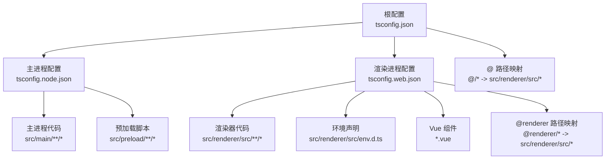
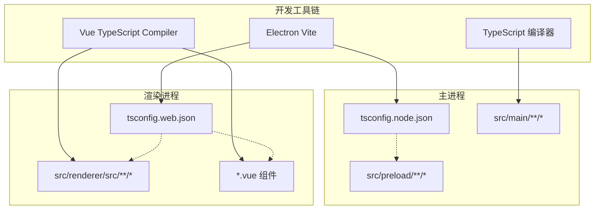
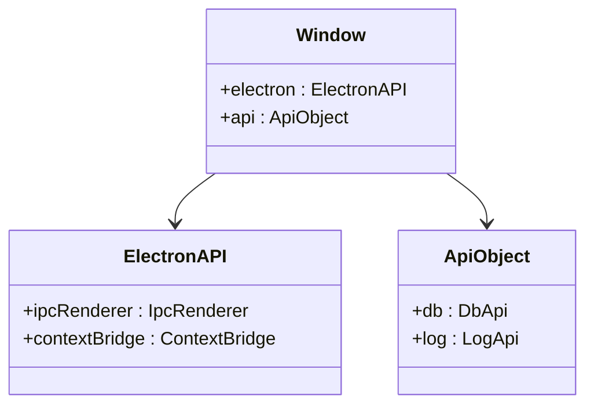
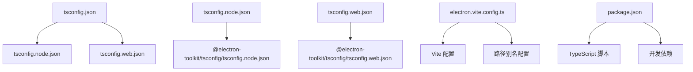

# TypeScript 配置

<cite>
**本文档引用的文件**
- [tsconfig.json](file://tsconfig.json)
- [tsconfig.node.json](file://tsconfig.node.json)
- [tsconfig.web.json](file://tsconfig.web.json)
- [package.json](file://package.json)
- [electron.vite.config.ts](file://electron.vite.config.ts)
- [src/preload/index.d.ts](file://src/preload/index.d.ts)
- [src/renderer/src/env.d.ts](file://src/renderer/src/env.d.ts)
- [src/main/index.ts](file://src/main/index.ts)
- [src/preload/index.ts](file://src/preload/index.ts)
</cite>

## 目录

1. [简介](#简介)
2. [项目结构](#项目结构)
3. [核心组件](#核心组件)
4. [架构概览](#架构概览)
5. [详细组件分析](#详细组件分析)
6. [依赖关系分析](#依赖关系分析)
7. [性能考虑](#性能考虑)
8. [故障排除指南](#故障排除指南)
9. [结论](#结论)

## 简介

MyTool 项目采用 Electron + Vue + TypeScript 技术栈构建，使用了现代化的 TypeScript 配置策略。该项目通过分层的 tsconfig 文件实现了主进程和渲染进程的独立类型检查，确保了开发体验和代码质量。

本项目的核心特点包括：

- 使用复合项目（Composite Projects）实现增量编译
- 通过引用机制分离主进程和渲染进程配置
- 利用路径映射简化模块导入
- 集成 Electron Vite 开发工具链
- 实现类型安全的 IPC 通信

## 项目结构

项目采用分层配置架构，通过根配置文件统一管理子配置：

**图表来源**

- [tsconfig.json:1-11](file://tsconfig.json#L1-L11)
- [tsconfig.node.json:1-9](file://tsconfig.node.json#L1-L9)
- [tsconfig.web.json:1-22](file://tsconfig.web.json#L1-L22)

**章节来源**

- [tsconfig.json:1-11](file://tsconfig.json#L1-L11)
- [tsconfig.node.json:1-9](file://tsconfig.node.json#L1-L9)
- [tsconfig.web.json:1-22](file://tsconfig.web.json#L1-L22)

## 核心组件

### 根配置文件 tsconfig.json

根配置文件作为整个项目的配置入口，采用了引用机制来组织子配置：

- **引用机制**：通过 `references` 字段引用主进程和渲染进程配置
- **基础路径**：设置 `baseUrl` 为项目根目录，支持相对路径解析
- **路径映射**：定义 `@/*` 映射到 `src/renderer/src/*`，简化渲染器代码导入

### 主进程配置 tsconfig.node.json

专门针对 Electron 主进程的配置：

- **继承基础配置**：扩展 `@electron-toolkit/tsconfig/tsconfig.node.json`
- **包含范围**：明确指定主进程和预加载脚本的源码位置
- **复合项目**：启用 `composite` 支持增量编译
- **类型声明**：添加 `electron-vite/node` 类型支持

### 渲染进程配置 tsconfig.web.json

专为 Vue 渲染器设计的配置：

- **继承基础配置**：扩展 `@electron-toolkit/tsconfig/tsconfig.web.json`
- **包含范围**：覆盖渲染器源码、环境声明和 Vue 组件文件
- **复合项目**：同样启用 `composite` 支持
- **路径映射**：同时支持 `@renderer/*` 和 `@/*` 两种映射

**章节来源**

- [tsconfig.json:1-11](file://tsconfig.json#L1-L11)
- [tsconfig.node.json:1-9](file://tsconfig.node.json#L1-L9)
- [tsconfig.web.json:1-22](file://tsconfig.web.json#L1-L22)

## 架构概览

项目采用双配置架构，分别服务于 Electron 的两个进程：

**图表来源**

- [electron.vite.config.ts:1-27](file://electron.vite.config.ts#L1-L27)
- [package.json:8-22](file://package.json#L8-L22)

## 详细组件分析

### 路径映射配置

项目实现了多层次的路径映射策略：

#### 根级路径映射

- `@/*` → `src/renderer/src/*`：为渲染器代码提供统一的根路径
- 支持在主进程和渲染进程中使用相对路径导入

#### 渲染器专用映射

- `@renderer/*` → `src/renderer/src/*`：专门为 Vue 组件提供路径映射
- 允许在渲染器中使用更直观的模块导入语法

#### Vite 集成

Vite 配置与 TypeScript 路径映射保持一致：

- `@renderer` → `src/renderer/src`
- `@` → `src/renderer/src`

**章节来源**

- [tsconfig.json:6-8](file://tsconfig.json#L6-L8)
- [tsconfig.web.json:12-19](file://tsconfig.web.json#L12-L19)
- [electron.vite.config.ts:15-20](file://electron.vite.config.ts#L15-L20)

### 类型声明文件组织

#### 预加载脚本类型声明

预加载脚本通过全局接口声明暴露安全的 API：

**图表来源**

- [src/preload/index.d.ts:3-21](file://src/preload/index.d.ts#L3-L21)

#### 环境类型声明

- `env.d.ts` 引入 Vite 客户端类型，支持环境变量和静态资源类型检查
- 确保开发时的类型安全和智能提示

**章节来源**

- [src/preload/index.d.ts:1-22](file://src/preload/index.d.ts#L1-L22)
- [src/renderer/src/env.d.ts:1-2](file://src/renderer/src/env.d.ts#L1-L2)

### 模块解析策略

#### 主进程解析

- 使用 Node.js 模块解析策略
- 支持 CommonJS 和 ES 模块语法
- 外部化 sqlite3 库以避免打包问题

#### 渲染进程解析

- Vue 单文件组件解析
- CSS 和静态资源处理
- Vite 插件系统集成

**章节来源**

- [electron.vite.config.ts:8-12](file://electron.vite.config.ts#L8-L12)
- [electron.vite.config.ts:21](file://electron.vite.config.ts#L21)

### 类型检查设置

#### 独立类型检查

项目提供了独立的类型检查脚本：

- `typecheck:node`：检查主进程代码
- `typecheck:web`：检查渲染器代码
- `typecheck`：同时检查两个进程

#### 编译选项

- 启用复合项目支持增量编译
- 禁用 emit 以仅进行类型检查
- 使用 `--composite false` 参数避免复合项目限制

**章节来源**

- [package.json:11-13](file://package.json#L11-L13)
- [tsconfig.node.json:5](file://tsconfig.node.json#L5)
- [tsconfig.web.json:10](file://tsconfig.web.json#L10)

## 依赖关系分析

### 配置文件依赖图

**图表来源**

- [tsconfig.json:2-3](file://tsconfig.json#L2-L3)
- [tsconfig.node.json:2](file://tsconfig.node.json#L2)
- [tsconfig.web.json:2](file://tsconfig.web.json#L2)

### 第三方库类型定义

项目集成了多个第三方库的类型定义：

#### Electron 生态系统

- `@types/node`：Node.js 类型定义
- `@types/sqlite3`：SQLite3 数据库类型定义
- `electron-vite/node`：Electron Vite 类型支持

#### Vue 生态系统

- `@vitejs/plugin-vue`：Vue Vite 插件类型
- `vue-tsc`：Vue TypeScript 编译器

#### UI 组件库

- `@element-plus/icons-vue`：Element Plus 图标类型
- `element-plus`：UI 组件类型定义

**章节来源**

- [package.json:23-59](file://package.json#L23-L59)

## 性能考虑

### 增量编译优化

通过启用复合项目（composite）实现增量编译：

- 主进程和渲染进程分别编译，互不影响
- 修改一个进程的代码只影响对应配置的编译
- 减少全量重新编译的时间开销

### 路径映射性能

合理的路径映射配置：

- 减少模块解析时间
- 提高 IDE 的智能提示准确性
- 降低模块路径解析的复杂度

### 外部化依赖

sqlite3 库被外部化处理：

- 避免在打包过程中编译原生模块
- 减少构建时间和包体积
- 解决跨平台兼容性问题

**章节来源**

- [tsconfig.node.json:5](file://tsconfig.node.json#L5)
- [tsconfig.web.json:10](file://tsconfig.web.json#L10)
- [electron.vite.config.ts:8-12](file://electron.vite.config.ts#L8-L12)

## 故障排除指南

### 常见配置问题

#### 路径映射不生效

**症状**：导入语句出现类型错误或模块解析失败
**解决方案**：

1. 确认 `baseUrl` 设置正确
2. 检查路径映射规则是否匹配实际文件结构
3. 验证 Vite 配置中的别名设置

#### 类型检查失败

**症状**：运行 `npm run typecheck` 时出现编译错误
**解决方案**：

1. 分别运行 `npm run typecheck:node` 和 `npm run typecheck:web`
2. 检查各配置文件的 `include` 规则
3. 确认第三方库的类型定义已正确安装

#### 预加载脚本类型错误

**症状**：访问 `window.api` 或 `window.electron` 时报类型错误
**解决方案**：

1. 确认 `src/preload/index.d.ts` 中的全局接口定义完整
2. 检查预加载脚本中的类型注解
3. 验证 `contextBridge.exposeInMainWorld` 的使用

### 开发工具链问题

#### Electron Vite 集成问题

**症状**：开发服务器无法启动或热重载失效
**解决方案**：

1. 检查 `electron.vite.config.ts` 的配置
2. 确认 Vite 插件正确安装和配置
3. 验证路径别名与 TypeScript 配置一致

#### IPC 通信类型安全

**症状**：IPC 调用参数或返回值类型不匹配
**解决方案**：

1. 在预加载脚本中明确定义 API 接口
2. 在主进程中使用类型安全的 IPC 处理函数
3. 利用 TypeScript 的类型推断确保参数正确

**章节来源**

- [src/preload/index.d.ts:3-21](file://src/preload/index.d.ts#L3-L21)
- [src/preload/index.ts:1-37](file://src/preload/index.ts#L1-L37)
- [src/main/index.ts:1-112](file://src/main/index.ts#L1-L112)

## 结论

MyTool 项目的 TypeScript 配置展现了现代 Electron 应用的最佳实践：

### 核心优势

- **清晰的架构分离**：主进程和渲染进程使用独立配置，职责明确
- **高效的开发体验**：复合项目支持增量编译，提升开发效率
- **强类型安全保障**：完善的类型声明和检查机制
- **灵活的模块管理**：多层级路径映射简化代码组织

### 最佳实践建议

1. **保持配置一致性**：确保 TypeScript 和 Vite 的路径配置同步
2. **合理使用复合项目**：利用增量编译提升大型项目的开发速度
3. **完善类型声明**：为自定义 API 和第三方库提供准确的类型定义
4. **模块化组织**：通过路径映射实现清晰的模块边界

这套配置方案为 Electron + Vue + TypeScript 项目提供了坚实的技术基础，既保证了开发效率，又确保了代码质量。
