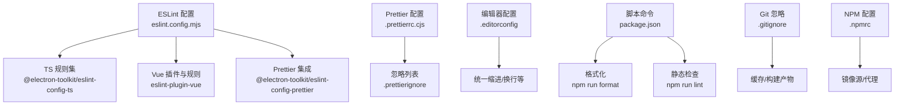
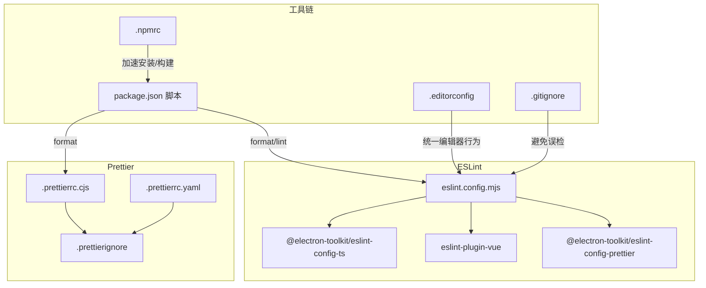
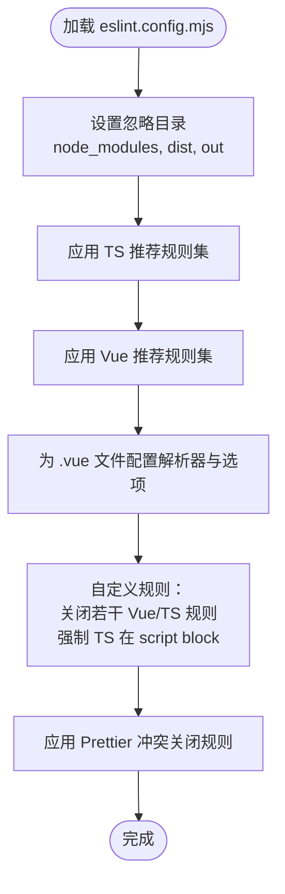
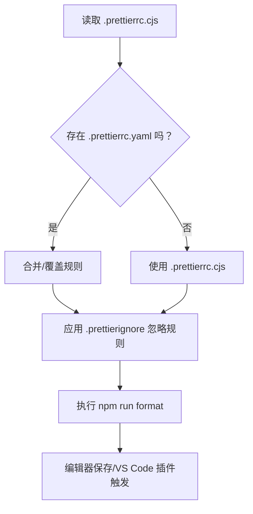
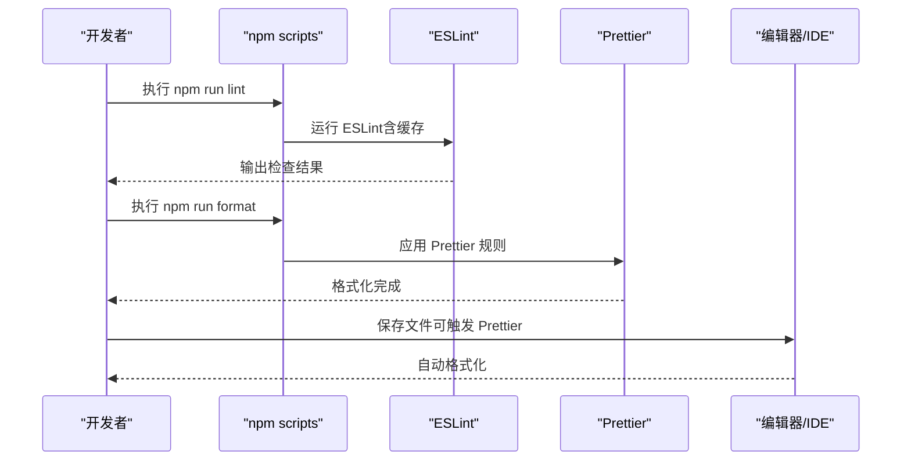
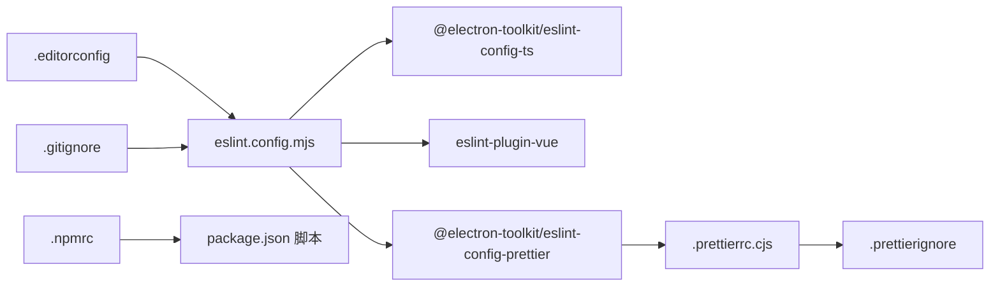

# 代码质量工具

<cite>
**本文引用的文件**
- [eslint.config.mjs](file://eslint.config.mjs)
- [.prettierrc.cjs](file://.prettierrc.cjs)
- [.prettierrc.yaml](file://.prettierrc.yaml)
- [.prettierignore](file://.prettierignore)
- [.editorconfig](file://.editorconfig)
- [package.json](file://package.json)
- [.gitignore](file://.gitignore)
- [.npmrc](file://.npmrc)
- [src/main/index.ts](file://src/main/index.ts)
- [src/renderer/src/App.vue](file://src/renderer/src/App.vue)
- [src/renderer/src/main.ts](file://src/renderer/src/main.ts)
</cite>

## 目录

1. [简介](#简介)
2. [项目结构](#项目结构)
3. [核心组件](#核心组件)
4. [架构总览](#架构总览)
5. [详细组件分析](#详细组件分析)
6. [依赖关系分析](#依赖关系分析)
7. [性能考量](#性能考量)
8. [故障排查指南](#故障排查指南)
9. [结论](#结论)
10. [附录](#附录)

## 简介

本文件面向 MyTool 项目的代码质量工具体系，系统性阐述 ESLint 配置策略、Prettier 格式化规则与代码规范检查机制，并结合项目实际配置给出最佳实践建议（如预提交钩子、CI/CD 集成与团队协作规范），以及常见风格问题的解决方案与配置优化建议。目标是帮助开发者快速理解并高效落地统一的代码风格与质量标准。

## 项目结构

MyTool 使用 Electron + Vue + TypeScript 技术栈，代码质量工具主要通过以下配置文件协同工作：

- ESLint：集中于 eslint.config.mjs，采用 Flat Config 并组合 @electron-toolkit 提供的 TS 与 Prettier 规则集
- Prettier：同时存在 .prettierrc.cjs 与 .prettierrc.yaml，最终以 .prettierrc.cjs 为主；.prettierrc.yaml 可能用于覆盖或补充
- 编辑器与工具链：.editorconfig 统一基础编辑器行为；.prettierignore 排除构建产物与特定文件；.gitignore 与 .npmrc 影响缓存与镜像源
- 脚本与命令：package.json 中定义 lint 与 format 命令，便于本地与 CI 执行

图表来源

- [eslint.config.mjs:1-44](file://eslint.config.mjs#L1-L44)
- [.prettierrc.cjs:1-12](file://.prettierrc.cjs#L1-L12)
- [.prettierrc.yaml:1-5](file://.prettierrc.yaml#L1-L5)
- [.prettierignore:1-7](file://.prettierignore#L1-L7)
- [.editorconfig:1-9](file://.editorconfig#L1-L9)
- [package.json:8-22](file://package.json#L8-L22)
- [.gitignore:1-7](file://.gitignore#L1-L7)
- [.npmrc:1-5](file://.npmrc#L1-L5)

章节来源

- [eslint.config.mjs:1-44](file://eslint.config.mjs#L1-L44)
- [.prettierrc.cjs:1-12](file://.prettierrc.cjs#L1-L12)
- [.prettierrc.yaml:1-5](file://.prettierrc.yaml#L1-L5)
- [.prettierignore:1-7](file://.prettierignore#L1-L7)
- [.editorconfig:1-9](file://.editorconfig#L1-L9)
- [package.json:8-22](file://package.json#L8-L22)
- [.gitignore:1-7](file://.gitignore#L1-L7)
- [.npmrc:1-5](file://.npmrc#L1-L5)

## 核心组件

- ESLint Flat Config（eslint.config.mjs）
  - 忽略目录：node_modules、dist、out
  - 组合规则集：@electron-toolkit/eslint-config-ts 的推荐规则
  - Vue 支持：eslint-plugin-vue 的 flat/recommended 配置，并为 .vue 文件指定 vue-eslint-parser
  - 自定义规则：关闭若干 Vue/TS 规则，强制 Vue script block 使用 TypeScript
  - Prettier 集成：eslint-config-prettier 关闭与 Prettier 冲突的 ESLint 规则
- Prettier 配置（.prettierrc.cjs/.prettierrc.yaml）
  - 主配置：.prettierrc.cjs 定义 printWidth、tabWidth、useTabs、semi、singleQuote、trailingComma、htmlWhitespaceSensitivity、endOfLine
  - 覆盖配置：.prettierrc.yaml 存在，可能用于特定场景或覆盖部分字段
  - 忽略：.prettierignore 排除 out、dist、pnpm-lock.yaml、LICENSE.md、tsconfig.json 及其派生文件
- 编辑器与工具链
  - .editorconfig 统一字符集、缩进风格、行尾、结尾换行与尾随空白处理
  - .gitignore 忽略 node_modules、dist、out、.eslintcache 等
  - .npmrc 配置镜像源与代理，影响安装与构建速度
- 脚本命令（package.json）
  - format：执行 Prettier 对项目进行格式化
  - lint：执行 ESLint 并启用缓存
  - typecheck：分别对 Node 与 Web 环境进行类型检查

章节来源

- [eslint.config.mjs:7-43](file://eslint.config.mjs#L7-L43)
- [.prettierrc.cjs:2-11](file://.prettierrc.cjs#L2-L11)
- [.prettierrc.yaml:1-5](file://.prettierrc.yaml#L1-L5)
- [.prettierignore:1-7](file://.prettierignore#L1-L7)
- [.editorconfig:1-9](file://.editorconfig#L1-L9)
- [package.json:8-22](file://package.json#L8-L22)
- [.gitignore:1-7](file://.gitignore#L1-L7)
- [.npmrc:1-5](file://.npmrc#L1-L5)

## 架构总览

下图展示 ESLint 与 Prettier 在 MyTool 中的协作关系及生效范围。

图表来源

- [eslint.config.mjs:1-44](file://eslint.config.mjs#L1-L44)
- [.prettierrc.cjs:1-12](file://.prettierrc.cjs#L1-L12)
- [.prettierrc.yaml:1-5](file://.prettierrc.yaml#L1-L5)
- [.prettierignore:1-7](file://.prettierignore#L1-L7)
- [package.json:8-22](file://package.json#L8-L22)
- [.editorconfig:1-9](file://.editorconfig#L1-L9)
- [.gitignore:1-7](file://.gitignore#L1-L7)
- [.npmrc:1-5](file://.npmrc#L1-L5)

## 详细组件分析

### ESLint 配置策略与规则定制

- 配置入口与组织
  - 使用 defineConfig 组织多段配置，按作用域分层：全局忽略、TS 推荐规则、Vue 推荐规则、Vue 文件语言选项、特定文件的自定义规则、Prettier 冲突关闭
- 插件与解析器
  - @electron-toolkit/eslint-config-ts 提供 Electron/Vue/TS 场景下的推荐规则
  - eslint-plugin-vue 提供 Vue 文件的规则与推荐配置
  - vue-eslint-parser 为 .vue 文件提供解析能力，支持 JSX 与额外扩展名
- 自定义规则与权衡
  - 关闭 vue/require-default-prop、vue/multi-word-component-names、@typescript-eslint/explicit-function-return-type、@typescript-eslint/no-explicit-any、@typescript-eslint/no-unused-vars 等，降低入门门槛与过度约束
  - 强制 Vue script block 使用 TypeScript，确保类型安全与一致性
- Prettier 集成
  - 通过 @electron-toolkit/eslint-config-prettier 关闭与 Prettier 冲突的 ESLint 规则，避免双重格式化冲突

图表来源

- [eslint.config.mjs:7-43](file://eslint.config.mjs#L7-L43)

章节来源

- [eslint.config.mjs:7-43](file://eslint.config.mjs#L7-L43)

### Prettier 格式化规则与编辑器集成

- 主配置（.prettierrc.cjs）
  - 行宽、缩进宽度、Tab/空格、分号、单引号、尾逗号、HTML 空白敏感度、行尾控制
- 覆盖配置（.prettierrc.yaml）
  - 存在独立覆盖文件，建议统一到单一配置源，减少歧义
- 忽略规则（.prettierignore）
  - 排除 out、dist、pnpm-lock.yaml、LICENSE.md、tsconfig.json 及其派生文件
- 编辑器集成
  - .editorconfig 统一基础编辑器行为，确保不同 IDE/编辑器的一致性
- 自动化流程
  - package.json 中提供 format 命令，可一键格式化全项目

图表来源

- [.prettierrc.cjs:1-12](file://.prettierrc.cjs#L1-L12)
- [.prettierrc.yaml:1-5](file://.prettierrc.yaml#L1-L5)
- [.prettierignore:1-7](file://.prettierignore#L1-L7)
- [package.json:9](file://package.json#L9)

章节来源

- [.prettierrc.cjs:1-12](file://.prettierrc.cjs#L1-L12)
- [.prettierrc.yaml:1-5](file://.prettierrc.yaml#L1-L5)
- [.prettierignore:1-7](file://.prettierignore#L1-L7)
- [.editorconfig:1-9](file://.editorconfig#L1-L9)
- [package.json:9](file://package.json#L9)

### 代码规范检查机制

- ESLint 检查流程
  - 通过 npm run lint 启动，自动缓存以提升性能
  - 结合 @electron-toolkit/eslint-config-ts 与 eslint-plugin-vue，覆盖 TS 与 Vue 场景
  - 与 Prettier 冲突规则被关闭，避免重复格式化
- 类型检查
  - 分别针对 Node 与 Web 环境执行类型检查，确保前后端类型安全
- 实际使用示例
  - 主进程入口文件中包含注释与日志记录，符合 ESLint 规则
  - Vue 单文件组件中使用 TypeScript 语法块，满足强制规则

图表来源

- [package.json:8-22](file://package.json#L8-L22)
- [eslint.config.mjs:1-44](file://eslint.config.mjs#L1-L44)
- [.prettierrc.cjs:1-12](file://.prettierrc.cjs#L1-L12)

章节来源

- [package.json:8-22](file://package.json#L8-L22)
- [eslint.config.mjs:1-44](file://eslint.config.mjs#L1-L44)
- [src/main/index.ts:1-112](file://src/main/index.ts#L1-L112)
- [src/renderer/src/App.vue:1-47](file://src/renderer/src/App.vue#L1-L47)
- [src/renderer/src/main.ts:1-24](file://src/renderer/src/main.ts#L1-L24)

## 依赖关系分析

- ESLint 与 Prettier 的耦合
  - 通过 @electron-toolkit/eslint-config-prettier 关闭冲突规则，确保两者协同工作
- 配置文件间的依赖
  - .prettierrc.cjs 为主要配置源；.prettierrc.yaml 可能造成规则歧义，建议统一
  - .prettierignore 与 .gitignore 共同避免对构建产物与缓存文件进行检查
- 工具链依赖
  - package.json 中的脚本命令依赖 ESLint 与 Prettier 版本
  - .npmrc 的镜像源与代理影响安装与构建速度

图表来源

- [eslint.config.mjs:1-44](file://eslint.config.mjs#L1-L44)
- [.prettierrc.cjs:1-12](file://.prettierrc.cjs#L1-L12)
- [.prettierignore:1-7](file://.prettierignore#L1-L7)
- [.editorconfig:1-9](file://.editorconfig#L1-L9)
- [.gitignore:1-7](file://.gitignore#L1-L7)
- [.npmrc:1-5](file://.npmrc#L1-L5)
- [package.json:8-22](file://package.json#L8-L22)

章节来源

- [eslint.config.mjs:1-44](file://eslint.config.mjs#L1-L44)
- [.prettierrc.cjs:1-12](file://.prettierrc.cjs#L1-L12)
- [.prettierignore:1-7](file://.prettierignore#L1-L7)
- [.editorconfig:1-9](file://.editorconfig#L1-L9)
- [.gitignore:1-7](file://.gitignore#L1-L7)
- [.npmrc:1-5](file://.npmrc#L1-L5)
- [package.json:8-22](file://package.json#L8-L22)

## 性能考量

- ESLint 缓存
  - 通过 --cache 参数启用缓存，仅检查变更文件，显著提升二次运行速度
- 忽略目录
  - 显式忽略 node_modules、dist、out，减少扫描范围
- Prettier 扫描范围
  - 结合 .prettierignore 与 .gitignore，避免对构建产物与锁文件进行格式化
- 安装与构建速度
  - .npmrc 配置镜像源与代理，有助于加速依赖安装与构建过程

章节来源

- [package.json:8-22](file://package.json#L8-L22)
- [.gitignore:1-7](file://.gitignore#L1-L7)
- [.npmrc:1-5](file://.npmrc#L1-L5)

## 故障排查指南

- ESLint 与 Prettier 冲突
  - 确认已应用 @electron-toolkit/eslint-config-prettier，关闭冲突规则
  - 若仍有冲突，检查是否混用了多个 Prettier 配置文件（如 .prettierrc.cjs 与 .prettierrc.yaml）
- 规则不生效
  - 检查 eslint.config.mjs 中的 files 匹配是否覆盖到目标文件（如 .vue、.ts）
  - 确认自定义规则未被更高优先级规则覆盖
- 格式化范围异常
  - 检查 .prettierignore 是否正确排除 out、dist、tsconfig.json 及其派生文件
  - 确认编辑器保存时触发了 Prettier（如 VS Code 插件）
- 缓存导致的“假阳性”
  - 清理 .eslintcache 或禁用缓存后重试，确认问题是否由缓存引起
- 类型检查失败
  - 分别执行 typecheck:node 与 typecheck:web，定位具体环境的问题

章节来源

- [eslint.config.mjs:1-44](file://eslint.config.mjs#L1-L44)
- [.prettierrc.cjs:1-12](file://.prettierrc.cjs#L1-L12)
- [.prettierrc.yaml:1-5](file://.prettierrc.yaml#L1-L5)
- [.prettierignore:1-7](file://.prettierignore#L1-L7)
- [package.json:8-22](file://package.json#L8-L22)

## 结论

MyTool 的代码质量工具体系以 ESLint Flat Config 为核心，结合 @electron-toolkit 提供的 TS/Vue/Prettier 规则集，形成统一且可维护的规范检查与格式化流程。通过合理的忽略策略、编辑器配置与脚本命令，能够在开发体验与质量保障之间取得良好平衡。建议后续进一步统一 Prettier 配置源、完善 CI/CD 集成与预提交钩子，持续提升团队协作效率与代码一致性。

## 附录

### 最佳实践建议

- 预提交钩子（Pre-commit）
  - 使用 husky + lint-staged，在提交前自动运行 npm run lint 与 npm run format，确保提交代码符合规范
- CI/CD 集成
  - 在 CI 流程中加入 npm run lint 与类型检查步骤，失败即阻断合并
- 团队协作规范
  - 统一编辑器配置（.editorconfig）与 Prettier 配置，避免因工具差异导致的分歧
  - 对新成员提供 ESLint/Prettier 配置说明与常用命令清单

### 常见问题与解决方案

- Prettier 配置冲突
  - 统一至 .prettierrc.cjs，删除 .prettierrc.yaml 或将其作为覆盖文件并明确优先级
- ESLint 规则过多导致学习成本高
  - 保持现有自定义规则关闭策略，逐步引入更严格的规则，配合团队评审
- 格式化耗时过长
  - 确保 .prettierignore 与 .gitignore 正确，利用 ESLint 缓存与增量检查
