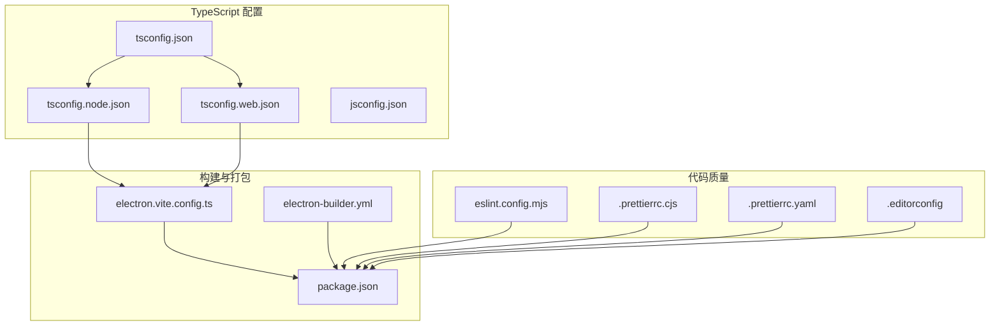
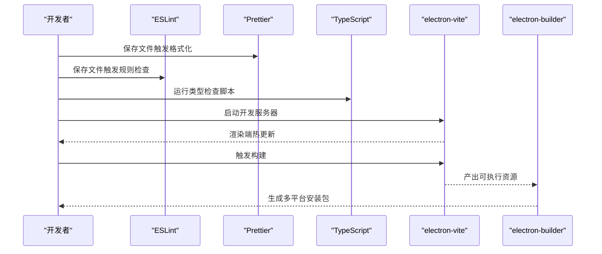
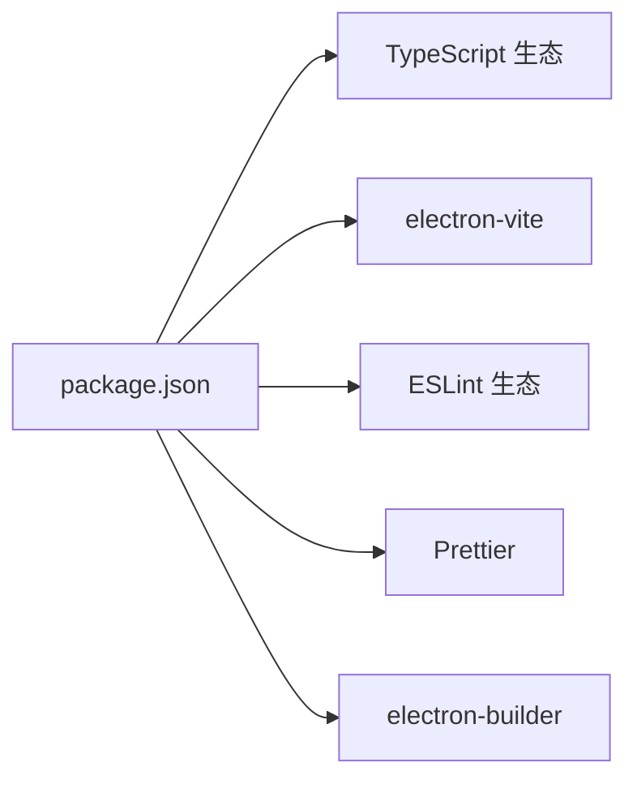

# 开发工具配置

<cite>
**本文引用的文件**
- [tsconfig.json](file://tsconfig.json)
- [tsconfig.node.json](file://tsconfig.node.json)
- [tsconfig.web.json](file://tsconfig.web.json)
- [jsconfig.json](file://jsconfig.json)
- [.editorconfig](file://.editorconfig)
- [.npmrc](file://.npmrc)
- [.gitignore](file://.gitignore)
- [eslint.config.mjs](file://eslint.config.mjs)
- [.prettierrc.cjs](file://.prettierrc.cjs)
- [.prettierrc.yaml](file://.prettierrc.yaml)
- [electron.vite.config.ts](file://electron.vite.config.ts)
- [package.json](file://package.json)
- [electron-builder.yml](file://electron-builder.yml)
</cite>

## 目录

1. [简介](#简介)
2. [项目结构](#项目结构)
3. [核心组件](#核心组件)
4. [架构总览](#架构总览)
5. [详细组件分析](#详细组件分析)
6. [依赖分析](#依赖分析)
7. [性能考虑](#性能考虑)
8. [故障排查指南](#故障排查指南)
9. [结论](#结论)
10. [附录](#附录)

## 简介

本文件系统性梳理 MyTool 项目的开发工具链配置，覆盖 TypeScript 编译配置、ESLint 规范、Prettier 格式化与 Vite/Electron-Vite 构建工具的策略与最佳实践。文档同时提供统一的开发环境配置指南（编辑器设置、插件推荐、工作流优化）、代码质量保障机制、自动化检查流程以及持续集成建议，并给出可扩展的自定义选项，帮助团队建立一致的开发标准与工具链。

## 项目结构

该项目采用 Electron + Vue + TypeScript 技术栈，使用 electron-vite 作为构建与开发服务器，TypeScript 多项目引用（references）分治主进程与渲染进程编译配置，配合 ESLint 与 Prettier 实现统一的代码质量与风格控制。

**图表来源**

- [tsconfig.json:1-11](file://tsconfig.json#L1-L11)
- [tsconfig.node.json:1-9](file://tsconfig.node.json#L1-L9)
- [tsconfig.web.json:1-22](file://tsconfig.web.json#L1-L22)
- [jsconfig.json:1-9](file://jsconfig.json#L1-L9)
- [eslint.config.mjs:1-44](file://eslint.config.mjs#L1-L44)
- [.prettierrc.cjs:1-12](file://.prettierrc.cjs#L1-L12)
- [.prettierrc.yaml:1-5](file://.prettierrc.yaml#L1-L5)
- [.editorconfig:1-9](file://.editorconfig#L1-L9)
- [electron.vite.config.ts:1-27](file://electron.vite.config.ts#L1-L27)
- [package.json:1-61](file://package.json#L1-L61)
- [electron-builder.yml:1-60](file://electron-builder.yml#L1-L60)

**章节来源**

- [tsconfig.json:1-11](file://tsconfig.json#L1-L11)
- [tsconfig.node.json:1-9](file://tsconfig.node.json#L1-L9)
- [tsconfig.web.json:1-22](file://tsconfig.web.json#L1-L22)
- [jsconfig.json:1-9](file://jsconfig.json#L1-L9)
- [eslint.config.mjs:1-44](file://eslint.config.mjs#L1-L44)
- [.prettierrc.cjs:1-12](file://.prettierrc.cjs#L1-L12)
- [.prettierrc.yaml:1-5](file://.prettierrc.yaml#L1-L5)
- [.editorconfig:1-9](file://.editorconfig#L1-L9)
- [electron.vite.config.ts:1-27](file://electron.vite.config.ts#L1-L27)
- [package.json:1-61](file://package.json#L1-L61)
- [electron-builder.yml:1-60](file://electron-builder.yml#L1-L60)

## 核心组件

- TypeScript 配置：通过多 tsconfig 引用分离主进程与渲染进程编译上下文，统一路径别名与复合编译能力，提升类型检查效率与准确性。
- 代码质量：ESLint 使用 @electron-toolkit 的 TS 与 Prettier 集成配置，结合 flat config 与 Vue 解析器，实现对 TS、TSX、Vue 文件的统一规则集。
- 代码格式化：Prettier 提供统一的缩进、引号、尾逗号等风格；同时保留 .yaml 与 .cjs 双配置以满足不同场景优先级。
- 构建工具：electron-vite 配置主/预加载/渲染三端别名与插件，内置开发服务器端口与外部依赖排除；package.json 脚本串联类型检查、格式化、构建与打包。
- 打包与发布：electron-builder 统一跨平台产物目录、目标与权限配置，支持 Windows（NSIS）、macOS（DMG）、Linux（AppImage/Snap/Deb）。

**章节来源**

- [tsconfig.json:1-11](file://tsconfig.json#L1-L11)
- [tsconfig.node.json:1-9](file://tsconfig.node.json#L1-L9)
- [tsconfig.web.json:1-22](file://tsconfig.web.json#L1-L22)
- [eslint.config.mjs:1-44](file://eslint.config.mjs#L1-L44)
- [.prettierrc.cjs:1-12](file://.prettierrc.cjs#L1-L12)
- [.prettierrc.yaml:1-5](file://.prettierrc.yaml#L1-L5)
- [electron.vite.config.ts:1-27](file://electron.vite.config.ts#L1-L27)
- [package.json:1-61](file://package.json#L1-L61)
- [electron-builder.yml:1-60](file://electron-builder.yml#L1-L60)

## 架构总览

下图展示从开发到构建的关键流程：编辑器保存触发 ESLint/Prettier，TypeScript 在独立配置中进行类型检查；开发时 electron-vite 启动渲染端服务并应用 Vue 插件；最终通过 electron-vite build 与 electron-builder 输出多平台安装包。

**图表来源**

- [package.json:8-21](file://package.json#L8-L21)
- [electron.vite.config.ts:14-25](file://electron.vite.config.ts#L14-L25)
- [electron-builder.yml:1-60](file://electron-builder.yml#L1-L60)

## 详细组件分析

### TypeScript 配置分析

- 主配置（tsconfig.json）
  - 通过 references 将 node 与 web 两套配置纳入统一入口，便于 IDE 与工具链一次性解析。
  - 设置 baseUrl 与路径映射，使项目内模块引用简洁一致。
- 主进程配置（tsconfig.node.json）
  - 继承官方 Electron 工具链的 node 配置基线，限定 include 范围，启用 composite 以支持增量编译。
  - 声明 electron-vite/node 类型，确保主进程 API 的类型可用。
- 渲染进程配置（tsconfig.web.json）
  - 继承官方 web 基线，include 涵盖 env.d.ts、Vue 组件与预加载声明文件。
  - 定义 @renderer 与 @ 的路径别名，与 electron-vite 别名保持一致。
- 辅助配置（jsconfig.json）
  - 为非构建工具场景（如 VS Code）提供基础路径映射，避免 IDE 路径解析差异。
- 最佳实践
  - 保持 baseUrl 与路径别名在 tsconfig.node/web 与 electron.vite.config.ts 中一致。
  - 对于大型项目，建议在 include 中显式列出源码目录，减少无关文件参与编译。
  - 使用 composite 与 noEmit 分离类型检查与实际构建，缩短 CI 时间。

**章节来源**

- [tsconfig.json:1-11](file://tsconfig.json#L1-L11)
- [tsconfig.node.json:1-9](file://tsconfig.node.json#L1-L9)
- [tsconfig.web.json:1-22](file://tsconfig.web.json#L1-L22)
- [jsconfig.json:1-9](file://jsconfig.json#L1-L9)
- [electron.vite.config.ts:15-20](file://electron.vite.config.ts#L15-L20)

### ESLint 配置分析

- 配置组成
  - 使用 defineConfig 与 flat config 结构，集中管理忽略项、推荐规则集与语言选项。
  - 引入 @electron-toolkit/eslint-config-ts 与 @electron-toolkit/eslint-config-prettier，确保与 Prettier 的兼容性。
  - 针对 Vue 文件引入 vue-eslint-parser 与 eslint-plugin-vue 的 flat 推荐配置。
- 关键规则与取舍
  - 忽略 node_modules、dist、out 等目录，减少无关文件扫描。
  - 针对 .vue 文件指定解析器与额外扩展，确保 TSX/TS 与模板语法协同。
  - 针对 TS/Vue 场景关闭若干严格规则（如函数返回值类型、未使用变量、组件命名），平衡工程效率与可维护性。
  - Vue script 块强制使用 TS，确保模板与逻辑一致的类型安全。
- 最佳实践
  - 在团队内统一 ESLint 规则，必要时通过本地 overrides 扩展。
  - 与编辑器 ESLint 插件联动，开启保存自动修复（结合 Prettier 的写入模式）。
  - CI 中仅运行 ESLint，不合并 Prettier 写入，避免冲突。

**章节来源**

- [eslint.config.mjs:1-44](file://eslint.config.mjs#L1-L44)

### Prettier 配置分析

- 配置来源与优先级
  - .prettierrc.cjs 提供默认风格参数（行长、缩进、引号、尾逗号、HTML 敏感度、换行符）。
  - .prettierrc.yaml 存在时会与 CJS 同时生效，建议在团队内明确优先级或统一为单一格式。
- 与 ESLint 协同
  - 通过 @electron-toolkit/eslint-config-prettier 关闭与 Prettier 冲突的 ESLint 规则，避免双重格式化。
- 最佳实践
  - 在编辑器中启用保存时格式化，CI 中仅校验格式一致性，不自动修复。
  - 团队统一配置后，建议移除冗余配置文件，避免歧义。

**章节来源**

- [.prettierrc.cjs:1-12](file://.prettierrc.cjs#L1-L12)
- [.prettierrc.yaml:1-5](file://.prettierrc.yaml#L1-L5)
- [eslint.config.mjs:42-42](file://eslint.config.mjs#L42-L42)

### EditorConfig 与 NPM 镜像

- EditorConfig
  - 统一字符集、缩进风格与行尾，确保跨编辑器一致性。
- NPM 镜像
  - 指定国内镜像与 Electron 二进制镜像，加速依赖下载与构建。

**章节来源**

- [.editorconfig:1-9](file://.editorconfig#L1-L9)
- [.npmrc:1-4](file://.npmrc#L1-L4)

### 构建与开发服务器配置

- electron.vite.config.ts
  - 主进程：配置 Rollup external，将 sqlite3 标记为外部依赖，避免打包体积膨胀。
  - 预加载：空配置占位，便于后续扩展。
  - 渲染进程：设置别名为 @renderer 与 @，启用 @vitejs/plugin-vue，开发服务器端口 3000。
- package.json 脚本
  - format/lint/typecheck/start/dev/build/postinstall/build:unpack/build:win/build:mac/build:linux
  - 通过串联类型检查与构建，确保交付前的质量门禁。
- 最佳实践
  - 在 CI 中缓存 node_modules 并复用 electron-builder 二进制镜像。
  - 将第三方原生模块标记为 external，减少打包时间与体积。

**章节来源**

- [electron.vite.config.ts:1-27](file://electron.vite.config.ts#L1-L27)
- [package.json:8-21](file://package.json#L8-L21)

### 打包与发布配置

- electron-builder.yml
  - appId/productName/compression/asar/files/asarUnpack：统一产物标识与打包内容。
  - 平台目标：Windows（NSIS x64）、macOS（DMG）、Linux（AppImage/Snap/Deb）。
  - macOS Entitlements 与权限描述、Windows 安装向导选项、Linux 分发类别等。
  - 发布通道与 afterPack/afterAllArtifactBuild 钩子，便于二次定制。
- 最佳实践
  - 在 CI 中按平台矩阵构建，上传制品至发布仓库。
  - 使用 afterPack 钩子注入资源或签名信息，确保合规与安全。

**章节来源**

- [electron-builder.yml:1-60](file://electron-builder.yml#L1-L60)

## 依赖分析

- 工具链依赖
  - TypeScript、vue-tsc/vite、@vitejs/plugin-vue、electron-vite、eslint、@electron-toolkit/eslint-config-ts/eslint-config-prettier、prettier。
- 运行时依赖
  - Electron、Vue 3、Pinia、Element Plus、Axios、sqlite3、@wangeditor 等。
- 开发依赖
  - electron、electron-builder、dmg-builder、sass、@types/\* 等。
- 依赖关系可视化

**图表来源**

- [package.json:23-59](file://package.json#L23-L59)

**章节来源**

- [package.json:23-59](file://package.json#L23-L59)

## 性能考虑

- 类型检查分离：分别对 node 与 web 执行类型检查，缩短 CI 时间。
- 复合编译：启用 composite 与 noEmit，避免重复编译。
- 外部依赖：将原生模块标记为 external，降低打包体积与时间。
- 缓存与镜像：使用 .npmrc 指定镜像，提升依赖拉取速度。
- CI 优化：先 lint/format/typecheck，再 build/bundle，失败尽早暴露问题。

[本节为通用指导，无需“章节来源”]

## 故障排查指南

- ESLint 缓存导致规则不生效
  - 清理 .eslintcache 或在脚本中添加清理步骤。
- Prettier 与 ESLint 冲突
  - 确认已引入 @electron-toolkit/eslint-config-prettier，且规则未被本地 overrides 覆盖。
- TypeScript 路径别名不生效
  - 检查 tsconfig.node/web 与 electron.vite.config.ts 的别名是否一致。
- electron-vite 开发服务器端口占用
  - 修改 electron.vite.config.ts 中 server.port。
- electron-builder 打包体积过大
  - 检查 external 配置与 asar/unpack 设置，确认无多余资源被打包。
- 依赖安装缓慢
  - 检查 .npmrc 是否正确指向镜像源。

**章节来源**

- [.gitignore:5-5](file://.gitignore#L5-L5)
- [eslint.config.mjs:42-42](file://eslint.config.mjs#L42-L42)
- [electron.vite.config.ts:15-24](file://electron.vite.config.ts#L15-L24)
- [electron-builder.yml:18-19](file://electron-builder.yml#L18-L19)
- [.npmrc:1-4](file://.npmrc#L1-L4)

## 结论

本项目通过多 tsconfig 引用、ESLint 与 Prettier 的协同、electron-vite 的高效开发体验以及 electron-builder 的跨平台打包能力，形成了完整的开发工具链闭环。遵循本文的最佳实践与扩展建议，团队可在保证代码质量的同时，显著提升开发效率与交付稳定性。

[本节为总结，无需“章节来源”]

## 附录

### 开发环境统一配置指南

- 编辑器设置
  - VS Code：安装 ESLint、Prettier、Vue Language Features、EditorConfig 等插件。
  - 启用保存时格式化与 ESLint 自动修复；禁用与 Prettier 冲突的格式化规则。
- 路径别名与类型检查
  - 确保 IDE 使用 tsconfig.json 作为工作配置，避免 jsconfig.json 导致的路径偏差。
- 工作流优化
  - 本地：保存即格式化 + 规则检查；提交前运行 lint/format/typecheck。
  - CI：缓存依赖与镜像，按平台矩阵构建并上传制品。

[本节为通用指导，无需“章节来源”]

### 自定义选项与扩展方法

- TypeScript
  - 新增 include/exclude 或 paths 映射，保持与 electron-vite 别名一致。
  - 在 tsconfig.node/web 中新增 compilerOptions 以适配新库或实验特性。
- ESLint
  - 通过 overrides 为特定目录或文件类型追加规则；关闭或调整现有规则需经团队评审。
  - 若引入 JSX/TSX，确保解析器与插件版本匹配。
- Prettier
  - 团队统一选择 .cjs 或 .yaml 其一，避免优先级混淆；必要时在根目录新增 .prettierignore 控制忽略范围。
- electron-vite
  - 在 main/preload/renderer 下新增插件或修改别名；注意 external 与打包体积的关系。
- electron-builder
  - 按平台细化 target 与属性；通过钩子 afterPack 注入签名或资源。

[本节为通用指导，无需“章节来源”]
