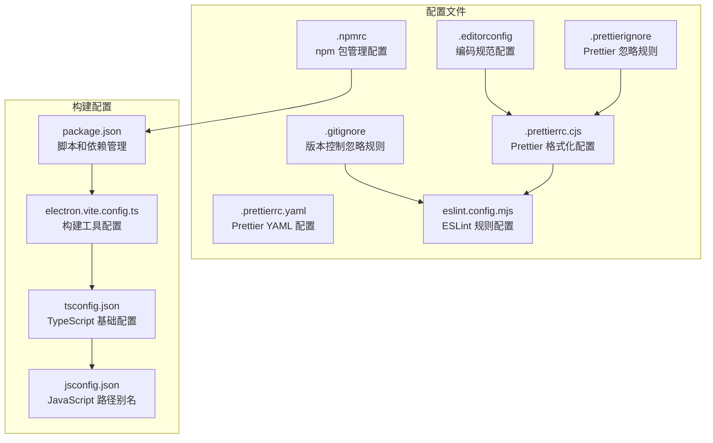
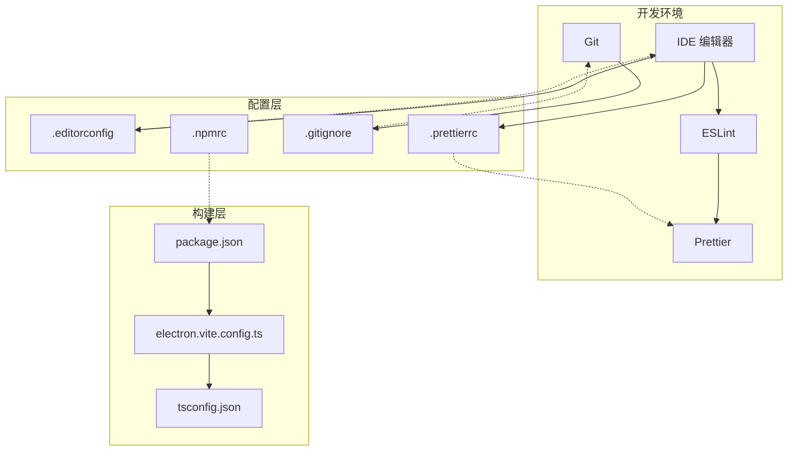
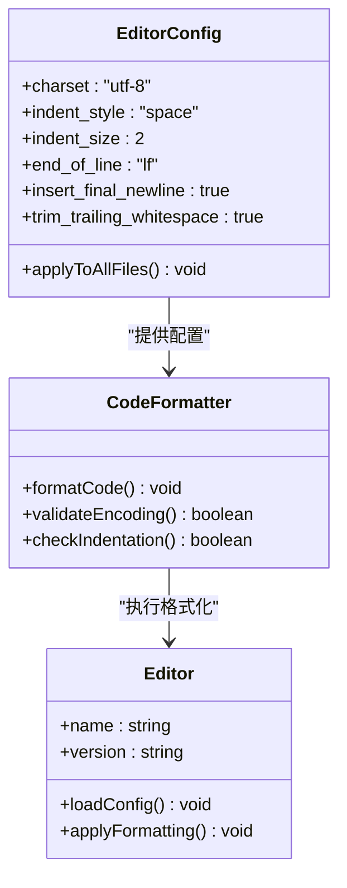
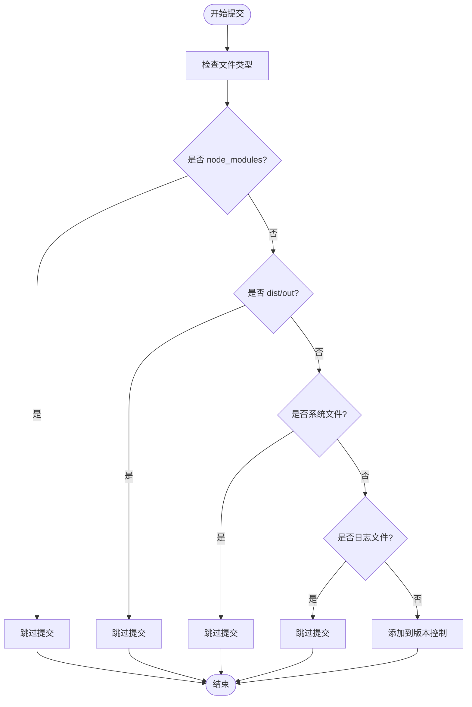
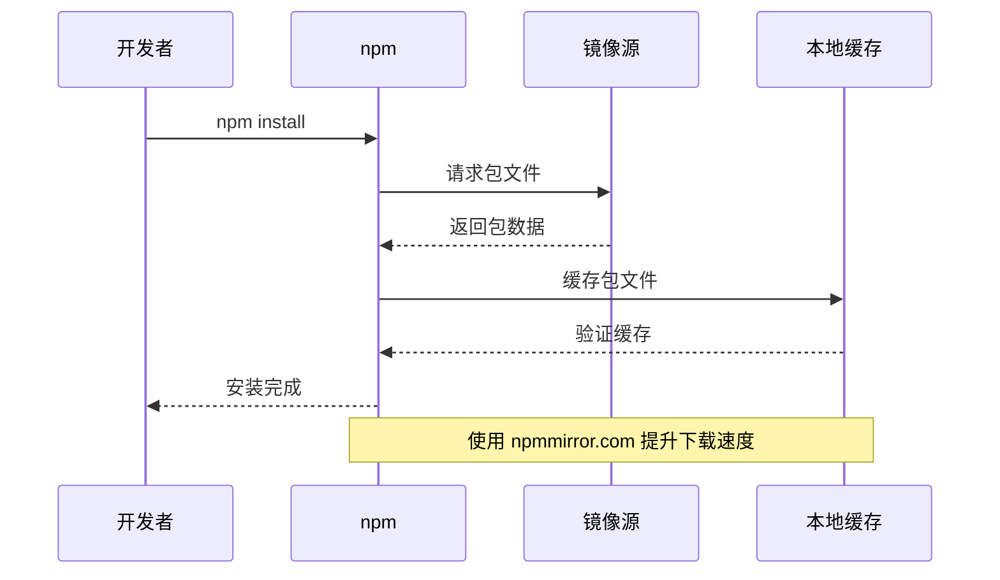
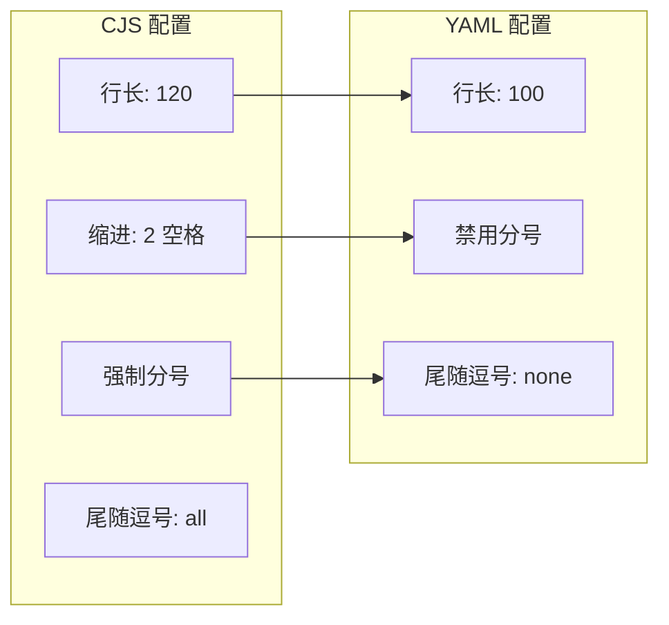
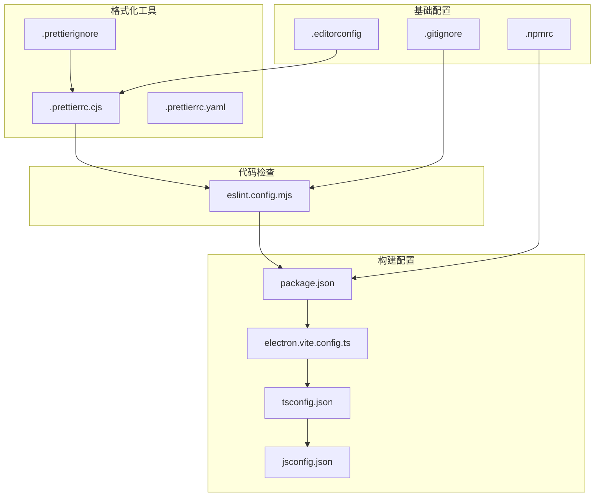

# 编辑器配置

<cite>
**本文档引用的文件**
- [.editorconfig](file://.editorconfig)
- [.gitignore](file://.gitignore)
- [.npmrc](file://.npmrc)
- [.prettierrc.cjs](file://.prettierrc.cjs)
- [.prettierrc.yaml](file://.prettierrc.yaml)
- [.prettierignore](file://.prettierignore)
- [eslint.config.mjs](file://eslint.config.mjs)
- [package.json](file://package.json)
- [electron.vite.config.ts](file://electron.vite.config.ts)
- [tsconfig.json](file://tsconfig.json)
- [jsconfig.json](file://jsconfig.json)
- [README.md](file://README.md)
</cite>

## 目录

1. [简介](#简介)
2. [项目结构](#项目结构)
3. [核心组件](#核心组件)
4. [架构概览](#架构概览)
5. [详细组件分析](#详细组件分析)
6. [依赖关系分析](#依赖关系分析)
7. [性能考虑](#性能考虑)
8. [故障排除指南](#故障排除指南)
9. [结论](#结论)

## 简介

本文件档详细说明 MyTool 项目的编辑器配置，涵盖代码格式化、版本控制、包管理等关键配置。项目采用现代化的前端技术栈（Electron + Vue + TypeScript），通过统一的配置确保团队协作的一致性和开发效率。

## 项目结构

MyTool 项目采用模块化的目录结构，主要包含以下配置相关文件：

**图表来源**

- [.editorconfig:1-9](file://.editorconfig#L1-L9)
- [.gitignore:1-7](file://.gitignore#L1-L7)
- [.npmrc:1-5](file://.npmrc#L1-L5)
- [.prettierrc.cjs:1-12](file://.prettierrc.cjs#L1-L12)
- [.prettierrc.yaml:1-5](file://.prettierrc.yaml#L1-L5)
- [eslint.config.mjs:1-44](file://eslint.config.mjs#L1-L44)
- [package.json:1-61](file://package.json#L1-L61)
- [electron.vite.config.ts:1-27](file://electron.vite.config.ts#L1-L27)

**章节来源**

- [README.md:1-35](file://README.md#L1-L35)

## 核心组件

### 编码规范配置 (.editorconfig)

.editorconfig 文件定义了统一的代码风格标准，确保不同编辑器间的一致性：

- **字符集**: UTF-8 编码，支持国际化字符
- **缩进规则**: 使用空格缩进，2 个空格为一个缩进级别
- **行尾符**: LF (Unix/Linux) 换行符
- **文件末尾**: 自动插入换行符
- **空白处理**: 自动去除行尾空白字符

这些设置适用于所有文件类型，确保团队成员在不同操作系统和编辑器中获得一致的编码体验。

**章节来源**

- [.editorconfig:1-9](file://.editorconfig#L1-L9)

### 版本控制忽略规则 (.gitignore)

.gitignore 文件定义了 Git 版本控制系统应该忽略的文件和目录：

- **依赖目录**: `node_modules` - npm 依赖包
- **构建输出**: `dist` 和 `out` - 构建产物
- **系统文件**: `.DS_Store` - macOS 系统文件
- **缓存文件**: `.eslintcache` - ESLint 缓存
- **日志文件**: `*.log*` - 应用日志

这些规则确保版本库保持精简，避免提交不必要的文件。

**章节来源**

- [.gitignore:1-7](file://.gitignore#L1-L7)

### npm 包管理配置 (.npmrc)

.npmrc 文件配置了 npm 包管理器的行为和镜像源：

- **注册表**: 使用 npmmirror.com 镜像源，提高下载速度
- **二进制镜像**: Electron Builder 二进制文件使用国内镜像
- **代理设置**: 禁用 HTTPS 代理，避免网络问题
- **全局代理**: 清空 GLOBAL_AGENT_HTTPS_PROXY 环境变量

这些配置特别针对中国开发者，优化了网络访问性能。

**章节来源**

- [.npmrc:1-5](file://.npmrc#L1-L5)

### Prettier 格式化配置

项目包含两种 Prettier 配置格式，提供了灵活的格式化选项：

#### 主要配置 (.prettierrc.cjs)

- **行长**: 120 字符
- **缩进宽度**: 2 个空格
- **使用 Tab**: 禁用
- **分号**: 强制使用
- **单引号**: 启用
- **尾随逗号**: 所有位置
- **HTML 空白敏感性**: 严格模式
- **行尾符**: 自动检测

#### YAML 配置 (.prettierrc.yaml)

- **单引号**: 启用
- **分号**: 禁用
- **行长**: 100 字符
- **尾随逗号**: 不使用

#### 忽略规则 (.prettierignore)

- **构建输出**: `out` 和 `dist`
- **锁定文件**: `pnpm-lock.yaml`
- **配置文件**: `LICENSE.md`、`tsconfig.json` 及其变体

**章节来源**

- [.prettierrc.cjs:1-12](file://.prettierrc.cjs#L1-L12)
- [.prettierrc.yaml:1-5](file://.prettierrc.yaml#L1-L5)
- [.prettierignore:1-7](file://.prettierignore#L1-L7)

### ESLint 规则配置

eslint.config.mjs 定义了严格的代码质量检查规则：

- **忽略文件**: 忽略 `node_modules`、`dist`、`out` 目录
- **TypeScript 支持**: 使用 @electron-toolkit/eslint-config-ts
- **Vue 支持**: 使用 eslint-plugin-vue 插件
- **Prettier 集成**: 使用 @electron-toolkit/eslint-config-prettier
- **自定义规则**:
  - 关闭 Vue 组件默认属性要求
  - 关闭多单词组件名限制
  - 关闭显式函数返回类型检查
  - 关闭 any 类型使用检查
  - 关闭未使用变量检查
  - 强制 Vue SFC 中的 TypeScript 使用

**章节来源**

- [eslint.config.mjs:1-44](file://eslint.config.mjs#L1-L44)

## 架构概览

项目配置的整体架构展示了各工具间的协作关系：

**图表来源**

- [.editorconfig:1-9](file://.editorconfig#L1-L9)
- [.prettierrc.cjs:1-12](file://.prettierrc.cjs#L1-L12)
- [.gitignore:1-7](file://.gitignore#L1-L7)
- [.npmrc:1-5](file://.npmrc#L1-L5)
- [package.json:1-61](file://package.json#L1-L61)
- [electron.vite.config.ts:1-27](file://electron.vite.config.ts#L1-L27)

## 详细组件分析

### 编辑器配置组件

#### 编码规范设置

**图表来源**

- [.editorconfig:1-9](file://.editorconfig#L1-L9)

#### 缩进规则分析

缩进规则采用 2 空格策略，适用于：

- JavaScript/TypeScript 代码
- Vue 单文件组件
- HTML/CSS 文件
- JSON/YAML 配置

这种选择平衡了代码可读性和屏幕空间利用效率。

**章节来源**

- [.editorconfig:5-6](file://.editorconfig#L5-L6)

### 版本控制配置组件

#### 忽略规则流程

**图表来源**

- [.gitignore:1-7](file://.gitignore#L1-L7)

**章节来源**

- [.gitignore:1-7](file://.gitignore#L1-L7)

### 包管理配置组件

#### npm 配置策略

**图表来源**

- [.npmrc:1-5](file://.npmrc#L1-L5)

**章节来源**

- [.npmrc:1-5](file://.npmrc#L1-L5)

### 格式化配置组件

#### Prettier 配置对比

**图表来源**

- [.prettierrc.cjs:1-12](file://.prettierrc.cjs#L1-L12)
- [.prettierrc.yaml:1-5](file://.prettierrc.yaml#L1-L5)

**章节来源**

- [.prettierrc.cjs:1-12](file://.prettierrc.cjs#L1-L12)
- [.prettierrc.yaml:1-5](file://.prettierrc.yaml#L1-L5)

## 依赖关系分析

项目配置文件之间的依赖关系展现了完整的开发工具链：

**图表来源**

- [eslint.config.mjs:1-44](file://eslint.config.mjs#L1-L44)
- [package.json:1-61](file://package.json#L1-L61)
- [electron.vite.config.ts:1-27](file://electron.vite.config.ts#L1-L27)
- [tsconfig.json:1-11](file://tsconfig.json#L1-L11)
- [jsconfig.json:1-9](file://jsconfig.json#L1-L9)

**章节来源**

- [eslint.config.mjs:1-44](file://eslint.config.mjs#L1-L44)
- [package.json:1-61](file://package.json#L1-L61)

## 性能考虑

### 编码规范性能影响

- **UTF-8 编码**: 支持多语言字符，但可能增加文件大小
- **2 空格缩进**: 减少代码宽度，提高屏幕利用率
- **LF 行尾符**: 在 Unix 系统上性能更优
- **自动换行**: 避免文件末尾缺失换行导致的兼容性问题

### 版本控制性能优化

- **忽略大型目录**: `node_modules` 和构建输出目录
- **缓存机制**: Git LFS 或子模块管理大文件
- **增量提交**: 避免不必要的文件重新索引

### 包管理性能优化

- **镜像源**: 使用 npmmirror.com 提升下载速度
- **缓存策略**: 利用 npm 内置缓存机制
- **代理配置**: 避免不必要的网络代理开销

## 故障排除指南

### 常见配置问题

#### 编码不一致问题

**症状**: 不同编辑器显示的缩进不一致
**解决方案**:

1. 确保所有编辑器都加载 .editorconfig
2. 检查编辑器的编码设置
3. 重启编辑器应用新配置

#### 格式化冲突问题

**症状**: Prettier 和 ESLint 规则冲突
**解决方案**:

1. 检查 eslint.config.mjs 中的 prettier 集成
2. 确保 .prettierrc.cjs 和 .prettierrc.yaml 配置一致
3. 运行 `npm run format` 重新格式化代码

#### 版本控制误提交问题

**症状**: 构建文件或日志文件被提交
**解决方案**:

1. 检查 .gitignore 规则是否正确
2. 使用 `git rm -r --cached .` 清理已跟踪的文件
3. 重新提交正确的文件

#### 包安装失败问题

**症状**: npm install 失败或下载缓慢
**解决方案**:

1. 检查 .npmrc 中的镜像源配置
2. 清理 npm 缓存 (`npm cache clean --force`)
3. 检查网络连接和代理设置

**章节来源**

- [.editorconfig:1-9](file://.editorconfig#L1-L9)
- [.gitignore:1-7](file://.gitignore#L1-L7)
- [.npmrc:1-5](file://.npmrc#L1-L5)
- [eslint.config.mjs:1-44](file://eslint.config.mjs#L1-L44)

## 结论

MyTool 项目的编辑器配置展现了现代前端开发的最佳实践：

1. **统一性**: 通过 .editorconfig 确保团队编码风格一致
2. **自动化**: Prettier 和 ESLint 实现代码格式化和质量检查
3. **效率**: .npmrc 优化包管理性能，提升开发体验
4. **可维护性**: 清晰的版本控制忽略规则，保持仓库整洁

这些配置共同构建了一个高效、一致的开发环境，为团队协作提供了坚实的技术基础。建议团队成员定期更新编辑器插件，确保与项目配置保持同步。
