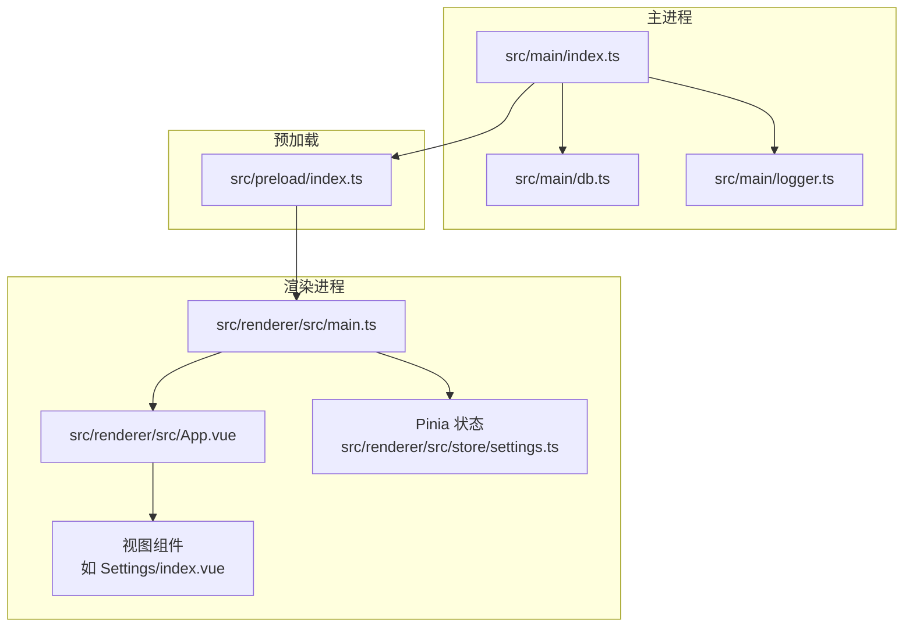
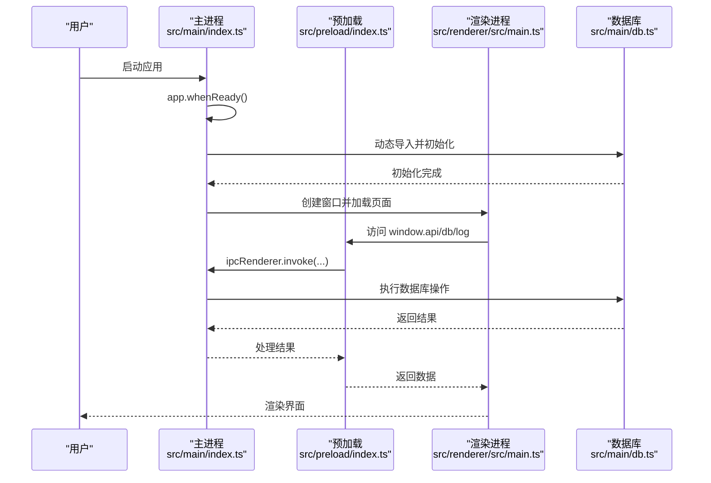
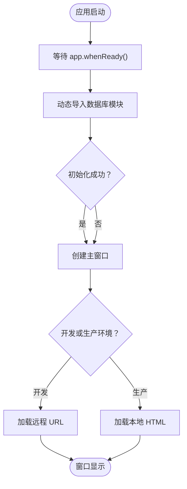
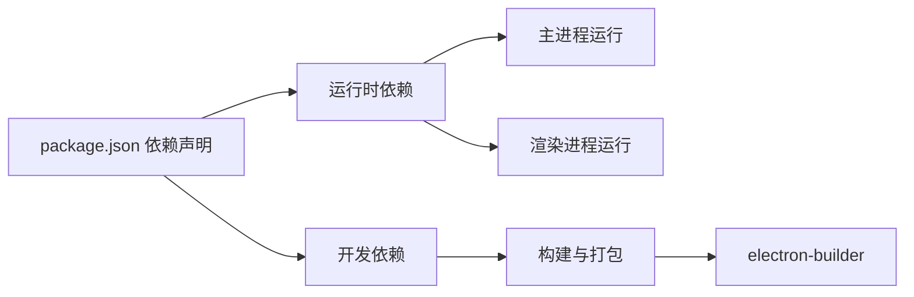

# 快速开始

<cite>
**本文引用的文件**
- [package.json](file://package.json)
- [README.md](file://README.md)
- [electron.vite.config.ts](file://electron.vite.config.ts)
- [src/main/index.ts](file://src/main/index.ts)
- [src/preload/index.ts](file://src/preload/index.ts)
- [src/main/db.ts](file://src/main/db.ts)
- [src/renderer/src/main.ts](file://src/renderer/src/main.ts)
- [src/renderer/src/App.vue](file://src/renderer/src/App.vue)
- [src/renderer/src/views/Settings/index.vue](file://src/renderer/src/views/Settings/index.vue)
- [src/renderer/src/store/settings.ts](file://src/renderer/src/store/settings.ts)
- [tsconfig.json](file://tsconfig.json)
- [tsconfig.node.json](file://tsconfig.node.json)
- [tsconfig.web.json](file://tsconfig.web.json)
- [eslint.config.mjs](file://eslint.config.mjs)
- [.prettierrc.yaml](file://.prettierrc.yaml)
- [electron-builder.yml](file://electron-builder.yml)
- [dev-app-update.yml](file://dev-app-update.yml)
</cite>

## 目录

1. [简介](#简介)
2. [项目结构](#项目结构)
3. [核心组件](#核心组件)
4. [架构总览](#架构总览)
5. [详细组件分析](#详细组件分析)
6. [依赖分析](#依赖分析)
7. [性能考虑](#性能考虑)
8. [故障排查指南](#故障排查指南)
9. [结论](#结论)
10. [附录](#附录)

## 简介

本指南面向首次接触 MyTool 的开发者，帮助你在最短时间内完成环境准备、项目安装与开发调试，并理解关键配置与脚本的作用。MyTool 是一个基于 Electron + Vue + TypeScript 的桌面应用，采用 electron-vite 作为构建与开发工具链，内置 SQLite 数据库存储与日志管理功能，支持多平台打包。

## 项目结构

MyTool 采用“主进程 + 预加载层 + 渲染进程”的经典 Electron 分层架构，配合 Vite + Vue 3 + TypeScript 实现高效的前端开发体验。核心目录与职责如下：

- src/main：Electron 主进程入口与系统集成逻辑（窗口、IPC、日志、数据库等）
- src/preload：预加载脚本，通过 contextBridge 安全暴露主进程能力给渲染进程
- src/renderer：Vue 3 渲染进程源码，包含路由、状态管理、组件与视图
- 根目录配置：包管理、类型检查、代码规范、构建与打包配置

图表来源

- [src/main/index.ts:1-112](file://src/main/index.ts#L1-L112)
- [src/preload/index.ts:1-37](file://src/preload/index.ts#L1-L37)
- [src/main/db.ts:1-100](file://src/main/db.ts#L1-L100)
- [src/renderer/src/main.ts:1-24](file://src/renderer/src/main.ts#L1-L24)
- [src/renderer/src/App.vue:1-47](file://src/renderer/src/App.vue#L1-L47)
- [src/renderer/src/views/Settings/index.vue:1-198](file://src/renderer/src/views/Settings/index.vue#L1-L198)
- [src/renderer/src/store/settings.ts:1-34](file://src/renderer/src/store/settings.ts#L1-L34)

章节来源

- [src/main/index.ts:1-112](file://src/main/index.ts#L1-L112)
- [src/preload/index.ts:1-37](file://src/preload/index.ts#L1-L37)
- [src/main/db.ts:1-100](file://src/main/db.ts#L1-L100)
- [src/renderer/src/main.ts:1-24](file://src/renderer/src/main.ts#L1-L24)
- [src/renderer/src/App.vue:1-47](file://src/renderer/src/App.vue#L1-L47)
- [src/renderer/src/views/Settings/index.vue:1-198](file://src/renderer/src/views/Settings/index.vue#L1-L198)
- [src/renderer/src/store/settings.ts:1-34](file://src/renderer/src/store/settings.ts#L1-L34)

## 核心组件

- 主进程入口：负责创建窗口、注册 IPC、加载数据库模块、处理系统事件与日志路径变更
- 预加载层：通过 contextBridge 暴露受控 API（如数据库与日志），隔离渲染进程访问原生能力
- 渲染进程：Vue 应用入口，挂载 Element Plus、路由与 Pinia，承载业务视图（如设置页）
- 数据库：SQLite3 存储笔记数据，主进程按需懒加载，避免 app 准备前访问用户数据目录导致异常
- 构建与开发：electron-vite 提供开发服务器与热重载；electron-builder 负责跨平台打包

章节来源

- [src/main/index.ts:1-112](file://src/main/index.ts#L1-L112)
- [src/preload/index.ts:1-37](file://src/preload/index.ts#L1-L37)
- [src/main/db.ts:1-100](file://src/main/db.ts#L1-L100)
- [src/renderer/src/main.ts:1-24](file://src/renderer/src/main.ts#L1-L24)
- [electron.vite.config.ts:1-27](file://electron.vite.config.ts#L1-L27)

## 架构总览

下图展示了从启动到页面渲染的关键流程，以及 IPC 在主进程与渲染进程之间的交互。

图表来源

- [src/main/index.ts:47-98](file://src/main/index.ts#L47-L98)
- [src/preload/index.ts:5-18](file://src/preload/index.ts#L5-L18)
- [src/main/db.ts:58-99](file://src/main/db.ts#L58-L99)
- [src/renderer/src/main.ts:1-24](file://src/renderer/src/main.ts#L1-L24)

## 详细组件分析

### 主进程与窗口生命周期

- 创建窗口：设置窗口尺寸、菜单栏、沙箱策略与预加载脚本路径
- 开发与生产：开发模式下加载远程地址，生产模式加载本地 HTML
- IPC 注册：提供日志路径查询、打开日志目录、变更日志路径等接口
- 数据库集成：在 app 准备后动态导入数据库模块，注册笔记相关 IPC

图表来源

- [src/main/index.ts:47-98](file://src/main/index.ts#L47-L98)

章节来源

- [src/main/index.ts:12-42](file://src/main/index.ts#L12-L42)
- [src/main/index.ts:58-98](file://src/main/index.ts#L58-L98)

### 预加载与安全桥接

- 使用 contextBridge 将受限 API 暴露到渲染进程，避免直接注入全局对象
- 暴露 db 与 log 两类 API，分别对应数据库操作与日志管理
- 在禁用上下文隔离时回退到 window 对象注入

章节来源

- [src/preload/index.ts:1-37](file://src/preload/index.ts#L1-L37)

### 渲染进程与状态管理

- 应用入口：注册 Element Plus、图标、路由与 Pinia，并挂载根组件
- 设置页：展示系统名称、主题色、暗黑模式、自动锁屏时间、通知开关与日志路径
- Pinia 持久化：通过插件实现设置项自动持久化至本地存储

章节来源

- [src/renderer/src/main.ts:1-24](file://src/renderer/src/main.ts#L1-L24)
- [src/renderer/src/views/Settings/index.vue:1-198](file://src/renderer/src/views/Settings/index.vue#L1-L198)
- [src/renderer/src/store/settings.ts:1-34](file://src/renderer/src/store/settings.ts#L1-L34)

### 数据库与日志

- 数据库：在用户数据目录创建 SQLite 文件，初始化笔记表，封装增删改查为 Promise
- 日志：记录应用启动与错误信息，支持变更日志目录并通过对话框选择路径

章节来源

- [src/main/db.ts:1-100](file://src/main/db.ts#L1-L100)

### 构建与开发配置

- electron-vite：主进程外置 sqlite3，渲染进程别名 @ 与 @renderer 指向 src/renderer/src，开发服务器端口 3000
- TypeScript：分拆 tsconfig.node.json 与 tsconfig.web.json，分别覆盖主进程与渲染进程
- ESLint/Prettier：统一代码风格与质量控制

章节来源

- [electron.vite.config.ts:1-27](file://electron.vite.config.ts#L1-L27)
- [tsconfig.json:1-11](file://tsconfig.json#L1-L11)
- [tsconfig.node.json:1-9](file://tsconfig.node.json#L1-L9)
- [tsconfig.web.json:1-22](file://tsconfig.web.json#L1-L22)
- [eslint.config.mjs:1-44](file://eslint.config.mjs#L1-L44)
- [.prettierrc.yaml:1-5](file://.prettierrc.yaml#L1-L5)

## 依赖分析

- 运行时依赖：@electron-toolkit 工具集、Element Plus UI、Vue Router、Axios、sqlite3、electron-log、electron-updater、pinia、wangeditor 等
- 开发依赖：electron、electron-vite、electron-builder、TypeScript、Vue 生态相关工具、ESLint、Prettier 等
- 构建与打包：electron-builder 支持 Windows（NSIS）、macOS（DMG）与 Linux（AppImage、deb、snap）

图表来源

- [package.json:23-59](file://package.json#L23-L59)
- [electron-builder.yml:1-60](file://electron-builder.yml#L1-L60)

章节来源

- [package.json:23-59](file://package.json#L23-L59)
- [electron-builder.yml:1-60](file://electron-builder.yml#L1-L60)

## 性能考虑

- 数据库查询优化：笔记列表仅返回必要字段，避免传输富文本内容
- 懒加载数据库模块：在 app 准备后再导入，避免早期访问用户数据目录
- 类型检查前置：构建前执行类型检查，减少运行期错误
- 开发服务器端口固定：便于代理与网络调试

章节来源

- [src/main/db.ts:82-85](file://src/main/db.ts#L82-L85)
- [src/main/index.ts:75-92](file://src/main/index.ts#L75-L92)
- [package.json:16-16](file://package.json#L16-L16)
- [electron.vite.config.ts:22-24](file://electron.vite.config.ts#L22-L24)

## 故障排查指南

- 开发服务器无法访问
  - 确认开发服务器端口未被占用，或调整配置中的端口
  - 章节来源
    - [electron.vite.config.ts:22-24](file://electron.vite.config.ts#L22-L24)
- 数据库初始化失败
  - 检查用户数据目录权限与磁盘空间
  - 查看日志输出定位错误
  - 章节来源
    - [src/main/db.ts:20-35](file://src/main/db.ts#L20-L35)
    - [src/main/index.ts:89-92](file://src/main/index.ts#L89-L92)
- 打包产物缺失或体积异常
  - 检查 electron-builder 配置与忽略规则
  - 章节来源
    - [electron-builder.yml:8-17](file://electron-builder.yml#L8-L17)
- ESLint 或 Prettier 报错
  - 先执行格式化与类型检查修复
  - 章节来源
    - [README.md:13-21](file://README.md#L13-L21)
    - [eslint.config.mjs:1-44](file://eslint.config.mjs#L1-L44)
    - [.prettierrc.yaml:1-5](file://.prettierrc.yaml#L1-L5)

## 结论

通过本指南，你可以在本地快速完成 MyTool 的环境准备与开发调试。建议优先掌握以下要点：

- 使用提供的脚本进行安装、开发与构建
- 理解主进程、预加载与渲染进程的职责边界
- 利用类型检查与代码规范工具提升开发效率
- 遇到问题时结合日志与配置文件定位根因

## 附录

### 环境要求

- Node.js：推荐使用长期支持版本（LTS），以获得最佳兼容性
- 操作系统：Windows/macOS/Linux 均可开发与打包
- 其他：确保已安装 Git 与包管理器（如 npm）

### 安装与开发步骤

- 克隆仓库后，在项目根目录执行安装依赖
  - 章节来源
    - [README.md:13-15](file://README.md#L13-L15)
- 启动开发服务器
  - 章节来源
    - [README.md:17-21](file://README.md#L17-L21)
- 构建应用（多平台）
  - Windows
    - 章节来源
      - [README.md:26-27](file://README.md#L26-L27)
  - macOS
    - 章节来源
      - [README.md:29-30](file://README.md#L29-L30)
  - Linux
    - 章节来源
      - [README.md:32-33](file://README.md#L32-L33)

### 关键配置项与脚本说明

- package.json 中的脚本
  - format：使用 Prettier 统一代码风格
  - lint：缓存式 ESLint 检查
  - typecheck：分别对 Node 与 Web 执行 TypeScript 检查
  - start：预览构建产物
  - dev：启动 electron-vite 开发服务器
  - build：先类型检查再构建
  - postinstall：安装原生依赖
  - build:unpack / build:win / build:mac / build:linux：多平台打包
  - 章节来源
    - [package.json:8-22](file://package.json#L8-L22)
- electron.vite.config.ts
  - 主进程外置 sqlite3，渲染进程启用 Vue 插件与别名，开发服务器端口 3000
  - 章节来源
    - [electron.vite.config.ts:1-27](file://electron.vite.config.ts#L1-L27)
- tsconfig.node.json / tsconfig.web.json
  - 分别限定主进程与渲染进程的编译范围与路径映射
  - 章节来源
    - [tsconfig.node.json:1-9](file://tsconfig.node.json#L1-L9)
    - [tsconfig.web.json:1-22](file://tsconfig.web.json#L1-L22)
- electron-builder.yml
  - 指定应用 ID、产品名、压缩级别、打包目标与输出目录
  - 章节来源
    - [electron-builder.yml:1-60](file://electron-builder.yml#L1-L60)
- dev-app-update.yml
  - 自动更新配置（开发阶段）
  - 章节来源
    - [dev-app-update.yml:1-4](file://dev-app-update.yml#L1-L4)

### VSCode 推荐插件与配置

- 插件组合：VSCode + ESLint + Prettier + Volar
- 章节来源
  - [README.md:5-8](file://README.md#L5-L8)
- 代码风格：遵循 Prettier 规则（单引号、无分号、宽松换行等）
  - 章节来源
    - [.prettierrc.yaml:1-5](file://.prettierrc.yaml#L1-L5)
- 代码规范：ESLint 平台化配置与 Vue 插件
  - 章节来源
    - [eslint.config.mjs:1-44](file://eslint.config.mjs#L1-L44)
