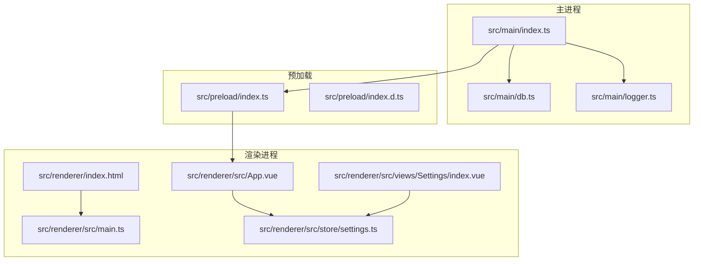
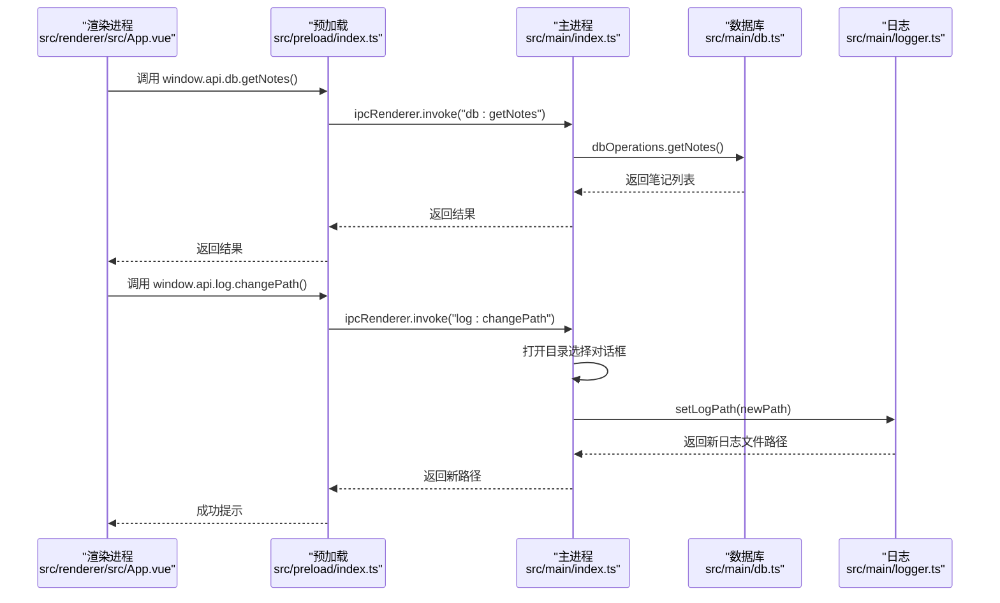
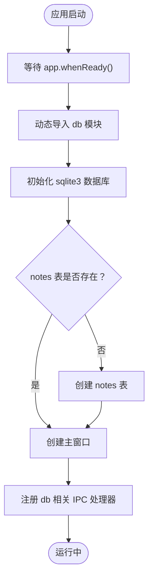
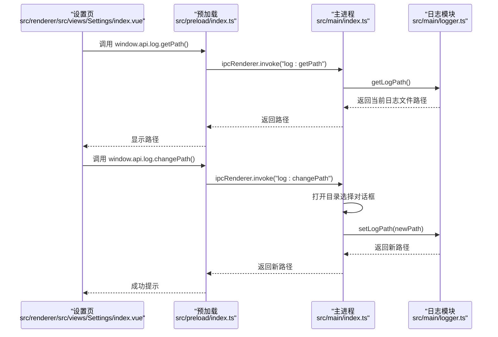
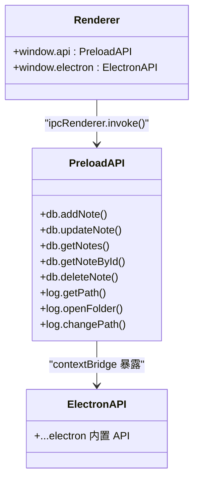
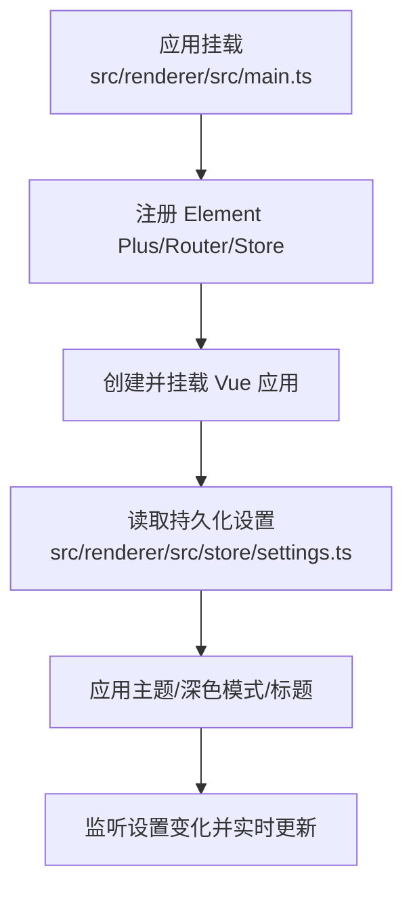
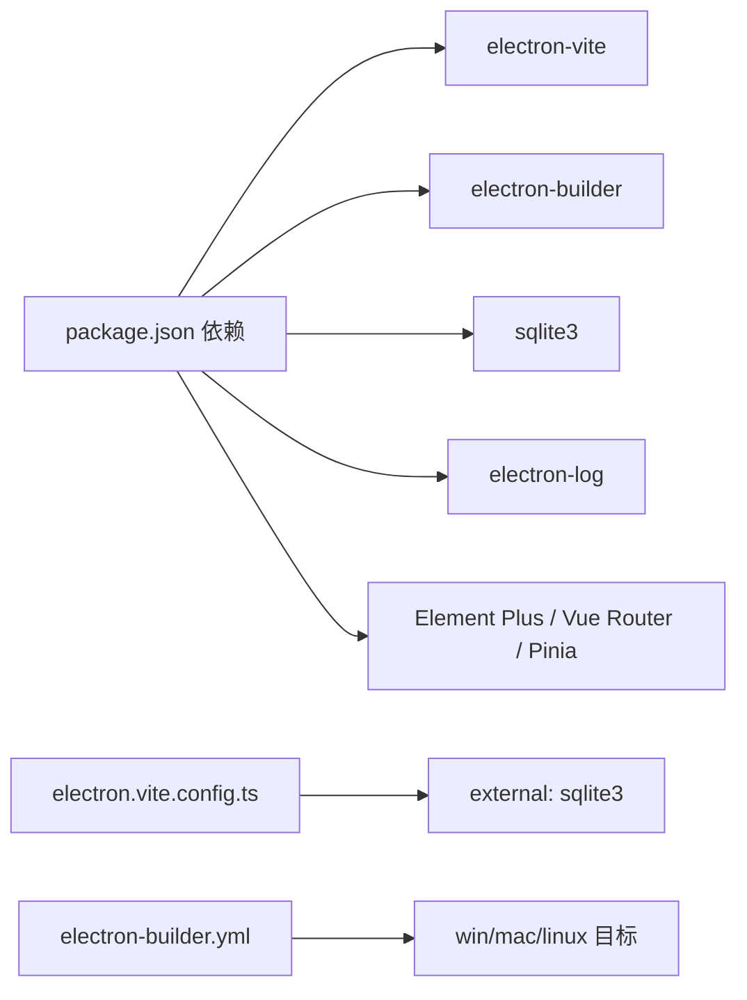

# 故障排除

<cite>
**本文引用的文件**
- [package.json](file://package.json)
- [README.md](file://README.md)
- [electron.vite.config.ts](file://electron.vite.config.ts)
- [electron-builder.yml](file://electron-builder.yml)
- [src/main/index.ts](file://src/main/index.ts)
- [src/main/db.ts](file://src/main/db.ts)
- [src/main/logger.ts](file://src/main/logger.ts)
- [src/preload/index.ts](file://src/preload/index.ts)
- [src/preload/index.d.ts](file://src/preload/index.d.ts)
- [src/renderer/src/main.ts](file://src/renderer/src/main.ts)
- [src/renderer/src/App.vue](file://src/renderer/src/App.vue)
- [src/renderer/src/store/settings.ts](file://src/renderer/src/store/settings.ts)
- [src/renderer/src/views/Settings/index.vue](file://src/renderer/src/views/Settings/index.vue)
- [src/renderer/index.html](file://src/renderer/index.html)
</cite>

## 目录

1. [简介](#简介)
2. [项目结构](#项目结构)
3. [核心组件](#核心组件)
4. [架构总览](#架构总览)
5. [详细组件分析](#详细组件分析)
6. [依赖分析](#依赖分析)
7. [性能考虑](#性能考虑)
8. [故障排除指南](#故障排除指南)
9. [结论](#结论)
10. [附录](#附录)

## 简介

本指南面向 MyTool 的开发者与运维人员，聚焦于 Electron + Vue + TypeScript 应用在开发、构建与运行阶段的常见问题与系统化排障流程。内容覆盖数据库连接失败、IPC 通信异常、UI 渲染问题、权限与沙盒限制、性能优化、内存泄漏检测与崩溃分析，并针对 Windows、macOS、Linux 平台提供差异化建议。同时提供日志分析技巧、调试工具使用方法以及问题反馈与社区支持渠道。

## 项目结构

MyTool 采用 Electron-Vite 工程化方案，主进程负责窗口管理、IPC 与数据库初始化；预加载脚本通过 contextBridge 暴露受控 API 至渲染进程；渲染层基于 Vue 3 + Pinia + Element Plus 构建界面与状态管理。

**图示来源**

- [src/main/index.ts:1-112](file://src/main/index.ts#L1-L112)
- [src/main/db.ts:1-100](file://src/main/db.ts#L1-L100)
- [src/main/logger.ts:1-42](file://src/main/logger.ts#L1-L42)
- [src/preload/index.ts:1-37](file://src/preload/index.ts#L1-L37)
- [src/preload/index.d.ts:1-21](file://src/preload/index.d.ts#L1-L21)
- [src/renderer/index.html:1-17](file://src/renderer/index.html#L1-L17)
- [src/renderer/src/App.vue:1-47](file://src/renderer/src/App.vue#L1-L47)
- [src/renderer/src/main.ts:1-24](file://src/renderer/src/main.ts#L1-L24)
- [src/renderer/src/store/settings.ts:1-34](file://src/renderer/src/store/settings.ts#L1-L34)
- [src/renderer/src/views/Settings/index.vue:42-88](file://src/renderer/src/views/Settings/index.vue#L42-L88)

**章节来源**

- [README.md:1-35](file://README.md#L1-L35)
- [package.json:1-61](file://package.json#L1-L61)

## 核心组件

- 主进程入口：负责窗口创建、DevTools 快捷键监听、IPC 事件注册、数据库模块按需加载与容错启动。
- 数据库模块：基于 sqlite3，使用 Electron app.getPath('userData') 作为数据库文件根目录，初始化 notes 表。
- 日志模块：基于 electron-log，按日切分日志文件，默认输出到应用日志目录，支持动态变更日志目录并通过 IPC 提供 UI 操作。
- 预加载脚本：通过 contextBridge 暴露受限 API（db、log），确保渲染进程仅可访问白名单接口。
- 渲染层：Vue 应用挂载入口、Pinia 设置持久化、设置页集成日志路径查看与变更。

**章节来源**

- [src/main/index.ts:12-92](file://src/main/index.ts#L12-L92)
- [src/main/db.ts:7-35](file://src/main/db.ts#L7-L35)
- [src/main/logger.ts:14-39](file://src/main/logger.ts#L14-L39)
- [src/preload/index.ts:4-36](file://src/preload/index.ts#L4-L36)
- [src/renderer/src/main.ts:1-24](file://src/renderer/src/main.ts#L1-L24)
- [src/renderer/src/store/settings.ts:1-34](file://src/renderer/src/store/settings.ts#L1-L34)
- [src/renderer/src/views/Settings/index.vue:42-88](file://src/renderer/src/views/Settings/index.vue#L42-L88)

## 架构总览

下图展示从渲染进程发起数据库或日志相关请求，经由预加载桥接至主进程 IPC，再由主进程执行具体逻辑（数据库操作或日志路径变更）并返回结果的完整链路。

**图示来源**

- [src/preload/index.ts:6-18](file://src/preload/index.ts#L6-L18)
- [src/main/index.ts:61-73](file://src/main/index.ts#L61-L73)
- [src/main/db.ts:82-86](file://src/main/db.ts#L82-L86)
- [src/main/logger.ts:34-39](file://src/main/logger.ts#L34-L39)
- [src/renderer/src/App.vue:1-47](file://src/renderer/src/App.vue#L1-L47)

## 详细组件分析

### 组件一：数据库模块（SQLite）

- 初始化策略：在 app.whenReady 后按需 import，避免 app.getPath('userData') 未准备导致的路径错误。
- 表结构：notes 表含自增 id、标题、内容、创建与更新时间戳。
- 异常处理：数据库打开失败会记录错误日志；查询/写入封装为 Promise，便于上层统一处理。
- 性能注意：查询笔记列表仅返回必要字段，避免传输富文本内容造成性能压力。

**图示来源**

- [src/main/index.ts:75-92](file://src/main/index.ts#L75-L92)
- [src/main/db.ts:19-35](file://src/main/db.ts#L19-L35)

**章节来源**

- [src/main/db.ts:1-100](file://src/main/db.ts#L1-L100)
- [src/main/index.ts:75-92](file://src/main/index.ts#L75-L92)

### 组件二：日志模块与日志路径变更

- 日志格式：文件与控制台均设置为 info 级别，按日生成日志文件。
- 动态路径：通过 IPC 对话框选择目录，支持创建目录；变更后记录日志并返回新路径。
- UI 集成：设置页显示当前日志路径，支持打开所在目录与变更路径。

**图示来源**

- [src/renderer/src/views/Settings/index.vue:74-88](file://src/renderer/src/views/Settings/index.vue#L74-L88)
- [src/preload/index.ts:14-18](file://src/preload/index.ts#L14-L18)
- [src/main/index.ts:61-73](file://src/main/index.ts#L61-L73)
- [src/main/logger.ts:25-39](file://src/main/logger.ts#L25-L39)

**章节来源**

- [src/main/logger.ts:1-42](file://src/main/logger.ts#L1-L42)
- [src/renderer/src/views/Settings/index.vue:42-88](file://src/renderer/src/views/Settings/index.vue#L42-L88)

### 组件三：预加载与 IPC 桥接

- 安全模型：启用上下文隔离，通过 contextBridge 暴露受控 API（db、log），避免直接暴露 Node/Electron 全部能力。
- 类型声明：index.d.ts 声明 window.electron 与 window.api 的类型，提升开发体验与类型安全。
- 错误兜底：在 contextBridge.exposeInMainWorld 时捕获异常并记录错误。

**图示来源**

- [src/preload/index.ts:4-36](file://src/preload/index.ts#L4-L36)
- [src/preload/index.d.ts:1-21](file://src/preload/index.d.ts#L1-L21)

**章节来源**

- [src/preload/index.ts:1-37](file://src/preload/index.ts#L1-L37)
- [src/preload/index.d.ts:1-21](file://src/preload/index.d.ts#L1-L21)

### 组件四：渲染层与设置持久化

- 应用挂载：在 main.ts 中注册 Element Plus、路由、状态管理并挂载应用。
- 设置持久化：Pinia store 使用持久化插件，设置项包括系统名、主题色、深色模式、锁屏时间、通知等。
- 主题联动：App.vue 在挂载时应用主题色与深色模式，并监听变化实时生效。

**图示来源**

- [src/renderer/src/main.ts:1-24](file://src/renderer/src/main.ts#L1-L24)
- [src/renderer/src/store/settings.ts:1-34](file://src/renderer/src/store/settings.ts#L1-L34)
- [src/renderer/src/App.vue:8-37](file://src/renderer/src/App.vue#L8-L37)

**章节来源**

- [src/renderer/src/main.ts:1-24](file://src/renderer/src/main.ts#L1-L24)
- [src/renderer/src/store/settings.ts:1-34](file://src/renderer/src/store/settings.ts#L1-L34)
- [src/renderer/src/App.vue:1-47](file://src/renderer/src/App.vue#L1-L47)

## 依赖分析

- 构建与打包：electron-vite 用于开发与构建；electron-builder 用于多平台打包与安装包生成。
- 数据库：sqlite3 通过外部依赖方式处理原生扩展；electron.vite.config.ts 将其标记为外部依赖。
- 日志：electron-log 提供文件与控制台输出，支持按日切分与自定义路径。
- UI：Element Plus + Vue Router + Pinia；设置页集成日志路径变更与打开目录功能。

**图示来源**

- [package.json:23-59](file://package.json#L23-L59)
- [electron.vite.config.ts:8-10](file://electron.vite.config.ts#L8-L10)
- [electron-builder.yml:1-60](file://electron-builder.yml#L1-L60)

**章节来源**

- [package.json:1-61](file://package.json#L1-L61)
- [electron.vite.config.ts:1-27](file://electron.vite.config.ts#L1-L27)
- [electron-builder.yml:1-60](file://electron-builder.yml#L1-L60)

## 性能考虑

- 数据库查询优化：仅返回必要字段，避免大字段传输；批量操作建议合并事务。
- 渲染层优化：避免在模板中进行复杂计算；合理拆分组件，减少不必要的重渲染。
- 日志级别：生产环境可降低日志级别，减少磁盘 IO；按需开启详细日志。
- 打包体积：electron-builder 启用 asar 与压缩；剔除开发期无关文件与注释。
- 运行时资源：避免在主进程做重型计算；将耗时任务移至子进程或后台线程。

## 故障排除指南

### 通用排障流程

- 确认应用版本与平台：在设置页或版本组件中查看 Electron/Chromium/Node 版本。
- 查看日志：通过设置页打开日志目录，定位当日日志文件；检查错误堆栈与关键信息。
- 复现最小化场景：尝试最小化功能复现问题，逐步加入特性以定位触发点。
- 开启 DevTools：开发环境下按 F12 打开主/渲染进程控制台，观察网络、性能与 Console 输出。
- 检查 CSP：确保渲染进程 CSP 允许必要的脚本与资源加载。

**章节来源**

- [src/renderer/src/components/Versions.vue:1-13](file://src/renderer/src/components/Versions.vue#L1-L13)
- [src/renderer/src/views/Settings/index.vue:74-88](file://src/renderer/src/views/Settings/index.vue#L74-L88)
- [src/renderer/index.html:6-10](file://src/renderer/index.html#L6-L10)

### 数据库连接失败

- 症状：应用启动时报数据库打开失败、无法创建/读取 notes 表。
- 排查要点：
  - 检查 userData 目录是否可写：确认 app.getPath('userData') 返回路径存在且具备写权限。
  - 检查 sqlite3 原生模块：确认构建后 sqlite3 未被打包进 asar 或正确解包。
  - 检查数据库文件权限：确保 mytool_notes.db 文件可读写。
  - 观察日志：定位数据库初始化阶段的错误信息。
- 解决建议：
  - 在主进程按需加载 db 模块，避免 app.getPath 未就绪导致的路径错误。
  - 如需迁移或修复，可在备份后删除旧数据库文件，让应用自动重建。
  - 在 CI/CD 环境中确保 userData 目录权限与磁盘空间充足。

**章节来源**

- [src/main/db.ts:7-17](file://src/main/db.ts#L7-L17)
- [src/main/db.ts:20-35](file://src/main/db.ts#L20-L35)
- [src/main/index.ts:75-92](file://src/main/index.ts#L75-L92)
- [electron.vite.config.ts:8-10](file://electron.vite.config.ts#L8-L10)

### IPC 通信异常

- 症状：渲染进程调用 window.api.db.xxx 或 window.api.log.xxx 抛错或无响应。
- 排查要点：
  - 确认预加载已成功暴露 API：检查 contextIsolation 是否启用，exposeInMainWorld 是否抛错。
  - 确认 IPC 名称一致：主进程 ipcMain.handle 与渲染端 ipcRenderer.invoke 名称必须严格匹配。
  - 检查参数与返回值：确保序列化参数符合预期，避免循环引用。
  - 观察主进程日志：定位 IPC 处理器注册与执行过程中的错误。
- 解决建议：
  - 在预加载中增加 try/catch 并记录错误；在渲染层对异步调用增加超时与重试。
  - 对高频 IPC 调用考虑批处理或缓存策略。

**章节来源**

- [src/preload/index.ts:24-36](file://src/preload/index.ts#L24-L36)
- [src/preload/index.d.ts:1-21](file://src/preload/index.d.ts#L1-L21)
- [src/main/index.ts:80-85](file://src/main/index.ts#L80-L85)
- [src/main/index.ts:61-73](file://src/main/index.ts#L61-L73)

### UI 渲染问题

- 症状：页面空白、组件不显示、主题不生效、标题未更新。
- 排查要点：
  - 检查应用挂载：确认 main.ts 中应用已正确挂载到 #app。
  - 检查路由与视图：确认路由配置与视图组件存在且可加载。
  - 检查主题与深色模式：确认 App.vue 中监听设置变化并调用主题切换函数。
  - 检查 CSS 与图标：确认 Element Plus 样式与图标已正确引入。
- 解决建议：
  - 在 App.vue 的 onMounted 中验证设置持久化数据是否正确读取。
  - 对于空白页，优先检查 index.html 的 CSP 与入口脚本加载。

**章节来源**

- [src/renderer/src/main.ts:1-24](file://src/renderer/src/main.ts#L1-L24)
- [src/renderer/src/App.vue:8-37](file://src/renderer/src/App.vue#L8-L37)
- [src/renderer/src/views/Settings/index.vue:74-88](file://src/renderer/src/views/Settings/index.vue#L74-L88)
- [src/renderer/index.html:6-10](file://src/renderer/index.html#L6-L10)

### 权限与沙盒限制

- 症状：无法打开外部链接、无法访问系统资源、窗口行为异常。
- 排查要点：
  - 检查 webPreferences.sandbox 是否启用：当前项目禁用了沙盒，若启用需明确权限清单。
  - 检查 setWindowOpenHandler：确认外部链接打开策略与安全策略一致。
  - 检查平台特定权限：macOS 需要 Entitlements；Windows 需要安装器权限。
- 解决建议：
  - 如需更高安全性，启用沙盒并配置相应权限；否则保持现有策略并加强输入校验与资源访问控制。

**章节来源**

- [src/main/index.ts:20-33](file://src/main/index.ts#L20-L33)
- [electron-builder.yml:32-38](file://electron-builder.yml#L32-L38)

### 性能问题与内存泄漏

- 症状：CPU 占用高、内存持续增长、界面卡顿。
- 排查要点：
  - 使用 DevTools Performance 面板采集渲染与主进程性能快照。
  - 使用 Memory 面板观察堆内存增长趋势，定位泄漏对象类型。
  - 检查数据库查询是否频繁触发、是否有未释放的定时器或事件监听。
- 解决建议：
  - 对长列表使用虚拟滚动；对高频事件使用防抖/节流。
  - 及时清理定时器、事件监听与闭包引用；避免在渲染层直接持有重型对象。

### 崩溃分析

- 收集日志：定位当日日志文件，提取错误堆栈与上下文信息。
- 重现与最小化：逐步移除功能，缩小问题范围。
- 平台差异：Windows 下关注安装器与权限；macOS 关注签名与 Entitlements；Linux 关注打包目标与依赖。

**章节来源**

- [src/main/logger.ts:1-42](file://src/main/logger.ts#L1-L42)

### 不同操作系统平台的针对性方案

- Windows
  - 安装器：NSIS 目标，支持更改安装目录与桌面/开始菜单快捷方式。
  - 权限：确保安装目录具备写权限；注意杀软拦截。
- macOS
  - 目标：dmg；可配置摄像头/麦克风/文档/下载目录使用说明。
  - 签名与公证：根据需要启用签名与公证流程。
- Linux
  - 目标：AppImage、deb、snap；注意打包后依赖与权限。

**章节来源**

- [electron-builder.yml:20-51](file://electron-builder.yml#L20-L51)

### 日志分析技巧与调试工具

- 日志级别：生产环境建议 info；问题定位时临时提升到 silly 或 verbose。
- 日志路径：通过设置页动态变更日志目录，便于收集多平台日志。
- 调试工具：F12 打开 DevTools；使用 Network 面板检查 IPC 请求与响应；使用 Console 查看错误与警告。
- 自动更新：应用内置自动更新配置，可结合日志定位更新失败原因。

**章节来源**

- [src/main/logger.ts:5-8](file://src/main/logger.ts#L5-L8)
- [src/renderer/src/views/Settings/index.vue:74-88](file://src/renderer/src/views/Settings/index.vue#L74-L88)
- [electron-builder.yml:54-57](file://electron-builder.yml#L54-L57)

### 问题反馈与社区支持

- 推荐使用仓库 Issues 进行问题反馈，附带：
  - 应用版本与平台信息（可通过版本组件或设置页查看）
  - 日志文件与关键错误片段
  - 最小化复现步骤与期望结果
- 社区支持：遵循仓库 README 中推荐的 IDE 与插件，保持代码风格与质量一致性。

**章节来源**

- [README.md:1-35](file://README.md#L1-L35)

## 结论

MyTool 的故障排除应围绕“日志先行、IPC 对齐、数据库稳健、渲染可控”四大原则展开。通过规范化的日志路径管理、严格的 IPC 类型约束、数据库初始化与权限保障、以及渲染层的状态与主题联动机制，可显著降低运行时风险。针对不同平台的打包与权限差异，建议在 CI/CD 中加入平台化测试与日志收集，形成闭环的质量保障体系。

## 附录

- 快速检查清单
  - 日志目录可写且可打开
  - IPC 名称与参数一致
  - 数据库文件存在且可读写
  - userData 目录权限正常
  - CSP 允许必要资源加载
  - 平台安装器权限与签名配置正确
