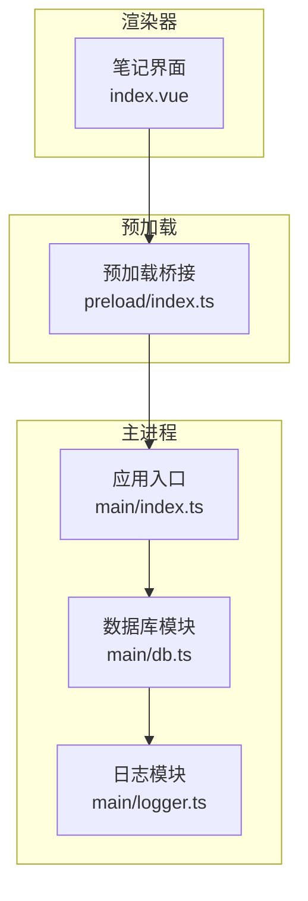
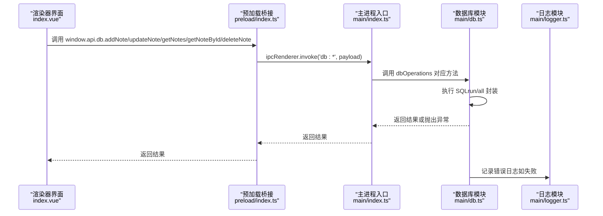
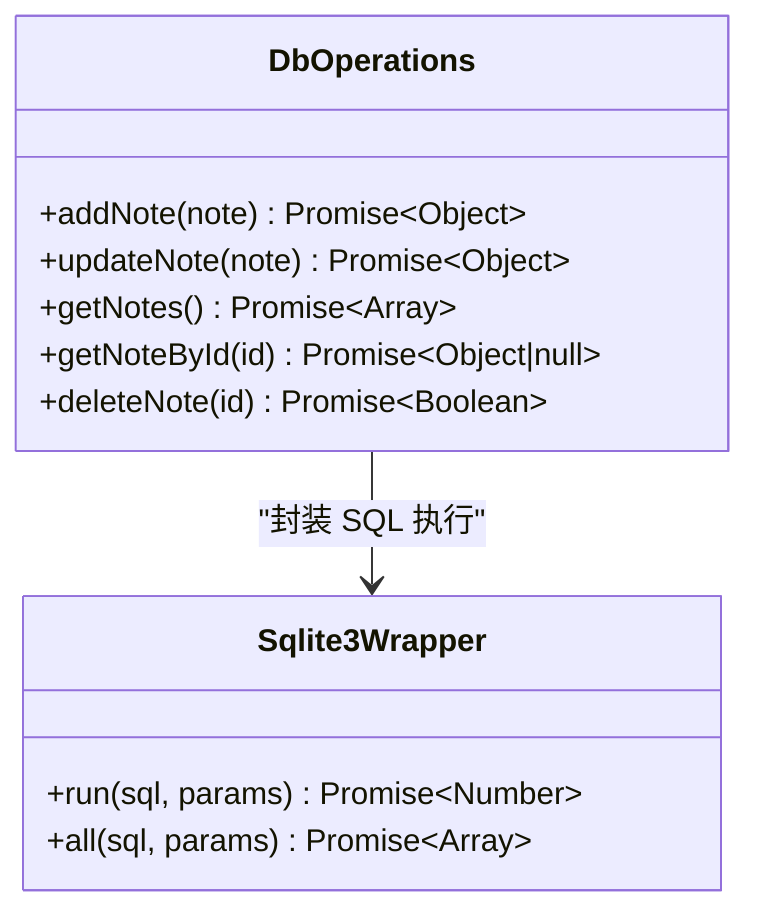
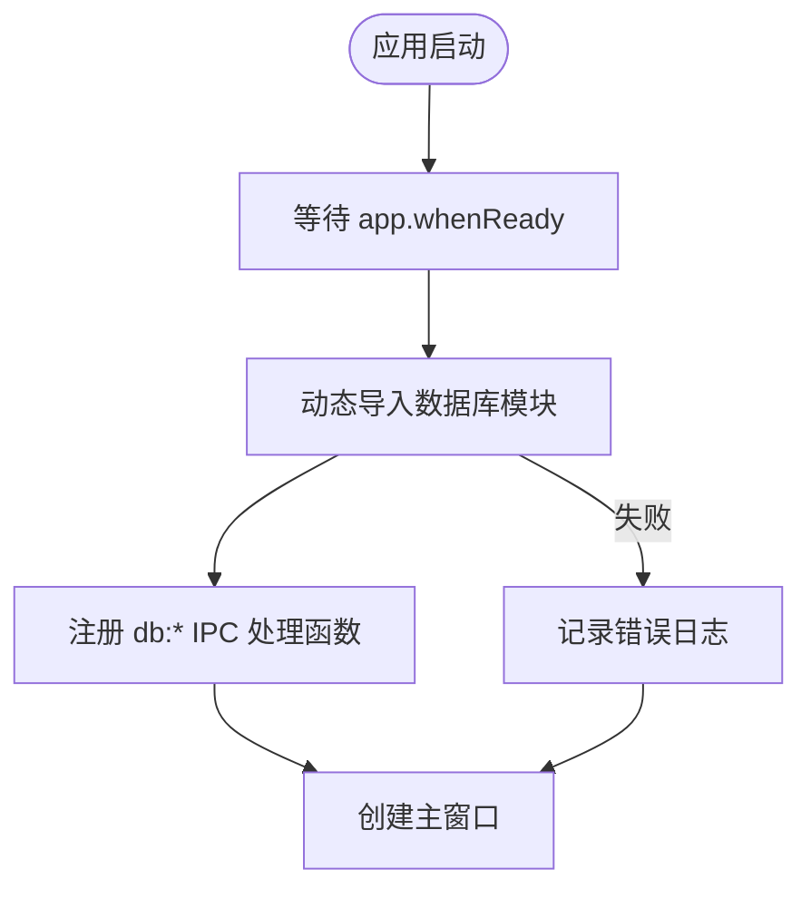
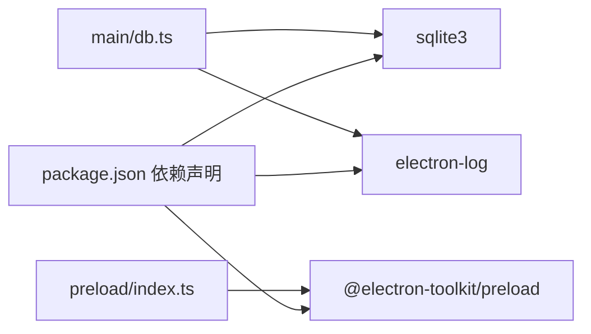
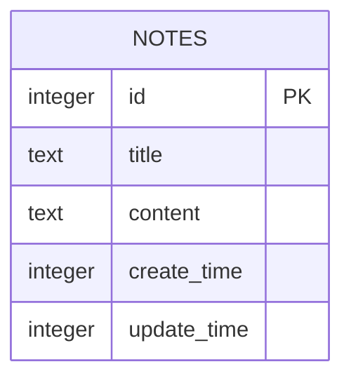

# 数据库系统

<cite>
**本文引用的文件**
- [db.ts](file://src/main/db.ts)
- [index.ts](file://src/main/index.ts)
- [index.ts](file://src/preload/index.ts)
- [index.d.ts](file://src/preload/index.d.ts)
- [index.vue](file://src/renderer/src/views/Notepad/index.vue)
- [logger.ts](file://src/main/logger.ts)
- [package.json](file://package.json)
</cite>

## 目录

1. [简介](#简介)
2. [项目结构](#项目结构)
3. [核心组件](#核心组件)
4. [架构总览](#架构总览)
5. [详细组件分析](#详细组件分析)
6. [依赖关系分析](#依赖关系分析)
7. [性能考量](#性能考量)
8. [故障排查指南](#故障排查指南)
9. [结论](#结论)
10. [附录](#附录)

## 简介

本文件面向 MyTool 的数据库系统，聚焦于 Electron + SQLite 的桌面应用数据层设计与实现。文档从架构设计、表结构与数据模型、连接与事务管理、并发控制、CRUD 接口、迁移与备份恢复、性能优化、查询优化与索引设计，以及扩展与维护最佳实践等方面进行系统化阐述，并通过可视化图表帮助读者快速理解各模块之间的交互关系。

## 项目结构

MyTool 的数据库系统采用“主进程数据库 + 预加载桥接 + 渲染器调用”的三层架构：

- 主进程负责数据库初始化、表结构创建、SQL 执行封装与错误日志记录
- 预加载脚本通过 contextBridge 暴露受控的数据库 API 至渲染器
- 渲染器通过 window.api.db 调用数据库操作，完成笔记的增删改查

图表来源

- [index.ts:75-92](file://src/main/index.ts#L75-L92)
- [db.ts:1-35](file://src/main/db.ts#L1-L35)
- [index.ts:1-36](file://src/preload/index.ts#L1-L36)
- [index.vue:312-344](file://src/renderer/src/views/Notepad/index.vue#L312-L344)

章节来源

- [index.ts:75-92](file://src/main/index.ts#L75-L92)
- [db.ts:1-35](file://src/main/db.ts#L1-L35)
- [index.ts:1-36](file://src/preload/index.ts#L1-L36)
- [index.vue:312-344](file://src/renderer/src/views/Notepad/index.vue#L312-L344)

## 核心组件

- 数据库模块：负责数据库初始化、表结构创建、SQL 执行封装（Promise 化）、CRUD 操作导出
- 应用入口：在 app.whenReady 后动态导入数据库模块，注册 IPC 处理函数，暴露数据库操作给渲染器
- 预加载桥接：通过 contextBridge 暴露 window.api.db，统一渲染器侧的数据库调用入口
- 日志模块：提供数据库错误日志记录能力，便于定位问题

章节来源

- [db.ts:57-99](file://src/main/db.ts#L57-L99)
- [index.ts:75-92](file://src/main/index.ts#L75-L92)
- [index.ts:5-18](file://src/preload/index.ts#L5-L18)
- [logger.ts:1-42](file://src/main/logger.ts#L1-L42)

## 架构总览

下图展示了从渲染器发起数据库请求到主进程执行 SQL 的完整流程，以及错误处理与日志记录路径。

图表来源

- [index.vue:312-344](file://src/renderer/src/views/Notepad/index.vue#L312-L344)
- [index.ts:7-12](file://src/preload/index.ts#L7-L12)
- [index.ts:80-85](file://src/main/index.ts#L80-L85)
- [db.ts:38-55](file://src/main/db.ts#L38-L55)
- [logger.ts:1-42](file://src/main/logger.ts#L1-L42)

## 详细组件分析

### 数据库模块（db.ts）

- 数据库文件位置：位于 Electron 用户数据目录下的 mytool_notes.db
- 表结构：notes 表包含自增主键 id、标题、内容、创建时间、更新时间
- SQL 封装：run（INSERT/UPDATE/DELETE）与 all（SELECT）均封装为 Promise，便于异步调用
- CRUD 方法：
  - addNote：插入新笔记，设置创建与更新时间为当前时间戳
  - updateNote：按 id 更新标题、内容与更新时间
  - getNotes：按更新时间倒序返回简要信息（id、title、create_time、update_time）
  - getNoteById：按 id 查询完整笔记详情
  - deleteNote：按 id 删除笔记

图表来源

- [db.ts:38-55](file://src/main/db.ts#L38-L55)
- [db.ts:58-99](file://src/main/db.ts#L58-L99)

章节来源

- [db.ts:15-35](file://src/main/db.ts#L15-L35)
- [db.ts:58-99](file://src/main/db.ts#L58-L99)

### 应用入口（index.ts）

- 在 app.whenReady 之后动态导入数据库模块，避免 userData 目录尚未准备导致的异常
- 注册数据库相关的 IPC 处理函数，将渲染器请求转发至 dbOperations
- 若数据库模块加载失败，仍保证窗口正常显示，提升健壮性

图表来源

- [index.ts:47-92](file://src/main/index.ts#L47-L92)

章节来源

- [index.ts:75-92](file://src/main/index.ts#L75-L92)

### 预加载桥接（preload/index.ts）

- 通过 contextBridge 暴露 window.api.db，包含 addNote、updateNote、getNotes、getNoteById、deleteNote
- 渲染器通过 ipcRenderer.invoke 发起调用，主进程以 handle 形式响应

章节来源

- [index.ts:5-18](file://src/preload/index.ts#L5-L18)
- [index.d.ts:6-13](file://src/preload/index.d.ts#L6-L13)

### 渲染器调用示例（Notepad/index.vue）

- 保存笔记：根据是否存在 id 决定新增或更新；成功后更新本地状态并提示
- 删除笔记：二次确认后调用 deleteNote 并刷新列表
- 加载列表：首次进入页面时拉取笔记列表

章节来源

- [index.vue:312-344](file://src/renderer/src/views/Notepad/index.vue#L312-L344)
- [index.vue:293-310](file://src/renderer/src/views/Notepad/index.vue#L293-L310)
- [index.vue:346-348](file://src/renderer/src/views/Notepad/index.vue#L346-L348)

## 依赖关系分析

- 依赖 sqlite3 实现本地数据库访问
- 依赖 electron-log 记录数据库错误日志
- 通过 @electron-toolkit/preload 提供预加载桥接能力

图表来源

- [package.json:23-37](file://package.json#L23-L37)
- [db.ts:1-5](file://src/main/db.ts#L1-L5)
- [index.ts:1-2](file://src/preload/index.ts#L1-L2)

章节来源

- [package.json:23-37](file://package.json#L23-L37)

## 性能考量

- 查询优化
  - 列表查询仅返回必要字段（id、title、create_time、update_time），避免传输大文本内容，降低网络/IPC 压力
  - 使用 ORDER BY update_time DESC，配合索引可显著提升排序效率
- 存储与路径
  - 数据库文件位于 Electron 用户数据目录，确保跨平台兼容与权限隔离
- 并发与事务
  - 当前实现未显式使用事务，建议在批量写入或需要强一致性的场景中引入 BEGIN/COMMIT
  - SQLite 默认 WAL 模式可提升读写并发，但需注意磁盘空间占用
- 索引设计
  - 建议为 create_time、update_time 建立索引，以支持高频排序与范围查询
  - 如未来扩展搜索功能，可考虑为 title 或全文检索建立索引

章节来源

- [db.ts:82-85](file://src/main/db.ts#L82-L85)
- [db.ts:25-33](file://src/main/db.ts#L25-L33)

## 故障排查指南

- 数据库打开失败
  - 现象：初始化回调中记录错误日志
  - 排查：检查用户数据目录权限、磁盘空间、文件被其他进程占用
- IPC 调用异常
  - 现象：渲染器调用 window.api.db.\* 抛错或无响应
  - 排查：确认主进程已注册对应 IPC 处理函数；检查预加载桥接是否正确暴露 api
- 日志定位
  - 使用日志模块记录数据库错误，定位具体 SQL 与参数
- 数据损坏或异常
  - 建议：定期备份数据库文件；出现问题时可回滚至上一个稳定版本

章节来源

- [db.ts:20-23](file://src/main/db.ts#L20-L23)
- [index.ts:89-92](file://src/main/index.ts#L89-L92)
- [logger.ts:1-42](file://src/main/logger.ts#L1-L42)

## 结论

MyTool 的数据库系统以 SQLite 为核心，结合 Electron 的 IPC 机制实现了简洁可靠的本地数据持久化方案。当前实现满足基础笔记管理需求，具备良好的可维护性与扩展性。后续可在事务管理、索引优化、迁移与备份策略方面进一步完善，以支撑更复杂的数据场景。

## 附录

### 数据库架构设计与表结构

- 数据库文件：mytool_notes.db

#### 1. `users` (用户系统表)

用于存储系统账号信息与鉴权凭证。

- `id` (INTEGER PRIMARY KEY AUTOINCREMENT)
- `username` (TEXT UNIQUE) - 唯一账号名
- `password` (TEXT) - 经过 SHA-256 加密的密码哈希值
- `avatar` (TEXT) - 头像图片网络地址
- `create_time` (INTEGER) - 账号创建时间戳

> 安全注意：系统会自动使用 Node.js 的 `crypto` 模块加密写入与校验密码，绝不以明文形式接触数据库。

#### 2. `notes` (本地记事本表)

用于存储用户的本地笔记：

- `id` (INTEGER PRIMARY KEY AUTOINCREMENT)
- `title` (TEXT) - 笔记标题
- `content` (TEXT) - 笔记 HTML 内容
- `create_time` (INTEGER) - 创建时间戳
- `update_time` (INTEGER) - 最后修改时间戳

## 数据库操作规范

所有数据库操作严格限制在 **主进程 (Main Process)** 中执行，并通过特定的 IPC API 暴露给渲染进程：

1. 渲染进程通过 `window.api.db.*` 发起异步请求。
2. 经过主进程中统一定义的 IPC 日志拦截器 (`ipcHandleWithLog`) 自动记录调用参数与耗时。
3. 主进程的 IPC 处理器接收请求，执行相应的 SQL 语句。
4. 主进程将执行结果或错误信息返回给渲染进程。

章节来源

- [db.ts:25-33](file://src/main/db.ts#L25-L33)

### 数据模型

图表来源

- [db.ts:25-33](file://src/main/db.ts#L25-L33)

### CRUD 操作接口文档

- addNote
  - 参数：{ title: string; content: string }
  - 返回：包含 id、title、content、create_time、update_time 的对象
  - 错误：SQL 执行失败时抛出异常
- updateNote
  - 参数：{ id: number; title: string; content: string }
  - 返回：包含更新后的 id、title、content、update_time 的对象
  - 错误：SQL 执行失败时抛出异常
- getNotes
  - 参数：无
  - 返回：按更新时间倒序排列的笔记简要信息数组
  - 错误：SQL 执行失败时抛出异常
- getNoteById
  - 参数：id: number
  - 返回：单条笔记详情对象或 null
  - 错误：SQL 执行失败时抛出异常
- deleteNote
  - 参数：id: number
  - 返回：true
  - 错误：SQL 执行失败时抛出异常

章节来源

- [db.ts:58-99](file://src/main/db.ts#L58-L99)
- [index.ts:7-12](file://src/preload/index.ts#L7-L12)

### 事务处理与并发控制

- 当前实现未显式使用事务，建议在以下场景引入：
  - 批量写入多条记录
  - 需要强一致性的复合操作（如更新关联数据）
- 并发控制建议：
  - 使用 SQLite 的 WAL 模式提升读写并发
  - 控制同时发起的写操作数量，避免竞争

章节来源

- [db.ts:38-55](file://src/main/db.ts#L38-L55)

### 数据迁移策略

- 版本化迁移
  - 在应用启动时检测数据库版本号，按顺序执行迁移脚本
  - 迁移脚本中使用事务包裹，失败则回滚
- 结构变更
  - 新增列：ALTER TABLE ... ADD COLUMN
  - 删除列：CREATE 新表 + 数据迁移 + DROP 原表
  - 重命名列：CREATE 新表 + 数据迁移 + DROP 原表
- 数据校验
  - 迁移完成后执行完整性检查与数据一致性验证

章节来源

- [db.ts:25-33](file://src/main/db.ts#L25-L33)

### 备份与恢复机制

- 自动备份
  - 定期复制数据库文件到备份目录
  - 支持按日期命名备份文件
- 手动备份
  - 提供 UI 操作，允许用户选择备份路径
- 恢复
  - 从备份文件替换当前数据库文件
  - 恢复前建议关闭应用并停止数据库写入

章节来源

- [logger.ts:17-23](file://src/main/logger.ts#L17-L23)

### 查询优化与索引设计原则

- 常用查询
  - 按更新时间倒序分页：为 update_time 建立索引
  - 按创建时间倒序分页：为 create_time 建立索引
- 复合条件
  - 如需按标题模糊匹配，考虑为 title 建立索引或使用 FTS5 全文索引
- 性能监控
  - 使用 EXPLAIN QUERY PLAN 分析慢查询
  - 定期清理无用索引，平衡写入与查询性能

章节来源

- [db.ts:82-85](file://src/main/db.ts#L82-L85)
- [db.ts:25-33](file://src/main/db.ts#L25-L33)

### 开发者最佳实践

- 错误处理
  - 所有数据库操作均应捕获异常并记录日志
  - 对外暴露统一的错误码或错误消息格式
- 类型安全
  - 在预加载桥接与渲染器间保持严格的类型定义
- 可测试性
  - 将 SQL 封装为独立函数，便于单元测试
- 可维护性
  - 将迁移脚本与业务逻辑解耦，集中管理
  - 文档化每个 SQL 的用途与边界条件

章节来源

- [index.d.ts:6-13](file://src/preload/index.d.ts#L6-L13)
- [logger.ts:1-42](file://src/main/logger.ts#L1-L42)
