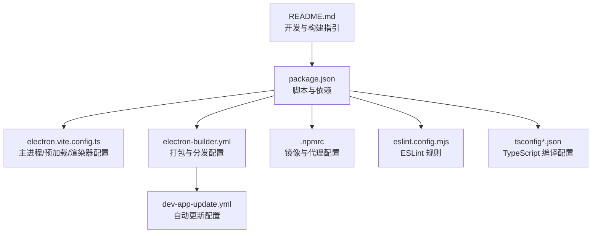
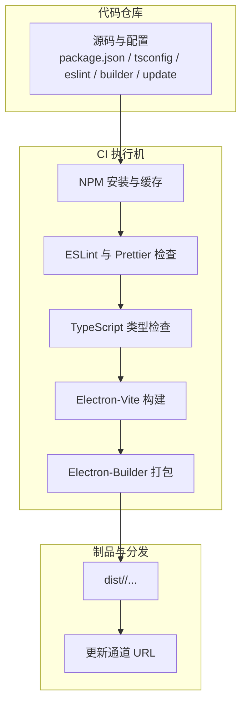
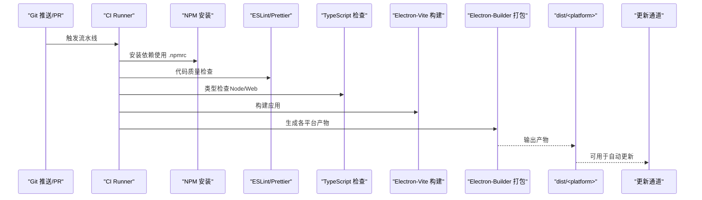
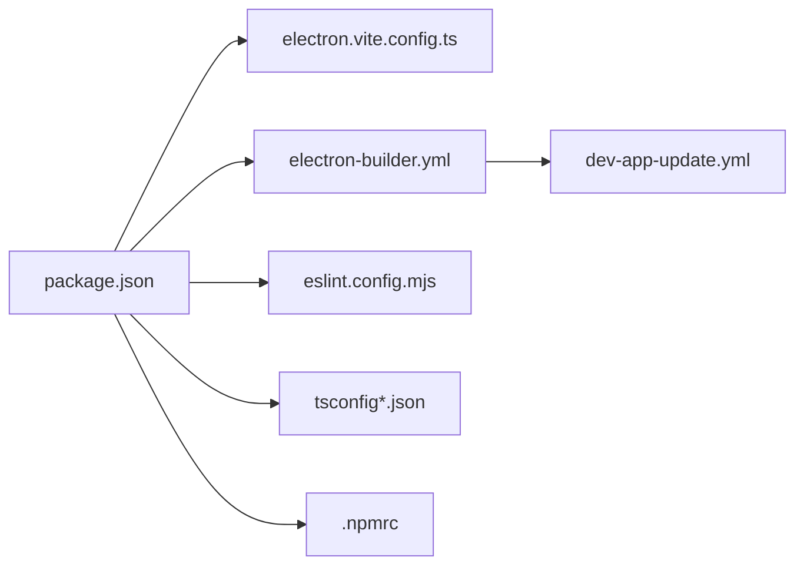

# CI/CD 集成

<cite>
**本文引用的文件**
- [package.json](file://package.json)
- [electron.vite.config.ts](file://electron.vite.config.ts)
- [electron-builder.yml](file://electron-builder.yml)
- [dev-app-update.yml](file://dev-app-update.yml)
- [.npmrc](file://.npmrc)
- [eslint.config.mjs](file://eslint.config.mjs)
- [tsconfig.json](file://tsconfig.json)
- [tsconfig.node.json](file://tsconfig.node.json)
- [tsconfig.web.json](file://tsconfig.web.json)
- [README.md](file://README.md)
</cite>

## 目录

1. [简介](#简介)
2. [项目结构](#项目结构)
3. [核心组件](#核心组件)
4. [架构总览](#架构总览)
5. [详细组件分析](#详细组件分析)
6. [依赖分析](#依赖分析)
7. [性能考虑](#性能考虑)
8. [故障排除指南](#故障排除指南)
9. [结论](#结论)
10. [附录](#附录)

## 简介

本指南面向 MyTool 的持续集成与持续部署（CI/CD），基于仓库中现有的构建脚本、打包配置与工具链，提供可直接落地的流水线设计与最佳实践。内容涵盖：

- 多平台并行构建与测试自动化
- 构建缓存策略与依赖管理
- 构建优化技巧与安全扫描
- 环境变量与密钥管理
- 自动化测试与代码质量检查
- 发布分支策略、版本标签与发布自动化
- 常见问题排查与性能优化建议

## 项目结构

MyTool 是一个基于 Electron-Vite + Vue + TypeScript 的桌面应用，使用 electron-builder 进行跨平台打包，并通过 npm scripts 提供开发、类型检查、格式化、构建与多平台打包命令。

**图示来源**

- [package.json:1-61](file://package.json#L1-L61)
- [electron.vite.config.ts:1-27](file://electron.vite.config.ts#L1-L27)
- [electron-builder.yml:1-60](file://electron-builder.yml#L1-L60)
- [dev-app-update.yml:1-4](file://dev-app-update.yml#L1-L4)
- [.npmrc:1-5](file://.npmrc#L1-L5)
- [eslint.config.mjs:1-44](file://eslint.config.mjs#L1-L44)
- [tsconfig.json:1-11](file://tsconfig.json#L1-L11)
- [tsconfig.node.json:1-9](file://tsconfig.node.json#L1-L9)
- [tsconfig.web.json:1-22](file://tsconfig.web.json#L1-L22)
- [README.md:1-35](file://README.md#L1-L35)

**章节来源**

- [package.json:1-61](file://package.json#L1-L61)
- [README.md:1-35](file://README.md#L1-L35)

## 核心组件

- 构建与打包
  - 使用 electron-vite 进行开发与构建；electron-builder 负责多平台打包与分发。
  - 支持 Windows（NSIS）、macOS（DMG）与 Linux（AppImage、deb、snap）目标。
- 类型检查与代码质量
  - ESLint 与 Prettier 配置，配合 TypeScript 类型检查脚本。
- 自动更新
  - 通过 dev-app-update.yml 指定通用更新通道与缓存目录。
- 依赖与镜像
  - .npmrc 指定国内镜像源与 electron-builder 二进制镜像，提升网络稳定性。

**章节来源**

- [package.json:8-22](file://package.json#L8-L22)
- [electron-builder.yml:20-60](file://electron-builder.yml#L20-L60)
- [dev-app-update.yml:1-4](file://dev-app-update.yml#L1-L4)
- [.npmrc:1-5](file://.npmrc#L1-L5)
- [eslint.config.mjs:1-44](file://eslint.config.mjs#L1-L44)
- [tsconfig.json:1-11](file://tsconfig.json#L1-L11)
- [tsconfig.node.json:1-9](file://tsconfig.node.json#L1-L9)
- [tsconfig.web.json:1-22](file://tsconfig.web.json#L1-L22)

## 架构总览

下图展示从代码提交到多平台产物产出的整体流程，以及与外部服务（更新通道）的关系。

**图示来源**

- [package.json:8-22](file://package.json#L8-L22)
- [electron.vite.config.ts:1-27](file://electron.vite.config.ts#L1-L27)
- [electron-builder.yml:1-60](file://electron-builder.yml#L1-L60)
- [dev-app-update.yml:1-4](file://dev-app-update.yml#L1-L4)

## 详细组件分析

### 构建与打包流水线

- 入口与阶段
  - 安装依赖：使用 .npmrc 中的镜像源加速安装。
  - 代码质量：执行 ESLint 与 Prettier 检查。
  - 类型检查：分别对 Node 与 Web 端进行类型检查。
  - 构建：调用 electron-vite 进行构建。
  - 打包：根据平台选择 electron-builder 子命令生成对应产物。
- 多平台并行
  - 在 CI 中并行运行 Windows/macOS/Linux 的构建与打包步骤，以缩短总时长。
- 更新通道
  - 通过 dev-app-update.yml 指定通用更新通道，确保自动更新可用。

**图示来源**

- [package.json:8-22](file://package.json#L8-L22)
- [.npmrc:1-5](file://.npmrc#L1-L5)
- [eslint.config.mjs:1-44](file://eslint.config.mjs#L1-L44)
- [tsconfig.json:1-11](file://tsconfig.json#L1-L11)
- [electron.vite.config.ts:1-27](file://electron.vite.config.ts#L1-L27)
- [electron-builder.yml:1-60](file://electron-builder.yml#L1-L60)
- [dev-app-update.yml:1-4](file://dev-app-update.yml#L1-L4)

**章节来源**

- [package.json:8-22](file://package.json#L8-L22)
- [electron-builder.yml:20-60](file://electron-builder.yml#L20-L60)
- [dev-app-update.yml:1-4](file://dev-app-update.yml#L1-L4)

### 测试自动化与覆盖率（建议）

- 当前仓库未发现测试入口或测试脚本。建议在 CI 中增加以下步骤：
  - 运行单元/集成测试（如 jest/vitest）。
  - 生成并上传覆盖率报告。
  - 将测试结果与 PR 状态关联。
- 与现有脚本的衔接点：
  - 在 ESLint/Prettier 之后、类型检查之前或之后执行测试，视团队策略而定。

[本节为概念性建议，不直接分析具体文件，故无“章节来源”]

### 代码质量检查与安全扫描（建议）

- 代码质量
  - ESLint 与 Prettier 已配置，CI 中应确保失败即中断。
- 安全扫描
  - 建议在 CI 中加入依赖漏洞扫描（如 npm audit 或 Snyk），在安装依赖后执行。
  - 对于构建产物，可在打包后进行安全扫描（如使用 trivy 扫描 DMG/AppImage/deb）。

**章节来源**

- [eslint.config.mjs:1-44](file://eslint.config.mjs#L1-L44)

### 发布分支策略与版本标签

- 分支策略
  - 主分支仅接受经 PR 合并的变更；hotfix 分支从 release/ 版本切出，修复后回并至 main 与 release/。
- 版本标签
  - 使用语义化版本（SemVer），在合并 PR 至 main 后打 tag（如 v1.2.3），触发发布流水线。
- 发布自动化
  - 在打 tag 时触发 electron-builder 打包与上传；更新通道指向指定 URL。

**章节来源**

- [electron-builder.yml:54-57](file://electron-builder.yml#L54-L57)

### 环境变量与密钥管理

- 镜像与代理
  - .npmrc 已设置 registry 与 electron-builder 二进制镜像，减少网络波动影响。
- 更新通道凭据
  - 若更新通道需要鉴权，建议通过 CI 密钥管理注入只读环境变量，避免硬编码在配置文件中。
- 构建与签名
  - macOS 签名与公证相关环境变量应在 CI 中注入；Windows 与 Linux 的签名信息也应通过密钥管理提供。

**章节来源**

- [.npmrc:1-5](file://.npmrc#L1-L5)
- [dev-app-update.yml:1-4](file://dev-app-update.yml#L1-L4)
- [electron-builder.yml:31-38](file://electron-builder.yml#L31-L38)

### 构建缓存策略与依赖管理

- NPM 缓存
  - 使用 CI 的 NPM 缓存（如 GitHub Actions 的 cache），键值包含 package-lock.json 的哈希，避免重复下载。
- 依赖锁定
  - 使用 package-lock.json，确保依赖版本一致。
- 二进制镜像
  - .npmrc 已配置镜像，有助于提升 electron-builder 二进制下载速度。

**章节来源**

- [.npmrc:1-5](file://.npmrc#L1-L5)
- [package.json:1-61](file://package.json#L1-L61)

### 构建优化技巧

- 并行任务
  - 将 Windows/macOS/Linux 打包作为独立作业并行执行。
- 条件构建
  - 仅在主分支或带标签的分支触发发布；PR 不触发发布作业。
- 产物复用
  - 将构建产物作为工件保存，供后续测试与发布作业复用。
- 清理与去污
  - 在作业开始清理工作区，避免历史状态干扰。

**章节来源**

- [electron-builder.yml:20-60](file://electron-builder.yml#L20-L60)
- [package.json:8-22](file://package.json#L8-L22)

## 依赖分析

- 关键依赖与工具
  - Electron、electron-vite、electron-builder：负责运行时、开发与打包。
  - Vue + TypeScript：前端框架与类型系统。
  - ESLint + Prettier：代码风格与静态检查。
- 配置耦合
  - electron.vite.config.ts 控制主/预加载/渲染器别名与插件；tsconfig\*.json 控制编译上下文；eslint.config.mjs 控制规则；electron-builder.yml 控制打包目标与产物命名。

**图示来源**

- [package.json:1-61](file://package.json#L1-L61)
- [electron.vite.config.ts:1-27](file://electron.vite.config.ts#L1-L27)
- [electron-builder.yml:1-60](file://electron-builder.yml#L1-L60)
- [dev-app-update.yml:1-4](file://dev-app-update.yml#L1-L4)
- [eslint.config.mjs:1-44](file://eslint.config.mjs#L1-L44)
- [tsconfig.json:1-11](file://tsconfig.json#L1-L11)
- [tsconfig.node.json:1-9](file://tsconfig.node.json#L1-L9)
- [tsconfig.web.json:1-22](file://tsconfig.web.json#L1-L22)
- [.npmrc:1-5](file://.npmrc#L1-L5)

**章节来源**

- [package.json:1-61](file://package.json#L1-L61)
- [electron.vite.config.ts:1-27](file://electron.vite.config.ts#L1-L27)
- [electron-builder.yml:1-60](file://electron-builder.yml#L1-L60)
- [dev-app-update.yml:1-4](file://dev-app-update.yml#L1-L4)
- [eslint.config.mjs:1-44](file://eslint.config.mjs#L1-L44)
- [tsconfig.json:1-11](file://tsconfig.json#L1-L11)
- [tsconfig.node.json:1-9](file://tsconfig.node.json#L1-L9)
- [tsconfig.web.json:1-22](file://tsconfig.web.json#L1-L22)
- [.npmrc:1-5](file://.npmrc#L1-L5)

## 性能考虑

- 网络与缓存
  - 使用 .npmrc 的镜像源与 CI 缓存，显著降低安装时间。
- 并行化
  - 将多平台构建拆分为独立作业并行执行。
- 产物缓存
  - 将构建产物与依赖缓存组合使用，减少重复计算。
- 清理与最小化
  - electron-builder 已启用 asar 与压缩，保持默认配置即可获得良好体积与性能。

**章节来源**

- [.npmrc:1-5](file://.npmrc#L1-L5)
- [electron-builder.yml:3-7](file://electron-builder.yml#L3-L7)

## 故障排除指南

- 安装失败或超时
  - 检查 .npmrc 是否正确生效；确认网络代理与镜像可达。
- 打包失败（Windows）
  - 确认 CI 环境具备必要签名证书与权限；若使用离线环境，提前缓存 electron-builder 二进制。
- 打包失败（macOS）
  - 确认 entitlements 与 notarize 配置；若未启用公证，需在配置中关闭相关步骤。
- Linux 打包目标缺失
  - 确认 CI 环境已安装相应打包依赖（如 dpkg、squashfuse 等）。
- 自动更新不可用
  - 检查 dev-app-update.yml 的更新通道 URL 是否可达且返回正确的更新元数据。

**章节来源**

- [.npmrc:1-5](file://.npmrc#L1-L5)
- [electron-builder.yml:20-60](file://electron-builder.yml#L20-L60)
- [dev-app-update.yml:1-4](file://dev-app-update.yml#L1-L4)

## 结论

本指南基于仓库现有配置，给出了可直接实施的 CI/CD 设计与优化建议。通过并行构建、缓存与镜像优化、安全扫描与密钥管理，可显著提升交付效率与安全性。建议尽快补充测试与覆盖率流程，并在主分支与发布分支上严格执行质量门禁。

## 附录

- 快速参考
  - 开发与构建命令参见 README 的“Project Setup”部分。
  - 多平台打包命令参见 package.json 的脚本定义。
  - 打包目标与产物命名参见 electron-builder.yml。
  - 更新通道配置参见 dev-app-update.yml。
  - 代码质量规则参见 eslint.config.mjs。
  - TypeScript 编译上下文参见 tsconfig\*.json。
  - NPM 镜像与代理参见 .npmrc。

**章节来源**

- [README.md:9-34](file://README.md#L9-L34)
- [package.json:8-22](file://package.json#L8-L22)
- [electron-builder.yml:1-60](file://electron-builder.yml#L1-L60)
- [dev-app-update.yml:1-4](file://dev-app-update.yml#L1-L4)
- [eslint.config.mjs:1-44](file://eslint.config.mjs#L1-L44)
- [tsconfig.json:1-11](file://tsconfig.json#L1-L11)
- [tsconfig.node.json:1-9](file://tsconfig.node.json#L1-L9)
- [tsconfig.web.json:1-22](file://tsconfig.web.json#L1-L22)
- [.npmrc:1-5](file://.npmrc#L1-L5)
