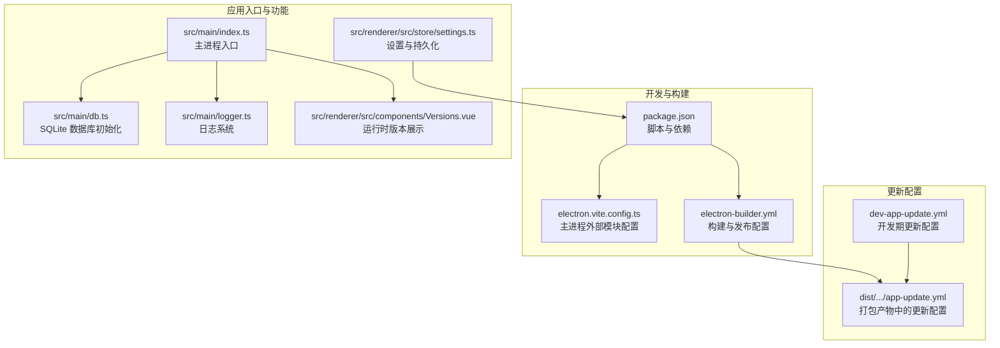
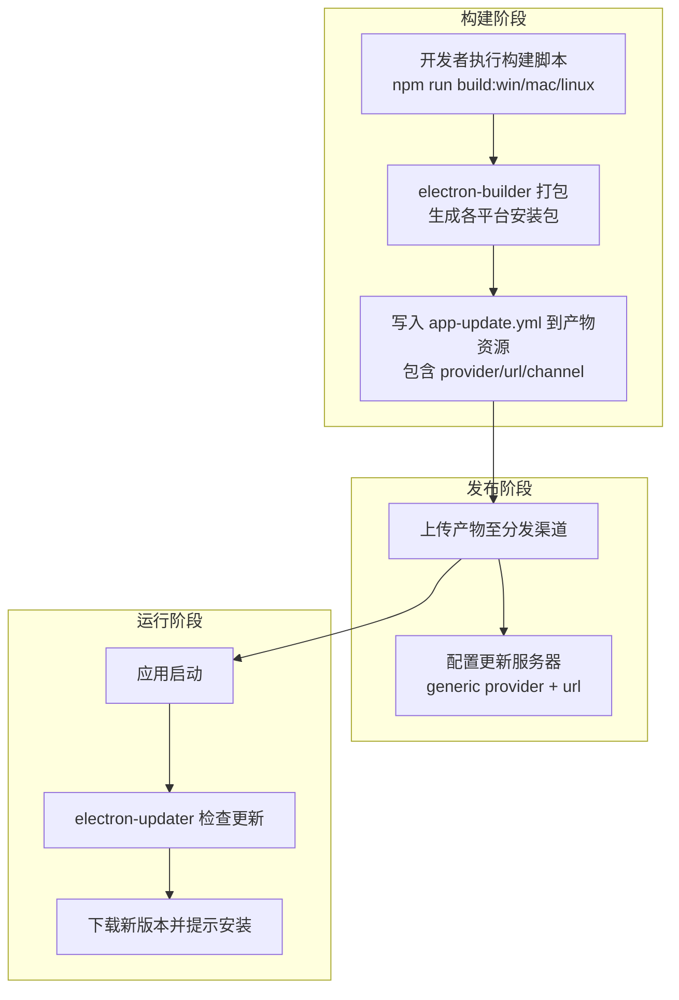
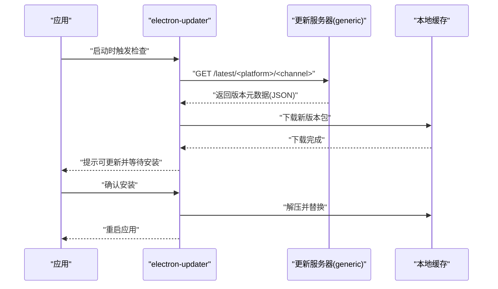
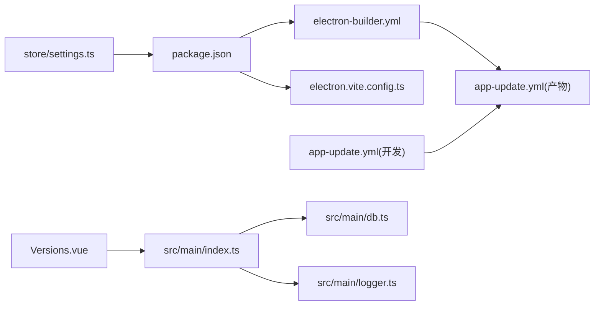

# 发布流程

<cite>
**本文引用的文件**
- [package.json](file://package.json)
- [electron-builder.yml](file://electron-builder.yml)
- [dev-app-update.yml](file://dev-app-update.yml)
- [electron.vite.config.ts](file://electron.vite.config.ts)
- [src/main/index.ts](file://src/main/index.ts)
- [src/main/db.ts](file://src/main/db.ts)
- [src/main/logger.ts](file://src/main/logger.ts)
- [src/renderer/src/components/Versions.vue](file://src/renderer/src/components/Versions.vue)
- [src/renderer/src/store/settings.ts](file://src/renderer/src/store/settings.ts)
- [dist/darwin/mac-arm64/myTool.app/Contents/Resources/app-update.yml](file://dist/darwin/mac-arm64/myTool.app/Contents/Resources/app-update.yml)
</cite>

## 目录

1. [简介](#简介)
2. [项目结构](#项目结构)
3. [核心组件](#核心组件)
4. [架构总览](#架构总览)
5. [详细组件分析](#详细组件分析)
6. [依赖分析](#依赖分析)
7. [性能考虑](#性能考虑)
8. [故障排查指南](#故障排查指南)
9. [结论](#结论)
10. [附录](#附录)

## 简介

本指南面向 MyTool 应用的发布与运维团队，提供一套标准化的发布流程，涵盖版本管理策略、发布前检查清单、质量保证流程、自动更新机制配置与实现（更新服务器、版本比较、增量更新）、发布标签与变更日志维护、发布通知流程、回滚与紧急修复策略、热修复发布指南、发布后监控与反馈收集，以及发布失败的应急处理与恢复策略。文档基于仓库现有配置与源码进行梳理，确保流程可落地、可追溯、可审计。

## 项目结构

MyTool 是一个基于 Electron + Vue + TypeScript 的桌面应用，使用 electron-vite 进行开发与打包，并通过 electron-builder 进行多平台产物构建与发布配置。自动更新能力由 electron-updater 提供，更新元信息通过 app-update.yml 配置。

**图表来源**

- [package.json:1-61](file://package.json#L1-L61)
- [electron.vite.config.ts:1-27](file://electron.vite.config.ts#L1-L27)
- [electron-builder.yml:1-60](file://electron-builder.yml#L1-L60)
- [src/main/index.ts:1-112](file://src/main/index.ts#L1-L112)
- [src/main/db.ts:1-100](file://src/main/db.ts#L1-L100)
- [src/main/logger.ts:1-42](file://src/main/logger.ts#L1-L42)
- [src/renderer/src/components/Versions.vue:1-14](file://src/renderer/src/components/Versions.vue#L1-L14)
- [src/renderer/src/store/settings.ts:1-34](file://src/renderer/src/store/settings.ts#L1-L34)
- [dev-app-update.yml:1-4](file://dev-app-update.yml#L1-L4)
- [dist/darwin/mac-arm64/myTool.app/Contents/Resources/app-update.yml:1-5](file://dist/darwin/mac-arm64/myTool.app/Contents/Resources/app-update.yml#L1-L5)

**章节来源**

- [package.json:1-61](file://package.json#L1-L61)
- [electron.vite.config.ts:1-27](file://electron.vite.config.ts#L1-L27)
- [electron-builder.yml:1-60](file://electron-builder.yml#L1-L60)

## 核心组件

- 版本与构建：通过 package.json 中的 version 字段与构建脚本控制版本与产物生成；electron-builder.yml 定义多平台目标与发布通道。
- 自动更新：electron-updater 作为更新引擎，配合 generic provider 与 app-update.yml 的 url/channel 配置实现远程更新。
- 主进程与数据库：主进程负责窗口创建、IPC 通信与日志；SQLite 数据库位于用户数据目录，用于本地数据持久化。
- 日志系统：集中化的日志输出与按日轮转，便于问题定位与发布后监控。
- 前端版本展示：渲染层展示 Electron/Chromium/Node 版本，辅助诊断环境差异。
- 设置与持久化：Pinia store 支持设置项持久化，保障用户配置在升级后可用。

**章节来源**

- [package.json:1-61](file://package.json#L1-L61)
- [electron-builder.yml:1-60](file://electron-builder.yml#L1-L60)
- [src/main/index.ts:1-112](file://src/main/index.ts#L1-L112)
- [src/main/db.ts:1-100](file://src/main/db.ts#L1-L100)
- [src/main/logger.ts:1-42](file://src/main/logger.ts#L1-L42)
- [src/renderer/src/components/Versions.vue:1-14](file://src/renderer/src/components/Versions.vue#L1-L14)
- [src/renderer/src/store/settings.ts:1-34](file://src/renderer/src/store/settings.ts#L1-L34)

## 架构总览

下图展示了从构建到发布的整体流程，以及自动更新在应用启动时的工作方式。

**图表来源**

- [package.json:16-21](file://package.json#L16-L21)
- [electron-builder.yml:54-57](file://electron-builder.yml#L54-L57)
- [dist/darwin/mac-arm64/myTool.app/Contents/Resources/app-update.yml:1-5](file://dist/darwin/mac-arm64/myTool.app/Contents/Resources/app-update.yml#L1-L5)

## 详细组件分析

### 版本管理策略

- 版本号来源：以 package.json 的 version 为准，所有构建脚本均基于此版本号生成产物命名与更新元数据。
- 多平台产物命名：electron-builder.yml 中定义了各平台产物命名模板，确保版本号贯穿安装包与更新通道。
- 渠道策略：当前配置为 latest 渠道，建议在正式发布时固定稳定通道，灰度发布使用 alpha/beta 等预发布通道。

**章节来源**

- [package.json:3-3](file://package.json#L3-L3)
- [electron-builder.yml:42-42](file://electron-builder.yml#L42-L42)
- [electron-builder.yml:56-57](file://electron-builder.yml#L56-L57)

### 发布前检查清单

- 代码质量
  - 通过类型检查与 ESLint/Prettier 规范校验，确保构建前无严重错误。
- 功能验证
  - 在 Windows/macOS/Linux 上分别进行功能回归测试，覆盖主窗口、数据库读写、日志输出等关键路径。
- 自动更新验证
  - 在测试环境中部署 generic provider 服务器，验证更新检查、下载与安装流程。
- 安装体验
  - 验证安装向导、桌面/开始菜单快捷方式、卸载流程与残留清理。
- 文档与合规
  - 确认 README 使用说明、变更日志与发布说明完整。

**章节来源**

- [package.json:11-13](file://package.json#L11-L13)
- [package.json:19-21](file://package.json#L19-L21)
- [electron-builder.yml:20-31](file://electron-builder.yml#L20-L31)
- [electron-builder.yml:43-47](file://electron-builder.yml#L43-L47)

### 质量保证流程

- 构建一致性：统一使用 electron-vite 与 electron-builder，避免本地环境差异导致的产物不一致。
- 日志与诊断：启用日志系统，按日轮转，便于问题复现与定位。
- 数据安全：数据库位于用户数据目录，升级不影响用户数据迁移策略需另行设计。

**章节来源**

- [src/main/logger.ts:1-42](file://src/main/logger.ts#L1-L42)
- [src/main/db.ts:1-100](file://src/main/db.ts#L1-L100)

### 自动更新机制配置与实现

- 更新引擎：electron-updater 作为核心更新器，支持通用 generic provider。
- 配置位置：
  - 开发期配置：dev-app-update.yml 指定 generic provider 与更新服务器地址。
  - 产物配置：打包后 app-update.yml 写入最终产物资源目录，包含 provider/url/channel/updaterCacheDirName。
- 更新流程（序列）：

**图表来源**

- [dev-app-update.yml:1-4](file://dev-app-update.yml#L1-L4)
- [dist/darwin/mac-arm64/myTool.app/Contents/Resources/app-update.yml:1-5](file://dist/darwin/mac-arm64/myTool.app/Contents/Resources/app-update.yml#L1-L5)
- [electron-builder.yml:54-57](file://electron-builder.yml#L54-L57)

**章节来源**

- [dev-app-update.yml:1-4](file://dev-app-update.yml#L1-L4)
- [dist/darwin/mac-arm64/myTool.app/Contents/Resources/app-update.yml:1-5](file://dist/darwin/mac-arm64/myTool.app/Contents/Resources/app-update.yml#L1-L5)
- [electron-builder.yml:54-57](file://electron-builder.yml#L54-L57)

### 版本比较与增量更新

- 版本比较：generic provider 通常依据远端 JSON 中的版本字段进行比较，遵循语义化版本规则。
- 增量更新：当前仓库未见显式配置差分更新或断点续传参数，建议在生产环境启用增量更新以降低带宽与时间成本。

**章节来源**

- [electron-builder.yml:54-57](file://electron-builder.yml#L54-L57)

### 发布标签管理与变更日志维护

- 标签规范：建议采用语义化版本标签（如 v1.0.0），并保持与 package.json.version 同步。
- 变更日志：建议在仓库中维护 CHANGELOG.md，记录每个版本的功能、修复与已知问题，便于发布说明与用户沟通。

**章节来源**

- [package.json:3-3](file://package.json#L3-L3)

### 发布通知流程

- 内部通知：发布完成后在团队通讯渠道同步版本信息、下载链接与注意事项。
- 用户通知：可在应用内或官网公告栏发布更新说明与下载链接。

**章节来源**

- [README.md:1-35](file://README.md#L1-L35)

### 回滚策略

- 快速回滚：若新版本出现严重问题，立即在更新服务器上将最新版本移除或降级，使客户端回退到上一稳定版本。
- 应用内回滚：可提供“回到上次版本”的选项（若实现），或引导用户手动下载历史版本安装包。

**章节来源**

- [electron-builder.yml:54-57](file://electron-builder.yml#L54-L57)

### 紧急修复与热修复发布

- 热修复流程：
  - 修复问题后，快速构建并上传新版本到 generic 服务器。
  - 通过调整服务器端版本元数据或通道策略，优先推送修复版本。
  - 监控安装率与错误率，确认修复生效后解除紧急状态。
- 通道隔离：紧急修复可使用独立通道（如 hotfix），待验证后再合并到稳定通道。

**章节来源**

- [dev-app-update.yml:1-4](file://dev-app-update.yml#L1-L4)
- [dist/darwin/mac-arm64/myTool.app/Contents/Resources/app-update.yml:1-5](file://dist/darwin/mac-arm64/myTool.app/Contents/Resources/app-update.yml#L1-L5)

### 发布后监控与反馈收集

- 日志监控：集中收集应用日志，关注启动失败、数据库异常、更新失败等关键指标。
- 用户反馈：在应用内提供反馈入口，收集崩溃报告与使用建议。
- 性能与稳定性：持续观察安装成功率、首次启动耗时、数据库连接成功率等。

**章节来源**

- [src/main/logger.ts:1-42](file://src/main/logger.ts#L1-L42)
- [src/main/index.ts:1-112](file://src/main/index.ts#L1-L112)

### 发布失败的应急处理与恢复

- 失败分类：
  - 构建失败：检查构建脚本与依赖版本，必要时回滚到上一稳定构建。
  - 产物异常：停止分发，回滚到上一稳定版本，修复后再发布。
  - 更新失败：临时关闭更新或回退到旧版更新服务器，排查网络与权限问题。
- 恢复策略：
  - 立即回滚到上一稳定版本。
  - 修复问题后，重新构建并通过测试验证。
  - 通过内部渠道发布补丁版本，随后在通用渠道发布。

**章节来源**

- [package.json:16-21](file://package.json#L16-L21)
- [electron-builder.yml:54-57](file://electron-builder.yml#L54-L57)

## 依赖分析

- 主要依赖关系：
  - package.json 定义构建脚本与运行时依赖（electron-updater、electron-log、sqlite3 等）。
  - electron-builder.yml 定义构建目标、产物输出、发布通道与更新配置。
  - electron.vite.config.ts 对主进程外部模块（sqlite3）进行排除，避免打包错误。
  - 主进程入口与数据库初始化、日志系统共同构成应用运行基础。
  - app-update.yml（开发与产物）决定更新服务器与通道。

**图表来源**

- [package.json:1-61](file://package.json#L1-L61)
- [electron-builder.yml:1-60](file://electron-builder.yml#L1-L60)
- [electron.vite.config.ts:1-27](file://electron.vite.config.ts#L1-L27)
- [src/main/index.ts:1-112](file://src/main/index.ts#L1-L112)
- [src/main/db.ts:1-100](file://src/main/db.ts#L1-L100)
- [src/main/logger.ts:1-42](file://src/main/logger.ts#L1-L42)
- [src/renderer/src/components/Versions.vue:1-14](file://src/renderer/src/components/Versions.vue#L1-L14)
- [src/renderer/src/store/settings.ts:1-34](file://src/renderer/src/store/settings.ts#L1-L34)
- [dev-app-update.yml:1-4](file://dev-app-update.yml#L1-L4)
- [dist/darwin/mac-arm64/myTool.app/Contents/Resources/app-update.yml:1-5](file://dist/darwin/mac-arm64/myTool.app/Contents/Resources/app-update.yml#L1-L5)

**章节来源**

- [package.json:1-61](file://package.json#L1-L61)
- [electron-builder.yml:1-60](file://electron-builder.yml#L1-L60)
- [electron.vite.config.ts:1-27](file://electron.vite.config.ts#L1-L27)

## 性能考虑

- 构建性能：合理配置 asar 与 asarUnpack，减少不必要的资源打包，平衡安全性与加载速度。
- 更新性能：在 generic 服务器端启用压缩与缓存，优化下载速度与成功率。
- 日志性能：按日轮转与限制日志级别，避免磁盘占用过高。

**章节来源**

- [electron-builder.yml:3-7](file://electron-builder.yml#L3-L7)
- [electron-builder.yml:18-19](file://electron-builder.yml#L18-L19)
- [src/main/logger.ts:1-42](file://src/main/logger.ts#L1-L42)

## 故障排查指南

- 应用无法启动或崩溃
  - 检查日志文件路径与权限，确认日志目录可写。
  - 关注主进程初始化与数据库加载过程中的错误信息。
- 更新失败
  - 核对 app-update.yml 中的 url 与 channel 是否正确。
  - 检查网络访问与代理设置，确认 generic 服务器可达。
- 安装失败
  - 检查平台目标与签名配置（macOS entitlements 与 notarize 状态）。
  - 确认安装目录权限与磁盘空间充足。

**章节来源**

- [src/main/logger.ts:1-42](file://src/main/logger.ts#L1-L42)
- [src/main/index.ts:75-92](file://src/main/index.ts#L75-L92)
- [dist/darwin/mac-arm64/myTool.app/Contents/Resources/app-update.yml:1-5](file://dist/darwin/mac-arm64/myTool.app/Contents/Resources/app-update.yml#L1-L5)
- [electron-builder.yml:31-40](file://electron-builder.yml#L31-L40)

## 结论

本指南基于仓库现有配置与源码，建立了从版本管理、构建打包、自动更新到发布后监控与应急处理的完整流程。建议在实际落地中补充变更日志与发布说明模板、完善灰度与回滚策略，并在生产环境启用增量更新与更严格的日志与监控体系，以确保发布质量与用户体验。

## 附录

- 构建命令参考
  - Windows：npm run build:win
  - macOS：npm run build:mac
  - Linux：npm run build:linux
- 运行时版本展示：渲染层组件展示 Electron/Chromium/Node 版本，便于诊断环境差异。

**章节来源**

- [package.json:19-21](file://package.json#L19-L21)
- [src/renderer/src/components/Versions.vue:1-14](file://src/renderer/src/components/Versions.vue#L1-L14)
