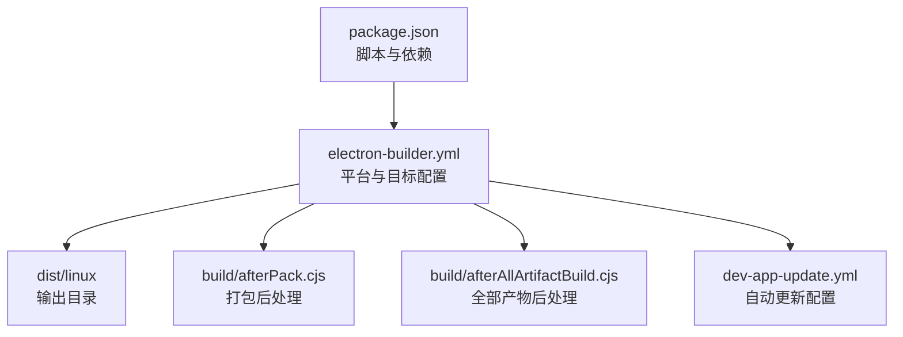
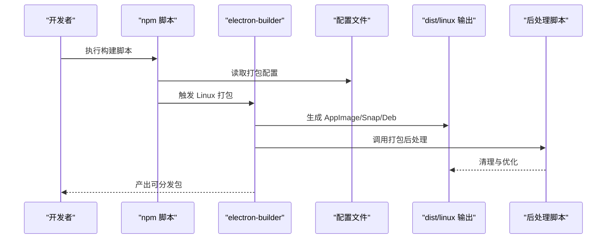
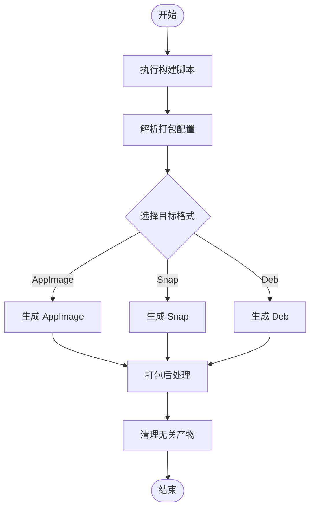
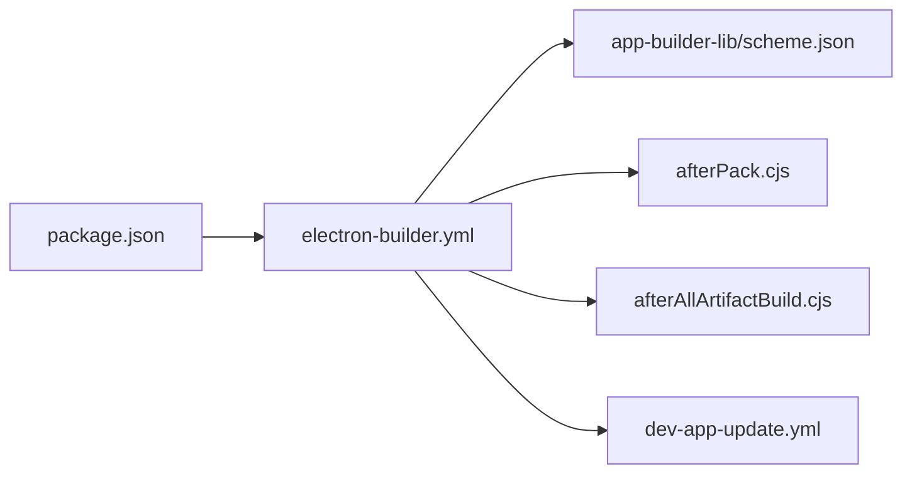

# Linux 平台打包

<cite>
**本文引用的文件**
- [electron-builder.yml](file://electron-builder.yml)
- [package.json](file://package.json)
- [dev-app-update.yml](file://dev-app-update.yml)
- [README.md](file://README.md)
- [scheme.json](file://node_modules/app-builder-lib/scheme.json)
- [afterPack.cjs](file://build/afterPack.cjs)
- [afterAllArtifactBuild.cjs](file://build/afterAllArtifactBuild.cjs)
</cite>

## 目录

1. [简介](#简介)
2. [项目结构](#项目结构)
3. [核心组件](#核心组件)
4. [架构总览](#架构总览)
5. [详细组件分析](#详细组件分析)
6. [依赖关系分析](#依赖关系分析)
7. [性能考虑](#性能考虑)
8. [故障排查指南](#故障排查指南)
9. [结论](#结论)
10. [附录](#附录)

## 简介

本指南面向 MyTool 在 Linux 平台的打包与发布，覆盖以下内容：

- Linux 支持的三种打包格式：AppImage、Snap、Deb 的配置与特性
- 每种格式的适用场景与安装方式
- Linux 打包配置项（维护者信息、分类等）
- 针对不同发行版的优化建议
- 构建命令、流程与分发策略

## 项目结构

MyTool 使用 electron-builder 进行多平台打包，Linux 相关配置集中在主配置文件中，并通过脚本完成构建与产物清理。

图表来源

- [package.json:1-61](file://package.json#L1-L61)
- [electron-builder.yml:1-60](file://electron-builder.yml#L1-L60)
- [afterPack.cjs:1-57](file://build/afterPack.cjs#L1-L57)
- [afterAllArtifactBuild.cjs:1-29](file://build/afterAllArtifactBuild.cjs#L1-L29)
- [dev-app-update.yml:1-4](file://dev-app-update.yml#L1-L4)

章节来源

- [package.json:1-61](file://package.json#L1-L61)
- [electron-builder.yml:1-60](file://electron-builder.yml#L1-L60)

## 核心组件

- 主配置文件：定义应用元数据、打包目标、维护者信息、分类、自动更新发布配置等
- 构建脚本：提供跨平台构建入口，Linux 专用构建命令
- 自动更新配置：通用服务器发布配置
- 打包后处理脚本：清理多余资源，优化产物体积

章节来源

- [electron-builder.yml:1-60](file://electron-builder.yml#L1-L60)
- [package.json:8-22](file://package.json#L8-L22)
- [dev-app-update.yml:1-4](file://dev-app-update.yml#L1-L4)
- [afterPack.cjs:12-56](file://build/afterPack.cjs#L12-L56)
- [afterAllArtifactBuild.cjs:12-28](file://build/afterAllArtifactBuild.cjs#L12-L28)

## 架构总览

Linux 打包的整体流程如下：

图表来源

- [package.json:8-22](file://package.json#L8-L22)
- [electron-builder.yml:43-59](file://electron-builder.yml#L43-L59)
- [afterPack.cjs:12-56](file://build/afterPack.cjs#L12-L56)
- [afterAllArtifactBuild.cjs:12-28](file://build/afterAllArtifactBuild.cjs#L12-L28)

## 详细组件分析

### Linux 打包目标与配置

- 目标格式：AppImage、Snap、Deb
- 维护者信息：使用统一维护者字段
- 应用分类：设置为通用工具类别
- 产物命名：使用模板化命名规则
- 自动更新：通用服务器发布配置

章节来源

- [electron-builder.yml:43-59](file://electron-builder.yml#L43-L59)

### AppImage 特性与适用场景

- 特性
  - 单文件可执行，便于分发与携带
  - 无需系统级安装，用户可直接运行
  - 依赖随包打包，兼容性较好
- 适用场景
  - 个人工具、开发辅助、便携式应用
  - 对安装便捷性要求高、不希望写入系统路径的场景
- 安装与运行
  - 下载后赋予可执行权限即可运行
  - 可放置于任意目录，适合桌面环境直接启动

章节来源

- [electron-builder.yml:50-51](file://electron-builder.yml#L50-L51)

### Snap 特性与适用场景

- 特性
  - 基于 Snap 生态，具备沙箱隔离与自动更新能力
  - 通过 Snap Store 或 Snap 公共通道分发
  - 依赖通过 Snap 生态管理，减少运行时冲突
- 适用场景
  - 需要强隔离与自动更新的应用
  - 面向 Ubuntu/Debian 用户或使用 Snap 的发行版
- 安装与运行
  - 通过 snap 命令安装，或从 Snap Store 获取
  - 可启用 classic 边缘模式（如需）以满足特殊依赖

章节来源

- [electron-builder.yml:44-47](file://electron-builder.yml#L44-L47)
- [scheme.json:2040-2043](file://node_modules/app-builder-lib/scheme.json#L2040-L2043)

### Deb 包特性与适用场景

- 特性
  - 符合 Debian/Ubuntu 软件包规范，系统级安装
  - 通过 apt/yum 等包管理器安装与卸载
  - 可配置依赖、描述、图标等元数据
- 适用场景
  - 需要系统集成、与发行版生态融合的应用
  - 企业内网或发行版仓库托管
- 安装与运行
  - 使用 dpkg/apt 安装；或双击安装器
  - 会写入系统路径，便于桌面菜单与命令行访问

章节来源

- [electron-builder.yml:44-49](file://electron-builder.yml#L44-L49)
- [scheme.json:2115-2175](file://node_modules/app-builder-lib/scheme.json#L2115-L2175)

### 维护者信息与分类设置

- 维护者（maintainer）
  - 用于 Deb/Snap 等包管理器显示与联系信息
- 分类（category）
  - 用于桌面菜单与应用商店归类，建议遵循 Freedesktop 分类标准
- 产物命名（artifactName）
  - 可自定义文件名模板，便于版本化与识别

章节来源

- [electron-builder.yml:48-51](file://electron-builder.yml#L48-L51)
- [scheme.json:2076-2082](file://node_modules/app-builder-lib/scheme.json#L2076-L2082)

### 针对不同发行版的优化配置

- Debian/Ubuntu
  - 优先使用 Deb 包；可配置依赖列表与描述
  - 若需要系统级集成，建议提供 desktop 文件与图标
- Fedora/RHEL
  - Deb 包可在部分环境中使用；也可考虑 RPM（不在当前配置中）
- Arch/Manjaro
  - 可提供 Snap 或 AppImage；必要时提供 PKGBUILD（不在当前配置中）
- 通用建议
  - 提供 AppImage 作为“无安装”方案
  - 为 Deb/Snap 提供 desktop 文件与图标，提升用户体验

章节来源

- [electron-builder.yml:44-49](file://electron-builder.yml#L44-L49)
- [scheme.json:2122-2124](file://node_modules/app-builder-lib/scheme.json#L2122-L2124)

### 构建命令与流程

- 构建命令
  - Linux：通过 npm 脚本触发 electron-builder，指定 Linux 平台
- 流程
  - 代码构建 → electron-builder 解析配置 → 生成多目标产物 → 后处理脚本优化 → 产出可分发包

图表来源

- [package.json:21](file://package.json#L21)
- [electron-builder.yml:43-59](file://electron-builder.yml#L43-L59)
- [afterAllArtifactBuild.cjs:12-28](file://build/afterAllArtifactBuild.cjs#L12-L28)

章节来源

- [package.json:8-22](file://package.json#L8-L22)
- [README.md:32-34](file://README.md#L32-L34)

### 自动更新与分发策略

- 自动更新
  - 通用服务器发布配置，适用于 Linux 平台
- 分发策略
  - AppImage：直接提供下载链接，适合快速分发
  - Snap：通过 Snap Store 或公共通道分发，便于自动更新
  - Deb：上传至发行版仓库或提供下载页面，结合 apt/yum 使用

章节来源

- [dev-app-update.yml:1-4](file://dev-app-update.yml#L1-L4)
- [electron-builder.yml:54-57](file://electron-builder.yml#L54-L57)

## 依赖关系分析

- 配置依赖
  - electron-builder.yml 决定 Linux 目标与元数据
  - package.json 提供构建入口与脚本
  - 后处理脚本在打包完成后清理与优化
- 外部依赖
  - app-builder-lib scheme.json 描述了 Linux 目标与选项的规范

图表来源

- [package.json:1-61](file://package.json#L1-L61)
- [electron-builder.yml:1-60](file://electron-builder.yml#L1-L60)
- [scheme.json:2040-2043](file://node_modules/app-builder-lib/scheme.json#L2040-L2043)
- [afterPack.cjs:1-57](file://build/afterPack.cjs#L1-L57)
- [afterAllArtifactBuild.cjs:1-29](file://build/afterAllArtifactBuild.cjs#L1-L29)
- [dev-app-update.yml:1-4](file://dev-app-update.yml#L1-L4)

章节来源

- [package.json:1-61](file://package.json#L1-L61)
- [electron-builder.yml:1-60](file://electron-builder.yml#L1-L60)
- [scheme.json:2040-2043](file://node_modules/app-builder-lib/scheme.json#L2040-L2043)

## 性能考虑

- 产物体积
  - 后处理脚本可移除不必要的资源，降低体积
- 构建时间
  - 合理配置打包过滤规则，避免冗余文件进入产物
- 运行性能
  - AppImage 将依赖随包打包，减少运行时查找成本
  - Deb/Snap 通过系统包管理器提供缓存与共享库，提高加载效率

章节来源

- [afterPack.cjs:12-56](file://build/afterPack.cjs#L12-L56)
- [electron-builder.yml:8-19](file://electron-builder.yml#L8-L19)

## 故障排查指南

- 构建失败
  - 检查打包配置是否正确，尤其是目标格式与输出目录
  - 确认依赖安装完整，必要时重新安装
- 产物异常
  - 查看后处理脚本是否按预期清理
  - 确认自动更新配置指向有效地址
- 运行问题
  - AppImage：确认可执行权限与依赖可用
  - Deb/Snap：检查系统依赖与桌面集成是否正常

章节来源

- [electron-builder.yml:43-59](file://electron-builder.yml#L43-L59)
- [afterAllArtifactBuild.cjs:12-28](file://build/afterAllArtifactBuild.cjs#L12-L28)
- [dev-app-update.yml:1-4](file://dev-app-update.yml#L1-L4)

## 结论

- MyTool 已在 electron-builder 中配置了 Linux 的 AppImage、Snap、Deb 三类目标
- 通过维护者信息与分类设置，可提升应用在各发行版中的可见性与可发现性
- 建议结合自动更新与多种分发渠道，覆盖不同用户群体与使用场景

## 附录

- 关键配置参考
  - Linux 目标与元数据：[electron-builder.yml:43-59](file://electron-builder.yml#L43-L59)
  - 构建脚本入口：[package.json:8-22](file://package.json#L8-L22)
  - 自动更新配置：[dev-app-update.yml:1-4](file://dev-app-update.yml#L1-L4)
  - 后处理脚本：[afterPack.cjs:12-56](file://build/afterPack.cjs#L12-L56)，[afterAllArtifactBuild.cjs:12-28](file://build/afterAllArtifactBuild.cjs#L12-L28)
  - 目标与选项规范：[scheme.json:2040-2043](file://node_modules/app-builder-lib/scheme.json#L2040-L2043)，[scheme.json:2115-2175](file://node_modules/app-builder-lib/scheme.json#L2115-L2175)，[scheme.json:1135-1334](file://node_modules/app-builder-lib/scheme.json#L1135-L1334)
