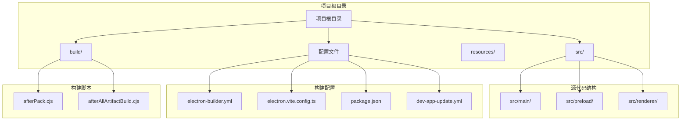
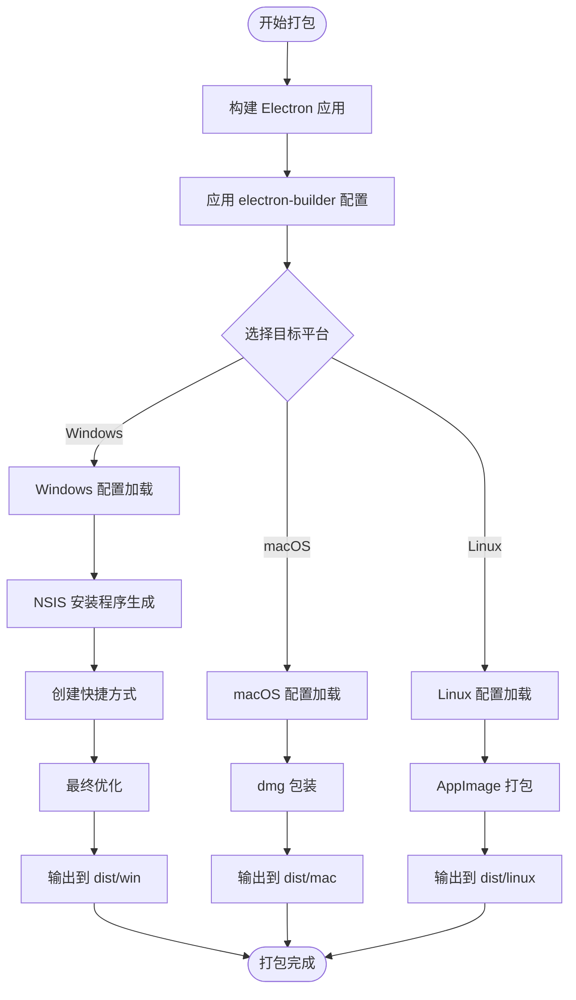
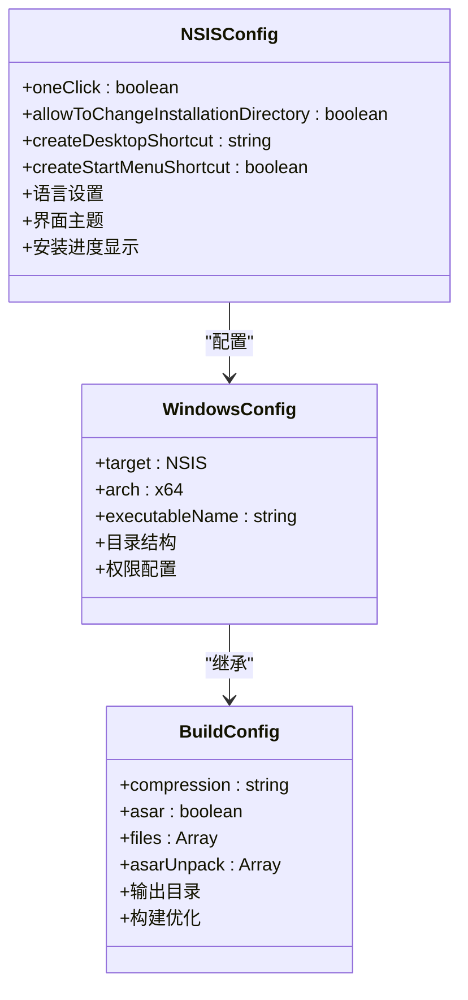
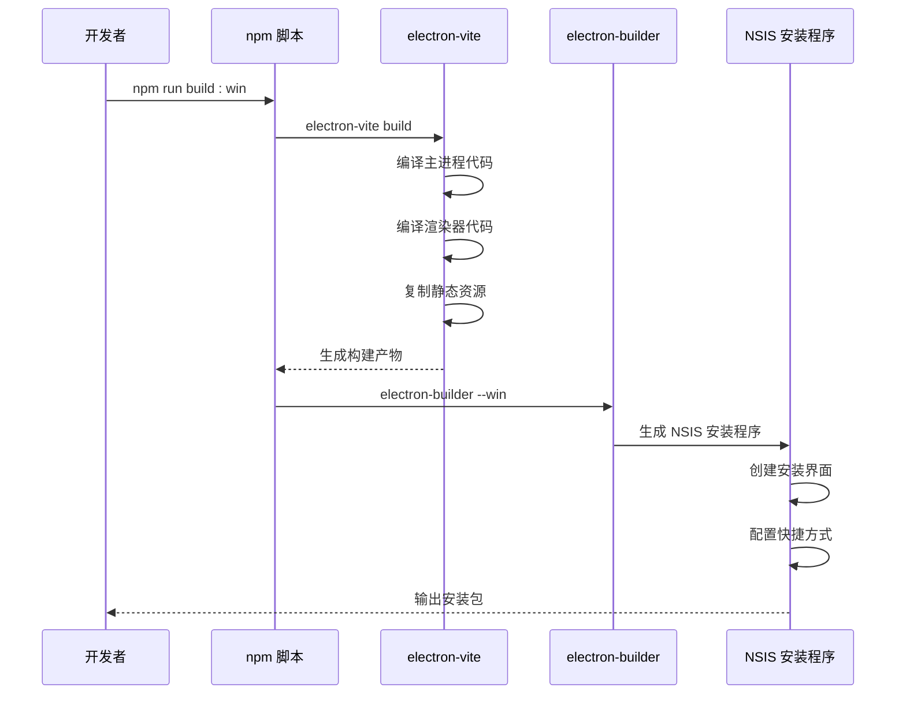
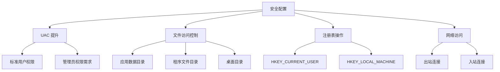
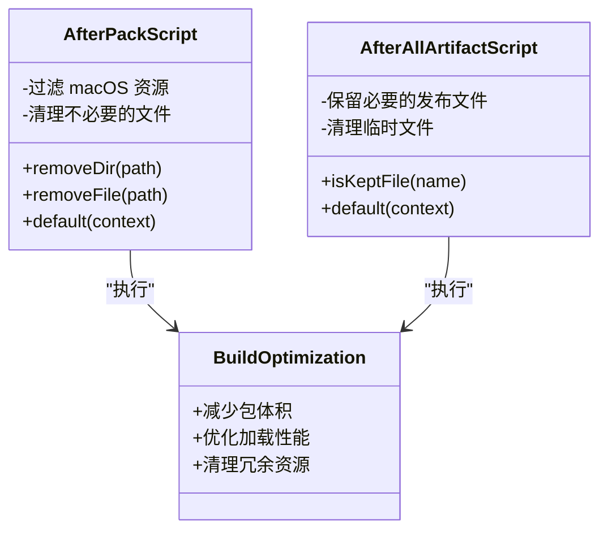

# Windows 平台打包

<cite>
**本文档引用的文件**
- [electron-builder.yml](file://electron-builder.yml)
- [package.json](file://package.json)
- [README.md](file://README.md)
- [dev-app-update.yml](file://dev-app-update.yml)
- [build/afterPack.cjs](file://build/afterPack.cjs)
- [build/afterAllArtifactBuild.cjs](file://build/afterAllArtifactBuild.cjs)
- [electron.vite.config.ts](file://electron.vite.config.ts)
</cite>

## 目录

1. [简介](#简介)
2. [项目结构](#项目结构)
3. [核心组件](#核心组件)
4. [架构概览](#架构概览)
5. [详细组件分析](#详细组件分析)
6. [依赖关系分析](#依赖关系分析)
7. [性能考虑](#性能考虑)
8. [故障排除指南](#故障排除指南)
9. [结论](#结论)

## 简介

本文档为 MyTool 项目的 Windows 平台打包提供了详细的指导文档。MyTool 是一个基于 Electron、Vue 和 TypeScript 构建的应用程序，使用 electron-builder 进行跨平台打包，并通过 NSIS（Nullsoft Scriptable Install System）创建 Windows 安装程序。

该文档重点说明了 Windows 特有的配置参数，包括：

- NSIS 安装程序的配置选项
- 安装目录设置
- 桌面快捷方式创建
- 开始菜单快捷方式配置
- Windows 特有的配置参数如 executableName、oneClick 安装模式、安装目录变更允许等
- Windows 平台的打包命令和构建流程
- Windows 平台的权限配置和安全考虑事项

## 项目结构

MyTool 项目采用标准的 Electron 应用程序结构，主要包含以下关键目录和文件：



**图表来源**

- [electron-builder.yml:1-60](file://electron-builder.yml#L1-L60)
- [package.json:1-61](file://package.json#L1-L61)
- [electron.vite.config.ts:1-27](file://electron.vite.config.ts#L1-L27)

**章节来源**

- [electron-builder.yml:1-60](file://electron-builder.yml#L1-L60)
- [package.json:1-61](file://package.json#L1-L61)
- [README.md:1-35](file://README.md#L1-L35)

## 核心组件

### 打包配置核心组件

MyTool 的 Windows 打包主要依赖于以下几个核心组件：

#### 1. electron-builder 配置系统

electron-builder.yml 文件定义了完整的打包配置，包括目标平台、输出目录、压缩设置等。

#### 2. 脚本化构建流程

package.json 中的 npm scripts 提供了简化的构建命令，支持多平台一键构建。

#### 3. 自动更新机制

dev-app-update.yml 配置了应用的自动更新功能，支持 Windows 平台的更新检查。

#### 4. 构建后处理脚本

自定义的 CJS 脚本用于优化打包结果和清理不必要的文件。

**章节来源**

- [electron-builder.yml:1-60](file://electron-builder.yml#L1-L60)
- [package.json:8-22](file://package.json#L8-L22)
- [dev-app-update.yml:1-4](file://dev-app-update.yml#L1-L4)

## 架构概览

MyTool 的 Windows 打包架构采用了模块化设计，各组件协同工作以生成最终的安装包：



**图表来源**

- [electron-builder.yml:20-30](file://electron-builder.yml#L20-L30)
- [package.json:18-21](file://package.json#L18-L21)

## 详细组件分析

### Windows 打包配置详解

#### NSIS 安装程序配置

NSIS（Nullsoft Scriptable Install System）是 Windows 平台上最常用的开源安装程序制作工具。在 MyTool 中，NSIS 配置位于 electron-builder.yml 文件中：



**图表来源**

- [electron-builder.yml:20-30](file://electron-builder.yml#L20-L30)
- [electron-builder.yml:25](file://electron-builder.yml#L25)

#### 关键配置参数说明

##### 1. 安装目录设置

- **路径**: `win.executableName: myTool`
- **作用**: 设置可执行文件的名称，影响安装后的程序图标和任务栏显示
- **影响**: 影响用户在开始菜单和桌面快捷方式中的显示名称

##### 2. NSIS 一键安装模式

- **路径**: `nsis.oneClick: false`
- **含义**: 禁用一键安装模式，要求用户确认安装过程
- **优势**: 提供更透明的安装体验，用户可以查看安装进度和选择安装选项

##### 3. 安装目录变更允许

- **路径**: `nsis.allowToChangeInstallationDirectory: true`
- **含义**: 允许用户更改默认的安装目录
- **用途**: 支持用户将应用程序安装到非默认位置（如 SSD 或其他磁盘）

##### 4. 桌面快捷方式创建

- **路径**: `nsis.createDesktopShortcut: always`
- **含义**: 始终创建桌面快捷方式
- **行为**: 不管用户选择什么选项，都会在桌面上创建快捷方式

##### 5. 开始菜单快捷方式配置

- **路径**: `nsis.createStartMenuShortcut: true`
- **含义**: 创建开始菜单快捷方式
- **位置**: 在 Windows 开始菜单中添加应用程序入口

**章节来源**

- [electron-builder.yml:25-30](file://electron-builder.yml#L25-L30)

### 构建流程详解

#### Windows 构建命令

MyTool 提供了简化的构建命令来处理 Windows 平台：



**图表来源**

- [package.json:19](file://package.json#L19)
- [README.md:26-27](file://README.md#L26-L27)

#### 构建步骤分解

1. **类型检查**: `npm run typecheck`
   - 检查 TypeScript 类型定义
   - 确保代码质量

2. **开发环境预览**: `electron-vite preview`
   - 启动开发服务器
   - 实时热重载

3. **开发模式启动**: `electron-vite dev`
   - 启动 Electron 应用
   - 支持调试模式

4. **生产构建**: `electron-vite build`
   - 编译所有源代码
   - 生成生产环境产物

5. **Windows 专用构建**: `electron-builder --win`
   - 仅针对 Windows 平台
   - 生成 NSIS 安装程序

**章节来源**

- [package.json:8-22](file://package.json#L8-L22)
- [README.md:23-34](file://README.md#L23-L34)

### 权限配置和安全考虑

#### Windows 权限配置

MyTool 的 Windows 打包配置考虑了以下安全和权限方面：



**图表来源**

- [electron-builder.yml:1-60](file://electron-builder.yml#L1-L60)

#### 安全最佳实践

1. **最小权限原则**: 应用程序应以最低必要权限运行
2. **数字签名**: 生产环境建议对安装程序进行数字签名
3. **沙盒隔离**: 考虑启用 Windows Defender Application Control
4. **更新安全**: 使用 HTTPS 协议进行自动更新
5. **文件完整性**: 验证下载文件的完整性

**章节来源**

- [dev-app-update.yml:1-4](file://dev-app-update.yml#L1-L4)

### 构建后处理机制

#### 自定义构建脚本

MyTool 使用自定义的 CJS 脚本来优化打包结果：



**图表来源**

- [build/afterPack.cjs:12-56](file://build/afterPack.cjs#L12-L56)
- [build/afterAllArtifactBuild.cjs:12-28](file://build/afterAllArtifactBuild.cjs#L12-L28)

**章节来源**

- [build/afterPack.cjs:1-57](file://build/afterPack.cjs#L1-L57)
- [build/afterAllArtifactBuild.cjs:1-29](file://build/afterAllArtifactBuild.cjs#L1-L29)

## 依赖关系分析

### 核心依赖关系

MyTool 的 Windows 打包依赖关系如下：

```mermaid
graph TB
subgraph "核心依赖"
Electron[electron@^39.2.6]
Builder[electron-builder@^26.0.12]
Vite[electron-vite@^5.0.0]
end
subgraph "应用依赖"
Vue[Vue 3.x]
TypeScript[TypeScript]
Pinia[状态管理]
ElementPlus[UI 组件库]
end
subgraph "构建工具"
NSIS[NSIS 安装程序]
ASAR[ASAR 打包]
Compression[压缩算法]
end
subgraph "开发工具"
ESLint[代码检查]
Prettier[代码格式化]
TSConfig[类型配置]
end
Electron --> Builder
Builder --> NSIS
Builder --> ASAR
Builder --> Compression
Vite --> Vue
Vite --> TypeScript
Vite --> Pinia
Builder --> ESLint
Builder --> Prettier
Builder --> TSConfig
```

**图表来源**

- [package.json:23-59](file://package.json#L23-L59)

### 版本兼容性

- **Node.js**: 支持版本 10.0.0 及以上
- **Electron**: 版本 39.2.6
- **electron-builder**: 版本 26.0.12
- **TypeScript**: 最新稳定版本
- **Vue**: 3.x 版本

**章节来源**

- [package.json:23-59](file://package.json#L23-L59)

## 性能考虑

### 构建性能优化

MyTool 在打包过程中采用了多种性能优化策略：

1. **增量构建**: 使用 electron-vite 提供的快速构建能力
2. **并行处理**: 多个构建任务并行执行
3. **资源优化**: ASAR 打包减少文件数量
4. **压缩策略**: 使用 maximum 压缩级别优化包体大小

### 运行时性能

- **内存管理**: Electron 应用的内存使用优化
- **启动时间**: 通过预加载机制减少启动延迟
- **渲染性能**: Vue 3 的响应式系统优化

## 故障排除指南

### 常见问题及解决方案

#### 1. 打包失败问题

**症状**: electron-builder 执行时报错
**可能原因**:

- Node.js 版本不兼容
- 缺少必要的构建工具
- 权限不足

**解决方法**:

- 确认 Node.js 版本符合要求
- 安装 Visual Studio Build Tools
- 以管理员权限运行命令

#### 2. NSIS 安装程序问题

**症状**: 安装程序无法正常创建快捷方式
**可能原因**:

- 用户权限限制
- 杀毒软件拦截
- 磁盘空间不足

**解决方法**:

- 检查用户账户控制设置
- 将安装程序添加到杀毒软件白名单
- 确保有足够的磁盘空间

#### 3. 自动更新问题

**症状**: 应用无法检测到更新
**可能原因**:

- 更新服务器配置错误
- 网络连接问题
- 证书验证失败

**解决方法**:

- 检查 dev-app-update.yml 配置
- 验证网络连接和代理设置
- 确认 SSL 证书有效性

**章节来源**

- [dev-app-update.yml:1-4](file://dev-app-update.yml#L1-L4)

### 调试技巧

1. **启用详细日志**: 使用 `--verbose` 参数获取详细输出
2. **检查构建缓存**: 清理 `node_modules/.cache` 目录
3. **验证配置文件**: 使用 YAML 验证器检查配置语法
4. **测试不同环境**: 在干净的 Windows 系统上测试安装

## 结论

MyTool 的 Windows 平台打包方案提供了完整且灵活的解决方案。通过精心配置的 electron-builder 设置，结合 NSIS 安装程序的强大功能，实现了：

1. **用户友好的安装体验**: 通过 oneClick: false 提供透明的安装过程
2. **灵活的安装选项**: 允许用户自定义安装目录
3. **便捷的访问方式**: 自动生成桌面和开始菜单快捷方式
4. **安全可靠的分发**: 支持自动更新和数字签名

该打包方案不仅满足了基本的 Windows 平台需求，还为未来的扩展和定制提供了良好的基础。开发者可以根据具体需求调整配置参数，以适应不同的部署场景和用户要求。

建议在生产环境中进一步完善的方面：

- 添加数字签名支持
- 配置更严格的权限控制
- 实现更精细的自动更新策略
- 增强错误报告和诊断功能
