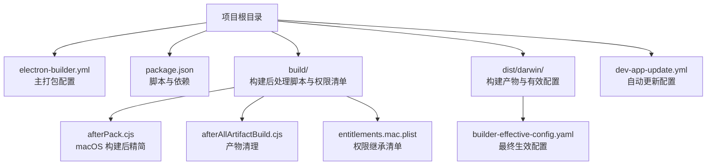
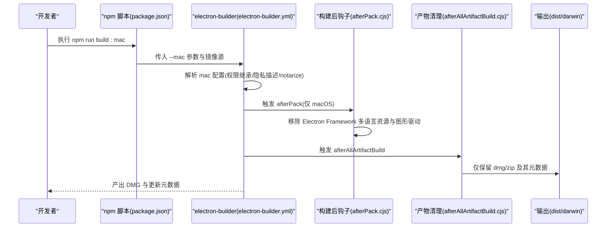
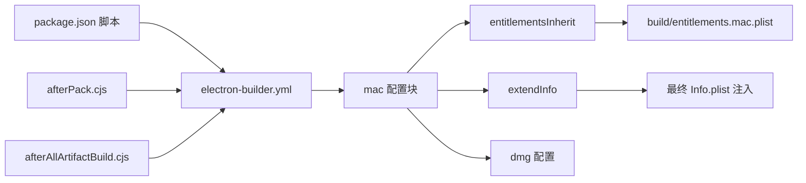

# macOS 平台打包

<cite>
**本文引用的文件**
- [electron-builder.yml](file://electron-builder.yml)
- [package.json](file://package.json)
- [README.md](file://README.md)
- [build/afterPack.cjs](file://build/afterPack.cjs)
- [build/afterAllArtifactBuild.cjs](file://build/afterAllArtifactBuild.cjs)
- [build/entitlements.mac.plist](file://build/entitlements.mac.plist)
- [dist/darwin/builder-effective-config.yaml](file://dist/darwin/builder-effective-config.yaml)
- [dev-app-update.yml](file://dev-app-update.yml)
</cite>

## 目录

1. [简介](#简介)
2. [项目结构](#项目结构)
3. [核心组件](#核心组件)
4. [架构总览](#架构总览)
5. [详细组件分析](#详细组件分析)
6. [依赖关系分析](#依赖关系分析)
7. [性能考虑](#性能考虑)
8. [故障排查指南](#故障排查指南)
9. [结论](#结论)
10. [附录](#附录)

## 简介

本指南面向 MyTool 在 macOS 平台的打包与分发，重点覆盖以下内容：

- DMG 打包配置与产物命名规则
- entitlementsInherit 权限继承设置与自定义权限清单
- extendInfo 中隐私权限描述（相机、麦克风、文档文件夹、下载文件夹）的配置与生效路径
- notarize 验证开关与签名流程说明
- macOS 平台的打包命令与构建要求
- 平台特定配置文件与权限设置的处理方式
- 发布与分发注意事项

## 项目结构

MyTool 使用 electron-builder 进行多平台打包，macOS 相关配置集中在主配置文件中，并通过脚本与构建钩子进行后处理优化。

图表来源

- [electron-builder.yml:1-60](file://electron-builder.yml#L1-L60)
- [package.json:1-61](file://package.json#L1-L61)
- [build/afterPack.cjs:1-57](file://build/afterPack.cjs#L1-L57)
- [build/afterAllArtifactBuild.cjs:1-29](file://build/afterAllArtifactBuild.cjs#L1-L29)
- [build/entitlements.mac.plist:1-13](file://build/entitlements.mac.plist#L1-L13)
- [dist/darwin/builder-effective-config.yaml:1-62](file://dist/darwin/builder-effective-config.yaml#L1-L62)
- [dev-app-update.yml:1-4](file://dev-app-update.yml#L1-L4)

章节来源

- [electron-builder.yml:1-60](file://electron-builder.yml#L1-L60)
- [package.json:1-61](file://package.json#L1-L61)
- [README.md:1-35](file://README.md#L1-L35)

## 核心组件

- 主打包配置：集中定义应用元数据、目标平台、DMG 产物命名、权限继承、隐私权限描述、notarize 开关等。
- 构建脚本：提供跨平台构建入口，macOS 专用镜像源加速下载二进制依赖。
- 权限清单：定义 macOS 应用运行所需的沙箱权限，作为 entitlementsInherit 的来源。
- 构建后处理：在 macOS 平台上对 Electron Framework 资源进行精简，移除不必要的语言包与图形驱动文件；在所有平台构建完成后仅保留必要产物。
- 自动更新配置：指定通用发布渠道与更新缓存目录名。

章节来源

- [electron-builder.yml:1-60](file://electron-builder.yml#L1-L60)
- [package.json:1-61](file://package.json#L1-L61)
- [build/entitlements.mac.plist:1-13](file://build/entitlements.mac.plist#L1-L13)
- [build/afterPack.cjs:1-57](file://build/afterPack.cjs#L1-L57)
- [build/afterAllArtifactBuild.cjs:1-29](file://build/afterAllArtifactBuild.cjs#L1-L29)
- [dev-app-update.yml:1-4](file://dev-app-update.yml#L1-L4)

## 架构总览

下图展示 macOS 打包的关键流程：从执行构建脚本到生成 DMG，再到权限注入与产物精简。

图表来源

- [package.json:18-21](file://package.json#L18-L21)
- [electron-builder.yml:31-41](file://electron-builder.yml#L31-L41)
- [build/afterPack.cjs:12-56](file://build/afterPack.cjs#L12-L56)
- [build/afterAllArtifactBuild.cjs:12-28](file://build/afterAllArtifactBuild.cjs#L12-L28)
- [dist/darwin/builder-effective-config.yaml:32-41](file://dist/darwin/builder-effective-config.yaml#L32-L41)

## 详细组件分析

### DMG 打包配置

- 目标类型：macOS 仅生成 dmg。
- 产物命名：使用模板变量 name、version 生成最终文件名。
- 输出目录：dist/${platform}，macOS 对应 dist/darwin。
- 压缩策略：maximum，提升体积压缩比。
- ASAR 打包：启用，提升资源加载效率与安全性。
- 文件过滤：排除开发相关文件与 node_modules 中的文档与测试文件，减少产物体积。

章节来源

- [electron-builder.yml:1-19](file://electron-builder.yml#L1-L19)
- [electron-builder.yml:41-43](file://electron-builder.yml#L41-L43)
- [dist/darwin/builder-effective-config.yaml:1-19](file://dist/darwin/builder-effective-config.yaml#L1-L19)

### 权限继承与自定义权限清单

- 权限继承：通过 entitlementsInherit 指向本地权限清单文件，确保应用具备必要的沙箱权限。
- 自定义权限清单：包含允许 JIT、无符号内存、动态环境变量等关键能力，满足运行时需求。
- 生效验证：构建产物中的 Info.plist 将合并该权限清单，确保签名与权限一致。

章节来源

- [electron-builder.yml:32-32](file://electron-builder.yml#L32-L32)
- [build/entitlements.mac.plist:1-13](file://build/entitlements.mac.plist#L1-L13)

### 隐私权限描述（extendInfo）

- 配置项：extendInfo 下包含相机、麦克风、文档文件夹、下载文件夹的使用说明。
- 生效路径：这些键值会写入最终的 Info.plist，用于系统弹窗提示用户授权。
- 验证位置：构建产物与有效配置文件均包含上述键值，确保打包阶段正确注入。

章节来源

- [electron-builder.yml:33-37](file://electron-builder.yml#L33-L37)
- [dist/darwin/builder-effective-config.yaml:34-37](file://dist/darwin/builder-effective-config.yaml#L34-L37)

### notarize 验证与签名流程

- 当前状态：notarize 设置为关闭，表示不进行 Apple 验证。
- 签名流程：electron-builder 会在 macOS 平台对应用进行签名，签名所用的权限由 entitlementsInherit 指定的清单提供。
- 注意事项：若后续开启 notarize，需在 CI 或本地准备有效的 Apple ID 与证书，并在构建脚本中注入相关环境变量或配置。

章节来源

- [electron-builder.yml:38-38](file://electron-builder.yml#L38-L38)

### macOS 打包命令与构建要求

- 打包命令：通过 npm 脚本执行 electron-builder --mac，同时设置镜像源以加速二进制下载。
- 构建要求：确保已安装依赖并完成前端构建；macOS 平台需要可用的签名证书与权限清单。
- 平台特定处理：afterPack 钩子仅在 macOS 平台触发，用于精简 Electron Framework 资源；afterAllArtifactBuild 钩子在所有平台构建完成后清理多余文件。

章节来源

- [package.json:18-21](file://package.json#L18-L21)
- [README.md:29-30](file://README.md#L29-L30)
- [build/afterPack.cjs:12-13](file://build/afterPack.cjs#L12-L13)
- [build/afterAllArtifactBuild.cjs:12-14](file://build/afterAllArtifactBuild.cjs#L12-L14)

### 平台特定配置文件与权限设置

- 权限清单：build/entitlements.mac.plist 提供沙箱权限，需与签名证书匹配。
- 构建后处理：afterPack.cjs 仅在 macOS 平台执行，移除 Electron Framework 的多语言资源与图形驱动文件，减小体积。
- 产物清理：afterAllArtifactBuild.cjs 仅保留 dmg、zip 及其元数据，避免 CI/CD 环境中产生冗余文件。

章节来源

- [build/entitlements.mac.plist:1-13](file://build/entitlements.mac.plist#L1-L13)
- [build/afterPack.cjs:12-56](file://build/afterPack.cjs#L12-L56)
- [build/afterAllArtifactBuild.cjs:4-10](file://build/afterAllArtifactBuild.cjs#L4-L10)

### 发布与分发注意事项

- 自动更新：dev-app-update.yml 指定了通用发布渠道与更新缓存目录名，便于分发后自动更新。
- 产物保留：afterAllArtifactBuild.cjs 已确保仅保留 dmg/zip 及其元数据，便于上传至发布平台。
- 分发建议：建议在发布前核验 DMG 安装体验与权限请求文案是否符合预期；如需上架 Mac App Store，需调整签名与权限策略。

章节来源

- [dev-app-update.yml:1-4](file://dev-app-update.yml#L1-L4)
- [build/afterAllArtifactBuild.cjs:4-10](file://build/afterAllArtifactBuild.cjs#L4-L10)

## 依赖关系分析

electron-builder.yml 作为主配置文件，贯穿 DMG 生成、权限注入与产物命名；构建脚本负责调用打包工具并传递参数；钩子脚本在构建后进行平台特定优化；权限清单与最终配置共同决定应用的沙箱能力与系统提示文案。

图表来源

- [electron-builder.yml:31-43](file://electron-builder.yml#L31-L43)
- [build/entitlements.mac.plist:1-13](file://build/entitlements.mac.plist#L1-L13)
- [build/afterPack.cjs:12-56](file://build/afterPack.cjs#L12-L56)
- [build/afterAllArtifactBuild.cjs:12-28](file://build/afterAllArtifactBuild.cjs#L12-L28)

章节来源

- [electron-builder.yml:31-43](file://electron-builder.yml#L31-L43)
- [package.json:18-21](file://package.json#L18-L21)
- [build/afterPack.cjs:12-56](file://build/afterPack.cjs#L12-L56)
- [build/afterAllArtifactBuild.cjs:12-28](file://build/afterAllArtifactBuild.cjs#L12-L28)

## 性能考虑

- 体积优化：afterPack.cjs 移除 Electron Framework 的多语言资源与图形驱动，显著降低 DMG 体积。
- 构建速度：通过 npm 脚本设置镜像源，加速 electron-builder 二进制下载。
- 产物管理：afterAllArtifactBuild.cjs 仅保留 dmg/zip 及其元数据，减少 CI/CD 存储与传输开销。

章节来源

- [build/afterPack.cjs:36-55](file://build/afterPack.cjs#L36-L55)
- [package.json:20-20](file://package.json#L20-L20)
- [build/afterAllArtifactBuild.cjs:23-28](file://build/afterAllArtifactBuild.cjs#L23-L28)

## 故障排查指南

- 权限不足导致运行异常：检查 entitlementsInherit 指向的权限清单是否与应用功能匹配；确认签名证书具备相应权限。
- 隐私权限未显示：确认 extendInfo 中的键值已在最终 Info.plist 注入；可在构建产物中核对对应键是否存在。
- notarize 开启后失败：需在 CI 或本地配置 Apple ID 与证书，并在构建脚本中注入相应环境变量。
- 产物过大：确认 afterPack.cjs 是否按预期执行；检查是否误保留了不必要的资源。
- 自动更新不可用：核对 dev-app-update.yml 的发布地址与缓存目录名，确保与实际分发渠道一致。

章节来源

- [build/entitlements.mac.plist:1-13](file://build/entitlements.mac.plist#L1-L13)
- [electron-builder.yml:33-37](file://electron-builder.yml#L33-L37)
- [dist/darwin/builder-effective-config.yaml:34-37](file://dist/darwin/builder-effective-config.yaml#L34-L37)
- [dev-app-update.yml:1-4](file://dev-app-update.yml#L1-L4)

## 结论

本指南基于现有配置文件梳理了 MyTool 在 macOS 平台的打包要点：DMG 产物命名与压缩策略、权限继承与隐私权限描述、构建脚本与后处理优化、以及自动更新与分发注意事项。当前配置已支持标准签名与 DMG 生成；如需进一步提升分发合规性，可考虑开启 notarize 并完善权限与证书配置。

## 附录

- 构建命令示例：参考项目 README 中的 macOS 构建脚本。
- 配置文件位置：主配置位于 electron-builder.yml；权限清单位于 build/entitlements.mac.plist；构建后处理脚本位于 build/afterPack.cjs 与 build/afterAllArtifactBuild.cjs；最终生效配置位于 dist/darwin/builder-effective-config.yaml；自动更新配置位于 dev-app-update.yml。

章节来源

- [README.md:29-30](file://README.md#L29-L30)
- [electron-builder.yml:1-60](file://electron-builder.yml#L1-L60)
- [build/entitlements.mac.plist:1-13](file://build/entitlements.mac.plist#L1-L13)
- [build/afterPack.cjs:1-57](file://build/afterPack.cjs#L1-L57)
- [build/afterAllArtifactBuild.cjs:1-29](file://build/afterAllArtifactBuild.cjs#L1-L29)
- [dist/darwin/builder-effective-config.yaml:1-62](file://dist/darwin/builder-effective-config.yaml#L1-L62)
- [dev-app-update.yml:1-4](file://dev-app-update.yml#L1-L4)
