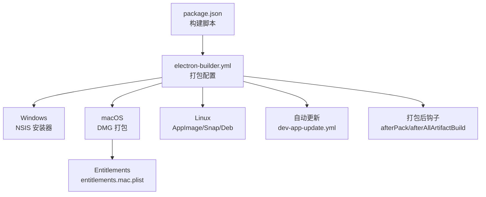
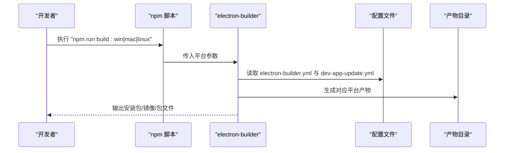
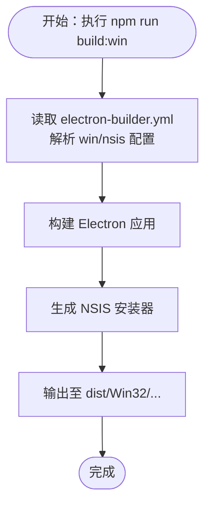
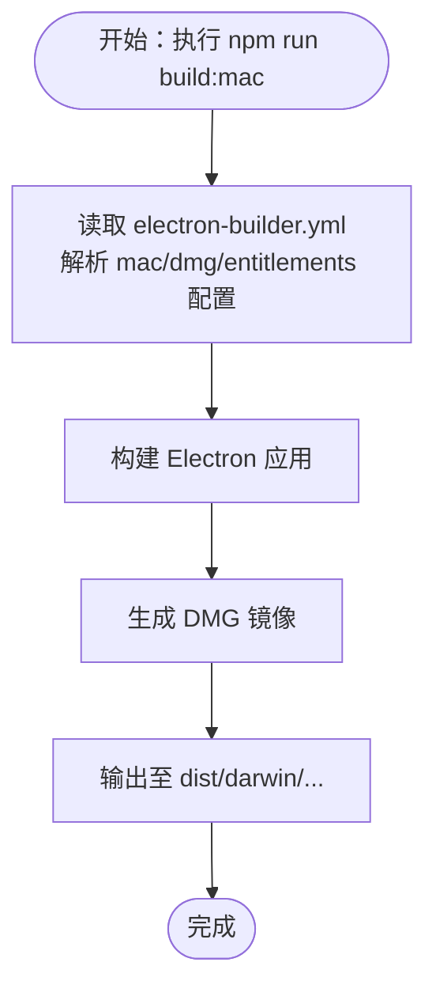
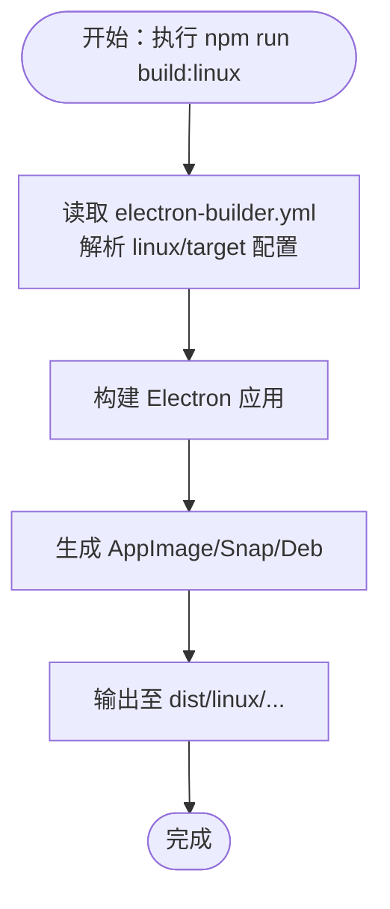
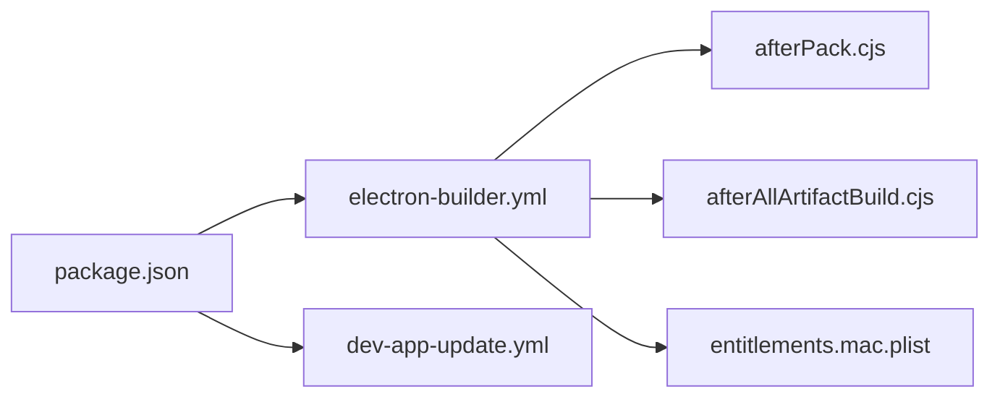

# 平台打包

<cite>
**本文引用的文件**
- [electron-builder.yml](file://electron-builder.yml)
- [package.json](file://package.json)
- [dev-app-update.yml](file://dev-app-update.yml)
- [electron.vite.config.ts](file://electron.vite.config.ts)
- [build/afterPack.cjs](file://build/afterPack.cjs)
- [build/afterAllArtifactBuild.cjs](file://build/afterAllArtifactBuild.cjs)
- [build/entitlements.mac.plist](file://build/entitlements.mac.plist)
</cite>

## 目录

1. [简介](#简介)
2. [项目结构](#项目结构)
3. [核心组件](#核心组件)
4. [架构总览](#架构总览)
5. [详细组件分析](#详细组件分析)
6. [依赖关系分析](#依赖关系分析)
7. [性能与体积优化](#性能与体积优化)
8. [故障排查指南](#故障排查指南)
9. [结论](#结论)
10. [附录：平台打包清单](#附录平台打包清单)

## 简介

本指南面向 MyTool 的多平台打包需求，基于仓库中现有的 electron-builder 配置与构建脚本，系统梳理 Windows（NSIS）、macOS（DMG）与 Linux（AppImage/Snap/Deb）三类产物的打包策略、命名规则、安装目录与权限配置，并补充签名与公证相关建议。同时给出不同架构支持、平台兼容性说明以及常见问题排查思路，帮助团队在 CI 或本地稳定产出符合预期的安装包。

## 项目结构

本项目采用 Electron-Vite 架构，使用 electron-builder 进行跨平台打包。关键配置集中在以下文件：

- electron-builder.yml：定义应用元数据、目标平台、打包产物、平台特定配置等
- package.json：定义构建脚本与依赖，包含各平台构建命令
- dev-app-update.yml：自动更新配置（通用提供者）
- electron.vite.config.ts：主进程、渲染进程与预加载脚本的构建别名与外部化配置
- build/afterPack.cjs 与 build/afterAllArtifactBuild.cjs：打包后钩子，用于精简资源与产物清理
- build/entitlements.mac.plist：macOS 权限清单（Entitlements）

图表来源

- [package.json:8-22](file://package.json#L8-L22)
- [electron-builder.yml:1-60](file://electron-builder.yml#L1-L60)
- [dev-app-update.yml:1-4](file://dev-app-update.yml#L1-L4)
- [build/afterPack.cjs:12-56](file://build/afterPack.cjs#L12-L56)
- [build/afterAllArtifactBuild.cjs:12-28](file://build/afterAllArtifactBuild.cjs#L12-L28)
- [build/entitlements.mac.plist:1-13](file://build/entitlements.mac.plist#L1-L13)

章节来源

- [package.json:8-22](file://package.json#L8-L22)
- [electron-builder.yml:1-60](file://electron-builder.yml#L1-L60)

## 核心组件

- 应用标识与元数据
  - appId/productName/compression/asar 等基础配置见 [electron-builder.yml:1-7](file://electron-builder.yml#L1-L7)
- 文件过滤与打包范围
  - files/asarUnpack 控制打包内容与解压策略，见 [electron-builder.yml:8-19](file://electron-builder.yml#L8-L19)
- 自动更新配置
  - provider/url/channel 见 [electron-builder.yml:54-57](file://electron-builder.yml#L54-L57)，与 [dev-app-update.yml:1-4](file://dev-app-update.yml#L1-L4) 协同
- 打包后处理
  - afterPack 与 afterAllArtifactBuild 分别用于 macOS 资源精简与产物目录清理，见 [build/afterPack.cjs:12-56](file://build/afterPack.cjs#L12-L56)、[build/afterAllArtifactBuild.cjs:12-28](file://build/afterAllArtifactBuild.cjs#L12-L28)
- macOS 权限与公证
  - entitlementsInherit 与 extendInfo 指定权限与使用说明文案；notarize 当前关闭，见 [electron-builder.yml:31-38](file://electron-builder.yml#L31-L38)、[build/entitlements.mac.plist:1-13](file://build/entitlements.mac.plist#L1-L13)

章节来源

- [electron-builder.yml:1-60](file://electron-builder.yml#L1-L60)
- [dev-app-update.yml:1-4](file://dev-app-update.yml#L1-L4)
- [build/afterPack.cjs:12-56](file://build/afterPack.cjs#L12-L56)
- [build/afterAllArtifactBuild.cjs:12-28](file://build/afterAllArtifactBuild.cjs#L12-L28)
- [build/entitlements.mac.plist:1-13](file://build/entitlements.mac.plist#L1-L13)

## 架构总览

下图展示从构建脚本到打包产物的关键流程，包括平台选择、打包器调用、平台特定配置与产物输出路径。

图表来源

- [package.json:18-21](file://package.json#L18-L21)
- [electron-builder.yml:1-60](file://electron-builder.yml#L1-L60)
- [dev-app-update.yml:1-4](file://dev-app-update.yml#L1-L4)

## 详细组件分析

### Windows 打包（NSIS 安装器）

- 目标与架构
  - 目标类型：nsis
  - 支持架构：x64（见 [electron-builder.yml:21-24](file://electron-builder.yml#L21-L24)）
- 可执行文件命名
  - executableName 指定为 myTool（见 [electron-builder.yml:25](file://electron-builder.yml#L25)）
- 安装目录与交互
  - oneClick 关闭，允许用户自定义安装目录（见 [electron-builder.yml:26-28](file://electron-builder.yml#L26-L28)）
  - 桌面快捷方式与开始菜单快捷方式均创建（见 [electron-builder.yml:29-30](file://electron-builder.yml#L29-L30)）
- 产物命名
  - 默认由 electron-builder 生成，未显式覆盖 artifactName（见 [electron-builder.yml:20-30](file://electron-builder.yml#L20-L30)）
- 安装目录
  - 未在配置中指定固定安装目录，遵循 NSIS 默认行为或安装器交互逻辑（见 [electron-builder.yml:20-30](file://electron-builder.yml#L20-L30)）

图表来源

- [package.json:19](file://package.json#L19)
- [electron-builder.yml:20-30](file://electron-builder.yml#L20-L30)

章节来源

- [electron-builder.yml:20-30](file://electron-builder.yml#L20-L30)
- [package.json:19](file://package.json#L19)

### macOS 打包（DMG）

- 目标与架构
  - 目标类型：dmg（见 [electron-builder.yml:39-40](file://electron-builder.yml#L39-L40)）
  - 未显式声明 arch，按 electron-builder 默认行为进行打包
- 可执行文件命名
  - 未显式覆盖，遵循默认命名（见 [electron-builder.yml:31-38](file://electron-builder.yml#L31-L38)）
- 安装目录
  - 未显式指定安装路径，通常位于 /Applications 或用户可拖拽位置（见 [electron-builder.yml:39-40](file://electron-builder.yml#L39-L40)）
- 权限与 Entitlements
  - entitlementsInherit 指向本地 entitlements.mac.plist（见 [electron-builder.yml:32](file://electron-builder.yml#L32)）
  - extendInfo 中声明了相机、麦克风、文档与下载目录的使用说明（见 [electron-builder.yml:33-37](file://electron-builder.yml#L33-L37)）
  - 本地 entitlements.mac.plist 启用了 JIT/无签名内存/动态链接环境变量等能力（见 [build/entitlements.mac.plist:5-10](file://build/entitlements.mac.plist#L5-L10)）
- 公证（Notarization）
  - notarize 当前为 false（见 [electron-builder.yml:38](file://electron-builder.yml#L38)），如需启用请参考官方文档配置 Apple ID 与票据服务凭据

图表来源

- [package.json:20](file://package.json#L20)
- [electron-builder.yml:31-38](file://electron-builder.yml#L31-L38)
- [build/entitlements.mac.plist:1-13](file://build/entitlements.mac.plist#L1-L13)

章节来源

- [electron-builder.yml:31-38](file://electron-builder.yml#L31-L38)
- [build/entitlements.mac.plist:1-13](file://build/entitlements.mac.plist#L1-L13)
- [package.json:20](file://package.json#L20)

### Linux 打包（AppImage/Snap/Deb）

- 目标与架构
  - 目标类型：AppImage、snap、deb（见 [electron-builder.yml:43-47](file://electron-builder.yml#L43-L47)）
  - 未显式声明 arch，按默认行为打包
- 维护者与分类
  - maintainer 与 category 已配置（见 [electron-builder.yml:48-49](file://electron-builder.yml#L48-L49)）
- 产物命名
  - AppImage 使用自定义 artifactName（见 [electron-builder.yml:50-51](file://electron-builder.yml#L50-L51)）
- 打包后处理
  - afterPack 与 afterAllArtifactBuild 在 Linux 平台同样生效，用于精简与清理（见 [build/afterPack.cjs:12-56](file://build/afterPack.cjs#L12-L56)、[build/afterAllArtifactBuild.cjs:12-28](file://build/afterAllArtifactBuild.cjs#L12-L28)）

图表来源

- [package.json:21](file://package.json#L21)
- [electron-builder.yml:43-51](file://electron-builder.yml#L43-L51)

章节来源

- [electron-builder.yml:43-51](file://electron-builder.yml#L43-L51)
- [package.json:21](file://package.json#L21)

### 自动更新配置

- 提供者与地址
  - provider 为 generic，url 指向示例地址（见 [electron-builder.yml:54-56](file://electron-builder.yml#L54-L56)）
- 更新缓存目录
  - updaterCacheDirName 指定为 mytool-updater（见 [dev-app-update.yml:3](file://dev-app-update.yml#L3)）
- 注意事项
  - 该配置适用于通用更新服务器场景；若使用 GitHub Releases 或 S3，请相应调整 provider 与 url

章节来源

- [electron-builder.yml:54-56](file://electron-builder.yml#L54-L56)
- [dev-app-update.yml:1-4](file://dev-app-update.yml#L1-L4)

### 打包后处理（afterPack / afterAllArtifactBuild）

- afterPack（macOS 专用）
  - 移除 Electron Framework 中非必要的语言包与 Vulkan 相关文件，减小体积（见 [build/afterPack.cjs:12-56](file://build/afterPack.cjs#L12-L56)）
- afterAllArtifactBuild
  - 仅保留 dmg/zip 及其 blockmap，清理其他中间产物（见 [build/afterAllArtifactBuild.cjs:12-28](file://build/afterAllArtifactBuild.cjs#L12-L28)）

章节来源

- [build/afterPack.cjs:12-56](file://build/afterPack.cjs#L12-L56)
- [build/afterAllArtifactBuild.cjs:12-28](file://build/afterAllArtifactBuild.cjs#L12-L28)

### 主进程外部化与构建别名（辅助打包）

- 主进程外部化 sqlite3，避免打包二进制依赖（见 [electron.vite.config.ts:8-11](file://electron.vite.config.ts#L8-L11)）
- 渲染进程别名与插件配置，确保打包时资源解析正确（见 [electron.vite.config.ts:14-25](file://electron.vite.config.ts#L14-L25)）

章节来源

- [electron.vite.config.ts:1-27](file://electron.vite.config.ts#L1-L27)

## 依赖关系分析

- 构建脚本与打包器
  - package.json 中的 scripts 将构建命令映射到 electron-builder 的平台参数（见 [package.json:18-21](file://package.json#L18-L21)）
- 配置文件耦合
  - electron-builder.yml 决定产物类型、命名与平台特定行为；dev-app-update.yml 与之协同控制更新通道（见 [electron-builder.yml:54-57](file://electron-builder.yml#L54-L57)、[dev-app-update.yml:1-4](file://dev-app-update.yml#L1-L4)）
- 打包后处理
  - afterPack/afterAllArtifactBuild 通过上下文 appOutDir/outDir 读写产物目录，影响最终产物体积与完整性（见 [build/afterPack.cjs:12-56](file://build/afterPack.cjs#L12-L56)、[build/afterAllArtifactBuild.cjs:12-28](file://build/afterAllArtifactBuild.cjs#L12-L28)）

图表来源

- [package.json:8-22](file://package.json#L8-L22)
- [electron-builder.yml:1-60](file://electron-builder.yml#L1-L60)
- [dev-app-update.yml:1-4](file://dev-app-update.yml#L1-L4)
- [build/afterPack.cjs:12-56](file://build/afterPack.cjs#L12-L56)
- [build/afterAllArtifactBuild.cjs:12-28](file://build/afterAllArtifactBuild.cjs#L12-L28)
- [build/entitlements.mac.plist:1-13](file://build/entitlements.mac.plist#L1-L13)

章节来源

- [package.json:8-22](file://package.json#L8-L22)
- [electron-builder.yml:1-60](file://electron-builder.yml#L1-L60)

## 性能与体积优化

- ASAR 打包与解压
  - asar 开启，asarUnpack 仅解压 resources/\*\*，减少打包体积（见 [electron-builder.yml:7](file://electron-builder.yml#L7)、[electron-builder.yml:18-19](file://electron-builder.yml#L18-L19)）
- 主进程外部化
  - 外部化 sqlite3，避免打包二进制，降低体积（见 [electron.vite.config.ts:8-11](file://electron.vite.config.ts#L8-L11)）
- macOS 资源精简
  - afterPack 移除非必要语言包与 Vulkan 文件，显著缩小 DMG 体积（见 [build/afterPack.cjs:12-56](file://build/afterPack.cjs#L12-L56)）
- 产物清理
  - afterAllArtifactBuild 仅保留 dmg/zip 及其 blockmap，避免冗余文件滞留（见 [build/afterAllArtifactBuild.cjs:12-28](file://build/afterAllArtifactBuild.cjs#L12-L28)）

章节来源

- [electron-builder.yml:7](file://electron-builder.yml#L7)
- [electron-builder.yml:18-19](file://electron-builder.yml#L18-L19)
- [electron.vite.config.ts:8-11](file://electron.vite.config.ts#L8-L11)
- [build/afterPack.cjs:12-56](file://build/afterPack.cjs#L12-L56)
- [build/afterAllArtifactBuild.cjs:12-28](file://build/afterAllArtifactBuild.cjs#L12-L28)

## 故障排查指南

- Windows 安装器无法选择安装目录
  - 检查 nsis.oneClick 是否为 false（当前已关闭，允许自定义目录）（见 [electron-builder.yml:26-28](file://electron-builder.yml#L26-L28)）
- macOS DMG 打开提示“无法验证开发者”
  - 若未进行公证（notarize=false），系统会提示安全性警告；建议开启公证并在 CI 中配置 Apple ID 凭据（见 [electron-builder.yml:38](file://electron-builder.yml#L38)）
- macOS 权限不生效
  - 确认 entitlementsInherit 指向的 entitlements.mac.plist 存在且格式正确（见 [electron-builder.yml:32](file://electron-builder.yml#L32)、[build/entitlements.mac.plist:1-13](file://build/entitlements.mac.plist#L1-L13)）
- Linux 产物缺失或体积异常
  - 检查 afterPack/afterAllArtifactBuild 是否按预期运行；确认目标类型与维护者/分类配置（见 [electron-builder.yml:43-51](file://electron-builder.yml#L43-L51)、[build/afterAllArtifactBuild.cjs:12-28](file://build/afterAllArtifactBuild.cjs#L12-L28)）
- 自动更新无法拉取
  - 确认 provider/url/channel 与 dev-app-update.yml 配置一致，且更新服务器可达（见 [electron-builder.yml:54-57](file://electron-builder.yml#L54-L57)、[dev-app-update.yml:1-4](file://dev-app-update.yml#L1-L4)）

章节来源

- [electron-builder.yml:26-28](file://electron-builder.yml#L26-L28)
- [electron-builder.yml:32](file://electron-builder.yml#L32)
- [build/entitlements.mac.plist:1-13](file://build/entitlements.mac.plist#L1-L13)
- [electron-builder.yml:38](file://electron-builder.yml#L38)
- [electron-builder.yml:43-51](file://electron-builder.yml#L43-L51)
- [build/afterAllArtifactBuild.cjs:12-28](file://build/afterAllArtifactBuild.cjs#L12-L28)
- [electron-builder.yml:54-57](file://electron-builder.yml#L54-L57)
- [dev-app-update.yml:1-4](file://dev-app-update.yml#L1-L4)

## 结论

本项目已具备完善的多平台打包基础：Windows 使用 NSIS、macOS 使用 DMG、Linux 生成 AppImage/Snap/Deb。通过 ASAR、外部化与打包后处理，有效控制产物体积与质量。建议在 macOS 上启用公证以提升用户信任度，并根据实际发布渠道完善自动更新配置。后续可在 CI 中固化各平台构建与签名流程，确保一致性与可重复性。

## 附录：平台打包清单

- Windows（NSIS）
  - 目标类型：nsis
  - 架构：x64
  - 可执行文件命名：myTool
  - 安装器交互：允许自定义安装目录
  - 快捷方式：桌面与开始菜单均创建
- macOS（DMG）
  - 目标类型：dmg
  - Entitlements：inherit 自本地文件
  - 权限说明：相机/麦克风/文档/下载目录
  - 公证：当前关闭
- Linux（AppImage/Snap/Deb）
  - 目标类型：AppImage、snap、deb
  - 维护者与分类：已配置
  - 产物命名：AppImage 使用自定义模板

章节来源

- [electron-builder.yml:20-30](file://electron-builder.yml#L20-L30)
- [electron-builder.yml:31-38](file://electron-builder.yml#L31-L38)
- [electron-builder.yml:39-49](file://electron-builder.yml#L39-L49)
- [electron-builder.yml:50-51](file://electron-builder.yml#L50-L51)
