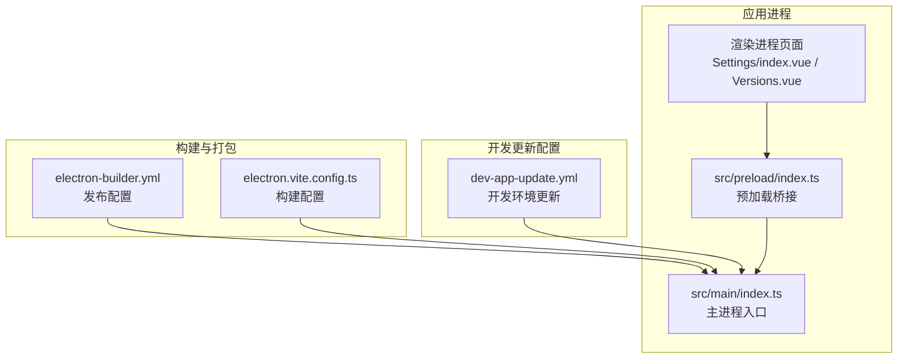
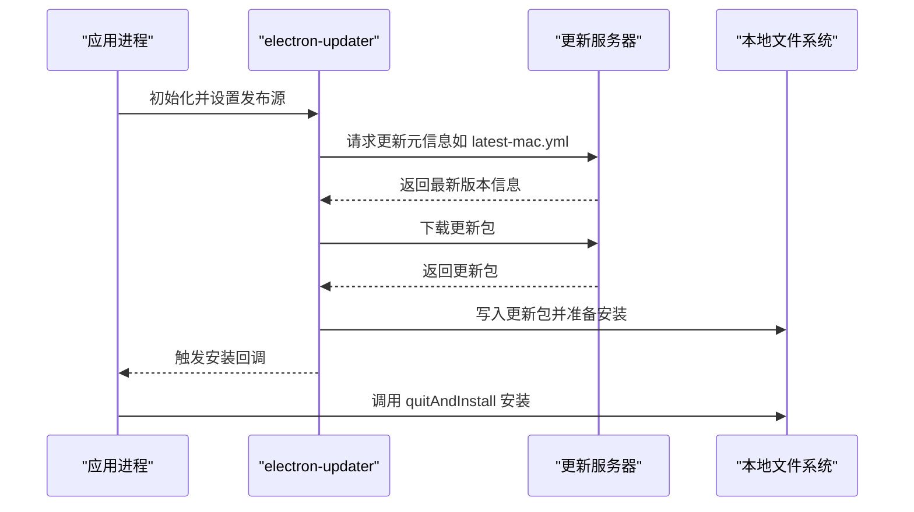
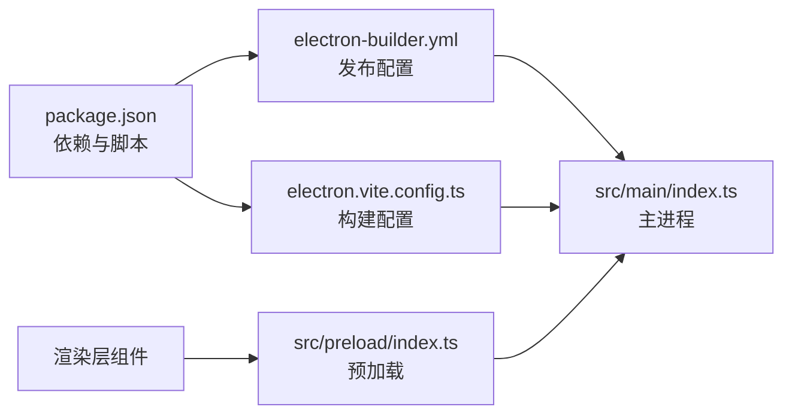
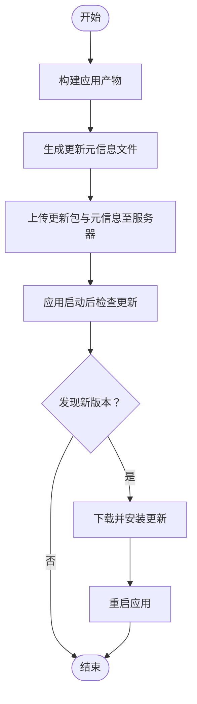

# 自动更新配置

<cite>
**本文引用的文件**
- [electron-builder.yml](file://electron-builder.yml)
- [dev-app-update.yml](file://dev-app-update.yml)
- [package.json](file://package.json)
- [src/main/index.ts](file://src/main/index.ts)
- [src/preload/index.ts](file://src/preload/index.ts)
- [src/renderer/src/views/Settings/index.vue](file://src/renderer/src/views/Settings/index.vue)
- [src/renderer/src/components/Versions.vue](file://src/renderer/src/components/Versions.vue)
- [electron.vite.config.ts](file://electron.vite.config.ts)
</cite>

## 目录

1. [简介](#简介)
2. [项目结构](#项目结构)
3. [核心组件](#核心组件)
4. [架构总览](#架构总览)
5. [详细组件分析](#详细组件分析)
6. [依赖关系分析](#依赖关系分析)
7. [性能考虑](#性能考虑)
8. [故障排查指南](#故障排查指南)
9. [结论](#结论)
10. [附录](#附录)

## 简介

本指南面向 MyTool 的自动更新机制配置，围绕以下目标展开：

- 解释 electron-builder.yml 中的 publish 配置：generic provider 设置、更新服务器 URL、channel 版本通道。
- 解释 dev-app-update.yml 的开发环境更新配置。
- 提供自动更新的实现原理与配置步骤，说明如何设置更新服务器与版本管理策略。
- 完整覆盖更新包的生成、发布与客户端检查更新的流程。

## 项目结构

MyTool 使用 electron-vite 作为开发与打包工具链，主进程入口位于 src/main/index.ts，渲染进程通过 Vite 插件加载。自动更新相关的关键配置集中在 electron-builder.yml 与 dev-app-update.yml；运行时通过 preload 暴露的 API 与主进程交互。

图表来源

- [electron-builder.yml:54-58](file://electron-builder.yml#L54-L58)
- [dev-app-update.yml:1-4](file://dev-app-update.yml#L1-L4)
- [electron.vite.config.ts:1-27](file://electron.vite.config.ts#L1-L27)
- [src/main/index.ts:1-112](file://src/main/index.ts#L1-L112)
- [src/preload/index.ts:1-37](file://src/preload/index.ts#L1-L37)
- [src/renderer/src/views/Settings/index.vue:1-198](file://src/renderer/src/views/Settings/index.vue#L1-L198)
- [src/renderer/src/components/Versions.vue:1-13](file://src/renderer/src/components/Versions.vue#L1-L13)

章节来源

- [electron-builder.yml:1-60](file://electron-builder.yml#L1-L60)
- [dev-app-update.yml:1-4](file://dev-app-update.yml#L1-L4)
- [electron.vite.config.ts:1-27](file://electron.vite.config.ts#L1-L27)
- [src/main/index.ts:1-112](file://src/main/index.ts#L1-L112)
- [src/preload/index.ts:1-37](file://src/preload/index.ts#L1-L37)
- [src/renderer/src/views/Settings/index.vue:1-198](file://src/renderer/src/views/Settings/index.vue#L1-L198)
- [src/renderer/src/components/Versions.vue:1-13](file://src/renderer/src/components/Versions.vue#L1-L13)

## 核心组件

- 发布配置（electron-builder.yml）：定义通用发布提供商、更新服务器地址与 channel 通道。
- 开发更新配置（dev-app-update.yml）：开发环境下指定 generic provider、更新服务器与缓存目录名。
- 应用主进程（src/main/index.ts）：应用启动后可进行更新检查与安装（当前未显式集成自动更新逻辑，需按后续章节添加）。
- 预加载桥接（src/preload/index.ts）：向渲染进程暴露日志等 API，便于展示更新状态或触发更新检查（当前未暴露更新相关 API，需按后续章节扩展）。
- 渲染层（Settings/index.vue、Versions.vue）：用于展示系统信息与日志路径，可作为更新 UI 的承载页面（当前未集成更新按钮或状态展示，需按后续章节扩展）。

章节来源

- [electron-builder.yml:54-58](file://electron-builder.yml#L54-L58)
- [dev-app-update.yml:1-4](file://dev-app-update.yml#L1-L4)
- [src/main/index.ts:1-112](file://src/main/index.ts#L1-L112)
- [src/preload/index.ts:1-37](file://src/preload/index.ts#L1-L37)
- [src/renderer/src/views/Settings/index.vue:1-198](file://src/renderer/src/views/Settings/index.vue#L1-L198)
- [src/renderer/src/components/Versions.vue:1-13](file://src/renderer/src/components/Versions.vue#L1-L13)

## 架构总览

自动更新的整体流程如下：

- 构建阶段：electron-builder 在构建完成后根据 publish 配置生成更新元信息文件（如 latest-mac.yml），并将更新包上传至 generic provider 指定的 URL。
- 运行阶段：应用启动后，通过 electron-updater 检查更新，下载新版本并提示安装；开发环境使用 dev-app-update.yml 覆盖生产配置。

图表来源

- [electron-builder.yml:54-58](file://electron-builder.yml#L54-L58)
- [dev-app-update.yml:1-4](file://dev-app-update.yml#L1-L4)
- [src/main/index.ts:1-112](file://src/main/index.ts#L1-L112)

## 详细组件分析

### electron-builder.yml 中的发布配置

- provider：generic 表示使用通用 HTTP/HTTPS 发布器，适用于自建更新服务器。
- url：更新服务器地址，应用启动后从该 URL 获取更新元信息与下载更新包。
- channel：版本通道，如 latest、beta、alpha 等，用于区分稳定版与测试版更新流。
- 其他构建选项：如 asar 打包、平台目标、产物命名规则等，不影响更新机制但影响更新包内容与分发方式。

章节来源

- [electron-builder.yml:54-58](file://electron-builder.yml#L54-L58)

### dev-app-update.yml 的开发环境配置

- provider：generic，与生产一致。
- url：更新服务器地址，开发时可指向本地或测试服务器。
- updaterCacheDirName：更新缓存目录名，避免与生产缓存冲突。

章节来源

- [dev-app-update.yml:1-4](file://dev-app-update.yml#L1-L4)

### 应用主进程与自动更新集成

当前主进程入口未显式集成自动更新逻辑。建议在应用初始化后注册更新检查与安装回调，以实现自动更新功能。具体步骤参见“配置步骤”与“实现原理”。

章节来源

- [src/main/index.ts:1-112](file://src/main/index.ts#L1-L112)

### 预加载桥接与渲染层扩展

- 预加载桥接：当前暴露日志相关 API，未暴露更新相关 API。可在预加载层新增更新检查与安装的 IPC 接口，供渲染层调用。
- 渲染层：Settings 页面与 Versions 组件可作为更新 UI 的承载页面，展示版本信息与更新状态。

章节来源

- [src/preload/index.ts:1-37](file://src/preload/index.ts#L1-L37)
- [src/renderer/src/views/Settings/index.vue:1-198](file://src/renderer/src/views/Settings/index.vue#L1-L198)
- [src/renderer/src/components/Versions.vue:1-13](file://src/renderer/src/components/Versions.vue#L1-L13)

## 依赖关系分析

- 依赖项：package.json 中包含 electron-updater，用于实现自动更新能力。
- 构建脚本：package.json 的构建脚本支持多平台打包，结合 electron-builder.yml 的发布配置完成更新包生成与上传。
- 构建配置：electron.vite.config.ts 控制主进程外部模块 sqlite3 的处理与渲染进程开发服务器端口。

图表来源

- [package.json:1-61](file://package.json#L1-L61)
- [electron-builder.yml:1-60](file://electron-builder.yml#L1-L60)
- [electron.vite.config.ts:1-27](file://electron.vite.config.ts#L1-L27)
- [src/main/index.ts:1-112](file://src/main/index.ts#L1-L112)
- [src/preload/index.ts:1-37](file://src/preload/index.ts#L1-L37)

章节来源

- [package.json:1-61](file://package.json#L1-L61)
- [electron-builder.yml:1-60](file://electron-builder.yml#L1-L60)
- [electron.vite.config.ts:1-27](file://electron.vite.config.ts#L1-L27)
- [src/main/index.ts:1-112](file://src/main/index.ts#L1-L112)
- [src/preload/index.ts:1-37](file://src/preload/index.ts#L1-L37)

## 性能考虑

- 更新包大小：通过 asar 打包与文件排除规则减小包体，有助于缩短下载时间。
- 差分更新：electron-updater 支持差分下载（differential download），可显著降低带宽占用与等待时间。
- 缓存策略：合理设置 channel 与缓存目录名，避免频繁重复下载与磁盘占用。
- 平台差异：不同平台（Windows/macOS/Linux）的目标产物与签名策略会影响更新体验，需分别优化。

## 故障排查指南

- 更新服务器不可达：检查 dev-app-update.yml 与 electron-builder.yml 中的 url 是否正确，确保网络连通性与证书有效。
- 权限问题：确保应用有写入更新缓存目录与安装目录的权限。
- 版本通道不匹配：确认 channel 设置与服务器返回的版本信息一致。
- 日志定位：通过 Settings 页面的日志路径与打开目录功能定位更新过程中的错误日志。

章节来源

- [dev-app-update.yml:1-4](file://dev-app-update.yml#L1-L4)
- [electron-builder.yml:54-58](file://electron-builder.yml#L54-L58)
- [src/renderer/src/views/Settings/index.vue:1-198](file://src/renderer/src/views/Settings/index.vue#L1-L198)

## 结论

- 生产与开发环境的更新配置由 electron-builder.yml 与 dev-app-update.yml 共同决定。
- 应用需在主进程集成 electron-updater，以实现自动检查与安装。
- 渲染层可通过预加载桥接暴露更新接口，提升用户体验。
- 合理设置更新服务器、版本通道与缓存策略，是保障自动更新稳定性的关键。

## 附录

### 实现原理与配置步骤

- 步骤一：配置发布源
  - 在 electron-builder.yml 中设置 provider 为 generic，并填写更新服务器 URL 与 channel。
  - 在 dev-app-update.yml 中设置开发环境的 provider、URL 与缓存目录名。
- 步骤二：生成更新包
  - 使用构建脚本生成各平台产物，并由 afterPack/afterAllArtifactBuild 钩子生成更新元信息文件。
- 步骤三：发布更新
  - 将更新包与元信息文件上传至与 url 对应的更新服务器。
- 步骤四：客户端检查更新
  - 在主进程初始化 electron-updater，设置发布源与 channel，触发检查更新与下载。
  - 在渲染层通过预加载桥接调用更新接口，展示进度与结果。
- 步骤五：安装更新
  - 调用 quitAndInstall 完成安装，重启应用。

图表来源

- [electron-builder.yml:54-58](file://electron-builder.yml#L54-L58)
- [dev-app-update.yml:1-4](file://dev-app-update.yml#L1-L4)
- [src/main/index.ts:1-112](file://src/main/index.ts#L1-L112)
