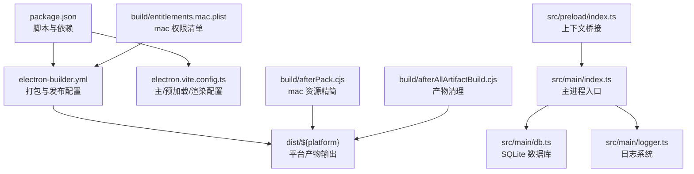
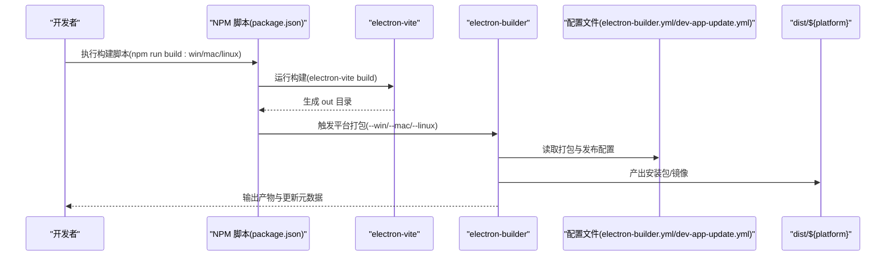
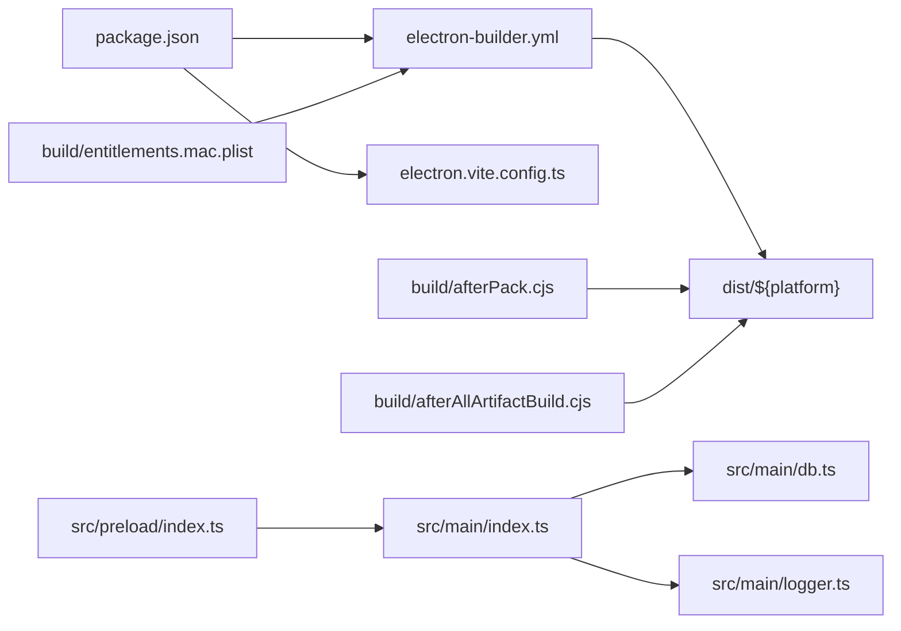

# 构建与部署

<cite>
**本文引用的文件**
- [electron-builder.yml](file://electron-builder.yml)
- [package.json](file://package.json)
- [dev-app-update.yml](file://dev-app-update.yml)
- [electron.vite.config.ts](file://electron.vite.config.ts)
- [src/main/index.ts](file://src/main/index.ts)
- [src/main/db.ts](file://src/main/db.ts)
- [src/main/logger.ts](file://src/main/logger.ts)
- [src/preload/index.ts](file://src/preload/index.ts)
- [src/preload/index.d.ts](file://src/preload/index.d.ts)
- [build/afterPack.cjs](file://build/afterPack.cjs)
- [build/afterAllArtifactBuild.cjs](file://build/afterAllArtifactBuild.cjs)
- [build/entitlements.mac.plist](file://build/entitlements.mac.plist)
- [README.md](file://README.md)
</cite>

## 目录

1. [简介](#简介)
2. [项目结构](#项目结构)
3. [核心组件](#核心组件)
4. [架构总览](#架构总览)
5. [详细组件分析](#详细组件分析)
6. [依赖关系分析](#依赖关系分析)
7. [性能考虑](#性能考虑)
8. [故障排除指南](#故障排除指南)
9. [结论](#结论)
10. [附录](#附录)

## 简介

本指南面向 MyTool 的构建与部署，围绕 electron-builder 的配置选项、平台特定构建流程、自动更新机制展开，并结合当前仓库中的配置文件与脚本，给出 Windows、macOS、Linux 的打包策略与签名/公证要点、CI/CD 集成思路、版本管理与回滚策略、以及常见问题排查与性能优化建议。读者无需深入源码即可按步骤完成从开发到生产的全流程。

## 项目结构

MyTool 使用 electron-vite 作为开发与构建工具链，主进程入口位于 src/main/index.ts，渲染进程基于 Vue 3 + TypeScript，打包配置集中在 electron-builder.yml，构建脚本与平台目标在 package.json 中定义。构建产物输出至 dist/${platform}，并使用 asar 打包与 asarUnpack 对资源进行解包以满足运行时需求。

图表来源

- [package.json:1-61](file://package.json#L1-L61)
- [electron-builder.yml:1-60](file://electron-builder.yml#L1-L60)
- [electron.vite.config.ts:1-27](file://electron.vite.config.ts#L1-L27)
- [src/main/index.ts:1-112](file://src/main/index.ts#L1-L112)
- [src/main/db.ts:1-100](file://src/main/db.ts#L1-L100)
- [src/main/logger.ts:1-42](file://src/main/logger.ts#L1-L42)
- [src/preload/index.ts:1-36](file://src/preload/index.ts#L1-L36)
- [build/afterPack.cjs:1-57](file://build/afterPack.cjs#L1-L57)
- [build/afterAllArtifactBuild.cjs:1-29](file://build/afterAllArtifactBuild.cjs#L1-L29)
- [build/entitlements.mac.plist:1-13](file://build/entitlements.mac.plist#L1-L13)

章节来源

- [package.json:1-61](file://package.json#L1-L61)
- [electron-builder.yml:1-60](file://electron-builder.yml#L1-L60)
- [electron.vite.config.ts:1-27](file://electron.vite.config.ts#L1-L27)
- [README.md:1-35](file://README.md#L1-L35)

## 核心组件

- 打包与发布配置：electron-builder.yml 定义了应用元信息、压缩级别、asar 打包、文件过滤、平台目标、安装器参数、自动更新发布地址与通道等。
- 构建脚本与平台目标：package.json 提供统一的开发、类型检查、构建命令及平台专属构建脚本。
- 主进程与 IPC：src/main/index.ts 负责窗口创建、事件监听、IPC 暴露与数据库模块动态加载；src/main/db.ts 提供 SQLite 访问；src/main/logger.ts 提供日志路径与目录切换能力。
- 预加载桥接：src/preload/index.ts 通过 contextBridge 暴露受控 API 至渲染进程，类型声明见 src/preload/index.d.ts。
- 构建后处理：build/afterPack.cjs 在 macOS 上移除多余语言包与无关库，减小体积；build/afterAllArtifactBuild.cjs 清理非必要产物，仅保留发布所需文件。
- 自动更新配置：electron-builder.yml 的 publish 字段与 dev-app-update.yml 共同定义更新源与缓存目录。

章节来源

- [electron-builder.yml:1-60](file://electron-builder.yml#L1-L60)
- [package.json:1-61](file://package.json#L1-L61)
- [src/main/index.ts:1-112](file://src/main/index.ts#L1-L112)
- [src/main/db.ts:1-100](file://src/main/db.ts#L1-L100)
- [src/main/logger.ts:1-42](file://src/main/logger.ts#L1-L42)
- [src/preload/index.ts:1-36](file://src/preload/index.ts#L1-L36)
- [src/preload/index.d.ts:1-21](file://src/preload/index.d.ts#L1-L21)
- [build/afterPack.cjs:1-57](file://build/afterPack.cjs#L1-L57)
- [build/afterAllArtifactBuild.cjs:1-29](file://build/afterAllArtifactBuild.cjs#L1-L29)
- [dev-app-update.yml:1-4](file://dev-app-update.yml#L1-L4)

## 架构总览

下图展示从构建到发布的整体流程，以及各配置文件之间的协作关系。

图表来源

- [package.json:8-22](file://package.json#L8-L22)
- [electron-builder.yml:1-60](file://electron-builder.yml#L1-L60)
- [dev-app-update.yml:1-4](file://dev-app-update.yml#L1-L4)

## 详细组件分析

### electron-builder 配置解析

- 应用标识与产品名：用于安装器名称、应用沙盒与权限识别。
- 压缩与打包：maximum 压缩、asar 打包；asarUnpack 指定资源目录解包，确保运行时可访问。
- 文件过滤：排除开发与构建相关文件、示例文档、node_modules 内部文档与配置，减少包体。
- 平台目标：
  - Windows：NSIS 安装器（x64），自定义桌面与开始菜单快捷方式行为。
  - macOS：dmg 安装包，权限清单 entitlementsInherit 指向自定义 plist；extendInfo 声明相机/麦克风/文档/下载目录使用说明；未启用公证 notarize。
  - Linux：AppImage、snap、deb 三合一目标，维护者信息与分类设置。
- 发布与更新：generic 提供商，指定更新服务器地址与 channel；dev-app-update.yml 为开发态更新配置。
- 构建钩子：afterPack 与 afterAllArtifactBuild 分别用于 macOS 资源精简与最终产物清理。

章节来源

- [electron-builder.yml:1-60](file://electron-builder.yml#L1-L60)
- [dev-app-update.yml:1-4](file://dev-app-update.yml#L1-L4)

### 构建脚本与平台目标

- 开发与构建：dev、start、build、typecheck 等脚本串联类型检查与构建流程。
- 平台专属：build:win、build:mac、build:linux 分别触发对应平台打包。
- postinstall：安装 electron-builder 依赖的应用依赖（如原生模块）。

章节来源

- [package.json:8-22](file://package.json#L8-L22)

### electron-vite 配置

- 主进程外部化 sqlite3，避免打包原生模块导致的兼容性问题。
- 渲染进程别名与插件配置，开发服务器端口设定。

章节来源

- [electron.vite.config.ts:1-27](file://electron.vite.config.ts#L1-L27)

### 主进程与 IPC

- 窗口创建、开发/生产加载逻辑、窗口快捷键监控、外部链接拦截。
- 动态加载数据库模块，避免 app.whenReady 之前访问用户数据目录。
- 通过 ipcMain.handle 暴露日志路径查询、打开日志目录、修改日志目录等接口。
- 通过 ipcMain.handle 暴露数据库增删改查接口，供渲染层调用。

章节来源

- [src/main/index.ts:1-112](file://src/main/index.ts#L1-L112)
- [src/main/db.ts:1-100](file://src/main/db.ts#L1-L100)
- [src/main/logger.ts:1-42](file://src/main/logger.ts#L1-L42)
- [src/preload/index.ts:1-36](file://src/preload/index.ts#L1-L36)
- [src/preload/index.d.ts:1-21](file://src/preload/index.d.ts#L1-L21)

### 预加载桥接与类型声明

- 通过 contextBridge 暴露受限 API 至渲染进程，封装数据库与日志相关调用。
- 类型声明确保编译期安全与 IDE 支持。

章节来源

- [src/preload/index.ts:1-36](file://src/preload/index.ts#L1-L36)
- [src/preload/index.d.ts:1-21](file://src/preload/index.d.ts#L1-L21)

### macOS 资源精简与产物清理

- afterPack：在 macOS 平台上移除 Electron Framework 中的多余语言包与无关库，降低体积。
- afterAllArtifactBuild：仅保留 dmg、zip、latest-mac.yml 及其 blockmap，清理其他中间产物。

章节来源

- [build/afterPack.cjs:1-57](file://build/afterPack.cjs#L1-L57)
- [build/afterAllArtifactBuild.cjs:1-29](file://build/afterAllArtifactBuild.cjs#L1-L29)

### 自动更新机制与版本管理

- 发布配置：generic 提供商，更新服务器地址与 channel。
- 开发态更新：dev-app-update.yml 指定 generic 地址与缓存目录名。
- 版本与回滚：建议采用语义化版本号，发布前在更新服务器准备对应 channel 的元数据；回滚可通过切换 channel 或降级版本实现。

章节来源

- [electron-builder.yml:54-57](file://electron-builder.yml#L54-L57)
- [dev-app-update.yml:1-4](file://dev-app-update.yml#L1-L4)

## 依赖关系分析

图表来源

- [package.json:1-61](file://package.json#L1-L61)
- [electron-builder.yml:1-60](file://electron-builder.yml#L1-L60)
- [electron.vite.config.ts:1-27](file://electron.vite.config.ts#L1-L27)
- [src/main/index.ts:1-112](file://src/main/index.ts#L1-L112)
- [src/main/db.ts:1-100](file://src/main/db.ts#L1-L100)
- [src/main/logger.ts:1-42](file://src/main/logger.ts#L1-L42)
- [src/preload/index.ts:1-36](file://src/preload/index.ts#L1-L36)
- [build/afterPack.cjs:1-57](file://build/afterPack.cjs#L1-L57)
- [build/afterAllArtifactBuild.cjs:1-29](file://build/afterAllArtifactBuild.cjs#L1-L29)
- [build/entitlements.mac.plist:1-13](file://build/entitlements.mac.plist#L1-L13)

## 性能考虑

- 打包体积
  - 启用 asar 并对资源目录使用 asarUnpack，平衡安全性与运行时可访问性。
  - 使用 maximum 压缩提升压缩率，但需权衡构建时间。
  - macOS 构建后精简语言包与无关库，显著降低体积。
- 构建时间
  - electron-vite 已提供快速热重载与增量构建；生产构建建议在 CI 中开启缓存。
  - 避免不必要的文件进入打包列表，已通过文件过滤规则减少包体。
- 运行时性能
  - 主进程外部化原生模块（如 sqlite3），避免 electron-builder 重复原生编译。
  - 日志按日切分，避免磁盘写入压力过大。

章节来源

- [electron-builder.yml:3-19](file://electron-builder.yml#L3-L19)
- [build/afterPack.cjs:1-57](file://build/afterPack.cjs#L1-L57)
- [electron.vite.config.ts:8-11](file://electron.vite.config.ts#L8-L11)

## 故障排除指南

- 打包后无法启动或崩溃
  - 检查主进程是否在 app.whenReady 之后才加载数据库模块，避免访问用户数据目录时机不当。
  - 确认 sqlite3 已正确外部化，避免 electron-builder 重新编译原生模块。
- Windows 安装器无法写入或权限不足
  - NSIS 配置允许更改安装目录，若需要静默安装或系统范围安装，请根据实际需求调整安装器参数。
- macOS 无法通过 Gatekeeper
  - 当前未启用公证（notarize: false），建议在发布前配置 Apple 证书与公证流程。
- 更新无法生效
  - 确认更新服务器地址与 channel 正确，且产物包含对应的更新元数据文件。
  - 开发态请检查 dev-app-update.yml 的 generic 地址与缓存目录名。
- 产物过多或体积异常
  - 检查 afterAllArtifactBuild 是否按预期清理，确认仅保留 dmg/zip 与最新元数据。

章节来源

- [src/main/index.ts:75-92](file://src/main/index.ts#L75-L92)
- [electron.vite.config.ts:8-11](file://electron.vite.config.ts#L8-L11)
- [electron-builder.yml:20-57](file://electron-builder.yml#L20-L57)
- [dev-app-update.yml:1-4](file://dev-app-update.yml#L1-L4)
- [build/afterAllArtifactBuild.cjs:4-10](file://build/afterAllArtifactBuild.cjs#L4-L10)

## 结论

本指南基于仓库现有配置，给出了 MyTool 的构建与部署实践路径。通过合理的打包策略、平台特定配置与自动更新机制，可稳定地交付 Windows、macOS、Linux 三大平台的应用。建议在生产环境中补充 macOS 公证与签名流程，并完善 CI/CD 的自动化发布与回滚策略。

## 附录

### 平台构建与部署要点

- Windows
  - 使用 NSIS 安装器，支持 x64；可按需开启系统范围安装与静默安装参数。
  - 若使用 per-machine 安装，注意安装器内嵌 elevate 可执行文件的打包要求。
- macOS
  - 使用 dmg 安装包；当前未启用公证，建议在发布前配置 Apple 证书与 notarization 流程。
  - 权限清单 entitlementsInherit 指向自定义 plist，确保运行时具备必要权限。
- Linux
  - 支持 AppImage、snap、deb 三种目标；维护者信息与分类已配置。

章节来源

- [electron-builder.yml:20-49](file://electron-builder.yml#L20-L49)
- [build/entitlements.mac.plist:1-13](file://build/entitlements.mac.plist#L1-L13)

### 自动更新与版本管理

- 发布地址与通道：generic 提供商与更新服务器地址、channel。
- 开发态更新：dev-app-update.yml 指定 generic 地址与缓存目录名。
- 回滚策略：通过切换 channel 或降级版本实现；建议在发布前准备对应元数据。

章节来源

- [electron-builder.yml:54-57](file://electron-builder.yml#L54-L57)
- [dev-app-update.yml:1-4](file://dev-app-update.yml#L1-L4)

### CI/CD 集成建议

- 触发条件：主分支推送、标签推送。
- 步骤建议：
  - 安装依赖与原生模块应用依赖。
  - 类型检查与构建。
  - 平台专属打包（多线程并行）。
  - 上传产物至发布源（如通用对象存储）。
  - 生成并上传更新元数据。
- 安全与缓存：缓存 node_modules 与构建缓存；敏感信息使用密钥管理服务。

章节来源

- [package.json:8-22](file://package.json#L8-L22)
- [electron-builder.yml:54-57](file://electron-builder.yml#L54-L57)
