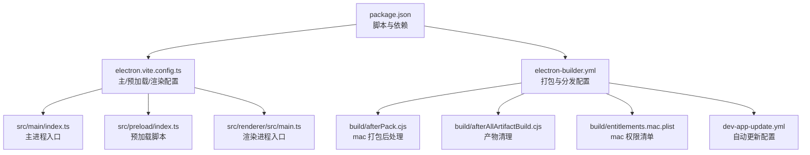
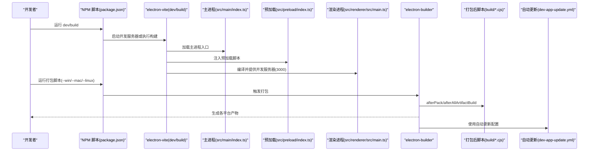
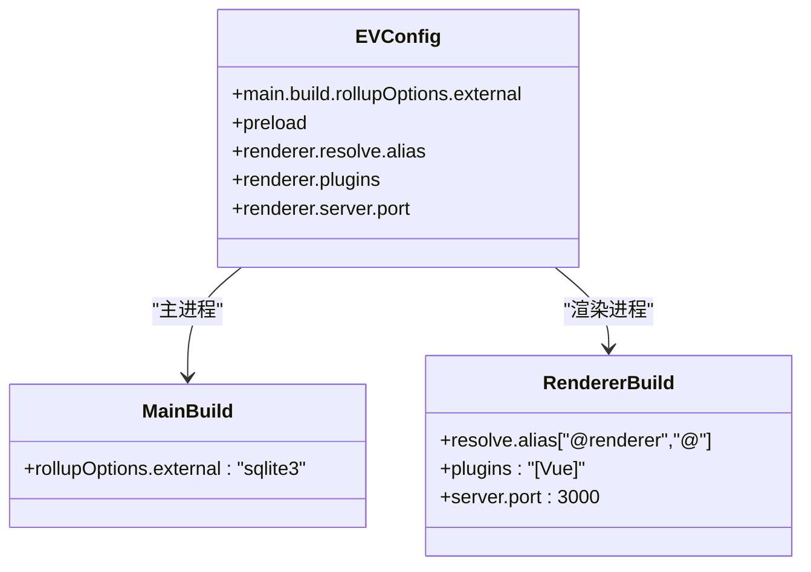
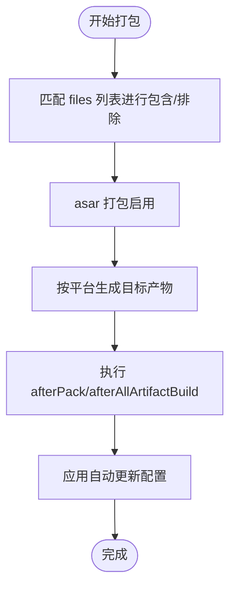
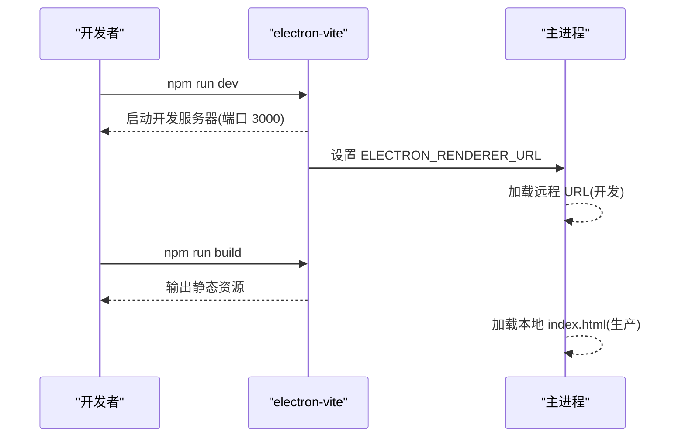
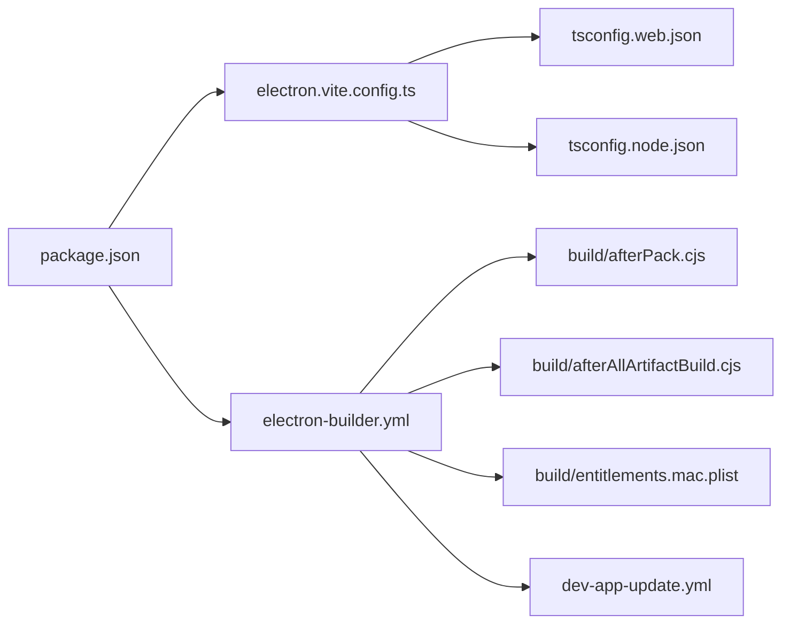

# 构建配置

<cite>
**本文引用的文件**
- [electron.vite.config.ts](file://electron.vite.config.ts)
- [electron-builder.yml](file://electron-builder.yml)
- [package.json](file://package.json)
- [dev-app-update.yml](file://dev-app-update.yml)
- [tsconfig.json](file://tsconfig.json)
- [tsconfig.node.json](file://tsconfig.node.json)
- [tsconfig.web.json](file://tsconfig.web.json)
- [jsconfig.json](file://jsconfig.json)
- [build/afterPack.cjs](file://build/afterPack.cjs)
- [build/afterAllArtifactBuild.cjs](file://build/afterAllArtifactBuild.cjs)
- [build/entitlements.mac.plist](file://build/entitlements.mac.plist)
- [src/main/index.ts](file://src/main/index.ts)
- [src/preload/index.ts](file://src/preload/index.ts)
- [src/renderer/src/main.ts](file://src/renderer/src/main.ts)
</cite>

## 目录

1. [简介](#简介)
2. [项目结构](#项目结构)
3. [核心组件](#核心组件)
4. [架构总览](#架构总览)
5. [详细组件分析](#详细组件分析)
6. [依赖关系分析](#依赖关系分析)
7. [性能考量](#性能考量)
8. [故障排查指南](#故障排查指南)
9. [结论](#结论)
10. [附录](#附录)

## 简介

本文件系统性梳理 MyTool 的构建配置，围绕以下目标展开：

- 解释 electron-vite 配置项：开发服务器端口、别名与插件、主进程外部化等。
- 解释 electron-builder 配置项：应用标识符、产品名称、压缩级别、asar 打包、平台目标、安装器参数、自动更新配置、打包后处理脚本等。
- 说明文件过滤规则、资源包含与排除策略。
- 对比开发与生产模式的差异（如开发服务器、加载入口）。
- 提供构建性能优化建议与常见问题解决方案。

## 项目结构

本项目采用 Electron + Vue + TypeScript 技术栈，使用 electron-vite 作为 Vite 插件化的 Electron 开发与构建工具，electron-builder 负责多平台打包与分发。TypeScript 通过多 tsconfig 文件分别约束 Node 主进程、Web 渲染进程与预加载脚本。

图表来源

- [package.json:8-22](file://package.json#L8-L22)
- [electron.vite.config.ts:5-26](file://electron.vite.config.ts#L5-L26)
- [electron-builder.yml:1-60](file://electron-builder.yml#L1-L60)
- [src/main/index.ts:12-42](file://src/main/index.ts#L12-L42)
- [src/preload/index.ts:1-37](file://src/preload/index.ts#L1-L37)
- [src/renderer/src/main.ts:1-24](file://src/renderer/src/main.ts#L1-L24)
- [build/afterPack.cjs:12-56](file://build/afterPack.cjs#L12-L56)
- [build/afterAllArtifactBuild.cjs:12-28](file://build/afterAllArtifactBuild.cjs#L12-L28)
- [build/entitlements.mac.plist:1-13](file://build/entitlements.mac.plist#L1-L13)
- [dev-app-update.yml:1-4](file://dev-app-update.yml#L1-L4)

章节来源

- [package.json:8-22](file://package.json#L8-L22)
- [electron.vite.config.ts:5-26](file://electron.vite.config.ts#L5-L26)
- [electron-builder.yml:1-60](file://electron-builder.yml#L1-L60)
- [tsconfig.json:1-11](file://tsconfig.json#L1-L11)
- [tsconfig.node.json:1-9](file://tsconfig.node.json#L1-L9)
- [tsconfig.web.json:1-22](file://tsconfig.web.json#L1-L22)
- [jsconfig.json:1-9](file://jsconfig.json#L1-L9)

## 核心组件

- electron-vite 配置：定义主进程、预加载与渲染进程的构建行为，含别名、插件、开发服务器端口以及主进程外部化 sqlite3。
- electron-builder 配置：定义应用元信息、压缩级别、asar 打包、平台目标、安装器参数、自动更新、打包后钩子与产物清理。
- TypeScript 多配置：分别约束 Node 主进程、Web 渲染进程与预加载脚本的编译路径与别名。
- 打包后脚本：mac 平台精简语言包与无用库；统一保留关键产物并清理其余文件。
- 自动更新配置：通用发布提供商与更新地址，缓存目录命名。

章节来源

- [electron.vite.config.ts:5-26](file://electron.vite.config.ts#L5-L26)
- [electron-builder.yml:1-60](file://electron-builder.yml#L1-L60)
- [tsconfig.node.json:1-9](file://tsconfig.node.json#L1-L9)
- [tsconfig.web.json:1-22](file://tsconfig.web.json#L1-L22)
- [build/afterPack.cjs:12-56](file://build/afterPack.cjs#L12-L56)
- [build/afterAllArtifactBuild.cjs:12-28](file://build/afterAllArtifactBuild.cjs#L12-L28)
- [dev-app-update.yml:1-4](file://dev-app-update.yml#L1-L4)

## 架构总览

下图展示从开发到打包的关键流程与配置交互：

图表来源

- [package.json:8-22](file://package.json#L8-L22)
- [electron.vite.config.ts:22-24](file://electron.vite.config.ts#L22-L24)
- [src/main/index.ts:37-41](file://src/main/index.ts#L37-L41)
- [electron-builder.yml:54-59](file://electron-builder.yml#L54-L59)
- [build/afterPack.cjs:12-56](file://build/afterPack.cjs#L12-L56)
- [build/afterAllArtifactBuild.cjs:12-28](file://build/afterAllArtifactBuild.cjs#L12-L28)
- [dev-app-update.yml:1-4](file://dev-app-update.yml#L1-L4)

## 详细组件分析

### electron-vite 配置详解

- 主进程构建
  - 外部化 sqlite3：避免将原生模块打包进主进程产物，减少体积与兼容性问题。
- 预加载
  - 空配置，沿用默认行为。
- 渲染进程
  - 别名：@renderer 与 @ 指向渲染源码根目录，便于统一导入。
  - 插件：启用 Vue 插件支持。
  - 开发服务器：端口 3000，用于本地热重载与调试。
- 类关系示意

图表来源

- [electron.vite.config.ts:5-26](file://electron.vite.config.ts#L5-L26)

章节来源

- [electron.vite.config.ts:5-26](file://electron.vite.config.ts#L5-L26)

### electron-builder 配置详解

- 应用标识与名称
  - appId：应用唯一标识。
  - productName：最终安装包与应用显示名称。
- 压缩与打包
  - compression: maximum：最大压缩级别。
  - asar: true：启用 asar 打包。
  - asarUnpack：对 resources/\*\* 进行解包，以便运行时访问资源。
- 目录与输出
  - buildResources：构建资源目录。
  - output：输出目录模板，按平台分目录存放。
- 文件过滤规则
  - 排除 .vscode、src、配置文件、文档、示例与 node_modules 中的文档与工具文件。
  - 排除 .env、.npmrc、锁文件与 tsconfig 文件。
- 平台与安装器
  - Windows：nsis 安装器，x64 架构，可自定义可执行名。
  - macOS：权限清单、启动菜单与桌面快捷方式、DMG 目标与产物命名。
  - Linux：AppImage、snap、deb 目标，维护者与分类。
- 自动更新
  - provider: generic，更新地址与通道，缓存目录命名。
- 打包后钩子
  - afterPack：mac 平台精简语言包与无用库。
  - afterAllArtifactBuild：仅保留必要产物并清理其他文件。

图表来源

- [electron-builder.yml:8-19](file://electron-builder.yml#L8-L19)
- [electron-builder.yml:70-79](file://electron-builder.yml#L70-L79)
- [build/afterPack.cjs:12-56](file://build/afterPack.cjs#L12-L56)
- [build/afterAllArtifactBuild.cjs:12-28](file://build/afterAllArtifactBuild.cjs#L12-L28)
- [dev-app-update.yml:1-4](file://dev-app-update.yml#L1-L4)

章节来源

- [electron-builder.yml:1-60](file://electron-builder.yml#L1-L60)
- [build/afterPack.cjs:12-56](file://build/afterPack.cjs#L12-L56)
- [build/afterAllArtifactBuild.cjs:12-28](file://build/afterAllArtifactBuild.cjs#L12-L28)
- [dev-app-update.yml:1-4](file://dev-app-update.yml#L1-L4)

### TypeScript 多配置与别名映射

- 根 tsconfig：聚合 node 与 web 两个工程，并在编译器选项中配置 @ 与 @renderer 的路径映射。
- tsconfig.node：限定 Node 主进程与预加载脚本的编译范围，启用 electron-vite/node 类型。
- tsconfig.web：限定渲染进程与类型声明的编译范围，包含 Vue 组件与 env.d.ts。
- jsconfig：基础别名配置，排除 node_modules 与 dist。

章节来源

- [tsconfig.json:1-11](file://tsconfig.json#L1-L11)
- [tsconfig.node.json:1-9](file://tsconfig.node.json#L1-L9)
- [tsconfig.web.json:1-22](file://tsconfig.web.json#L1-L22)
- [jsconfig.json:1-9](file://jsconfig.json#L1-L9)

### 开发与生产模式差异

- 开发模式
  - electron-vite dev 启动开发服务器，渲染进程监听 3000 端口。
  - 主进程通过 ELECTRON_RENDERER_URL 加载远程 URL，实现热重载。
- 生产模式
  - electron-vite build 产出静态资源，主进程加载本地 index.html。
  - electron-builder 生成各平台安装包或便携版本。

图表来源

- [electron.vite.config.ts:22-24](file://electron.vite.config.ts#L22-L24)
- [src/main/index.ts:37-41](file://src/main/index.ts#L37-L41)

章节来源

- [electron.vite.config.ts:22-24](file://electron.vite.config.ts#L22-L24)
- [src/main/index.ts:37-41](file://src/main/index.ts#L37-L41)

### 打包后处理与资源管理

- mac 平台精简
  - afterPack：移除 Electron Framework 中非必要的语言包与无用库，减小体积。
- 产物清理
  - afterAllArtifactBuild：仅保留 dmg、zip、latest-mac.yml 及其 blockmap，删除其他中间产物。

章节来源

- [build/afterPack.cjs:12-56](file://build/afterPack.cjs#L12-L56)
- [build/afterAllArtifactBuild.cjs:12-28](file://build/afterAllArtifactBuild.cjs#L12-L28)

### 自动更新配置

- provider: generic，指向通用发布服务。
- 更新地址与通道：用于分发更新元数据。
- 缓存目录命名：控制更新缓存位置。

章节来源

- [dev-app-update.yml:1-4](file://dev-app-update.yml#L1-L4)
- [electron-builder.yml:54-57](file://electron-builder.yml#L54-L57)

## 依赖关系分析

- 脚本与工具链
  - NPM 脚本串联 electron-vite 与 electron-builder，覆盖开发、构建与多平台打包。
  - 依赖包括 electron、electron-builder、electron-vite、Vue、TypeScript 等。
- 配置耦合点
  - electron.vite.config.ts 的别名与 tsconfig.web.json 的路径映射保持一致，确保开发与构建一致性。
  - electron-builder 的 asar 与 asarUnpack 需与运行时资源访问策略匹配。

图表来源

- [package.json:8-22](file://package.json#L8-L22)
- [electron.vite.config.ts:15-24](file://electron.vite.config.ts#L15-L24)
- [electron-builder.yml:7-19](file://electron-builder.yml#L7-L19)
- [tsconfig.web.json:9-21](file://tsconfig.web.json#L9-L21)
- [tsconfig.node.json:3-7](file://tsconfig.node.json#L3-L7)
- [build/afterPack.cjs:12-56](file://build/afterPack.cjs#L12-L56)
- [build/afterAllArtifactBuild.cjs:12-28](file://build/afterAllArtifactBuild.cjs#L12-L28)
- [build/entitlements.mac.plist:1-13](file://build/entitlements.mac.plist#L1-L13)
- [dev-app-update.yml:1-4](file://dev-app-update.yml#L1-L4)

章节来源

- [package.json:8-22](file://package.json#L8-L22)
- [electron.vite.config.ts:15-24](file://electron.vite.config.ts#L15-L24)
- [electron-builder.yml:7-19](file://electron-builder.yml#L7-L19)
- [tsconfig.web.json:9-21](file://tsconfig.web.json#L9-L21)
- [tsconfig.node.json:3-7](file://tsconfig.node.json#L3-L7)

## 性能考量

- 构建性能
  - 使用 asar 打包可提升加载性能并减小体积，但需注意某些原生模块与动态加载场景的兼容性。
  - external sqlite3：避免将原生模块打入主进程产物，降低打包复杂度与体积。
  - 最大压缩级别：在可接受的构建时间范围内提升产物压缩率。
- 产物体积
  - mac 平台 afterPack 精简语言包与无用库，显著降低 .app 体积。
  - afterAllArtifactBuild 仅保留关键产物，避免磁盘占用。
- 开发体验
  - 渲染进程 3000 端口与 HMR：快速迭代与热更新。
  - TypeScript 分层配置：明确编译边界，减少类型检查开销。

[本节为通用性能建议，不直接分析具体文件]

## 故障排查指南

- 无法加载远程开发页面
  - 确认开发服务器已启动且端口未被占用。
  - 确认主进程在开发模式下设置了正确的 ELECTRON_RENDERER_URL。
- 打包后资源缺失
  - 检查 electron-builder 的 files 过滤规则与 asarUnpack 是否覆盖所需资源。
- macOS 无法签名或上架
  - 检查 entitlements.mac.plist 内容是否满足需求。
  - 确认 notarize 配置与证书状态。
- 自动更新失败
  - 确认 dev-app-update.yml 的 provider、url 与通道配置正确。
  - 确保发布服务器可访问且返回有效元数据。
- 打包产物过多或过少
  - 检查 afterAllArtifactBuild 的保留规则是否符合预期。
  - 如需保留更多产物，调整 isKeptFile 判定逻辑。

章节来源

- [src/main/index.ts:37-41](file://src/main/index.ts#L37-L41)
- [electron-builder.yml:8-19](file://electron-builder.yml#L8-L19)
- [build/afterPack.cjs:12-56](file://build/afterPack.cjs#L12-L56)
- [build/afterAllArtifactBuild.cjs:4-10](file://build/afterAllArtifactBuild.cjs#L4-L10)
- [dev-app-update.yml:1-4](file://dev-app-update.yml#L1-L4)

## 结论

本项目的构建配置以 electron-vite 与 electron-builder 为核心，结合多 tsconfig 的路径别名体系，实现了清晰的开发与生产流程。通过合理的 asar、external 与过滤规则，兼顾了性能与可维护性；mac 平台的打包后处理进一步优化了产物体积。遵循本文档的差异说明与优化建议，可在不同环境下稳定地构建与分发应用。

[本节为总结性内容，不直接分析具体文件]

## 附录

- 关键配置要点速览
  - electron-vite：渲染进程别名、Vue 插件、开发服务器端口、主进程 external。
  - electron-builder：appId/productName、compression、asar、asarUnpack、平台目标、安装器参数、自动更新、打包后钩子。
  - TypeScript：根 tsconfig 聚合、node/web 分层配置、jsconfig 别名。
  - 打包后脚本：mac 精简、产物清理。
  - 自动更新：通用发布提供商与更新地址。

[本节为概览性内容，不直接分析具体文件]
