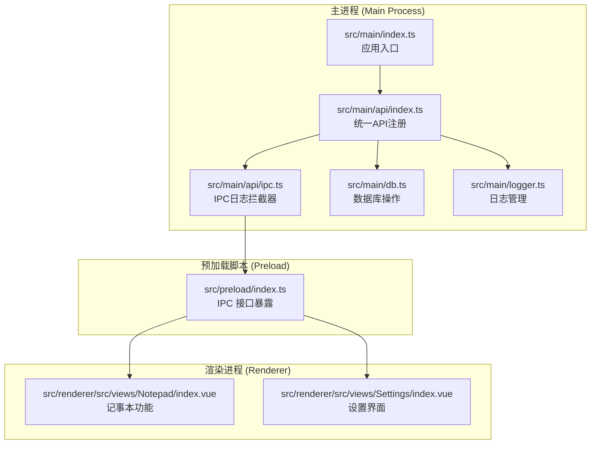
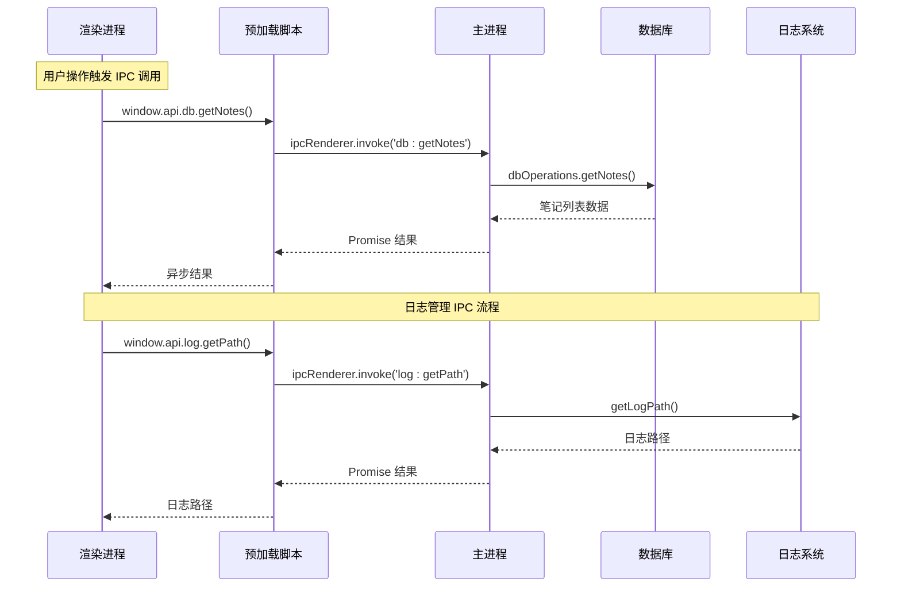
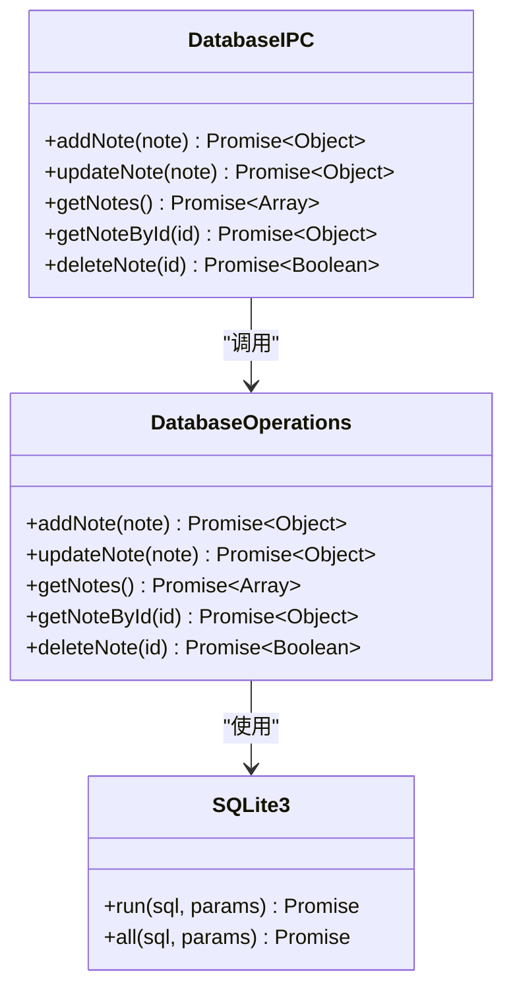
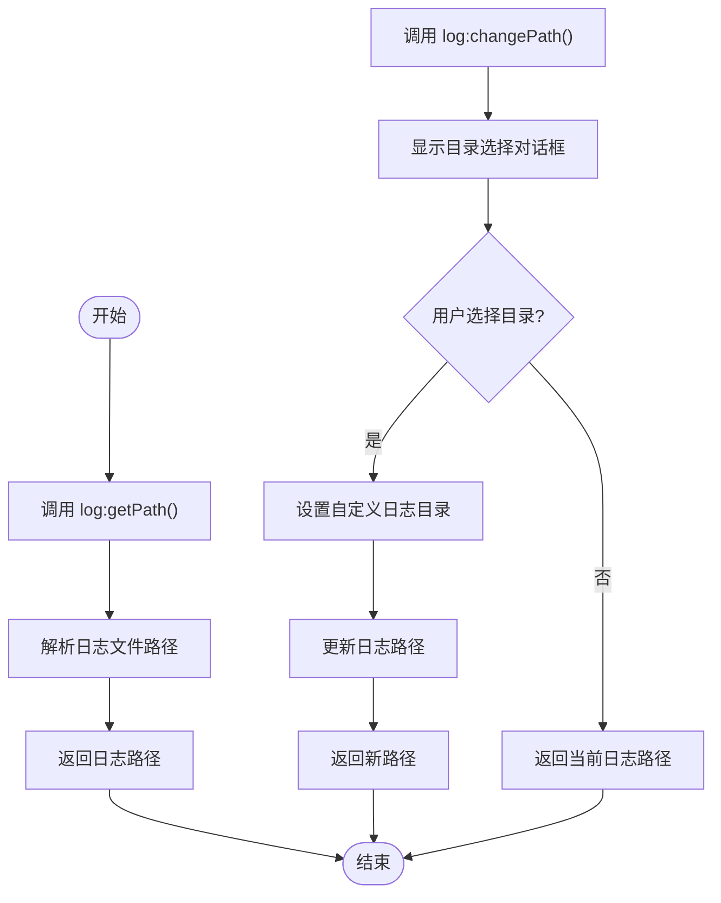
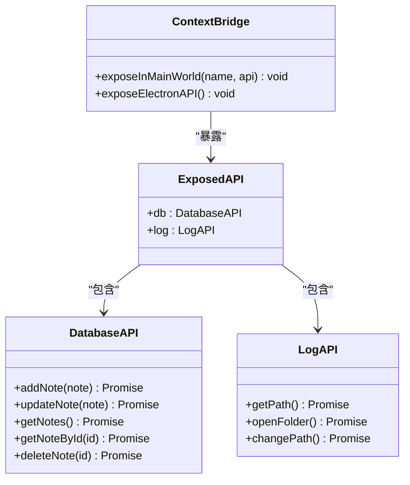
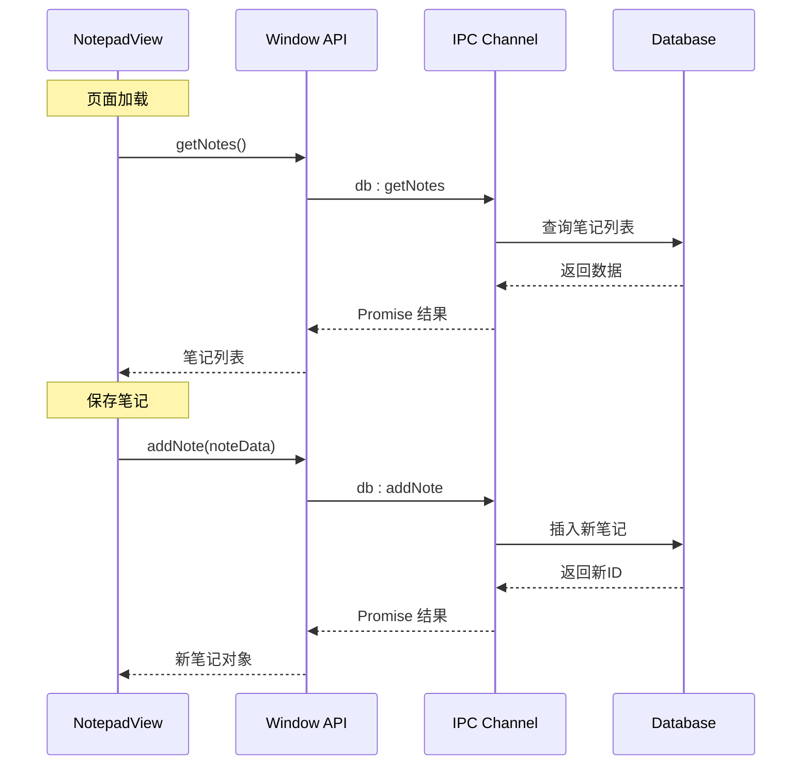
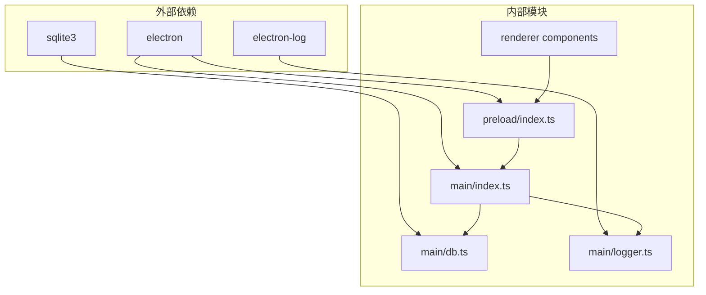
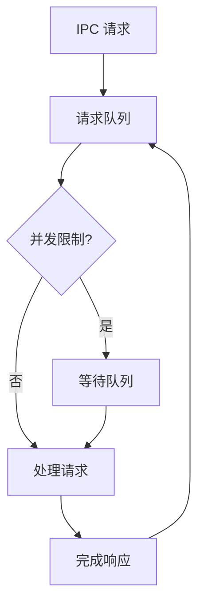

# IPC 通信机制

<cite>
**本文档引用的文件**
- [src/main/index.ts](file://src/main/index.ts)
- [src/preload/index.ts](file://src/preload/index.ts)
- [src/main/db.ts](file://src/main/db.ts)
- [src/main/logger.ts](file://src/main/logger.ts)
- [src/renderer/src/views/Notepad/index.vue](file://src/renderer/src/views/Notepad/index.vue)
- [src/renderer/src/views/Settings/index.vue](file://src/renderer/src/views/Settings/index.vue)
- [package.json](file://package.json)
</cite>

## 目录

1. [简介](#简介)
2. [项目结构](#项目结构)
3. [核心组件](#核心组件)
4. [架构概览](#架构概览)
5. [详细组件分析](#详细组件分析)
6. [依赖关系分析](#依赖关系分析)
7. [性能考虑](#性能考虑)
8. [故障排除指南](#故障排除指南)
9. [结论](#结论)

## 简介

MyTool 应用程序采用 Electron 框架构建，实现了主进程与渲染进程之间的高效 IPC（进程间通信）机制。该系统通过 `ipcMain.handle` 和 `ipcRenderer.invoke` 实现双向异步通信，支持数据库操作和日志管理等核心功能。

本文档深入解析了 IPC 通信的实现原理、通道设计、错误处理机制以及性能优化策略，为开发者提供了全面的技术指导。

## 项目结构

MyTool 项目采用标准的 Electron 应用程序结构，主要分为三个核心部分：

**图表来源**

- [src/main/index.ts:1-112](file://src/main/index.ts#L1-L112)
- [src/preload/index.ts:1-37](file://src/preload/index.ts#L1-L37)

**章节来源**

- [src/main/index.ts:1-112](file://src/main/index.ts#L1-L112)
- [src/preload/index.ts:1-37](file://src/preload/index.ts#L1-L37)

## 核心组件

### 主进程 IPC 处理器

在应用入口通过 `setupAllAPIs()` (位于 `src/main/api/index.ts`) 集中注册所有的 IPC 接口。
主进程通过封装好的 `ipcHandleWithLog` (位于 `src/main/api/ipc.ts`) 方法注册了以下主要模块通道，它在底层封装了 `ipcMain.handle` 并在执行前后自动输出规范化的请求日志（如耗时、参数拦截、错误堆栈抛出）：

1. **数据库操作通道** (`db:*`)
2. **日志管理通道** (`log:*`)
3. **文件与多媒体操作** (`file:*`, `media:*`)

### 预加载脚本 API 暴露

预加载脚本通过 `contextBridge` 安全地向渲染进程暴露了定制化的 API 接口，确保了上下文隔离的安全性。

### 渲染进程 IPC 调用

渲染进程通过 `window.api` 对象访问预加载脚本暴露的方法，实现异步的 IPC 调用。

**章节来源**

- [src/main/index.ts:61-85](file://src/main/index.ts#L61-L85)
- [src/preload/index.ts:5-19](file://src/preload/index.ts#L5-L19)

## 架构概览

MyTool 的 IPC 通信架构采用了分层设计，确保了安全性、可维护性和性能：

**图表来源**

- [src/renderer/src/views/Notepad/index.vue:217-224](file://src/renderer/src/views/Notepad/index.vue#L217-L224)
- [src/renderer/src/views/Settings/index.vue:74-76](file://src/renderer/src/views/Settings/index.vue#L74-L76)
- [src/preload/index.ts:7-17](file://src/preload/index.ts#L7-L17)

## 详细组件分析

### 数据库 IPC 通道设计

数据库 IPC 通道实现了完整的 CRUD 操作，每个操作都通过独立的通道进行：

#### 通道定义与实现

**图表来源**

- [src/main/index.ts:80-85](file://src/main/index.ts#L80-L85)
- [src/main/db.ts:58-99](file://src/main/db.ts#L58-L99)

#### 数据库操作流程

每个数据库操作都遵循统一的异步处理模式：

1. **参数验证**：确保传入的数据格式正确
2. **SQL 执行**：通过封装的 Promise 方法执行数据库操作
3. **结果处理**：返回标准化的数据结构
4. **错误传播**：将数据库错误传递给调用方

**章节来源**

- [src/main/index.ts:80-85](file://src/main/index.ts#L80-L85)
- [src/main/db.ts:58-99](file://src/main/db.ts#L58-L99)

### 日志管理 IPC 通道设计

日志管理通道提供了灵活的日志路径管理功能：

#### 通道功能

| 通道名称         | 功能描述             | 参数类型 | 返回值类型        |
| ---------------- | -------------------- | -------- | ----------------- |
| `log:getPath`    | 获取当前日志文件路径 | 无       | `Promise<string>` |
| `log:openFolder` | 打开日志文件夹       | 无       | `Promise<void>`   |
| `log:changePath` | 更改日志存储目录     | 无       | `Promise<string>` |

#### 日志路径管理流程

**图表来源**

- [src/main/index.ts:61-73](file://src/main/index.ts#L61-L73)
- [src/main/logger.ts:25-39](file://src/main/logger.ts#L25-L39)

**章节来源**

- [src/main/index.ts:61-73](file://src/main/index.ts#L61-L73)
- [src/main/logger.ts:25-39](file://src/main/logger.ts#L25-L39)

### 预加载脚本安全桥接

预加载脚本通过 `contextBridge` 实现了安全的 API 暴露：

**图表来源**

- [src/preload/index.ts:24-36](file://src/preload/index.ts#L24-L36)
- [src/preload/index.ts:5-19](file://src/preload/index.ts#L5-L19)

**章节来源**

- [src/preload/index.ts:24-36](file://src/preload/index.ts#L24-L36)
- [src/preload/index.ts:5-19](file://src/preload/index.ts#L5-L19)

### 渲染进程 IPC 调用模式

渲染进程通过统一的 API 接口访问主进程功能：

#### 记事本功能中的 IPC 使用

在记事本组件中，IPC 调用贯穿了整个数据生命周期：

**图表来源**

- [src/renderer/src/views/Notepad/index.vue:217-224](file://src/renderer/src/views/Notepad/index.vue#L217-L224)
- [src/renderer/src/views/Notepad/index.vue:313-344](file://src/renderer/src/views/Notepad/index.vue#L313-L344)

**章节来源**

- [src/renderer/src/views/Notepad/index.vue:217-224](file://src/renderer/src/views/Notepad/index.vue#L217-L224)
- [src/renderer/src/views/Notepad/index.vue:313-344](file://src/renderer/src/views/Notepad/index.vue#L313-L344)

## 依赖关系分析

### 核心依赖关系

MyTool 的 IPC 通信依赖关系清晰明确，形成了稳定的分层架构：

**图表来源**

- [package.json:23-38](file://package.json#L23-L38)
- [src/main/index.ts:1-112](file://src/main/index.ts#L1-L112)

### IPC 通道依赖矩阵

| 通道名称         | 调用方                      | 处理方                     | 数据类型               | 错误处理       |
| ---------------- | --------------------------- | -------------------------- | ---------------------- | -------------- |
| `db:addNote`     | `window.api.db.addNote`     | `dbOperations.addNote`     | `{title, content}`     | 数据库异常     |
| `db:updateNote`  | `window.api.db.updateNote`  | `dbOperations.updateNote`  | `{id, title, content}` | 数据库异常     |
| `db:getNotes`    | `window.api.db.getNotes`    | `dbOperations.getNotes`    | 无                     | 数据库异常     |
| `db:getNoteById` | `window.api.db.getNoteById` | `dbOperations.getNoteById` | `id`                   | 数据库异常     |
| `db:deleteNote`  | `window.api.db.deleteNote`  | `dbOperations.deleteNote`  | `id`                   | 数据库异常     |
| `log:getPath`    | `window.api.log.getPath`    | `logger.getPath`           | 无                     | 文件系统异常   |
| `log:openFolder` | `window.api.log.openFolder` | `logger.openFolder`        | 无                     | Shell 打开异常 |
| `log:changePath` | `window.api.log.changePath` | `logger.setLogPath`        | 无                     | 对话框取消     |

**章节来源**

- [src/main/index.ts:80-85](file://src/main/index.ts#L80-L85)
- [src/main/index.ts:61-73](file://src/main/index.ts#L61-L73)
- [src/preload/index.ts:7-17](file://src/preload/index.ts#L7-L17)

## 性能考虑

### 异步通信优化

MyTool 的 IPC 通信采用了高效的异步处理模式，避免了阻塞主线程：

1. **Promise 包装**：所有数据库操作都返回 Promise 对象
2. **延迟加载**：数据库模块在应用准备完成后才加载
3. **错误快速返回**：异常情况立即返回，避免长时间等待

### 数据传输优化

针对数据库查询进行了专门的性能优化：

- **选择性字段查询**：列表查询只返回必要字段，避免传输大文本内容
- **时间戳优化**：使用 Unix 时间戳进行排序和过滤
- **批量操作支持**：为未来的批量操作预留接口

### 并发控制策略

**图表来源**

- [src/main/db.ts:37-55](file://src/main/db.ts#L37-L55)

### 内存管理

- **数据库连接池**：SQLite3 连接在内存中复用
- **Promise 缓存**：避免重复的数据库查询
- **资源清理**：组件卸载时自动清理编辑器资源

**章节来源**

- [src/main/db.ts:37-55](file://src/main/db.ts#L37-L55)
- [src/renderer/src/views/Notepad/index.vue:158-162](file://src/renderer/src/views/Notepad/index.vue#L158-L162)

## 故障排除指南

### 常见错误类型及解决方案

#### 数据库连接错误

**症状**：`Failed to load db module` 日志

**原因**：

- 应用程序 userData 目录尚未初始化
- SQLite3 模块加载失败

**解决方案**：

- 确保在 `app.whenReady()` 事件后加载数据库模块
- 检查应用程序权限和磁盘空间

#### IPC 调用超时

**症状**：渲染进程长时间无响应

**原因**：

- 数据库查询过于复杂
- 网络阻塞（如果扩展了网络功能）

**解决方案**：

- 优化 SQL 查询语句
- 添加适当的超时机制
- 实现进度反馈

#### 上下文隔离问题

**症状**：`window.api` 未定义

**原因**：

- 预加载脚本加载失败
- 上下文隔离配置问题

**解决方案**：

- 检查预加载脚本的语法错误
- 确认 `contextIsolation: true` 配置

### 调试技巧

1. **启用详细日志**：在开发环境中增加日志级别
2. **使用 Electron DevTools**：监控 IPC 通信过程
3. **单元测试**：为关键 IPC 通道编写测试用例

**章节来源**

- [src/main/index.ts:89-92](file://src/main/index.ts#L89-L92)
- [src/preload/index.ts:24-30](file://src/preload/index.ts#L24-L30)

## 结论

MyTool 的 IPC 通信机制展现了现代 Electron 应用的最佳实践：

### 设计优势

1. **安全性**：通过 `contextBridge` 实现安全的 API 暴露
2. **可维护性**：清晰的分层架构和模块化设计
3. **性能**：异步处理和优化的数据传输策略
4. **可靠性**：完善的错误处理和恢复机制

### 技术亮点

- **标准化的 IPC 通道设计**：统一的命名约定和数据格式
- **优雅的错误处理**：从底层数据库异常到上层用户反馈的完整链路
- **性能优化**：针对数据库操作的专门优化策略
- **安全考虑**：上下文隔离和最小权限原则

### 改进建议

1. **添加 IPC 通道监控**：实现通信统计和性能分析
2. **增强错误恢复**：实现自动重连和降级策略
3. **扩展并发控制**：支持更复杂的并发场景
4. **完善测试覆盖**：为 IPC 通道添加自动化测试

这个 IPC 通信系统为 MyTool 提供了稳定、高效、安全的进程间通信基础，为后续功能扩展奠定了坚实的技术基础。
