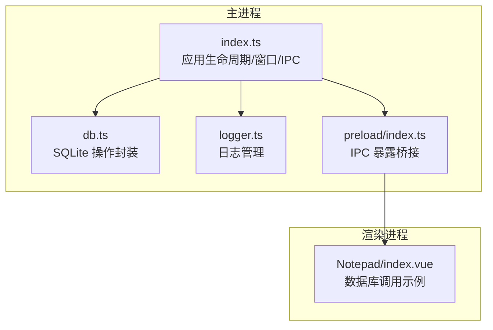
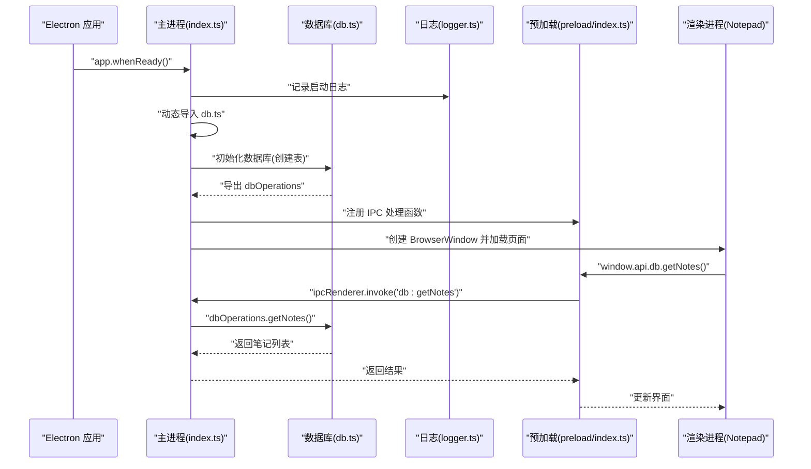
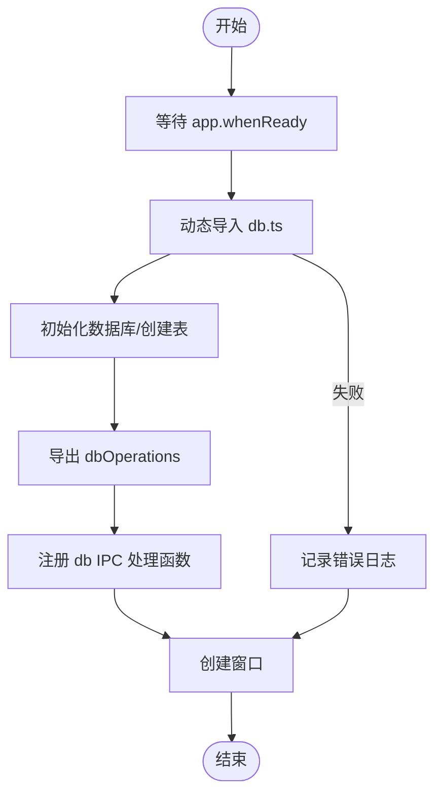
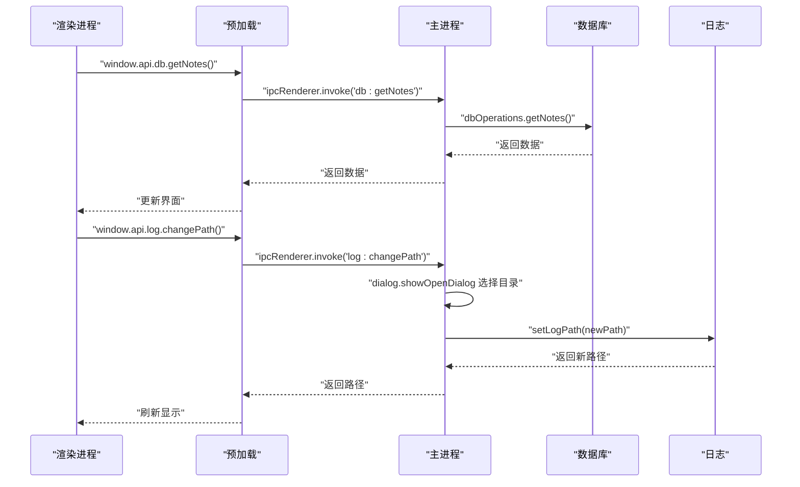
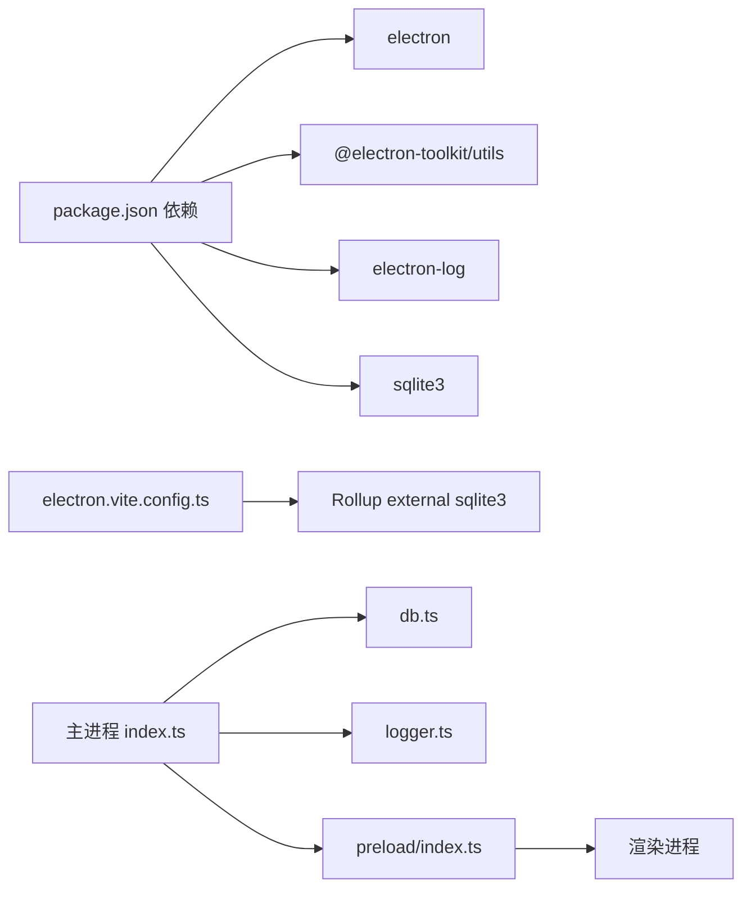

# 主进程设计

<cite>
**本文引用的文件**
- [src/main/index.ts](file://src/main/index.ts)
- [src/main/db.ts](file://src/main/db.ts)
- [src/main/logger.ts](file://src/main/logger.ts)
- [src/preload/index.ts](file://src/preload/index.ts)
- [src/preload/index.d.ts](file://src/preload/index.d.ts)
- [electron.vite.config.ts](file://electron.vite.config.ts)
- [package.json](file://package.json)
- [src/renderer/src/views/Notepad/index.vue](file://src/renderer/src/views/Notepad/index.vue)
</cite>

## 目录

1. [简介](#简介)
2. [项目结构](#项目结构)
3. [核心组件](#核心组件)
4. [架构总览](#架构总览)
5. [详细组件分析](#详细组件分析)
6. [依赖关系分析](#依赖关系分析)
7. [性能考虑](#性能考虑)
8. [故障排查指南](#故障排查指南)
9. [结论](#结论)
10. [附录](#附录)

## 简介

本文件面向 MyTool 的主进程设计，系统性阐述主进程的核心职责与实现机制，涵盖应用生命周期管理、窗口创建与配置、系统级功能（文件对话框、日志管理）、数据库模块的动态加载与错误处理策略、IPC 事件监听注册（含日志相关处理）、以及关键流程与时序图。同时提供安全配置建议、性能优化要点与故障排查清单，帮助开发者快速理解并维护主进程。

## 项目结构

主进程入口位于 src/main/index.ts，负责：

- 应用生命周期事件处理（app.whenReady、window-all-closed、activate）
- 浏览器窗口创建与配置（BrowserWindow、webPreferences、preload）
- 动态加载数据库模块（延迟导入 db.ts）与错误兜底
- 注册 IPC 事件监听（日志管理、数据库操作）
- 预加载脚本桥接（src/preload/index.ts）

构建配置通过 electron-vite 控制主进程打包，外部 sqlite3 通过 Rollup external 处理，避免打包进主进程二进制。

图表来源

- [src/main/index.ts:1-112](file://src/main/index.ts#L1-L112)
- [src/main/db.ts:1-100](file://src/main/db.ts#L1-L100)
- [src/main/logger.ts:1-42](file://src/main/logger.ts#L1-L42)
- [src/preload/index.ts:1-37](file://src/preload/index.ts#L1-L37)
- [src/renderer/src/views/Notepad/index.vue:1-599](file://src/renderer/src/views/Notepad/index.vue#L1-L599)

章节来源

- [src/main/index.ts:1-112](file://src/main/index.ts#L1-L112)
- [electron.vite.config.ts:1-27](file://electron.vite.config.ts#L1-L27)
- [package.json:1-61](file://package.json#L1-L61)

## 核心组件

- 应用生命周期与窗口管理：在 app.whenReady 后初始化窗口、注册快捷键监控、处理窗口激活与关闭事件。
- 日志子系统：基于 electron-log，按日切分文件，支持自定义日志目录与打开日志文件夹。
- 数据库模块：动态加载 sqlite3，确保 app.getPath('userData') 可用后再初始化数据库；封装增删改查操作。
- 预加载桥接：通过 contextBridge 暴露受控 API 至渲染进程，统一数据库与日志 IPC 调用入口。
- 构建与打包：Rollup external sqlite3，避免主进程二进制体积膨胀。

章节来源

- [src/main/index.ts:1-112](file://src/main/index.ts#L1-L112)
- [src/main/logger.ts:1-42](file://src/main/logger.ts#L1-L42)
- [src/main/db.ts:1-100](file://src/main/db.ts#L1-L100)
- [src/preload/index.ts:1-37](file://src/preload/index.ts#L1-L37)
- [electron.vite.config.ts:1-27](file://electron.vite.config.ts#L1-L27)

## 架构总览

主进程采用“事件驱动 + 动态模块加载 + 受控 IPC”的架构：

- 生命周期事件驱动窗口创建与资源释放
- 数据库模块延迟加载，避免 app.getPath 未就绪导致异常
- 预加载脚本暴露统一 API，渲染进程通过 invoke 调用主进程处理函数
- 日志模块贯穿启动、数据库、IPC 等关键路径，便于问题定位

图表来源

- [src/main/index.ts:47-99](file://src/main/index.ts#L47-L99)
- [src/main/db.ts:19-35](file://src/main/db.ts#L19-L35)
- [src/main/logger.ts:1-42](file://src/main/logger.ts#L1-L42)
- [src/preload/index.ts:1-37](file://src/preload/index.ts#L1-L37)
- [src/renderer/src/views/Notepad/index.vue:216-272](file://src/renderer/src/views/Notepad/index.vue#L216-L272)

## 详细组件分析

### 应用生命周期与窗口管理

- 关键事件
  - app.whenReady：初始化窗口、注册快捷键监控、动态加载数据库模块
  - activate：macOS 下 dock 图标点击时重建窗口
  - window-all-closed：非 macOS 平台退出应用
- 窗口创建
  - 宽高、菜单栏隐藏、Linux 平台图标设置
  - webPreferences 配置 preload 路径，sandbox 关闭
  - ready-to-show 显示窗口；setWindowOpenHandler 打开外部链接
  - 开发环境加载远程 URL，生产环境加载本地 HTML

章节来源

- [src/main/index.ts:12-42](file://src/main/index.ts#L12-L42)
- [src/main/index.ts:47-99](file://src/main/index.ts#L47-L99)
- [src/main/index.ts:104-108](file://src/main/index.ts#L104-L108)

### 数据库模块动态加载与错误处理

- 加载时机
  - 在 app.whenReady 之后动态 import('./db')，确保 app.getPath('userData') 可用
- 初始化与表结构
  - 确保 userData 目录存在，创建数据库文件 mytool_notes.db
  - 初始化 notes 表（id、title、content、create_time、update_time）
- 错误处理
  - 数据库打开失败记录日志；动态加载失败同样记录并继续创建窗口
- 操作封装
  - Promise 化 run 与 all，封装增删改查
  - 返回值包含时间戳等元信息，便于渲染层展示

图表来源

- [src/main/index.ts:75-92](file://src/main/index.ts#L75-L92)
- [src/main/db.ts:19-35](file://src/main/db.ts#L19-L35)

章节来源

- [src/main/index.ts:75-92](file://src/main/index.ts#L75-L92)
- [src/main/db.ts:1-100](file://src/main/db.ts#L1-L100)

### 日志管理与系统级功能

- 日志格式与级别
  - 文件与控制台均设置为 info 级别，文件名按日期切分
- 日志路径管理
  - 默认日志目录来自 electron-log；支持自定义目录并返回当日完整路径
  - 提供打开日志文件夹能力
- 系统级功能
  - 通过 dialog.showOpenDialog 提供日志目录选择，支持创建目录
  - IPC 处理函数：log:getPath、log:openFolder、log:changePath

章节来源

- [src/main/logger.ts:1-42](file://src/main/logger.ts#L1-L42)
- [src/main/index.ts:61-73](file://src/main/index.ts#L61-L73)

### 预加载桥接与 IPC 事件监听注册

- 预加载桥接
  - 通过 contextBridge 暴露 window.electron 与 window.api
  - window.api.db 与 window.api.log 对应主进程 IPC 名称
- IPC 注册
  - 主进程注册 db:_ 与 log:_ 相关处理函数
  - 渲染进程通过 window.api.db._ 或 window.api.log._ 调用

图表来源

- [src/preload/index.ts:1-37](file://src/preload/index.ts#L1-L37)
- [src/main/index.ts:61-85](file://src/main/index.ts#L61-L85)
- [src/main/db.ts:58-99](file://src/main/db.ts#L58-L99)
- [src/main/logger.ts:25-39](file://src/main/logger.ts#L25-L39)

章节来源

- [src/preload/index.ts:1-37](file://src/preload/index.ts#L1-L37)
- [src/preload/index.d.ts:1-22](file://src/preload/index.d.ts#L1-L22)
- [src/main/index.ts:61-85](file://src/main/index.ts#L61-L85)

### 渲染进程数据库调用示例

- 列表加载：window.api.db.getNotes()
- 单条详情：window.api.db.getNoteById(id)
- 删除：window.api.db.deleteNote(id)
- 保存/新建：window.api.db.addNote / updateNote（在 Notepad 组件中使用）

章节来源

- [src/renderer/src/views/Notepad/index.vue:216-319](file://src/renderer/src/views/Notepad/index.vue#L216-L319)

## 依赖关系分析

- 主进程依赖
  - electron、@electron-toolkit/utils、electron-log、sqlite3
  - electron-vite 构建工具链
- 打包策略
  - Rollup external sqlite3，避免打包进主进程二进制
- 运行时依赖
  - userData 目录用于存放 SQLite 数据库文件
  - 预加载脚本提供受控 IPC 接口

图表来源

- [package.json:23-38](file://package.json#L23-L38)
- [electron.vite.config.ts:8-11](file://electron.vite.config.ts#L8-L11)
- [src/main/index.ts:1-112](file://src/main/index.ts#L1-L112)
- [src/main/db.ts:1-100](file://src/main/db.ts#L1-L100)
- [src/main/logger.ts:1-42](file://src/main/logger.ts#L1-L42)
- [src/preload/index.ts:1-37](file://src/preload/index.ts#L1-L37)

章节来源

- [package.json:1-61](file://package.json#L1-L61)
- [electron.vite.config.ts:1-27](file://electron.vite.config.ts#L1-L27)

## 性能考虑

- 延迟加载数据库模块：在 app.whenReady 之后再 import('./db')，避免 app.getPath 未就绪导致异常，同时减少启动时阻塞
- 窗口显示策略：窗口创建时默认隐藏，ready-to-show 时再显示，提升首屏体验
- 数据查询优化：数据库查询仅返回必要字段（如列表页），避免传输富文本内容，降低 IPC 数据量
- 预加载桥接：通过 contextBridge 暴露受控 API，避免直接注入全局对象，减少潜在性能与安全风险
- 构建优化：external sqlite3，减小主进程二进制体积，缩短冷启动时间

章节来源

- [src/main/index.ts:75-92](file://src/main/index.ts#L75-L92)
- [src/main/index.ts:26-28](file://src/main/index.ts#L26-L28)
- [src/main/db.ts:82-86](file://src/main/db.ts#L82-L86)
- [electron.vite.config.ts:8-11](file://electron.vite.config.ts#L8-L11)

## 故障排查指南

- 应用无法启动或窗口不显示
  - 检查 app.whenReady 是否触发，确认动态导入 db.ts 成功
  - 查看日志文件路径与权限，确认日志目录可写
- 数据库无法初始化
  - 确认 userData 目录存在且可写；检查数据库文件路径
  - 若初始化失败，查看日志输出并确认 sqlite3 可用
- IPC 调用失败
  - 确认预加载桥接已正确暴露 window.api，并在渲染进程使用 window.api.db._ 或 window.api.log._
  - 检查主进程是否已注册对应 IPC 处理函数
- 日志目录变更无效
  - 确认 log:changePath 的返回值与实际路径一致；检查自定义目录权限
- macOS 窗口无法重建
  - 确认 activate 事件处理逻辑，确保 BrowserWindow.getAllWindows().length === 0 时重新创建窗口

章节来源

- [src/main/index.ts:47-99](file://src/main/index.ts#L47-L99)
- [src/main/db.ts:19-35](file://src/main/db.ts#L19-L35)
- [src/main/logger.ts:25-39](file://src/main/logger.ts#L25-L39)
- [src/preload/index.ts:24-36](file://src/preload/index.ts#L24-L36)

## 结论

主进程围绕“事件驱动 + 动态加载 + 受控 IPC”构建，既保证了启动性能与稳定性，又提供了清晰的日志与数据库能力。通过预加载桥接与严格的 IPC 设计，渲染进程可以安全地访问数据库与日志功能。建议在后续迭代中持续关注日志分级、数据库事务与错误重试策略，进一步提升健壮性与可观测性。

## 附录

- 安全配置建议
  - webPreferences.sandbox 保持关闭时，确保仅暴露必要的 API（已在预加载中实现）
  - 使用 contextIsolation 与 contextBridge，避免直接注入全局对象
  - 对外部链接打开进行白名单校验（当前 setWindowOpenHandler 拒绝所有外部链接）
- 性能优化建议
  - 列表页仅返回必要字段，富文本内容按需加载
  - 数据库查询增加索引（如按 update_time 排序的索引）
  - 预加载桥接方法尽量复用，减少重复 IPC 调用
- 故障排查清单
  - 检查 app.getPath('userData') 是否可用
  - 确认 sqlite3 可用且版本兼容
  - 校验日志目录权限与磁盘空间
  - 验证预加载桥接是否成功暴露 window.api
