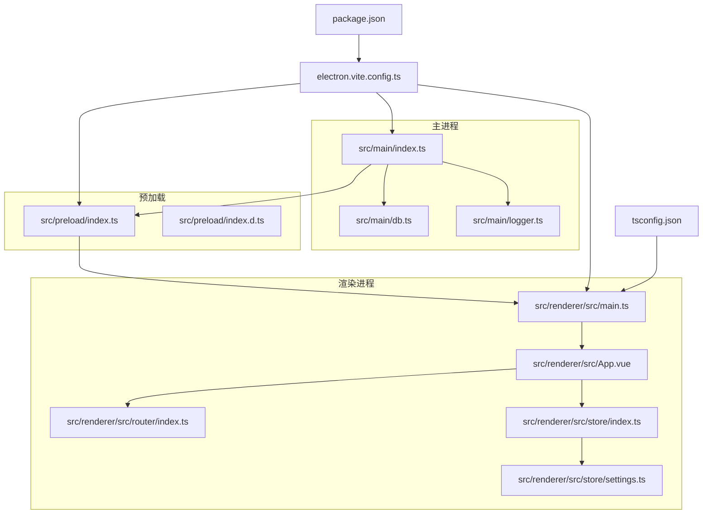
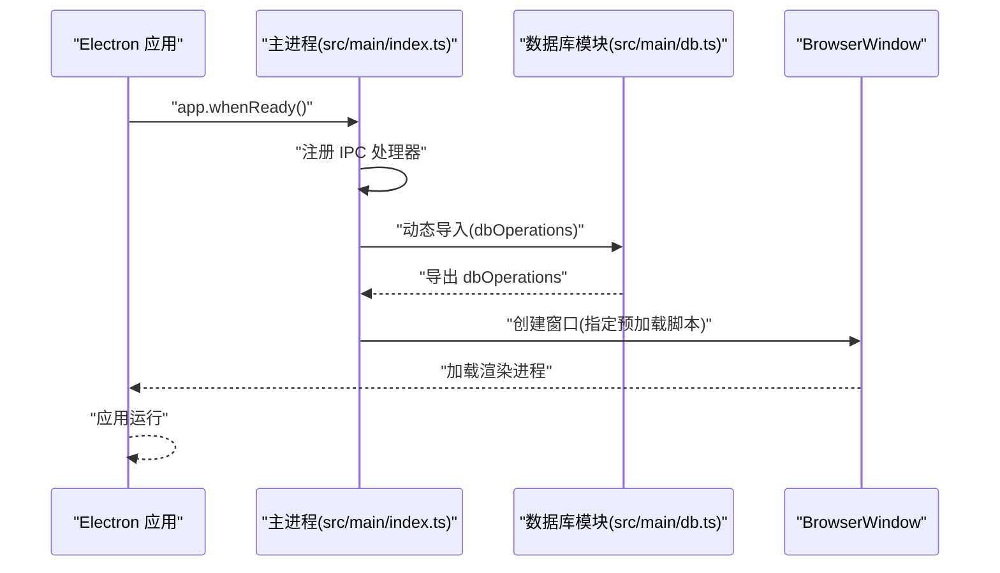
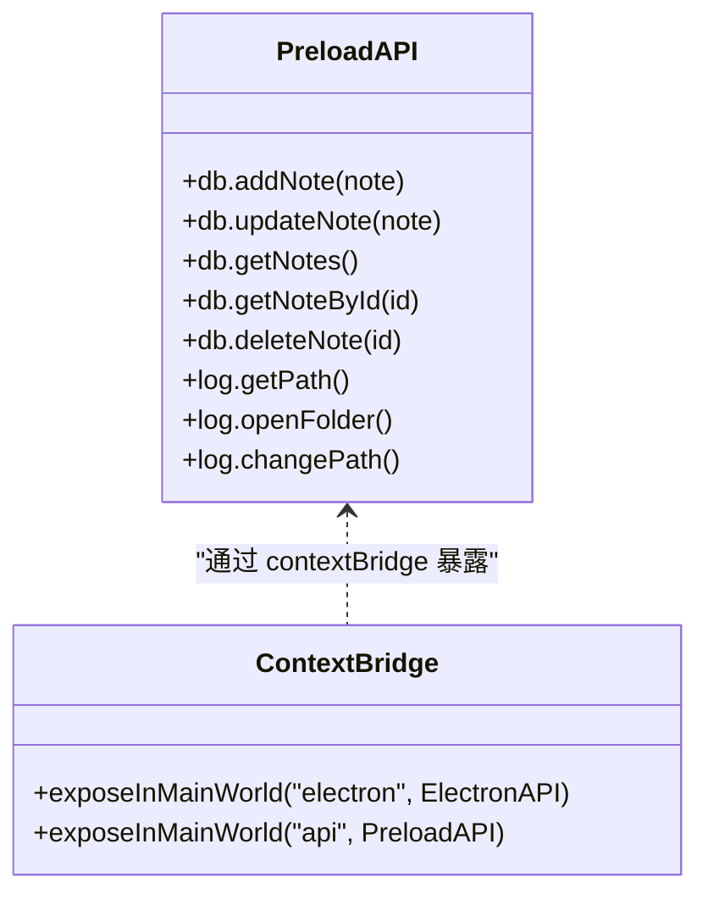
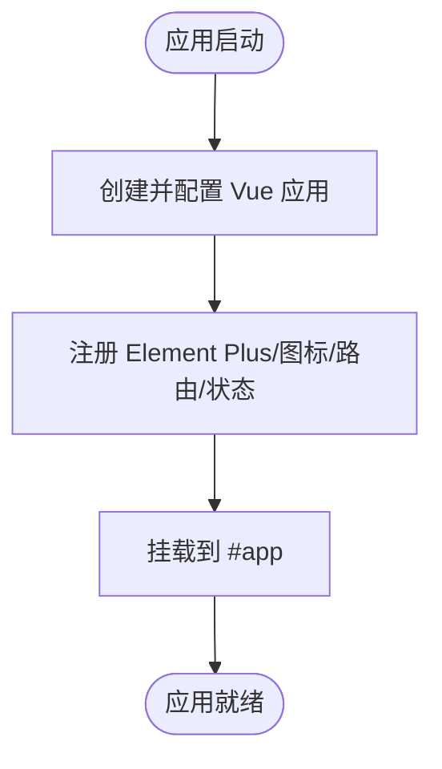
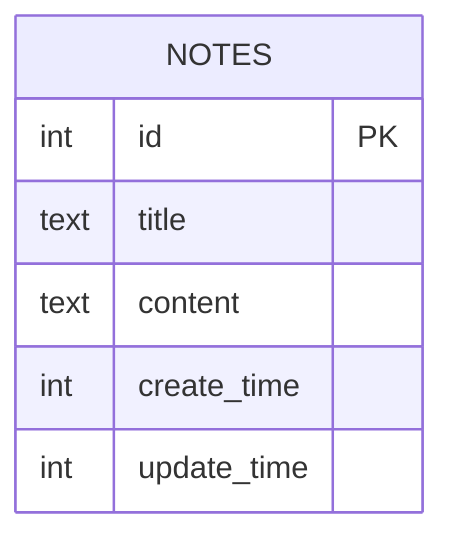
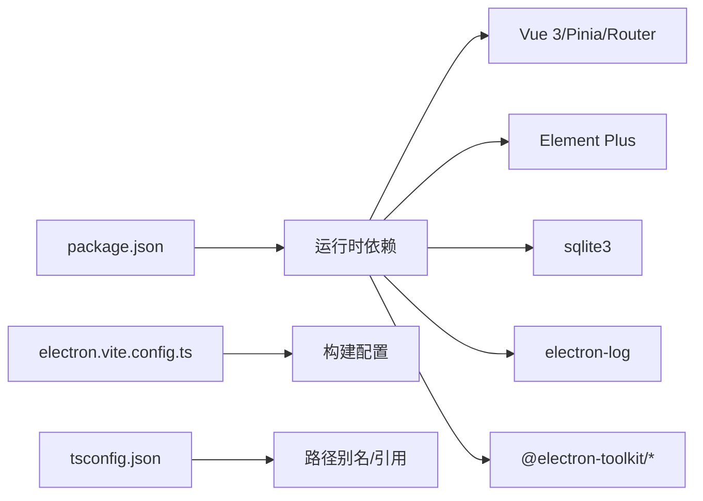

# 架构设计

<cite>
**本文引用的文件**
- [src/main/index.ts](file://src/main/index.ts)
- [src/main/db.ts](file://src/main/db.ts)
- [src/main/logger.ts](file://src/main/logger.ts)
- [src/preload/index.ts](file://src/preload/index.ts)
- [src/preload/index.d.ts](file://src/preload/index.d.ts)
- [src/renderer/src/main.ts](file://src/renderer/src/main.ts)
- [src/renderer/src/App.vue](file://src/renderer/src/App.vue)
- [src/renderer/src/router/index.ts](file://src/renderer/src/router/index.ts)
- [src/renderer/src/store/index.ts](file://src/renderer/src/store/index.ts)
- [src/renderer/src/store/settings.ts](file://src/renderer/src/store/settings.ts)
- [electron.vite.config.ts](file://electron.vite.config.ts)
- [package.json](file://package.json)
- [tsconfig.json](file://tsconfig.json)
- [README.md](file://README.md)
</cite>

## 目录

1. [简介](#简介)
2. [项目结构](#项目结构)
3. [核心组件](#核心组件)
4. [架构总览](#架构总览)
5. [详细组件分析](#详细组件分析)
6. [依赖分析](#依赖分析)
7. [性能考量](#性能考量)
8. [故障排查指南](#故障排查指南)
9. [结论](#结论)
10. [附录](#附录)

## 简介

本文件为 MyTool 的架构设计文档，聚焦 Electron 应用的整体架构与关键模块职责划分：主进程负责应用生命周期、窗口创建与系统级能力；渲染进程承载用户界面与业务逻辑；预加载脚本通过上下文隔离安全地暴露受限 API。文档还阐述 IPC 通信的数据流、上下文隔离的实现方式，并给出架构图表、组件交互关系图、技术选型与权衡、扩展与维护建议。

## 项目结构

MyTool 采用 Electron-Vite 工程化方案，按“主进程/预加载/渲染进程”三层组织源码，配合 TypeScript 与 Vue 3 生态，形成清晰的职责边界与构建配置。



**图表来源**

- [src/main/index.ts:1-112](file://src/main/index.ts#L1-L112)
- [src/main/db.ts:1-100](file://src/main/db.ts#L1-L100)
- [src/main/logger.ts:1-42](file://src/main/logger.ts#L1-L42)
- [src/preload/index.ts:1-37](file://src/preload/index.ts#L1-L37)
- [src/preload/index.d.ts:1-22](file://src/preload/index.d.ts#L1-L22)
- [src/renderer/src/main.ts:1-24](file://src/renderer/src/main.ts#L1-L24)
- [src/renderer/src/App.vue:1-47](file://src/renderer/src/App.vue#L1-L47)
- [src/renderer/src/router/index.ts:1-79](file://src/renderer/src/router/index.ts#L1-L79)
- [src/renderer/src/store/index.ts:1-10](file://src/renderer/src/store/index.ts#L1-L10)
- [src/renderer/src/store/settings.ts:1-34](file://src/renderer/src/store/settings.ts#L1-L34)
- [electron.vite.config.ts:1-27](file://electron.vite.config.ts#L1-L27)
- [package.json:1-61](file://package.json#L1-L61)
- [tsconfig.json:1-11](file://tsconfig.json#L1-L11)

**章节来源**

- [src/main/index.ts:1-112](file://src/main/index.ts#L1-L112)
- [src/preload/index.ts:1-37](file://src/preload/index.ts#L1-L37)
- [src/renderer/src/main.ts:1-24](file://src/renderer/src/main.ts#L1-L24)
- [electron.vite.config.ts:1-27](file://electron.vite.config.ts#L1-L27)
- [package.json:1-61](file://package.json#L1-L61)
- [tsconfig.json:1-11](file://tsconfig.json#L1-L11)

## 核心组件

- 主进程入口与窗口管理
  - 负责应用生命周期事件处理、窗口创建与显示策略、外部链接打开策略、开发/生产环境资源加载。
  - 在应用准备就绪后延迟加载数据库模块，注册数据库相关 IPC 处理器，并在错误时仍保证窗口可用。
- 预加载脚本
  - 通过上下文隔离暴露受限 API 至渲染进程，封装数据库与日志相关 IPC 调用，确保仅暴露必要接口。
- 渲染进程
  - 基于 Vue 3 + Element Plus 构建，使用 Pinia 管理状态并持久化，Vue Router 提供页面导航与标题同步。
- 数据层
  - SQLite3 本地数据库，位于用户数据目录，提供笔记的增删改查与时间戳管理。
- 日志系统
  - 基于 electron-log，支持按日切分日志文件、自定义日志目录、打开日志目录等能力。

**章节来源**

- [src/main/index.ts:12-42](file://src/main/index.ts#L12-L42)
- [src/main/index.ts:47-99](file://src/main/index.ts#L47-L99)
- [src/preload/index.ts:4-19](file://src/preload/index.ts#L4-L19)
- [src/renderer/src/main.ts:1-24](file://src/renderer/src/main.ts#L1-L24)
- [src/renderer/src/router/index.ts:64-76](file://src/renderer/src/router/index.ts#L64-L76)
- [src/renderer/src/store/index.ts:1-10](file://src/renderer/src/store/index.ts#L1-L10)
- [src/renderer/src/store/settings.ts:1-34](file://src/renderer/src/store/settings.ts#L1-L34)
- [src/main/db.ts:15-35](file://src/main/db.ts#L15-L35)
- [src/main/logger.ts:14-39](file://src/main/logger.ts#L14-L39)

## 架构总览

下图展示主进程、预加载与渲染进程之间的职责分工与交互关系，以及 IPC 通道如何承载数据库与日志能力。

```mermaid
graph TB
subgraph "主进程"
MP["src/main/index.ts"]
DB["src/main/db.ts"]
LG["src/main/logger.ts"]
end
subgraph "预加载"
PL["src/preload/index.ts"]
end
subgraph "渲染进程"
RN["src/renderer/src/main.ts"]
APP["src/renderer/src/App.vue"]
RT["src/renderer/src/router/index.ts"]
ST["src/renderer/src/store/index.ts"]
SS["src/renderer/src/store/settings.ts"]
end
MP <- --> PL
PL <- --> RN
RN --> APP
APP --> RT
APP --> ST
ST --> SS
MP --- DB
MP --- LG
PL -.->|"invoke/handle"| MP
RN -.->|"invoke/handle"| PL
```

**图表来源**

- [src/main/index.ts:12-42](file://src/main/index.ts#L12-L42)
- [src/main/index.ts:61-88](file://src/main/index.ts#L61-L88)
- [src/preload/index.ts:4-19](file://src/preload/index.ts#L4-L19)
- [src/renderer/src/main.ts:1-24](file://src/renderer/src/main.ts#L1-L24)
- [src/renderer/src/App.vue:1-47](file://src/renderer/src/App.vue#L1-L47)
- [src/renderer/src/router/index.ts:1-79](file://src/renderer/src/router/index.ts#L1-L79)
- [src/renderer/src/store/index.ts:1-10](file://src/renderer/src/store/index.ts#L1-L10)
- [src/renderer/src/store/settings.ts:1-34](file://src/renderer/src/store/settings.ts#L1-L34)
- [src/main/db.ts:58-99](file://src/main/db.ts#L58-L99)
- [src/main/logger.ts:25-39](file://src/main/logger.ts#L25-L39)

## 详细组件分析

### 主进程组件分析

- 职责
  - 应用生命周期管理：监听 ready、window-all-closed、activate 等事件，控制窗口创建与退出策略。
  - 窗口创建与行为：配置窗口尺寸、菜单栏、图标、webPreferences（预加载脚本路径、沙箱关闭）；设置 ready-to-show 显示策略与外部链接打开处理。
  - IPC 注册：注册日志与数据库相关 handle，提供受限能力给渲染进程。
  - 延迟初始化：在 app.whenReady 后动态导入数据库模块，避免 userData 目录未就绪导致的异常。
- 安全与稳定性
  - 即使数据库模块加载失败，也会继续创建窗口，保证用户体验。
  - 关闭沙箱以简化渲染进程访问能力，但通过预加载桥接限制暴露面。
- 技术要点
  - 开发/生产环境资源加载由主进程根据环境变量或本地 HTML 切换。
  - 使用 @electron-toolkit/utils 提供窗口快捷键监控等工具。



**图表来源**

- [src/main/index.ts:47-99](file://src/main/index.ts#L47-L99)
- [src/main/db.ts:58-99](file://src/main/db.ts#L58-L99)

**章节来源**

- [src/main/index.ts:12-42](file://src/main/index.ts#L12-L42)
- [src/main/index.ts:47-99](file://src/main/index.ts#L47-L99)
- [src/main/db.ts:58-99](file://src/main/db.ts#L58-L99)

### 预加载脚本组件分析

- 职责
  - 通过 contextBridge 暴露受限 API 至渲染进程，封装数据库与日志相关 IPC 调用。
  - 支持上下文隔离：在隔离环境下使用 exposeInMainWorld 暴露 window.electron 与 window.api；若未启用隔离则直接挂载到全局。
- 安全通信机制
  - 渲染进程只能通过 ipcRenderer.invoke/handle 与主进程通信，避免直接注入全局对象。
  - 预加载脚本作为“白名单”，仅暴露必要的方法签名，降低 XSS 与权限滥用风险。
- 类型声明
  - 通过类型文件声明 window.electron 与 window.api 的结构，便于 TypeScript 检查。



**图表来源**

- [src/preload/index.ts:4-19](file://src/preload/index.ts#L4-L19)
- [src/preload/index.d.ts:4-21](file://src/preload/index.d.ts#L4-L21)

**章节来源**

- [src/preload/index.ts:1-37](file://src/preload/index.ts#L1-L37)
- [src/preload/index.d.ts:1-22](file://src/preload/index.d.ts#L1-L22)

### 渲染进程组件分析

- 应用启动
  - 初始化 Vue 应用，注册 Element Plus 与图标，挂载路由与状态管理。
- 页面与导航
  - 使用 Vue Router 提供多视图页面与面包屑式布局，设置页面标题与图标。
- 状态管理
  - 使用 Pinia 管理主题、系统名称、暗色模式等设置，并开启持久化插件。
- 视图联动
  - App.vue 监听设置变化，动态更新主题色、暗色模式与窗口标题。



**图表来源**

- [src/renderer/src/main.ts:1-24](file://src/renderer/src/main.ts#L1-L24)
- [src/renderer/src/App.vue:8-37](file://src/renderer/src/App.vue#L8-L37)
- [src/renderer/src/router/index.ts:1-79](file://src/renderer/src/router/index.ts#L1-L79)
- [src/renderer/src/store/index.ts:1-10](file://src/renderer/src/store/index.ts#L1-L10)
- [src/renderer/src/store/settings.ts:1-34](file://src/renderer/src/store/settings.ts#L1-L34)

**章节来源**

- [src/renderer/src/main.ts:1-24](file://src/renderer/src/main.ts#L1-L24)
- [src/renderer/src/App.vue:1-47](file://src/renderer/src/App.vue#L1-L47)
- [src/renderer/src/router/index.ts:1-79](file://src/renderer/src/router/index.ts#L1-L79)
- [src/renderer/src/store/index.ts:1-10](file://src/renderer/src/store/index.ts#L1-L10)
- [src/renderer/src/store/settings.ts:1-34](file://src/renderer/src/store/settings.ts#L1-L34)

### 数据库与日志子系统

- 数据库
  - 位置：用户数据目录下的本地 SQLite 文件。
  - 表结构：notes 表包含标题、内容、创建与更新时间戳。
  - 操作：Promise 化的 run 与 all 封装，提供新增、更新、查询列表、按 ID 查询、删除。
- 日志
  - 输出：按日切分文件，支持默认与自定义目录。
  - 控制：提供获取当前日志路径、打开日志目录、变更日志目录的 IPC 接口。



**图表来源**

- [src/main/db.ts:25-35](file://src/main/db.ts#L25-L35)

**章节来源**

- [src/main/db.ts:15-35](file://src/main/db.ts#L15-L35)
- [src/main/db.ts:58-99](file://src/main/db.ts#L58-L99)
- [src/main/logger.ts:14-39](file://src/main/logger.ts#L14-L39)

## 依赖分析

- 构建与打包
  - electron-vite 作为构建工具，区分 main/preload/renderer 三段构建，主进程外部化 sqlite3，避免打包二进制。
- 运行时依赖
  - Vue 3、Element Plus、Pinia、Vue Router、sqlite3、electron-log、@electron-toolkit/\* 等。
- 类型与路径别名
  - tsconfig.json 统一配置路径别名与引用关系，便于跨层引用。



**图表来源**

- [package.json:23-38](file://package.json#L23-L38)
- [electron.vite.config.ts:5-12](file://electron.vite.config.ts#L5-L12)
- [tsconfig.json:1-11](file://tsconfig.json#L1-L11)

**章节来源**

- [package.json:1-61](file://package.json#L1-L61)
- [electron.vite.config.ts:1-27](file://electron.vite.config.ts#L1-L27)
- [tsconfig.json:1-11](file://tsconfig.json#L1-L11)

## 性能考量

- 渲染进程首屏与路由懒加载
  - 路由与视图组件均采用动态导入，减少初始包体与首屏加载时间。
- 数据库查询优化
  - 列表查询仅返回必要字段，避免传输富文本内容，降低 IPC 传输开销。
- 日志按日切分
  - 减少单文件体积，提升读写效率与磁盘占用可控性。
- 构建外置 sqlite3
  - 避免打包大型二进制，减小安装包体积，同时在不同平台按需安装。

**章节来源**

- [src/renderer/src/router/index.ts:4-56](file://src/renderer/src/router/index.ts#L4-L56)
- [src/main/db.ts:82-86](file://src/main/db.ts#L82-L86)
- [electron.vite.config.ts:8-11](file://electron.vite.config.ts#L8-L11)
- [src/main/logger.ts:17-23](file://src/main/logger.ts#L17-L23)

## 故障排查指南

- 应用无法启动或窗口不显示
  - 检查主进程窗口创建与 ready-to-show 逻辑，确认开发/生产环境资源加载路径。
  - 参考：[src/main/index.ts:12-42](file://src/main/index.ts#L12-L42)
- 数据库模块加载失败
  - 主进程在 app.whenReady 后动态导入数据库模块，失败时仍会创建窗口。可查看日志定位具体错误。
  - 参考：[src/main/index.ts:75-92](file://src/main/index.ts#L75-L92)，[src/main/db.ts:15-35](file://src/main/db.ts#L15-L35)
- 日志目录变更无效
  - 确认 IPC 调用是否成功，日志路径解析函数是否被正确调用。
  - 参考：[src/main/logger.ts:34-39](file://src/main/logger.ts#L34-L39)
- 预加载 API 未生效
  - 确认上下文隔离已启用且 contextBridge 成功暴露；若未启用隔离，需检查全局挂载逻辑。
  - 参考：[src/preload/index.ts:24-36](file://src/preload/index.ts#L24-L36)

**章节来源**

- [src/main/index.ts:12-42](file://src/main/index.ts#L12-L42)
- [src/main/index.ts:75-92](file://src/main/index.ts#L75-L92)
- [src/main/db.ts:15-35](file://src/main/db.ts#L15-L35)
- [src/main/logger.ts:34-39](file://src/main/logger.ts#L34-L39)
- [src/preload/index.ts:24-36](file://src/preload/index.ts#L24-L36)

## 结论

MyTool 采用清晰的三层架构：主进程负责系统级能力与 IPC 管理，预加载脚本通过上下文隔离安全地暴露受限 API，渲染进程承载 UI 与业务逻辑。该架构在保证安全性的同时，兼顾了开发体验与性能表现。后续可在保持现有边界的前提下，逐步扩展 IPC 能力与状态管理，完善路由鉴权与数据校验，持续优化日志与数据库性能。

## 附录

- 快速开始
  - 安装依赖与启动开发服务器，参考工程 README。
  - 参考：[README.md:9-21](file://README.md#L9-L21)
- 构建与发布
  - 支持 Windows/macOS/Linux 多平台构建，构建脚本与 electron-builder 配置由 package.json 与 electron-vite 配置共同决定。
  - 参考：[package.json:8-21](file://package.json#L8-L21)，[electron.vite.config.ts:1-27](file://electron.vite.config.ts#L1-L27)
