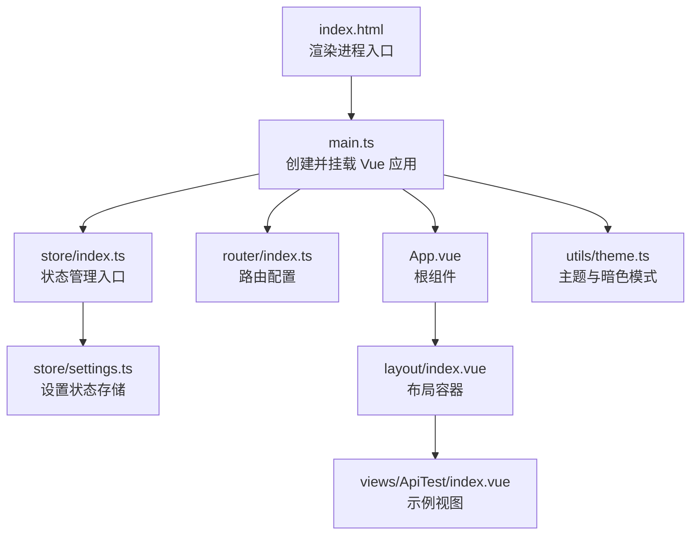
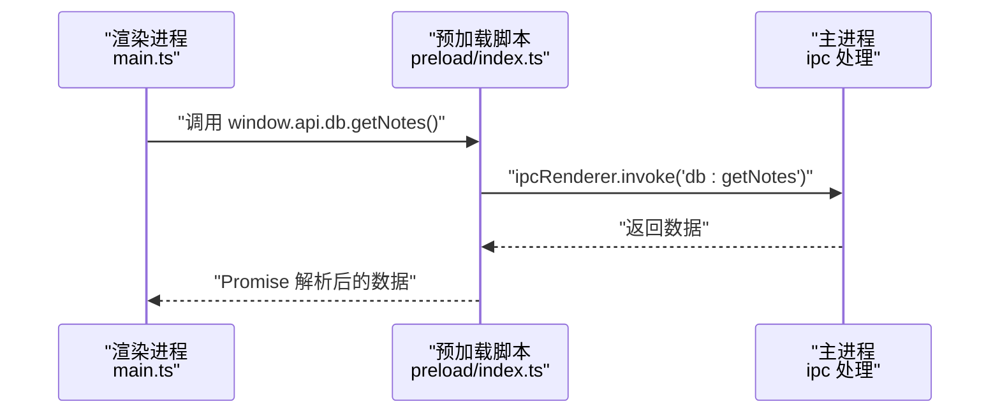
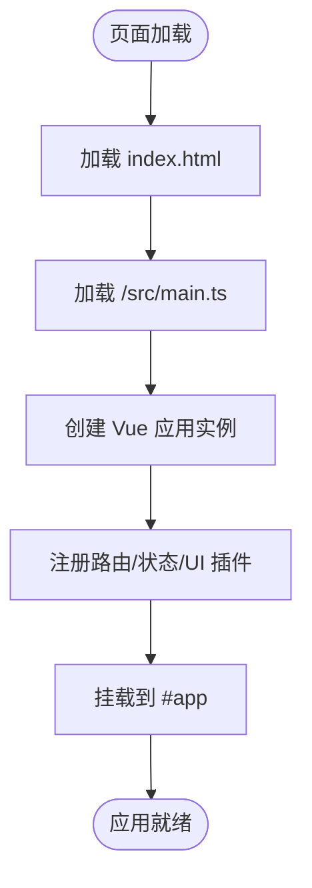
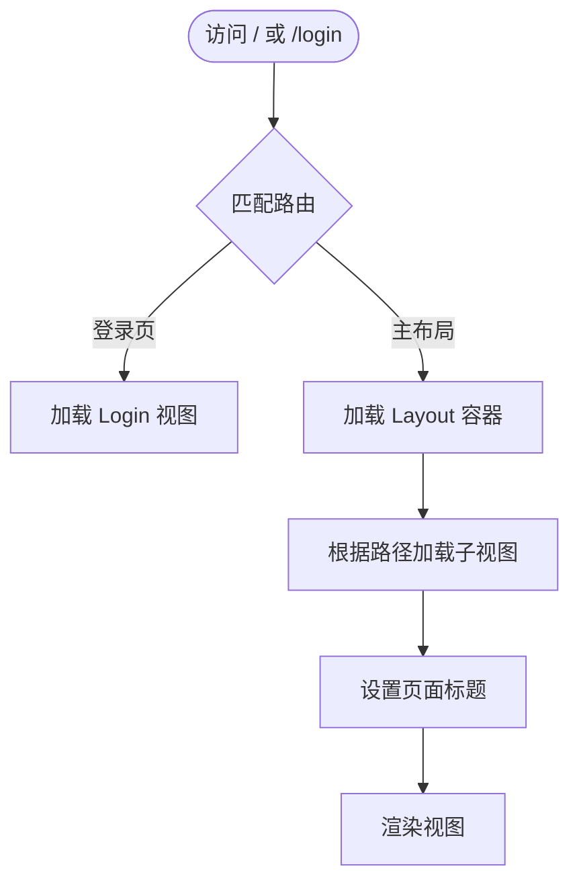
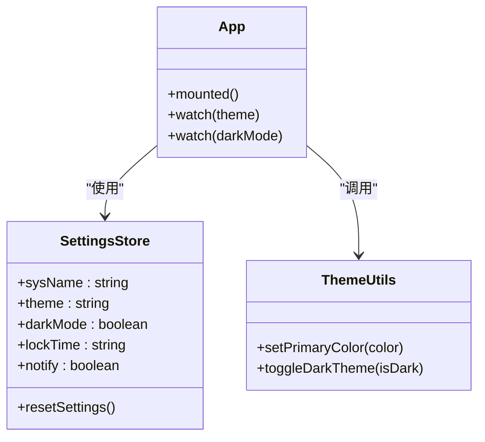
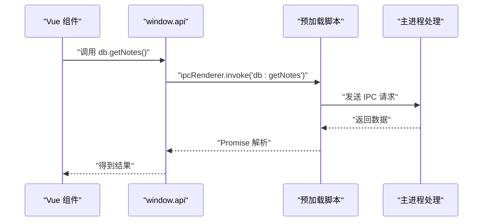
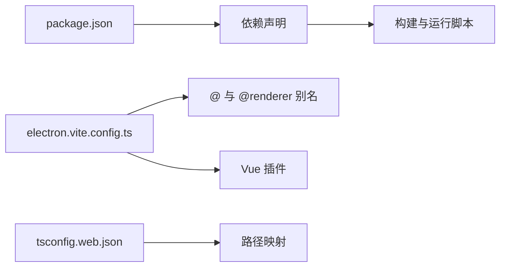

# 渲染进程设计

<cite>
**本文引用的文件**
- [src/renderer/src/main.ts](file://src/renderer/src/main.ts)
- [src/renderer/index.html](file://src/renderer/index.html)
- [src/preload/index.ts](file://src/preload/index.ts)
- [src/preload/index.d.ts](file://src/preload/index.d.ts)
- [src/renderer/src/App.vue](file://src/renderer/src/App.vue)
- [src/renderer/src/router/index.ts](file://src/renderer/src/router/index.ts)
- [src/renderer/src/store/index.ts](file://src/renderer/src/store/index.ts)
- [src/renderer/src/store/settings.ts](file://src/renderer/src/store/settings.ts)
- [src/renderer/src/utils/theme.ts](file://src/renderer/src/utils/theme.ts)
- [src/renderer/src/layout/index.vue](file://src/renderer/src/layout/index.vue)
- [src/renderer/src/views/ApiTest/index.vue](file://src/renderer/src/views/ApiTest/index.vue)
- [package.json](file://package.json)
- [electron.vite.config.ts](file://electron.vite.config.ts)
- [tsconfig.json](file://tsconfig.json)
- [tsconfig.web.json](file://tsconfig.web.json)
</cite>

## 目录

1. [引言](#引言)
2. [项目结构](#项目结构)
3. [核心组件](#核心组件)
4. [架构总览](#架构总览)
5. [详细组件分析](#详细组件分析)
6. [依赖分析](#依赖分析)
7. [性能考虑](#性能考虑)
8. [故障排查指南](#故障排查指南)
9. [结论](#结论)
10. [附录](#附录)

## 引言

本文件面向 MyTool 的渲染进程设计，聚焦于渲染进程初始化流程、Vue 应用启动过程、TypeScript 环境配置、入口点设置、与主进程的交互模式（通过预加载脚本）、模块化架构（组件系统、路由、状态管理）以及性能优化与内存管理最佳实践。文档以仓库中实际文件为依据，提供可操作的说明与可视化图示。

## 项目结构

渲染进程位于 src/renderer 目录，采用 Electron-Vite 构建，使用 Vue 3 + TypeScript + Pinia + Element Plus 技术栈。入口 HTML 指向 /src/main.ts，该文件负责创建并挂载 Vue 应用，同时注册路由、状态管理和 UI 组件库。

图表来源

- [src/renderer/index.html:1-18](file://src/renderer/index.html#L1-L18)
- [src/renderer/src/main.ts:1-24](file://src/renderer/src/main.ts#L1-L24)
- [src/renderer/src/App.vue:1-47](file://src/renderer/src/App.vue#L1-L47)
- [src/renderer/src/router/index.ts:1-79](file://src/renderer/src/router/index.ts#L1-L79)
- [src/renderer/src/store/index.ts:1-10](file://src/renderer/src/store/index.ts#L1-L10)
- [src/renderer/src/store/settings.ts:1-34](file://src/renderer/src/store/settings.ts#L1-L34)
- [src/renderer/src/utils/theme.ts:1-70](file://src/renderer/src/utils/theme.ts#L1-L70)
- [src/renderer/src/layout/index.vue:1-232](file://src/renderer/src/layout/index.vue#L1-L232)
- [src/renderer/src/views/ApiTest/index.vue:1-163](file://src/renderer/src/views/ApiTest/index.vue#L1-L163)

章节来源

- [src/renderer/index.html:1-18](file://src/renderer/index.html#L1-L18)
- [src/renderer/src/main.ts:1-24](file://src/renderer/src/main.ts#L1-L24)
- [electron.vite.config.ts:1-27](file://electron.vite.config.ts#L1-L27)
- [tsconfig.json:1-11](file://tsconfig.json#L1-L11)
- [tsconfig.web.json:1-22](file://tsconfig.web.json#L1-L22)

## 核心组件

- 渲染入口与应用启动：在入口 HTML 中加载 /src/main.ts，创建 Vue 应用实例，注册 Element Plus 图标、安装路由与状态管理，最后挂载到 #app。
- 根组件与主题联动：App.vue 在挂载时读取设置状态并应用主题色与暗色模式，同时监听设置变更动态更新。
- 路由系统：基于 vue-router 的 hash 历史模式，定义登录页与主布局下的多个子路由，支持页面标题动态设置。
- 状态管理：Pinia 创建全局 store，并启用持久化插件；设置状态包含系统名、主题色、暗色模式、锁屏时间、通知开关等。
- 主题工具：提供主题色计算与 Element Plus CSS 变量注入，支持暗色模式类名切换。
- 布局与视图：layout/index.vue 提供侧边栏折叠、面包屑、用户下拉菜单与页面切换动画；views 下包含示例视图（如接口测试）。

章节来源

- [src/renderer/src/main.ts:1-24](file://src/renderer/src/main.ts#L1-L24)
- [src/renderer/src/App.vue:1-47](file://src/renderer/src/App.vue#L1-L47)
- [src/renderer/src/router/index.ts:1-79](file://src/renderer/src/router/index.ts#L1-L79)
- [src/renderer/src/store/index.ts:1-10](file://src/renderer/src/store/index.ts#L1-L10)
- [src/renderer/src/store/settings.ts:1-34](file://src/renderer/src/store/settings.ts#L1-L34)
- [src/renderer/src/utils/theme.ts:1-70](file://src/renderer/src/utils/theme.ts#L1-L70)
- [src/renderer/src/layout/index.vue:1-232](file://src/renderer/src/layout/index.vue#L1-L232)
- [src/renderer/src/views/ApiTest/index.vue:1-163](file://src/renderer/src/views/ApiTest/index.vue#L1-L163)

## 架构总览

渲染进程与主进程通过预加载脚本建立受控通信通道。预加载脚本暴露受限 API 至渲染进程，渲染端通过 ipcRenderer.invoke 调用主进程能力，避免直接访问 Node/Electron API。

图表来源

- [src/renderer/src/main.ts:1-24](file://src/renderer/src/main.ts#L1-L24)
- [src/preload/index.ts:1-37](file://src/preload/index.ts#L1-L37)

章节来源

- [src/preload/index.ts:1-37](file://src/preload/index.ts#L1-L37)
- [src/preload/index.d.ts:1-22](file://src/preload/index.d.ts#L1-L22)

## 详细组件分析

### 初始化流程与入口点

- 入口 HTML 加载 /src/main.ts，确保在 <body> 中存在挂载点 #app。
- main.ts 完成以下步骤：
  - 导入样式与 UI 库资源
  - 创建 Vue 应用实例并注册 Element Plus 图标
  - 安装路由、状态管理、UI 插件
  - 挂载到 #app

图表来源

- [src/renderer/index.html:1-18](file://src/renderer/index.html#L1-L18)
- [src/renderer/src/main.ts:1-24](file://src/renderer/src/main.ts#L1-L24)

章节来源

- [src/renderer/index.html:1-18](file://src/renderer/index.html#L1-L18)
- [src/renderer/src/main.ts:1-24](file://src/renderer/src/main.ts#L1-L24)

### TypeScript 环境配置

- 项目采用复合型 tsconfig 结构：
  - 根 tsconfig.json 引用 node 与 web 两个配置
  - tsconfig.web.json 配置 Web 端路径别名与包含范围，覆盖渲染端源码与预加载类型声明
- electron-vite.config.ts 为渲染端配置路径别名 @ 与 @renderer，Vite 服务器端口 3000，启用 Vue 插件

章节来源

- [tsconfig.json:1-11](file://tsconfig.json#L1-L11)
- [tsconfig.web.json:1-22](file://tsconfig.web.json#L1-L22)
- [electron.vite.config.ts:1-27](file://electron.vite.config.ts#L1-L27)

### 路由配置与导航

- 路由采用 hash 历史模式，定义登录页与主布局下的多个子路由
- beforeEach 中设置页面标题，预留鉴权逻辑位置（注释）
- 布局组件提供面包屑与折叠控制，配合路由元信息展示标题

图表来源

- [src/renderer/src/router/index.ts:1-79](file://src/renderer/src/router/index.ts#L1-L79)
- [src/renderer/src/layout/index.vue:1-232](file://src/renderer/src/layout/index.vue#L1-L232)

章节来源

- [src/renderer/src/router/index.ts:1-79](file://src/renderer/src/router/index.ts#L1-L79)
- [src/renderer/src/layout/index.vue:1-232](file://src/renderer/src/layout/index.vue#L1-L232)

### 状态管理与设置存储

- Pinia 创建全局 store 并启用持久化插件
- settings store 定义系统名、主题色、暗色模式、锁屏时间、通知开关等状态，并提供重置方法
- App.vue 在挂载时读取设置并应用主题与标题，监听设置变化实时更新

图表来源

- [src/renderer/src/store/settings.ts:1-34](file://src/renderer/src/store/settings.ts#L1-L34)
- [src/renderer/src/utils/theme.ts:1-70](file://src/renderer/src/utils/theme.ts#L1-L70)
- [src/renderer/src/App.vue:1-47](file://src/renderer/src/App.vue#L1-L47)

章节来源

- [src/renderer/src/store/index.ts:1-10](file://src/renderer/src/store/index.ts#L1-L10)
- [src/renderer/src/store/settings.ts:1-34](file://src/renderer/src/store/settings.ts#L1-L34)
- [src/renderer/src/utils/theme.ts:1-70](file://src/renderer/src/utils/theme.ts#L1-L70)
- [src/renderer/src/App.vue:1-47](file://src/renderer/src/App.vue#L1-L47)

### 主题与暗色模式

- setPrimaryColor 将十六进制主题色写入 CSS 变量，并生成多级浅色与深色变体
- toggleDarkTheme 通过添加/移除 dark 类名切换暗色模式
- App.vue 在挂载时应用当前主题与暗色模式，并监听变更

章节来源

- [src/renderer/src/utils/theme.ts:1-70](file://src/renderer/src/utils/theme.ts#L1-L70)
- [src/renderer/src/App.vue:1-47](file://src/renderer/src/App.vue#L1-L47)

### 与主进程的交互模式

- 预加载脚本通过 contextBridge 暴露 window.electron 与 window.api
- 渲染端通过 window.api.db 或 window.api.log 等方法调用主进程，内部使用 ipcRenderer.invoke
- 预加载类型声明文件提供类型安全的 API 接口

图表来源

- [src/preload/index.ts:1-37](file://src/preload/index.ts#L1-L37)
- [src/preload/index.d.ts:1-22](file://src/preload/index.d.ts#L1-L22)

章节来源

- [src/preload/index.ts:1-37](file://src/preload/index.ts#L1-L37)
- [src/preload/index.d.ts:1-22](file://src/preload/index.d.ts#L1-L22)

### 示例视图：接口测试

- ApiTest 视图提供输入 URL、选择方法、发送请求与展示响应的界面
- 使用 Element Plus 表单组件与滚动区域，响应内容以美化格式展示

章节来源

- [src/renderer/src/views/ApiTest/index.vue:1-163](file://src/renderer/src/views/ApiTest/index.vue#L1-L163)

## 依赖分析

- 渲染端依赖：Vue 3、Element Plus、Pinia、vue-router、@wangeditor/editor-for-vue、axios、electron-log、electron-updater 等
- 构建工具：electron-vite、@vitejs/plugin-vue、TypeScript、Vue Language Tools
- 配置文件：package.json 脚本与依赖、electron.vite.config.ts 路径别名与插件、tsconfig.web.json 路径映射

图表来源

- [package.json:1-61](file://package.json#L1-L61)
- [electron.vite.config.ts:1-27](file://electron.vite.config.ts#L1-L27)
- [tsconfig.web.json:1-22](file://tsconfig.web.json#L1-L22)

章节来源

- [package.json:1-61](file://package.json#L1-L61)
- [electron.vite.config.ts:1-27](file://electron.vite.config.ts#L1-L27)
- [tsconfig.web.json:1-22](file://tsconfig.web.json#L1-L22)

## 性能考虑

- 资源加载与懒加载
  - 路由与视图采用动态导入，减少首屏体积
  - UI 组件库按需引入，避免全量打包
- 样式与主题
  - 仅注入必要 CSS 变量，避免重复计算
  - 暗色模式切换通过类名切换，降低样式重绘成本
- 状态管理
  - Pinia 持久化仅保存必要字段，避免存储大对象
  - 合理拆分 store，避免单一 store 过大
- 渲染性能
  - 布局容器使用过渡动画，但仅在必要场景启用
  - 滚动区域与文本域使用原生滚动条隐藏技巧，减少重排
- 开发与构建
  - electron-vite 提供快速热更新与开发服务器
  - TypeScript 与 Vue Language Tools 提升类型安全与开发效率

## 故障排查指南

- CSP 与脚本加载
  - 确认 index.html 中 Content-Security-Policy 配置允许加载 /src/main.ts
- 路由跳转异常
  - 检查路由元信息 title 是否正确，确保 beforeEach 中标题设置逻辑生效
- 主进程通信失败
  - 确认预加载脚本已正确暴露 window.api，并在渲染端使用 window.api.db 或 window.api.log
  - 检查主进程中对应 IPC 处理函数是否注册
- 主题与暗色模式不生效
  - 确认 setPrimaryColor 与 toggleDarkTheme 调用顺序与时机
  - 检查 CSS 变量是否被覆盖或未注入
- 类型错误
  - 确保 tsconfig.web.json 包含渲染端源码与预加载类型声明
  - 使用 @ 与 @renderer 别名时，保持路径映射一致

章节来源

- [src/renderer/index.html:1-18](file://src/renderer/index.html#L1-L18)
- [src/renderer/src/router/index.ts:1-79](file://src/renderer/src/router/index.ts#L1-L79)
- [src/preload/index.ts:1-37](file://src/preload/index.ts#L1-L37)
- [src/renderer/src/utils/theme.ts:1-70](file://src/renderer/src/utils/theme.ts#L1-L70)
- [tsconfig.web.json:1-22](file://tsconfig.web.json#L1-L22)

## 结论

MyTool 渲染进程采用现代化前端技术栈与 Electron-Vite 构建体系，通过预加载脚本实现安全可控的主进程交互，结合 Vue 3 的组合式 API、Pinia 状态管理与 Element Plus UI 组件，形成清晰的模块化架构。遵循本文的初始化流程、配置要点、交互模式与性能建议，可有效提升开发效率与运行稳定性。

## 附录

- 关键入口与配置参考路径
  - 渲染入口 HTML：[src/renderer/index.html:1-18](file://src/renderer/index.html#L1-L18)
  - 应用入口脚本：[src/renderer/src/main.ts:1-24](file://src/renderer/src/main.ts#L1-L24)
  - 预加载脚本与类型：[src/preload/index.ts:1-37](file://src/preload/index.ts#L1-L37)，[src/preload/index.d.ts:1-22](file://src/preload/index.d.ts#L1-L22)
  - 路由配置：[src/renderer/src/router/index.ts:1-79](file://src/renderer/src/router/index.ts#L1-L79)
  - 状态管理入口与设置存储：[src/renderer/src/store/index.ts:1-10](file://src/renderer/src/store/index.ts#L1-L10)，[src/renderer/src/store/settings.ts:1-34](file://src/renderer/src/store/settings.ts#L1-L34)
  - 主题工具：[src/renderer/src/utils/theme.ts:1-70](file://src/renderer/src/utils/theme.ts#L1-L70)
  - 布局与示例视图：[src/renderer/src/layout/index.vue:1-232](file://src/renderer/src/layout/index.vue#L1-L232)，[src/renderer/src/views/ApiTest/index.vue:1-163](file://src/renderer/src/views/ApiTest/index.vue#L1-L163)
  - 构建与类型配置：[electron.vite.config.ts:1-27](file://electron.vite.config.ts#L1-L27)，[tsconfig.json:1-11](file://tsconfig.json#L1-L11)，[tsconfig.web.json:1-22](file://tsconfig.web.json#L1-L22)
  - 依赖与脚本：[package.json:1-61](file://package.json#L1-L61)
