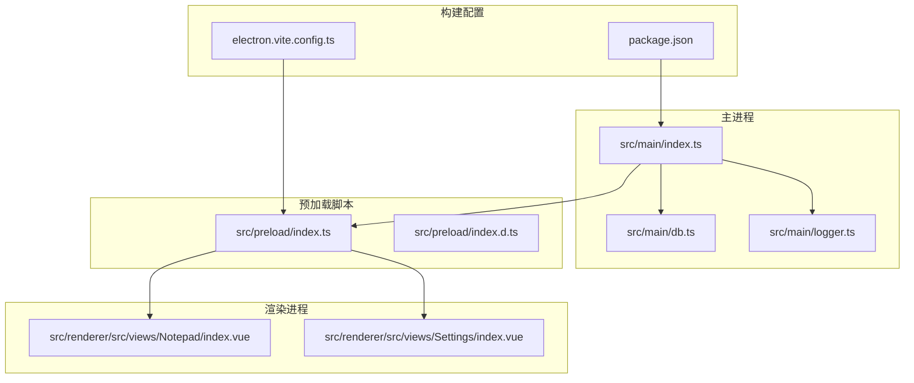
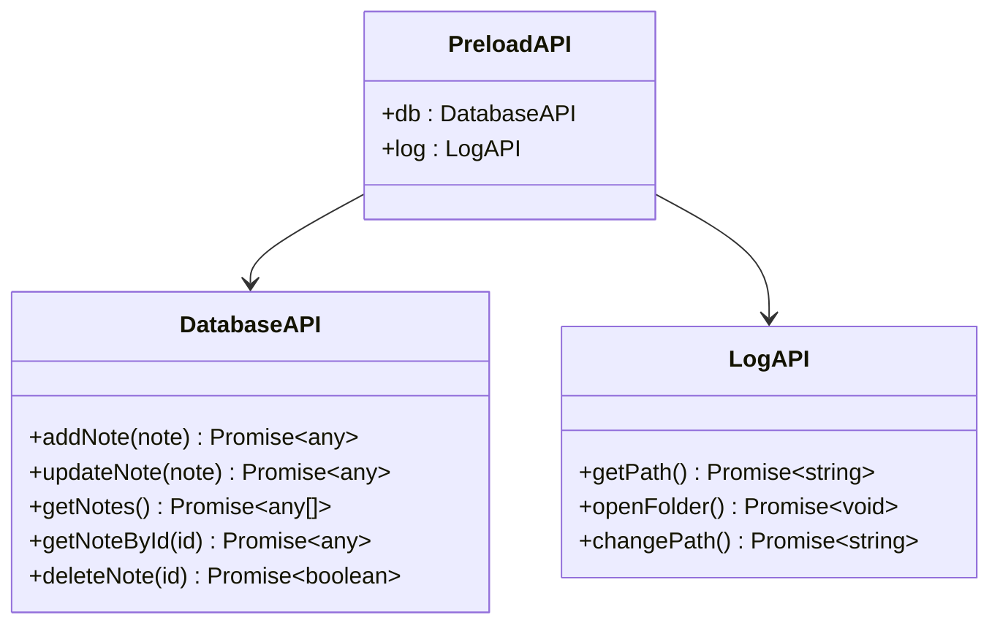
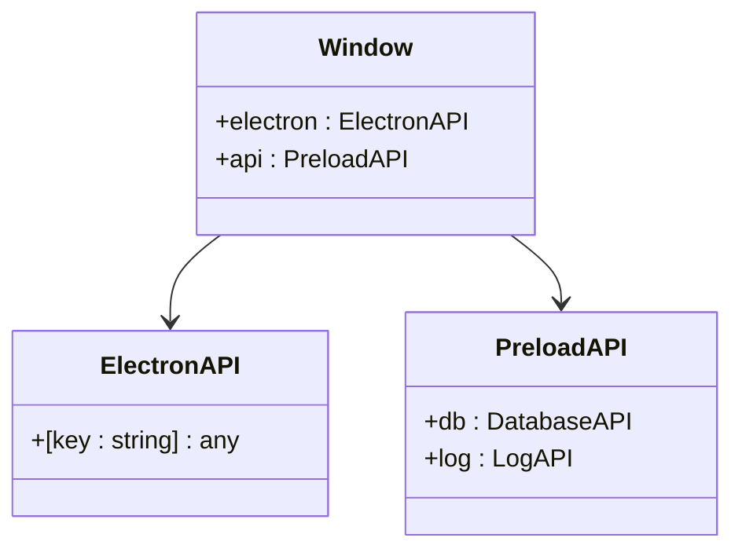
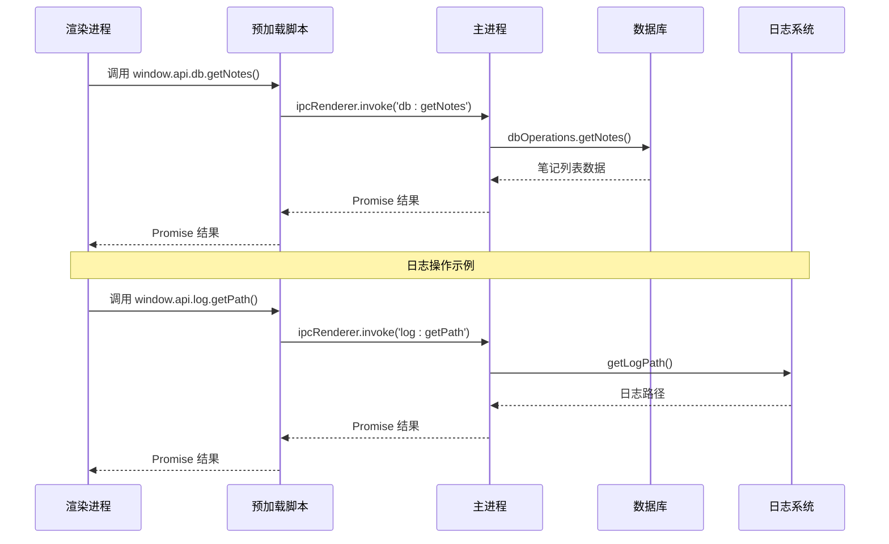
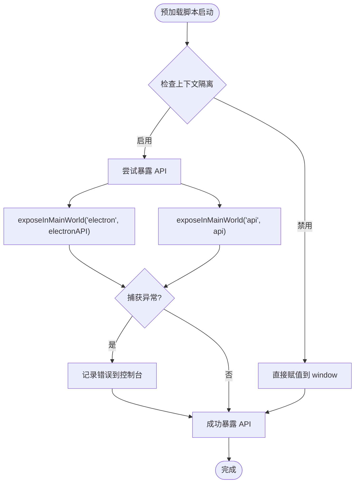
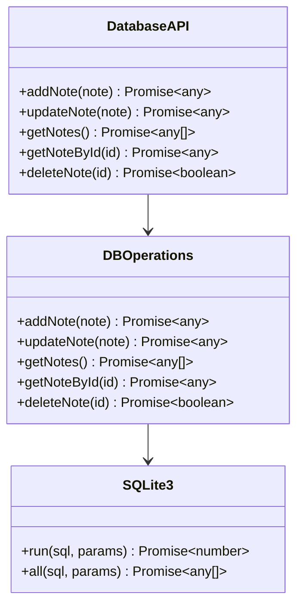
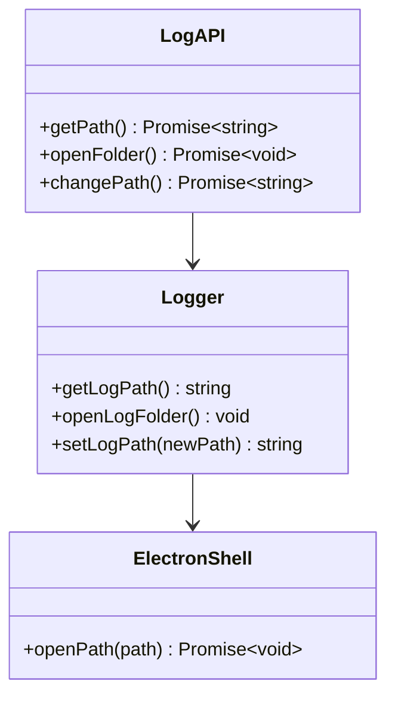
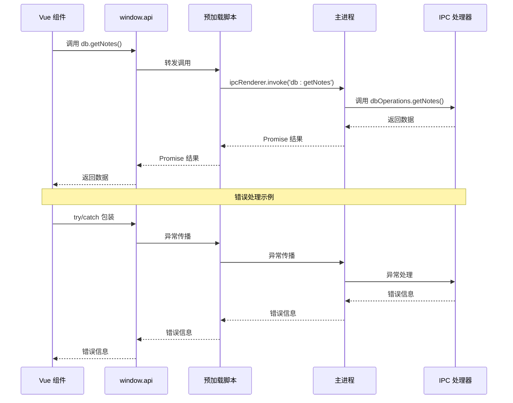

# 预加载脚本设计

<cite>
**本文档引用的文件**
- [src/preload/index.ts](file://src/preload/index.ts)
- [src/preload/index.d.ts](file://src/preload/index.d.ts)
- [src/main/index.ts](file://src/main/index.ts)
- [src/main/db.ts](file://src/main/db.ts)
- [src/main/logger.ts](file://src/main/logger.ts)
- [src/renderer/src/views/Notepad/index.vue](file://src/renderer/src/views/Notepad/index.vue)
- [src/renderer/src/views/Settings/index.vue](file://src/renderer/src/views/Settings/index.vue)
- [electron.vite.config.ts](file://electron.vite.config.ts)
- [package.json](file://package.json)
</cite>

## 目录

1. [简介](#简介)
2. [项目结构](#项目结构)
3. [核心组件](#核心组件)
4. [架构概览](#架构概览)
5. [详细组件分析](#详细组件分析)
6. [依赖关系分析](#依赖关系分析)
7. [性能考虑](#性能考虑)
8. [故障排除指南](#故障排除指南)
9. [结论](#结论)

## 简介

MyTool 项目采用 Electron + Vue + TypeScript 技术栈构建桌面应用程序。本文档深入分析预加载脚本的设计与实现，重点解释其安全通信机制、上下文隔离实现以及受限 API 暴露策略。预加载脚本作为主进程与渲染进程之间的桥梁，通过 contextBridge 实现安全的 API 暴露，确保渲染进程只能访问经过精心设计的受限接口。

## 项目结构

MyTool 项目采用典型的 Electron 应用程序结构，重点关注预加载脚本的组织和实现：



**图表来源**

- [src/main/index.ts:12-42](file://src/main/index.ts#L12-L42)
- [src/preload/index.ts:1-37](file://src/preload/index.ts#L1-L37)
- [electron.vite.config.ts:5-27](file://electron.vite.config.ts#L5-L27)

**章节来源**

- [src/main/index.ts:12-42](file://src/main/index.ts#L12-L42)
- [src/preload/index.ts:1-37](file://src/preload/index.ts#L1-L37)
- [electron.vite.config.ts:5-27](file://electron.vite.config.ts#L5-L27)

## 核心组件

预加载脚本系统由三个核心组件构成：API 暴露层、类型定义层和安全隔离层。

### API 暴露层

预加载脚本通过 `contextBridge.exposeInMainWorld` 方法向渲染进程暴露受限 API：



**图表来源**

- [src/preload/index.ts:5-19](file://src/preload/index.ts#L5-L19)

### 类型定义层

TypeScript 类型定义确保编译时类型安全：



**图表来源**

- [src/preload/index.d.ts:3-22](file://src/preload/index.d.ts#L3-L22)

**章节来源**

- [src/preload/index.ts:5-19](file://src/preload/index.ts#L5-L19)
- [src/preload/index.d.ts:3-22](file://src/preload/index.d.ts#L3-L22)

## 架构概览

预加载脚本采用分层架构设计，确保安全性和可维护性：



**图表来源**

- [src/preload/index.ts:7-17](file://src/preload/index.ts#L7-L17)
- [src/main/index.ts:80-85](file://src/main/index.ts#L80-L85)

## 详细组件分析

### 预加载脚本核心实现

预加载脚本通过 `contextBridge` 实现安全的 API 暴露，支持上下文隔离和非隔离两种模式：



**图表来源**

- [src/preload/index.ts:24-36](file://src/preload/index.ts#L24-L36)

### 数据库 API 设计

数据库 API 通过 `ipcRenderer.invoke` 实现异步通信，确保数据操作的线程安全：



**图表来源**

- [src/preload/index.ts:6-13](file://src/preload/index.ts#L6-L13)
- [src/main/db.ts:58-99](file://src/main/db.ts#L58-L99)

### 日志管理 API

日志管理 API 提供日志路径查询、目录打开和路径变更功能：



**图表来源**

- [src/preload/index.ts:14-18](file://src/preload/index.ts#L14-L18)
- [src/main/logger.ts:25-39](file://src/main/logger.ts#L25-L39)

**章节来源**

- [src/preload/index.ts:1-37](file://src/preload/index.ts#L1-L37)
- [src/main/db.ts:58-99](file://src/main/db.ts#L58-L99)
- [src/main/logger.ts:25-39](file://src/main/logger.ts#L25-L39)

### 渲染进程集成模式

渲染进程通过统一的 API 接口访问预加载脚本提供的功能：



**图表来源**

- [src/renderer/src/views/Notepad/index.vue:217-224](file://src/renderer/src/views/Notepad/index.vue#L217-L224)
- [src/renderer/src/views/Settings/index.vue:75-76](file://src/renderer/src/views/Settings/index.vue#L75-L76)

**章节来源**

- [src/renderer/src/views/Notepad/index.vue:217-224](file://src/renderer/src/views/Notepad/index.vue#L217-L224)
- [src/renderer/src/views/Settings/index.vue:75-76](file://src/renderer/src/views/Settings/index.vue#L75-L76)

## 依赖关系分析

预加载脚本系统涉及多个层面的依赖关系：

```mermaid
graph TB
subgraph "运行时依赖"
A[Electron Runtime]
B[TypeScript Types]
C[Context Bridge]
end
subgraph "应用依赖"
D[SQLite3]
E[electron-log]
F[electron]
end
subgraph "开发依赖"
G[electron-vite]
H[@types/node]
I[@types/sqlite3]
end
A --> C
B --> C
C --> D
C --> E
C --> F
G --> A
H --> B
I --> D
```

**图表来源**

- [package.json:23-38](file://package.json#L23-L38)
- [package.json:39-58](file://package.json#L39-L58)

**章节来源**

- [package.json:23-38](file://package.json#L23-L38)
- [package.json:39-58](file://package.json#L39-L58)

## 性能考虑

预加载脚本设计充分考虑了性能优化：

### 数据库查询优化

- 使用 `SELECT id, title, create_time, update_time` 查询笔记列表，避免传输富文本内容
- 仅在需要时加载完整笔记详情，减少网络传输开销

### 异步通信优化

- 采用 `ipcRenderer.invoke` 实现请求-响应模式，避免阻塞主线程
- Promise 包装确保异步操作的可预测性

### 内存管理

- 预加载脚本生命周期与浏览器窗口绑定
- 及时清理编辑器实例，避免内存泄漏

## 故障排除指南

### 常见问题及解决方案

#### 上下文隔离问题

当 `process.contextIsolated` 为 false 时，预加载脚本会直接赋值到 `window` 对象：

**解决方法**：确保在 `BrowserWindow` 配置中启用上下文隔离

```typescript
const mainWindow = new BrowserWindow({
  webPreferences: {
    preload: join(__dirname, '../preload/index.js'),
    contextIsolation: true,
    sandbox: false
  }
})
```

#### IPC 通信超时

如果 `ipcRenderer.invoke` 调用超时，检查主进程中的处理器注册：

**解决方法**：确认主进程正确注册了所有 IPC 处理器

```typescript
// 主进程注册示例
ipcMain.handle('db:getNotes', async () => await dbOperations.getNotes())
```

#### 类型定义错误

TypeScript 编译错误通常源于类型定义不匹配：

**解决方法**：检查 `index.d.ts` 中的类型声明是否与实际实现一致

**章节来源**

- [src/main/index.ts:20-24](file://src/main/index.ts#L20-L24)
- [src/preload/index.ts:24-36](file://src/preload/index.ts#L24-L36)

## 结论

MyTool 项目的预加载脚本设计体现了现代 Electron 应用的最佳实践。通过分层架构、严格的类型定义和安全的上下文隔离，实现了渲染进程与主进程之间的安全通信。关键优势包括：

1. **安全性**：通过 `contextBridge` 限制 API 暴露范围，防止直接访问 Node.js API
2. **类型安全**：完整的 TypeScript 类型定义确保编译时错误检测
3. **性能优化**：合理的数据传输策略和异步通信模式
4. **可维护性**：清晰的模块划分和标准化的 API 设计

该设计为类似的应用程序提供了可靠的预加载脚本实现模板，值得在生产环境中推广使用。
