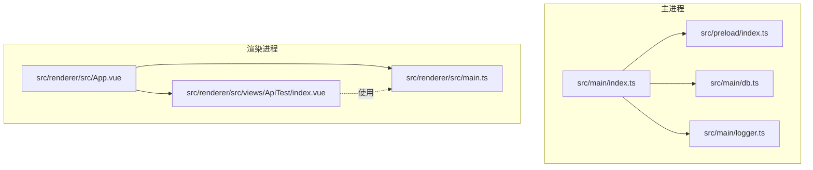
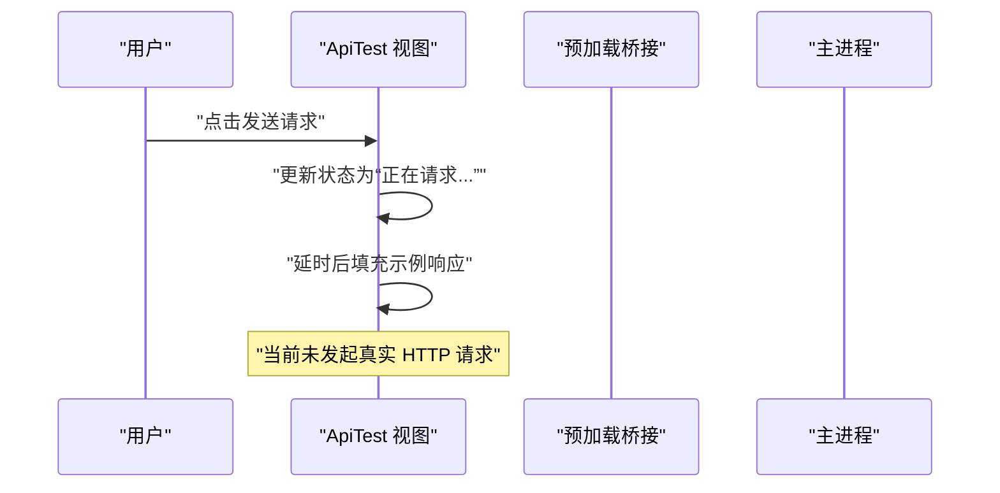
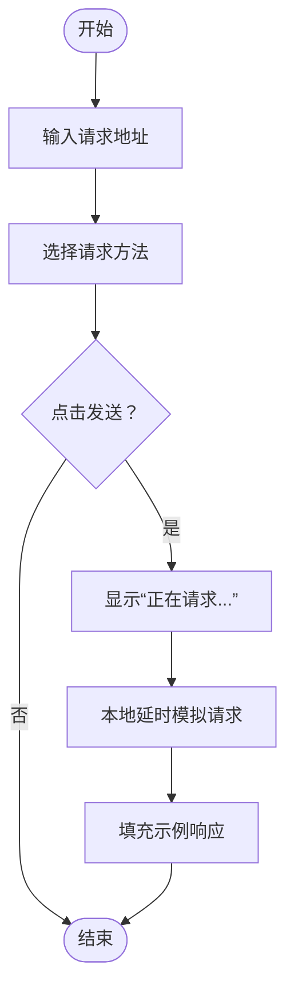
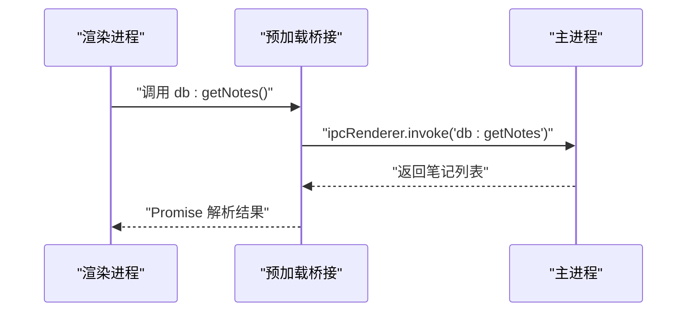
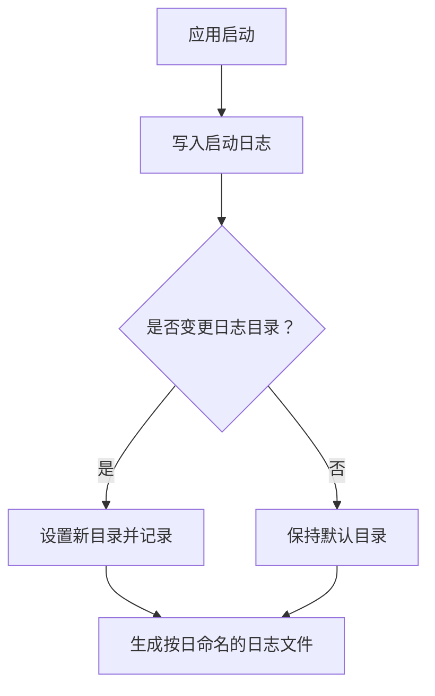
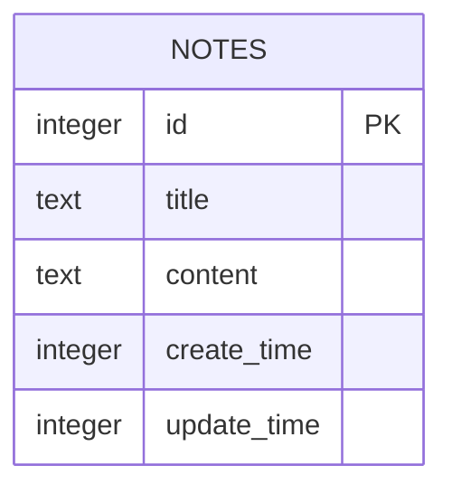
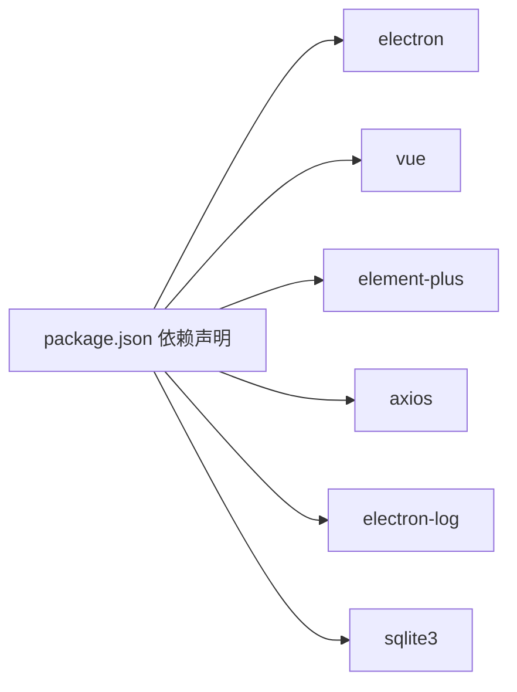

# 接口测试工具模块

<cite>
**本文引用的文件**
- [src/renderer/src/views/ApiTest/index.vue](file://src/renderer/src/views/ApiTest/index.vue)
- [src/main/index.ts](file://src/main/index.ts)
- [src/main/db.ts](file://src/main/db.ts)
- [src/main/logger.ts](file://src/main/logger.ts)
- [src/preload/index.ts](file://src/preload/index.ts)
- [src/preload/index.d.ts](file://src/preload/index.d.ts)
- [src/renderer/src/main.ts](file://src/renderer/src/main.ts)
- [src/renderer/src/App.vue](file://src/renderer/src/App.vue)
- [package.json](file://package.json)
- [README.md](file://README.md)
</cite>

## 目录

1. [简介](#简介)
2. [项目结构](#项目结构)
3. [核心组件](#核心组件)
4. [架构总览](#架构总览)
5. [详细组件分析](#详细组件分析)
6. [依赖分析](#依赖分析)
7. [性能考虑](#性能考虑)
8. [故障排查指南](#故障排查指南)
9. [结论](#结论)
10. [附录](#附录)

## 简介

本文件为“接口测试工具模块”的技术文档，聚焦于 Electron + Vue 应用中的接口测试页面设计与实现现状。当前仓库中接口测试页面已具备基础的 UI 结构与交互逻辑（请求方法选择、URL 输入、发送按钮、响应展示），但尚未集成真实的 HTTP 请求发送能力。本文将基于现有代码，系统阐述该模块的架构、组件关系、数据流、错误处理策略、性能优化建议以及可扩展方向，并提供实用的测试流程、调试技巧与性能分析方法。

## 项目结构

该项目采用 Electron + Vue 3 + TypeScript 技术栈，前端使用 Vite 构建，主进程负责窗口创建、IPC 通信与日志管理，渲染进程承载业务视图（含接口测试页）。

**图表来源**

- [src/main/index.ts:12-42](file://src/main/index.ts#L12-L42)
- [src/main/db.ts:15-35](file://src/main/db.ts#L15-L35)
- [src/main/logger.ts:14-23](file://src/main/logger.ts#L14-L23)
- [src/preload/index.ts:1-37](file://src/preload/index.ts#L1-L37)
- [src/renderer/src/App.vue:1-47](file://src/renderer/src/App.vue#L1-L47)
- [src/renderer/src/main.ts:1-24](file://src/renderer/src/main.ts#L1-L24)
- [src/renderer/src/views/ApiTest/index.vue:1-163](file://src/renderer/src/views/ApiTest/index.vue#L1-L163)

**章节来源**

- [src/main/index.ts:12-42](file://src/main/index.ts#L12-L42)
- [src/renderer/src/main.ts:1-24](file://src/renderer/src/main.ts#L1-L24)
- [src/renderer/src/App.vue:1-47](file://src/renderer/src/App.vue#L1-L47)
- [src/renderer/src/views/ApiTest/index.vue:1-163](file://src/renderer/src/views/ApiTest/index.vue#L1-L163)

## 核心组件

- 接口测试页面（ApiTest）
  - 负责：请求地址输入、请求方法选择、发送请求、响应展示。
  - 当前实现：通过本地定时器模拟“正在请求”与“返回示例响应”，未接入真实网络请求。
- 主进程与 IPC
  - 负责：窗口创建、外部链接拦截、日志路径变更、SQLite 数据库操作注册。
- 预加载桥接层（Preload）
  - 负责：向渲染进程暴露受控的 API（如数据库与日志），确保上下文隔离安全。
- 日志模块
  - 负责：按日切分的日志文件输出、日志目录动态切换、打开日志目录。
- 数据库模块
  - 负责：SQLite 初始化、笔记表结构、增删改查操作封装。

**章节来源**

- [src/renderer/src/views/ApiTest/index.vue:44-66](file://src/renderer/src/views/ApiTest/index.vue#L44-L66)
- [src/main/index.ts:58-92](file://src/main/index.ts#L58-L92)
- [src/preload/index.ts:5-18](file://src/preload/index.ts#L5-L18)
- [src/main/logger.ts:25-39](file://src/main/logger.ts#L25-L39)
- [src/main/db.ts:58-99](file://src/main/db.ts#L58-L99)

## 架构总览

接口测试模块在当前版本中处于“UI 原型阶段”。其核心交互流程如下：

**图表来源**

- [src/renderer/src/views/ApiTest/index.vue:51-65](file://src/renderer/src/views/ApiTest/index.vue#L51-L65)

**章节来源**

- [src/renderer/src/views/ApiTest/index.vue:51-65](file://src/renderer/src/views/ApiTest/index.vue#L51-L65)

## 详细组件分析

### 接口测试页面（ApiTest）

- 功能要点
  - 请求方法：GET/POST/PUT/DELETE 下拉选择。
  - 请求地址：输入框，支持粘贴任意 URL。
  - 发送按钮：触发请求发送流程。
  - 响应展示：只读文本域，支持滚动查看。
- 当前实现特征
  - 使用本地计时器模拟请求耗时与响应返回。
  - 响应内容为固定示例 JSON，便于界面演示。
- 可扩展方向
  - 引入 HTTP 客户端（如 axios/fetch）进行真实请求。
  - 支持请求头、请求体、认证方式等配置项。
  - 增加响应解析、断言与结果对比功能。
  - 加入超时控制、重试机制与错误提示。

**图表来源**

- [src/renderer/src/views/ApiTest/index.vue:47-65](file://src/renderer/src/views/ApiTest/index.vue#L47-L65)

**章节来源**

- [src/renderer/src/views/ApiTest/index.vue:8-39](file://src/renderer/src/views/ApiTest/index.vue#L8-L39)
- [src/renderer/src/views/ApiTest/index.vue:51-65](file://src/renderer/src/views/ApiTest/index.vue#L51-L65)

### 主进程与 IPC

- 窗口与导航
  - 创建窗口、延迟显示、外部链接拦截。
- 日志管理
  - 提供日志路径查询、打开日志目录、动态变更日志目录。
- 数据库操作
  - 注册 IPC 处理函数，供渲染进程调用数据库 CRUD。
- 预加载桥接
  - 暴露受限 API 给渲染进程，避免直接注入全局对象。

**图表来源**

- [src/preload/index.ts:7-12](file://src/preload/index.ts#L7-L12)
- [src/main/index.ts:81-85](file://src/main/index.ts#L81-L85)

**章节来源**

- [src/main/index.ts:12-42](file://src/main/index.ts#L12-L42)
- [src/main/index.ts:58-92](file://src/main/index.ts#L58-L92)
- [src/preload/index.ts:1-37](file://src/preload/index.ts#L1-L37)

### 日志模块

- 特性
  - 按日切分日志文件名。
  - 控制台与文件双通道输出。
  - 支持动态变更日志目录并记录变更事件。
- 用途
  - 记录应用启动、数据库初始化、日志路径变更等关键事件，便于问题定位。

**图表来源**

- [src/main/logger.ts:17-23](file://src/main/logger.ts#L17-L23)
- [src/main/logger.ts:34-39](file://src/main/logger.ts#L34-L39)

**章节来源**

- [src/main/logger.ts:1-42](file://src/main/logger.ts#L1-L42)

### 数据库模块

- 特性
  - 自动创建用户数据目录与数据库文件。
  - 初始化笔记表（含标题、内容、时间戳字段）。
  - 提供 Promise 化的执行与查询封装。
- 用途
  - 为应用提供本地数据持久化能力；接口测试模块未来可复用此能力保存测试历史或配置。

**图表来源**

- [src/main/db.ts:25-33](file://src/main/db.ts#L25-L33)

**章节来源**

- [src/main/db.ts:15-35](file://src/main/db.ts#L15-L35)
- [src/main/db.ts:58-99](file://src/main/db.ts#L58-L99)

## 依赖分析

- 运行时依赖
  - Electron、Vue 3、Element Plus、Axios、electron-log、sqlite3 等。
- 开发依赖
  - ESLint、Prettier、TypeScript、Vite、Electron-Vite 等。
- 关键模块耦合
  - 渲染进程通过预加载桥接访问主进程提供的受限 API。
  - 主进程负责窗口生命周期、IPC 注册与日志/数据库等基础设施。

**图表来源**

- [package.json:23-38](file://package.json#L23-L38)

**章节来源**

- [package.json:1-61](file://package.json#L1-L61)

## 性能考虑

- 当前实现
  - 接口测试页面使用本地延时模拟请求，不会产生网络开销，但也不具备真实性能指标。
- 建议优化
  - 使用浏览器内置 fetch 或 axios，启用连接池与超时控制。
  - 对响应数据进行分页/截断展示，避免大体积 JSON 占用过多内存。
  - 在渲染层增加防抖与去抖逻辑，避免频繁刷新导致的卡顿。
  - 对日志输出进行采样或分级，减少磁盘 IO 压力。
  - 数据库操作使用事务批量提交，降低写入频率。

[本节为通用指导，无需特定文件引用]

## 故障排查指南

- 日志定位
  - 通过日志模块提供的接口打开日志目录，检查当日日志文件内容。
  - 若日志目录被更改，确认变更后的路径是否可写。
- 数据库问题
  - 检查用户数据目录是否存在，数据库文件是否成功创建。
  - 若数据库初始化失败，关注主进程日志中的错误信息。
- IPC 调用异常
  - 确认预加载桥接是否正确暴露 API。
  - 检查主进程是否已注册对应 IPC 处理函数。
- 接口测试页面空白或无响应
  - 当前实现为本地模拟，若未看到“正在请求...”或示例响应，请检查页面脚本是否正常挂载。
  - 确认路由与菜单是否正确指向接口测试页面。

**章节来源**

- [src/main/logger.ts:29-39](file://src/main/logger.ts#L29-L39)
- [src/main/db.ts:20-35](file://src/main/db.ts#L20-L35)
- [src/preload/index.ts:24-36](file://src/preload/index.ts#L24-L36)
- [src/main/index.ts:80-88](file://src/main/index.ts#L80-L88)
- [src/renderer/src/views/ApiTest/index.vue:51-65](file://src/renderer/src/views/ApiTest/index.vue#L51-L65)

## 结论

接口测试工具模块目前处于 UI 原型阶段，具备清晰的页面结构与交互入口。要实现真正的 RESTful API 测试能力，建议在现有基础上：

- 引入 HTTP 客户端，支持多请求方法、请求头、请求体与认证方式。
- 实现超时控制与重试机制，增强稳定性。
- 完善响应解析、断言与结果展示，提升可读性与可维护性。
- 扩展日志与数据库能力，用于记录测试历史与配置。

[本节为总结性内容，无需特定文件引用]

## 附录

### 测试流程说明（概念性）

- 准备阶段
  - 明确目标 API 的 URL、方法、认证方式与请求体格式。
- 执行阶段
  - 在接口测试页面填写参数，点击发送，观察响应与耗时。
- 分析阶段
  - 对比期望结果与实际响应，记录差异与异常。
- 回归阶段
  - 保存测试用例与历史结果，定期回归验证。

[本节为通用流程说明，无需特定文件引用]

### 调试技巧

- 使用浏览器开发者工具检查网络面板，确认请求是否发出、状态码与响应体。
- 在日志中添加关键节点标记，定位异常发生位置。
- 对数据库操作进行单元测试，确保 CRUD 行为符合预期。

[本节为通用指导，无需特定文件引用]

### 性能分析方法

- 使用浏览器性能面板测量渲染与脚本执行时间。
- 对日志输出进行采样统计，评估磁盘写入压力。
- 对数据库批量写入进行事务化处理，减少锁竞争。

[本节为通用指导，无需特定文件引用]
