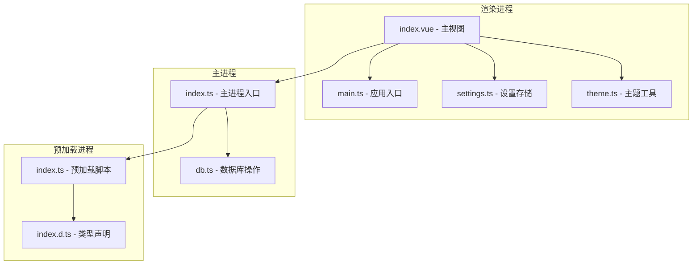
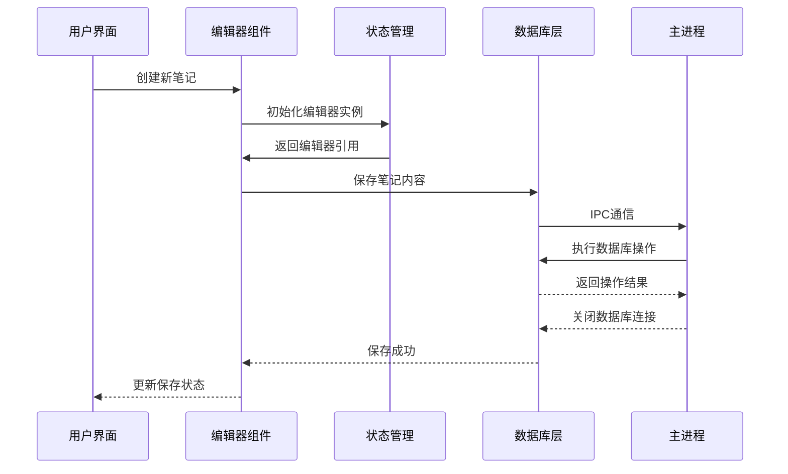
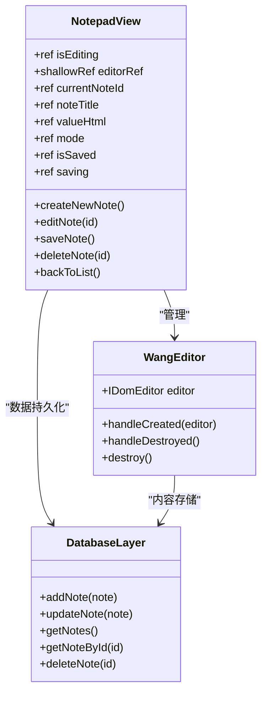
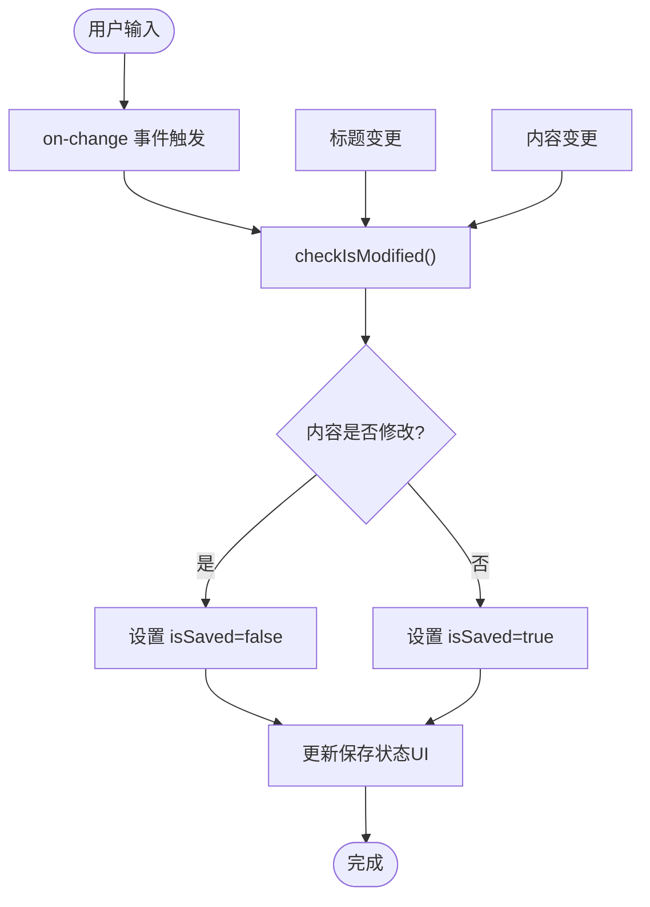
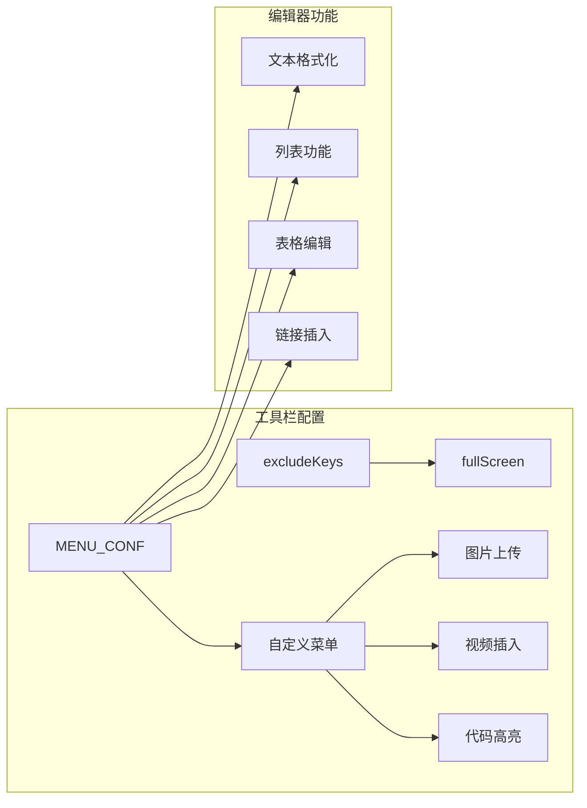
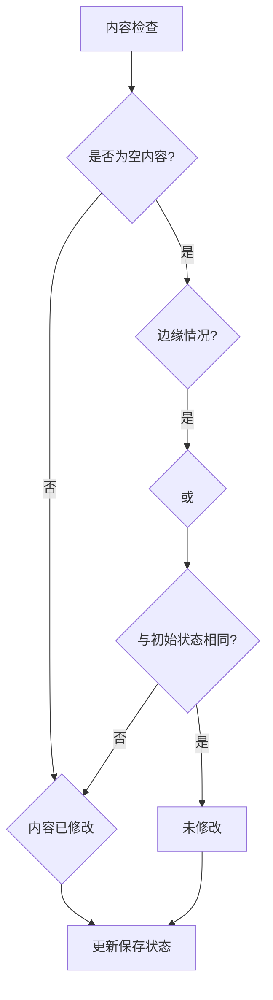
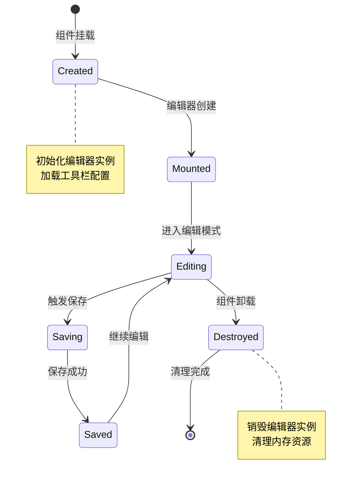
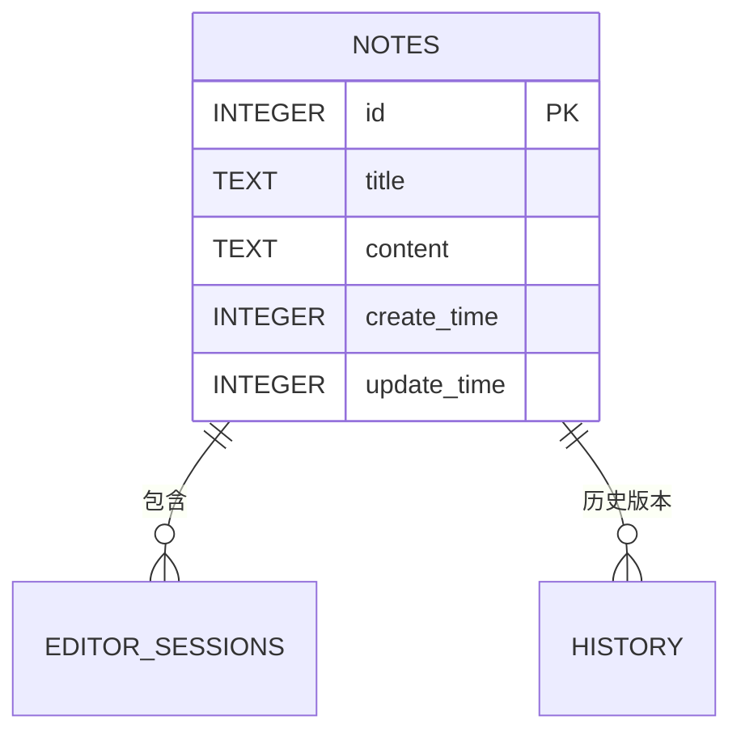
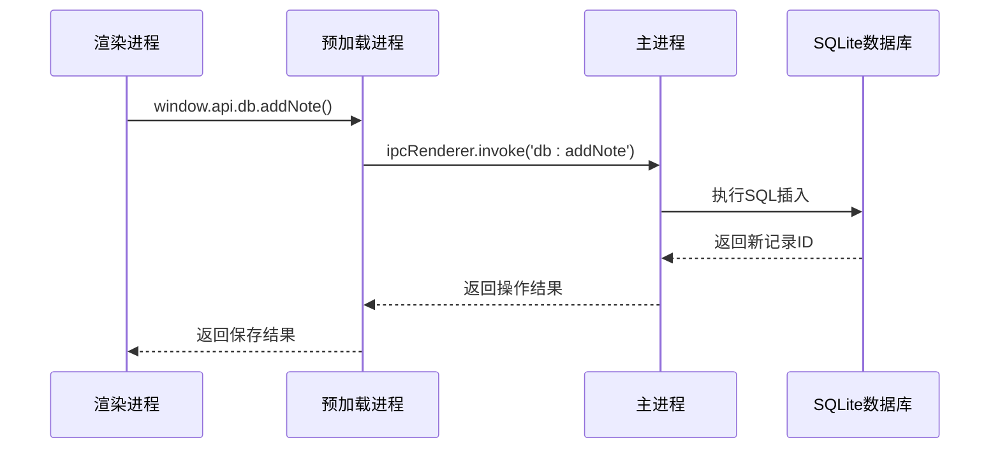
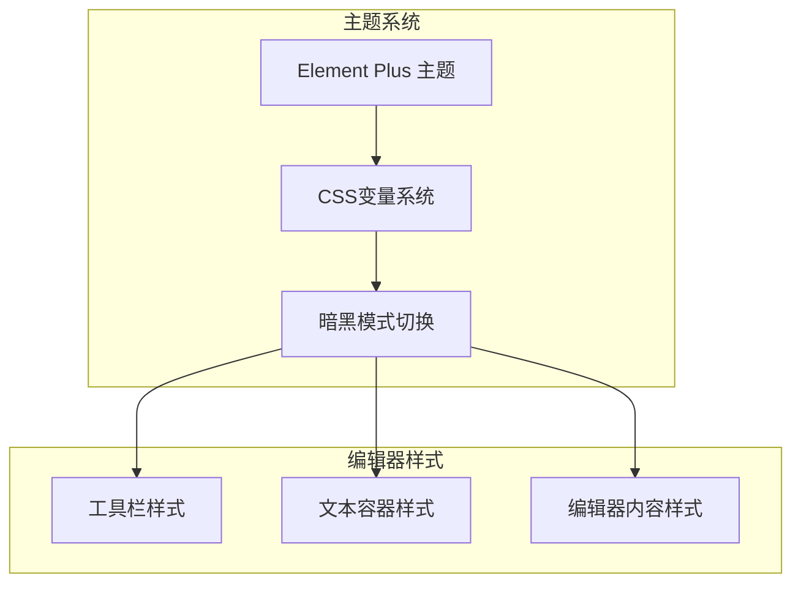

# 富文本编辑功能

<cite>
**本文档引用的文件**
- [index.vue](file://src/renderer/src/views/Notepad/index.vue)
- [package.json](file://package.json)
- [db.ts](file://src/main/db.ts)
- [index.ts](file://src/main/index.ts)
- [index.ts](file://src/preload/index.ts)
- [index.d.ts](file://src/preload/index.d.ts)
- [main.ts](file://src/renderer/src/main.ts)
- [settings.ts](file://src/renderer/src/store/settings.ts)
- [theme.ts](file://src/renderer/src/utils/theme.ts)
</cite>

## 目录

1. [简介](#简介)
2. [项目结构](#项目结构)
3. [核心组件](#核心组件)
4. [架构概览](#架构概览)
5. [详细组件分析](#详细组件分析)
6. [依赖关系分析](#依赖关系分析)
7. [性能考虑](#性能考虑)
8. [故障排除指南](#故障排除指南)
9. [结论](#结论)

## 简介

本地记事本模块集成了 @wangeditor/editor 富文本编辑器，提供了完整的笔记管理功能。该模块实现了从基础的富文本编辑到高级的数据库持久化、主题适配和响应式设计的完整解决方案。

## 项目结构

富文本编辑功能主要集中在以下文件中：



**图表来源**

- [index.vue:1-599](file://src/renderer/src/views/Notepad/index.vue#L1-L599)
- [main.ts:1-24](file://src/renderer/src/main.ts#L1-L24)
- [db.ts:1-100](file://src/main/db.ts#L1-L100)

**章节来源**

- [index.vue:1-599](file://src/renderer/src/views/Notepad/index.vue#L1-L599)
- [package.json:1-61](file://package.json#L1-L61)

## 核心组件

### 编辑器集成架构

富文本编辑器采用 @wangeditor/editor-for-vue 包装器进行集成，实现了以下核心功能：

#### 编辑器配置

- **占位符配置**: 提供用户友好的输入提示
- **工具栏配置**: 自定义工具栏按钮集合
- **菜单配置**: 支持扩展和自定义菜单项

#### 状态管理系统

- **编辑器实例管理**: 使用 shallowRef 确保响应式更新
- **内容状态跟踪**: 实时监控内容变化
- **保存状态管理**: 智能保存状态检测

**章节来源**

- [index.vue:116-174](file://src/renderer/src/views/Notepad/index.vue#L116-L174)
- [index.vue:146-155](file://src/renderer/src/views/Notepad/index.vue#L146-L155)

## 架构概览

富文本编辑功能采用三层架构设计，确保了良好的分离关注点和可维护性：



**图表来源**

- [index.vue:258-272](file://src/renderer/src/views/Notepad/index.vue#L258-L272)
- [index.vue:312-344](file://src/renderer/src/views/Notepad/index.vue#L312-L344)
- [db.ts:58-99](file://src/main/db.ts#L58-L99)

## 详细组件分析

### 编辑器组件实现

#### 编辑器实例管理

编辑器使用 shallowRef 来管理编辑器实例，确保响应式更新的同时避免不必要的深度监听：



**图表来源**

- [index.vue:116-174](file://src/renderer/src/views/Notepad/index.vue#L116-L174)
- [index.vue:258-344](file://src/renderer/src/views/Notepad/index.vue#L258-L344)

#### 内容变更监听机制

编辑器实现了多层次的内容变更检测：



**图表来源**

- [index.vue:171-198](file://src/renderer/src/views/Notepad/index.vue#L171-L198)
- [index.vue:200-207](file://src/renderer/src/views/Notepad/index.vue#L200-L207)

**章节来源**

- [index.vue:171-198](file://src/renderer/src/views/Notepad/index.vue#L171-L198)
- [index.vue:200-207](file://src/renderer/src/views/Notepad/index.vue#L200-L207)

### 工具栏自定义

#### 工具栏配置选项

工具栏通过 excludeKeys 属性排除不需要的功能按钮：

| 配置项      | 默认值         | 说明                           |
| ----------- | -------------- | ------------------------------ |
| excludeKeys | ['fullScreen'] | 排除全屏功能，适配桌面应用布局 |
| insertKeys  | undefined      | 插入功能键集合                 |
| replaceKeys | undefined      | 替换功能键集合                 |

#### 自定义菜单项

编辑器支持通过 MENU_CONF 配置对象添加自定义功能：



**图表来源**

- [index.vue:146-155](file://src/renderer/src/views/Notepad/index.vue#L146-L155)

**章节来源**

- [index.vue:146-155](file://src/renderer/src/views/Notepad/index.vue#L146-L155)

### 内容格式化功能

#### 富文本内容处理

编辑器支持标准的 HTML 格式化内容，包括：

- **段落格式**: 标准的 `<p>` 标签结构
- **文本样式**: 粗体、斜体、下划线等
- **列表功能**: 有序列表和无序列表
- **链接插入**: 支持外部链接和锚点链接
- **图片处理**: 图片上传和本地预览

#### 空内容处理策略

系统实现了智能的空内容检测机制：



**图表来源**

- [index.vue:171-189](file://src/renderer/src/views/Notepad/index.vue#L171-L189)

**章节来源**

- [index.vue:171-189](file://src/renderer/src/views/Notepad/index.vue#L171-L189)

### 生命周期管理

#### 编辑器生命周期

编辑器组件实现了完整的生命周期管理：



**图表来源**

- [index.vue:157-166](file://src/renderer/src/views/Notepad/index.vue#L157-L166)
- [index.vue:346-348](file://src/renderer/src/views/Notepad/index.vue#L346-L348)

#### 内存清理机制

组件销毁时自动清理编辑器资源，防止内存泄漏：

**章节来源**

- [index.vue:157-166](file://src/renderer/src/views/Notepad/index.vue#L157-L166)

### 数据持久化机制

#### 数据库架构设计

笔记数据采用 SQLite 进行本地存储，支持完整的 CRUD 操作：



**图表来源**

- [db.ts:25-32](file://src/main/db.ts#L25-L32)

#### IPC 通信架构

渲染进程与主进程通过 IPC 进行安全的数据交换：



**图表来源**

- [index.ts:80-85](file://src/main/index.ts#L80-L85)
- [index.ts:6-13](file://src/preload/index.ts#L6-L13)

**章节来源**

- [db.ts:58-99](file://src/main/db.ts#L58-L99)
- [index.ts:80-85](file://src/main/index.ts#L80-L85)

### 主题适配和响应式设计

#### 暗黑模式支持

编辑器完全支持 Element Plus 的暗黑模式，通过 CSS 变量实现动态主题切换：



**图表来源**

- [index.vue:585-593](file://src/renderer/src/views/Notepad/index.vue#L585-L593)
- [theme.ts:63-69](file://src/renderer/src/utils/theme.ts#L63-L69)

#### 响应式布局设计

编辑器采用 Flexbox 布局，支持不同屏幕尺寸的自适应：

**章节来源**

- [index.vue:585-593](file://src/renderer/src/views/Notepad/index.vue#L585-L593)
- [theme.ts:63-69](file://src/renderer/src/utils/theme.ts#L63-L69)

## 依赖关系分析

### 核心依赖关系

```mermaid
graph TB
subgraph "富文本编辑器依赖"
A[@wangeditor/editor]
B[@wangeditor/editor-for-vue]
C[@wangeditor/basic-modules]
D[@wangeditor/code-highlight]
end
subgraph "UI框架依赖"
E[Element Plus]
F[Vue 3]
G[TypeScript]
end
subgraph "数据库依赖"
H[sqlite3]
I[electron-log]
end
A --> C
A --> D
B --> A
B --> F
E --> F
H --> I
```

**图表来源**

- [package.json:27-37](file://package.json#L27-L37)

### 编辑器功能模块

富文本编辑器集成了多个功能模块，每个模块负责特定的功能领域：

| 模块名称            | 功能描述     | 依赖关系    |
| ------------------- | ------------ | ----------- |
| basic-modules       | 基础编辑功能 | slate, dom7 |
| code-highlight      | 代码语法高亮 | prismjs     |
| list-module         | 列表功能     | slate       |
| table-module        | 表格编辑     | slate       |
| upload-image-module | 图片上传     | @uppy/core  |
| video-module        | 视频插入     | @uppy/core  |

**章节来源**

- [package.json:27-37](file://package.json#L27-L37)

## 性能考虑

### 内存管理优化

#### 编辑器实例管理

- 使用 shallowRef 避免深度监听开销
- 组件卸载时自动销毁编辑器实例
- 智能的空内容检测减少不必要的比较

#### 数据库操作优化

- 批量查询优化，避免频繁的数据库访问
- 使用 Promise 封装异步操作
- 连接池管理，避免重复建立连接

### 响应式性能优化

#### 状态更新策略

- 分离标题和内容的状态管理
- 智能的保存状态检测算法
- 防抖处理避免频繁的数据库写入

#### UI渲染优化

- 使用 CSS 变量实现主题切换
- 避免不必要的组件重新渲染
- 合理的样式作用域管理

## 故障排除指南

### 常见问题诊断

#### 编辑器无法初始化

1. 检查 @wangeditor/editor 依赖是否正确安装
2. 验证 CSS 文件是否正确导入
3. 确认编辑器配置参数的有效性

#### 内容保存失败

1. 检查数据库连接状态
2. 验证 IPC 通信是否正常
3. 查看控制台错误日志

#### 主题切换异常

1. 确认 CSS 变量是否正确设置
2. 检查 Element Plus 版本兼容性
3. 验证暗黑模式切换逻辑

**章节来源**

- [index.vue:157-166](file://src/renderer/src/views/Notepad/index.vue#L157-L166)
- [db.ts:19-35](file://src/main/db.ts#L19-L35)

## 结论

本地记事本模块的富文本编辑功能实现了以下关键特性：

### 技术亮点

- **完整的富文本编辑体验**: 基于 @wangeditor/editor 的专业级编辑器
- **智能状态管理**: 实时内容检测和保存状态跟踪
- **优雅的主题适配**: 完美支持 Element Plus 暗黑模式
- **可靠的数据库持久化**: SQLite 本地存储和安全的 IPC 通信
- **响应式设计**: 适配不同屏幕尺寸的现代化布局

### 架构优势

- **清晰的分层架构**: 渲染进程、主进程、预加载进程职责明确
- **良好的可扩展性**: 支持插件扩展和自定义功能
- **完善的错误处理**: 全面的异常捕获和用户反馈机制
- **性能优化策略**: 多层次的性能优化和内存管理

该实现为开发者提供了一个生产级别的富文本编辑解决方案，既满足了功能需求，又保证了良好的用户体验和技术可维护性。
