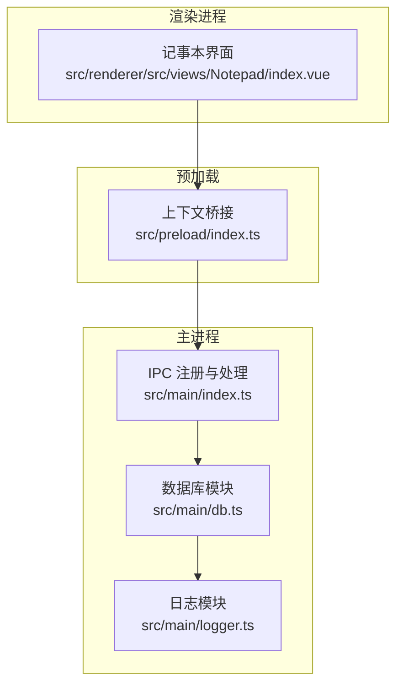
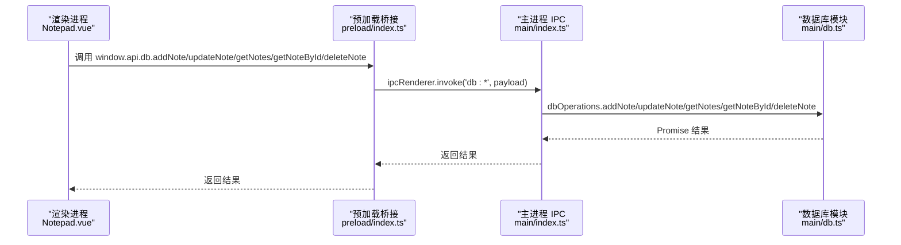
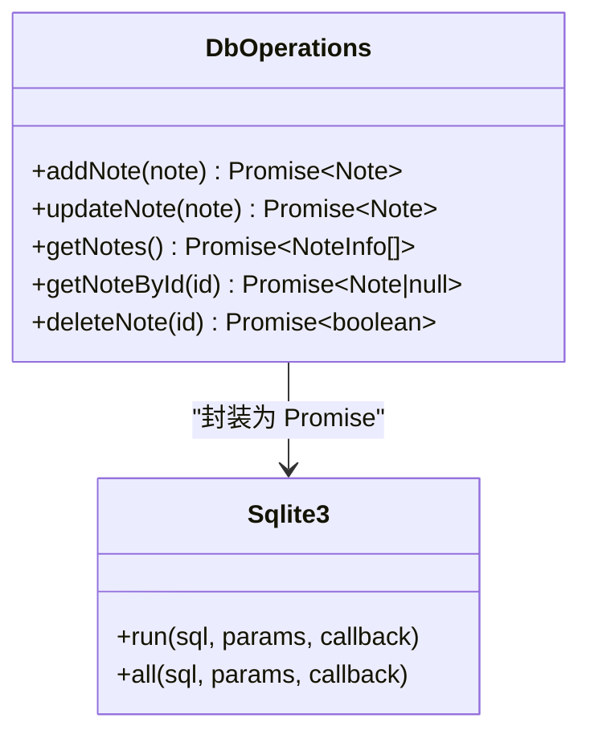
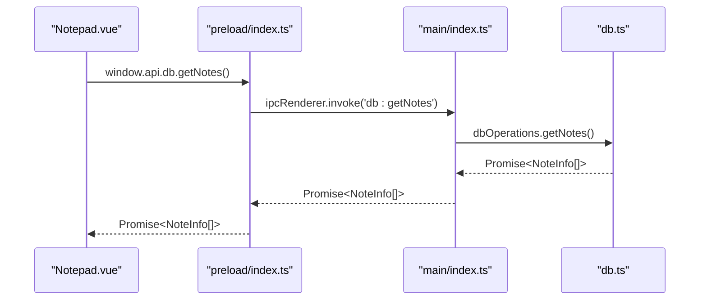
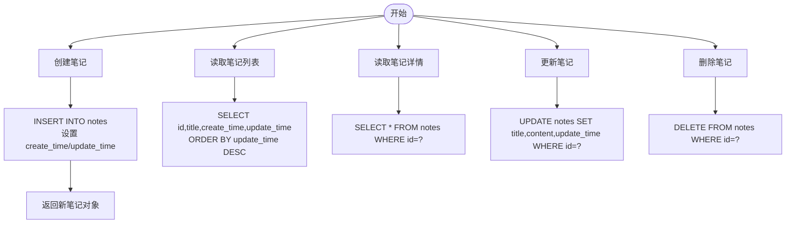
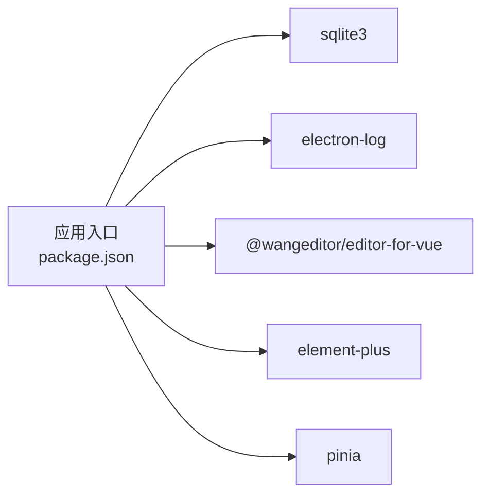

# 数据管理与存储

<cite>
**本文引用的文件**
- [db.ts](file://src/main/db.ts)
- [index.ts](file://src/main/index.ts)
- [index.ts](file://src/preload/index.ts)
- [index.vue](file://src/renderer/src/views/Notepad/index.vue)
- [logger.ts](file://src/main/logger.ts)
- [package.json](file://package.json)
</cite>

## 目录

1. [简介](#简介)
2. [项目结构](#项目结构)
3. [核心组件](#核心组件)
4. [架构总览](#架构总览)
5. [详细组件分析](#详细组件分析)
6. [依赖分析](#依赖分析)
7. [性能考虑](#性能考虑)
8. [故障排查指南](#故障排查指南)
9. [结论](#结论)
10. [附录](#附录)

## 简介

本文件面向本地记事本模块的数据管理与存储系统，围绕笔记数据模型、SQLite 数据库操作接口以及 CRUD 实现机制进行深入解析。文档覆盖笔记的创建、读取、更新、删除流程，包含数据验证、错误处理与事务管理策略；解释数据持久化策略、缓存机制、数据一致性保证与性能优化措施；并提供完整的 API 接口说明、数据模型定义、数据库查询优化技巧与故障恢复机制。

## 项目结构

本项目采用 Electron + Vue 的桌面应用架构，数据层位于主进程，通过 IPC 暴露给渲染进程使用。核心文件分布如下：

- 主进程数据库与 IPC：src/main/db.ts、src/main/index.ts
- 预加载桥接：src/preload/index.ts
- 渲染进程记事本界面：src/renderer/src/views/Notepad/index.vue
- 日志工具：src/main/logger.ts
- 依赖声明：package.json

图表来源

- [db.ts:1-100](file://src/main/db.ts#L1-L100)
- [index.ts:1-112](file://src/main/index.ts#L1-L112)
- [index.ts:1-37](file://src/preload/index.ts#L1-L37)
- [index.vue:1-599](file://src/renderer/src/views/Notepad/index.vue#L1-L599)
- [logger.ts:1-42](file://src/main/logger.ts#L1-L42)

章节来源

- [db.ts:1-100](file://src/main/db.ts#L1-L100)
- [index.ts:1-112](file://src/main/index.ts#L1-L112)
- [index.ts:1-37](file://src/preload/index.ts#L1-L37)
- [index.vue:1-599](file://src/renderer/src/views/Notepad/index.vue#L1-L599)
- [logger.ts:1-42](file://src/main/logger.ts#L1-L42)

## 核心组件

- 数据模型：笔记实体包含标识、标题、内容、创建时间与更新时间字段。
- 数据库接口：封装 sqlite3 的 run/all 方法为 Promise，提供 CRUD 操作。
- IPC 桥接：在主进程注册数据库相关 IPC 处理函数，在渲染进程通过 window.api.db 调用。
- 错误处理：主进程日志记录与渲染进程消息提示相结合。
- 性能策略：列表仅返回必要字段，避免富文本内容传输；编辑器内容变更检测减少无效保存。

章节来源

- [db.ts:58-99](file://src/main/db.ts#L58-L99)
- [index.ts:80-85](file://src/main/index.ts#L80-L85)
- [index.ts:5-19](file://src/preload/index.ts#L5-L19)
- [index.vue:137-144](file://src/renderer/src/views/Notepad/index.vue#L137-L144)

## 架构总览

渲染进程通过 window.api.db 发起数据库操作请求，经由预加载桥接转发至主进程 IPC 处理函数，主进程调用数据库模块执行 SQL 并返回结果。日志模块贯穿主进程，用于记录数据库初始化、错误与运行信息。

图表来源

- [index.vue:217-344](file://src/renderer/src/views/Notepad/index.vue#L217-L344)
- [index.ts:5-19](file://src/preload/index.ts#L5-L19)
- [index.ts:80-85](file://src/main/index.ts#L80-L85)
- [db.ts:58-99](file://src/main/db.ts#L58-L99)

## 详细组件分析

### 数据模型定义

- 字段说明
  - id：整型自增主键
  - title：文本标题，默认“无标题笔记”
  - content：富文本内容（HTML 字符串）
  - create_time：毫秒级时间戳
  - update_time：毫秒级时间戳
- 设计要点
  - 使用毫秒时间戳便于前端格式化与排序
  - 列表页仅返回必要字段，避免传输大体量富文本内容
  - 标题默认值确保非空约束

章节来源

- [db.ts:26-32](file://src/main/db.ts#L26-L32)
- [db.ts:82-85](file://src/main/db.ts#L82-L85)
- [db.ts:60-67](file://src/main/db.ts#L60-L67)
- [db.ts:70-78](file://src/main/db.ts#L70-L78)
- [index.vue:137-144](file://src/renderer/src/views/Notepad/index.vue#L137-L144)

### SQLite 数据库操作接口

- 初始化与表结构
  - 应用启动时在用户数据目录创建数据库文件
  - 自动创建 notes 表，包含上述字段
- Promise 化封装
  - run：封装 sqlite3.Database.run，返回 lastID 或抛出错误
  - all：封装 sqlite3.Database.all，返回查询结果数组或抛出错误
- CRUD 操作
  - addNote：插入新笔记，设置 create_time 与 update_time
  - updateNote：按 id 更新标题、内容与 update_time
  - getNotes：按更新时间倒序返回简要信息
  - getNoteById：按 id 查询完整笔记
  - deleteNote：按 id 删除笔记

图表来源

- [db.ts:38-55](file://src/main/db.ts#L38-L55)
- [db.ts:58-99](file://src/main/db.ts#L58-L99)

章节来源

- [db.ts:19-35](file://src/main/db.ts#L19-L35)
- [db.ts:38-55](file://src/main/db.ts#L38-L55)
- [db.ts:58-99](file://src/main/db.ts#L58-L99)

### IPC 与预加载桥接

- 预加载暴露 window.api.db，包含 addNote、updateNote、getNotes、getNoteById、deleteNote
- 主进程在 app.whenReady 后动态导入数据库模块并注册 ipcMain.handle
- 若数据库模块加载失败，仍可正常创建窗口，保证可用性

图表来源

- [index.ts:5-19](file://src/preload/index.ts#L5-L19)
- [index.ts:80-85](file://src/main/index.ts#L80-L85)
- [db.ts:82-86](file://src/main/db.ts#L82-L86)

章节来源

- [index.ts:75-92](file://src/main/index.ts#L75-L92)
- [index.ts:5-19](file://src/preload/index.ts#L5-L19)

### CRUD 流程与数据验证

- 创建笔记
  - 渲染进程调用 window.api.db.addNote
  - 主进程执行 SQL 插入，设置 create_time 与 update_time
  - 返回包含 id 与时间戳的新笔记对象
- 读取笔记
  - 列表：getNotes 返回 id、title、create_time、update_time
  - 详情：getNoteById 返回完整笔记
- 更新笔记
  - 渲染进程调用 window.api.db.updateNote
  - 主进程执行 SQL 更新 title、content、update_time
- 删除笔记
  - 渲染进程调用 window.api.db.deleteNote
  - 主进程执行 SQL 删除

图表来源

- [db.ts:60-67](file://src/main/db.ts#L60-L67)
- [db.ts:82-86](file://src/main/db.ts#L82-L86)
- [db.ts:89-92](file://src/main/db.ts#L89-L92)
- [db.ts:70-78](file://src/main/db.ts#L70-L78)
- [db.ts:95-98](file://src/main/db.ts#L95-L98)

章节来源

- [index.vue:217-344](file://src/renderer/src/views/Notepad/index.vue#L217-L344)
- [db.ts:58-99](file://src/main/db.ts#L58-L99)

### 数据验证与错误处理

- 标题默认值：若传入标题为空，后端将其置为“无标题笔记”，避免空标题
- 前端校验：编辑器内容为空时（如 
 
）视为未修改，防止误触发保存
- 错误处理：
  - 主进程：数据库模块与 IPC 加载失败均记录日志并继续运行
  - 渲染进程：数据库读写异常显示错误消息，删除与返回列表前进行二次确认

章节来源

- [db.ts:60-67](file://src/main/db.ts#L60-L67)
- [db.ts:70-78](file://src/main/db.ts#L70-L78)
- [index.ts:89-92](file://src/main/index.ts#L89-L92)
- [index.vue:218-224](file://src/renderer/src/views/Notepad/index.vue#L218-L224)
- [index.vue:294-310](file://src/renderer/src/views/Notepad/index.vue#L294-L310)
- [index.vue:172-189](file://src/renderer/src/views/Notepad/index.vue#L172-L189)

### 事务管理

- 当前实现未显式开启事务，所有操作以单条 SQL 执行
- SQLite 在单条语句中具备原子性；批量操作建议在上层逻辑合并为事务以提升一致性与性能

章节来源

- [db.ts:38-55](file://src/main/db.ts#L38-L55)

### 数据持久化策略

- 存储位置：Electron 应用用户数据目录下的 mytool_notes.db 文件
- 初始化策略：首次启动自动创建数据库与表结构
- 日志策略：日志按日期分片，便于问题定位与审计

章节来源

- [db.ts:8-17](file://src/main/db.ts#L8-L17)
- [db.ts:20-35](file://src/main/db.ts#L20-L35)
- [logger.ts:14-23](file://src/main/logger.ts#L14-L23)

### 缓存机制

- 列表缓存：渲染进程在 mounted 时一次性加载笔记列表，后续通过 IPC 刷新
- 内容缓存：编辑器内容在内存中维护，通过变更检测判断是否保存
- 建议优化：可在渲染进程增加基于时间戳的本地缓存，避免重复加载相同 id 的详情

章节来源

- [index.vue:217-224](file://src/renderer/src/views/Notepad/index.vue#L217-L224)
- [index.vue:191-198](file://src/renderer/src/views/Notepad/index.vue#L191-L198)

### 数据一致性保证

- 时间戳同步：创建与更新均写入 create_time/update_time，确保排序与审计一致
- 前端一致性：保存成功后更新初始状态，避免保存后立即返回弹窗提示
- 容错设计：数据库模块加载失败不影响窗口创建，保证基本可用性

章节来源

- [db.ts:60-67](file://src/main/db.ts#L60-L67)
- [db.ts:70-78](file://src/main/db.ts#L70-L78)
- [index.vue:330-337](file://src/renderer/src/views/Notepad/index.vue#L330-L337)
- [index.ts:89-92](file://src/main/index.ts#L89-L92)

### API 接口说明

- window.api.db.addNote(note)
  - 参数：{ title: string; content: string }
  - 返回：Promise<Note>
- window.api.db.updateNote(note)
  - 参数：{ id: number; title: string; content: string }
  - 返回：Promise<Note>
- window.api.db.getNotes()
  - 返回：Promise<NoteInfo[]>
- window.api.db.getNoteById(id)
  - 参数：number
  - 返回：Promise<Note|null>
- window.api.db.deleteNote(id)
  - 参数：number
  - 返回：Promise<boolean>

章节来源

- [index.ts:5-19](file://src/preload/index.ts#L5-L19)
- [index.ts:80-85](file://src/main/index.ts#L80-L85)
- [db.ts:58-99](file://src/main/db.ts#L58-L99)

## 依赖分析

- sqlite3：提供本地嵌入式数据库能力
- electron-log：提供日志输出与目录管理
- @wangeditor/editor-for-vue：富文本编辑器
- element-plus：UI 组件库
- pinia：状态管理（与记事本模块无直接耦合）

图表来源

- [package.json:23-37](file://package.json#L23-L37)

章节来源

- [package.json:23-37](file://package.json#L23-L37)

## 性能考虑

- 查询优化
  - 列表仅返回必要字段，避免传输大体量富文本内容
  - 按 update_time 倒序查询，满足常用排序需求
- 编辑器性能
  - 内容变更检测仅在实际修改时标记为未保存，减少无效保存
  - 富文本编辑器在渲染进程中运行，避免主线程阻塞
- I/O 优化
  - 数据库文件位于用户数据目录，避免跨盘符访问
  - 日志按日期分片，降低单文件体积
- 建议优化
  - 对高频查询建立索引（如 update_time）
  - 批量更新时使用事务包裹，减少磁盘写入次数
  - 列表页可引入分页或懒加载，进一步降低内存占用

章节来源

- [db.ts:82-86](file://src/main/db.ts#L82-L86)
- [index.vue:172-189](file://src/renderer/src/views/Notepad/index.vue#L172-L189)
- [logger.ts:14-23](file://src/main/logger.ts#L14-L23)

## 故障排查指南

- 数据库无法打开
  - 检查用户数据目录权限与磁盘空间
  - 查看日志文件定位具体错误
- IPC 调用失败
  - 确认主进程已注册对应 handle
  - 检查预加载桥接是否正确暴露 window.api.db
- 渲染进程报错
  - 查看控制台错误与 Element Plus 提示
  - 确认富文本编辑器实例在组件销毁时被正确释放
- 日志定位
  - 通过 window.api.log.changePath 设置日志目录
  - 使用 window.api.log.openFolder 打开日志文件夹

章节来源

- [index.ts:89-92](file://src/main/index.ts#L89-L92)
- [index.ts:61-73](file://src/main/index.ts#L61-L73)
- [logger.ts:25-39](file://src/main/logger.ts#L25-L39)
- [index.vue:158-162](file://src/renderer/src/views/Notepad/index.vue#L158-L162)

## 结论

本系统以 SQLite 作为轻量级持久化方案，结合 Electron 的 IPC 机制实现了稳定的记事本数据管理。通过列表字段裁剪、内容变更检测与日志分片等策略，兼顾了性能与可维护性。建议在未来引入事务与索引优化，并在渲染层增加更细粒度的缓存与分页策略，以进一步提升用户体验与系统稳定性。

## 附录

- 数据库初始化与表结构
  - 用户数据目录：app.getPath('userData')
  - 数据库文件：mytool_notes.db
  - 表结构：notes(id, title, content, create_time, update_time)
- 关键路径参考
  - 数据库模块：[db.ts:1-100](file://src/main/db.ts#L1-L100)
  - IPC 注册与处理：[index.ts:75-92](file://src/main/index.ts#L75-L92)
  - 预加载桥接：[index.ts:5-19](file://src/preload/index.ts#L5-L19)
  - 记事本界面：[index.vue:1-599](file://src/renderer/src/views/Notepad/index.vue#L1-L599)
  - 日志模块：[logger.ts:1-42](file://src/main/logger.ts#L1-L42)
