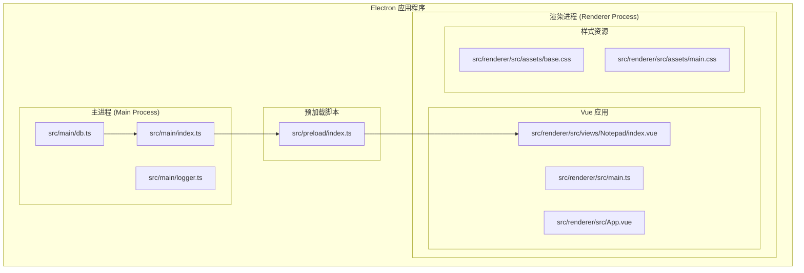
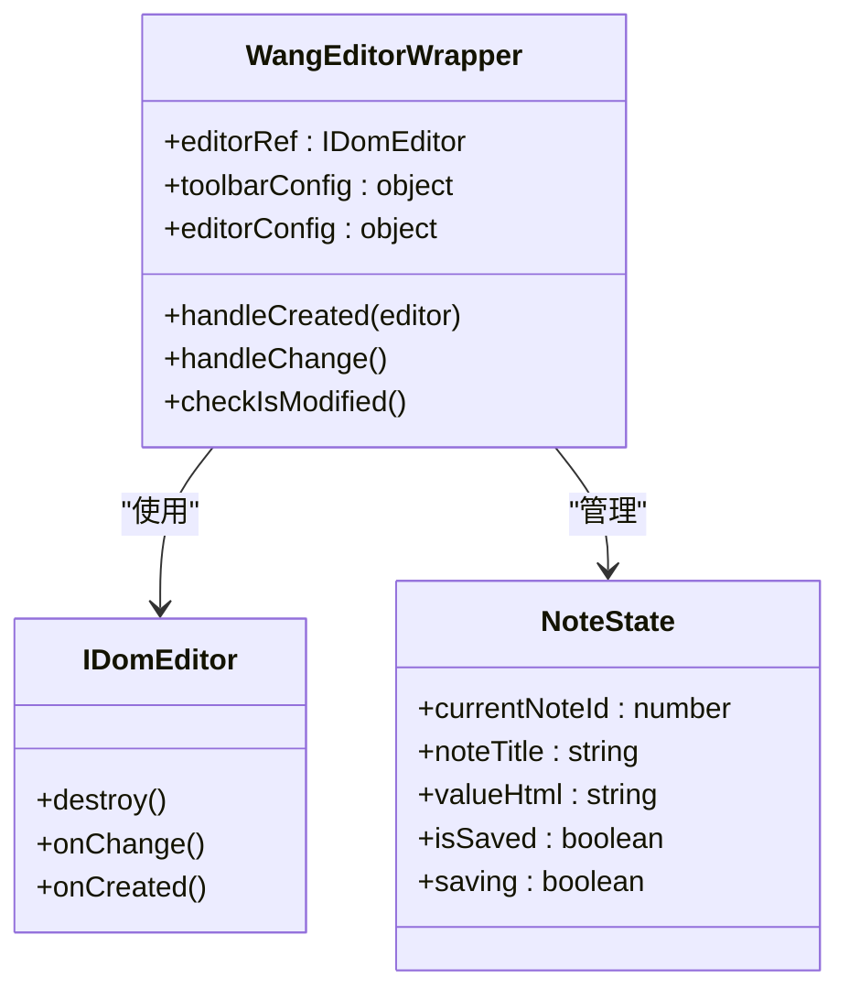
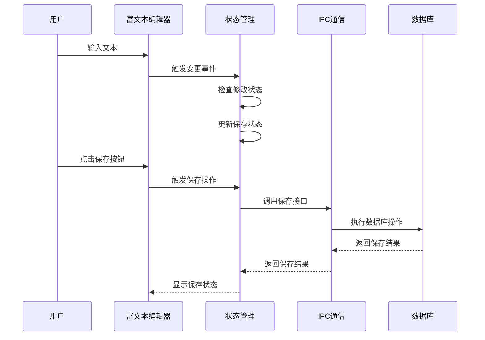
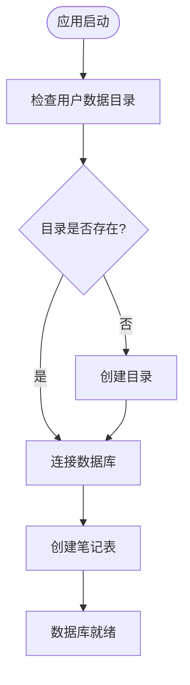
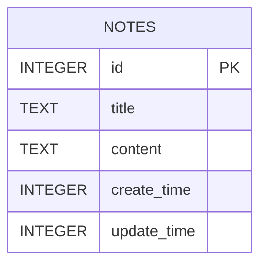
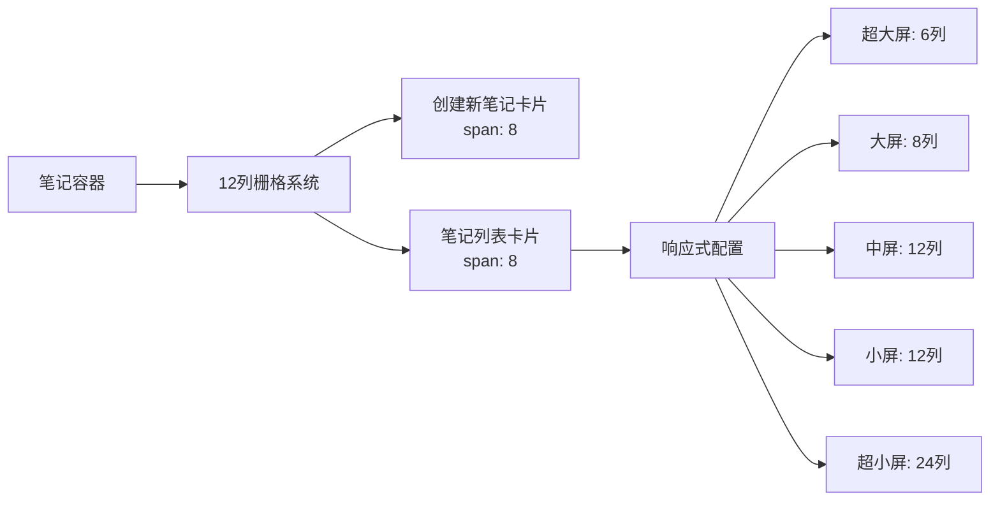
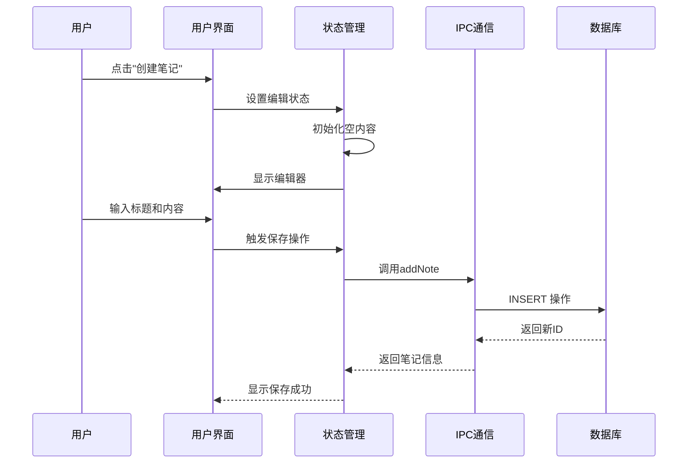
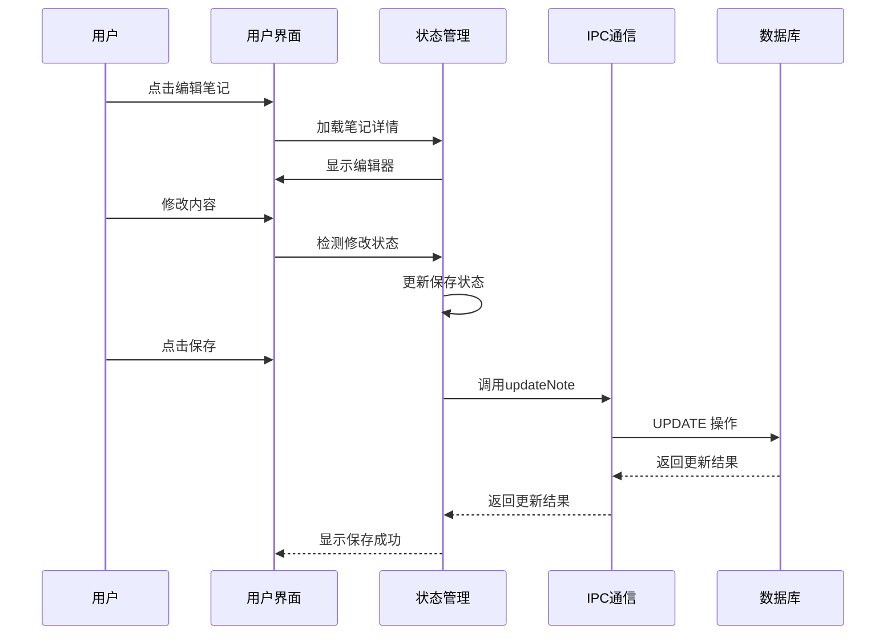
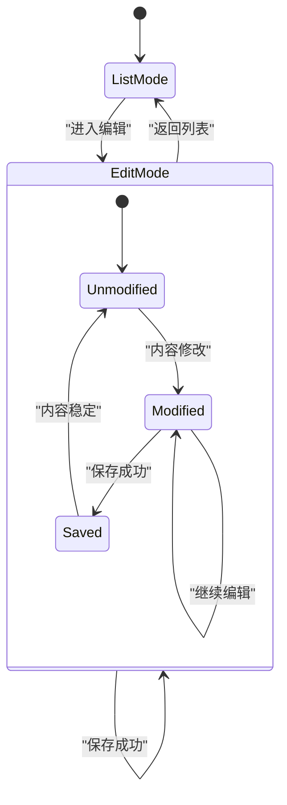
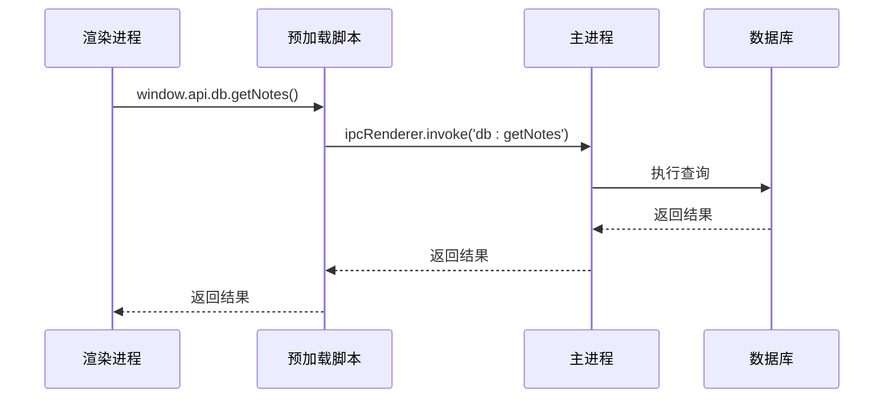

# 本地记事本模块

<cite>
**本文档引用的文件**
- [index.vue](file://src/renderer/src/views/Notepad/index.vue)
- [db.ts](file://src/main/db.ts)
- [index.ts](file://src/main/index.ts)
- [preload/index.ts](file://src/preload/index.ts)
- [package.json](file://package.json)
- [main.ts](file://src/renderer/src/main.ts)
- [base.css](file://src/renderer/src/assets/base.css)
- [main.css](file://src/renderer/src/assets/main.css)
</cite>

## 目录

1. [简介](#简介)
2. [项目结构](#项目结构)
3. [核心组件](#核心组件)
4. [架构概览](#架构概览)
5. [详细组件分析](#详细组件分析)
6. [依赖关系分析](#依赖关系分析)
7. [性能考虑](#性能考虑)
8. [故障排除指南](#故障排除指南)
9. [结论](#结论)

## 简介

本地记事本模块是一个基于 Electron + Vue + TypeScript 构建的桌面应用程序，集成了 @wangeditor/editor 富文本编辑器，使用 SQLite 数据库存储笔记数据。该模块提供了完整的笔记 CRUD 操作、响应式网格布局设计和实时保存机制，支持暗黑模式切换。

## 项目结构

本地记事本模块采用典型的 Electron 应用程序结构，主要分为渲染进程和主进程两个部分：



**图表来源**

- [index.ts:1-112](file://src/main/index.ts#L1-L112)
- [db.ts:1-100](file://src/main/db.ts#L1-L100)
- [index.vue:1-599](file://src/renderer/src/views/Notepad/index.vue#L1-L599)

**章节来源**

- [index.ts:1-112](file://src/main/index.ts#L1-L112)
- [db.ts:1-100](file://src/main/db.ts#L1-L100)
- [index.vue:1-599](file://src/renderer/src/views/Notepad/index.vue#L1-L599)

## 核心组件

### 富文本编辑器组件

系统集成了 @wangeditor/editor，这是一个功能强大的富文本编辑器，支持多种格式化选项和插件扩展。

### SQLite 数据库存储

使用 sqlite3 模块实现本地数据持久化，所有笔记数据存储在用户数据目录下的 mytool_notes.db 文件中。

### 响应式网格布局

采用 Element Plus 的栅格系统实现自适应布局，支持从移动端到桌面端的多设备适配。

**章节来源**

- [index.vue:116-166](file://src/renderer/src/views/Notepad/index.vue#L116-L166)
- [db.ts:58-99](file://src/main/db.ts#L58-L99)
- [index.vue:28-74](file://src/renderer/src/views/Notepad/index.vue#L28-L74)

## 架构概览

本地记事本模块采用分层架构设计，实现了清晰的职责分离：

```mermaid
graph TB
subgraph "用户界面层"
UI[Vue 组件<br/>Notepad/index.vue]
Editor[富文本编辑器<br/>@wangeditor/editor]
Grid[响应式网格<br/>Element Plus]
end
subgraph "应用逻辑层"
State[状态管理<br/>Vue Ref/Reactive]
Validation[数据验证<br/>修改检测]
Formatting[格式化处理<br/>时间格式化]
end
subgraph "数据访问层"
IPC[IPC 通信<br/>preload/index.ts]
DBOps[数据库操作<br/>dbOperations]
end
subgraph "数据存储层"
SQLite[SQLite 数据库<br/>mytool_notes.db]
end
UI --> Editor
UI --> Grid
UI --> State
State --> Validation
State --> Formatting
UI --> IPC
IPC --> DBOps
DBOps --> SQLite
```

**图表来源**

- [index.vue:116-348](file://src/renderer/src/views/Notepad/index.vue#L116-L348)
- [preload/index.ts:5-19](file://src/preload/index.ts#L5-L19)
- [db.ts:58-99](file://src/main/db.ts#L58-L99)

## 详细组件分析

### 富文本编辑器集成

#### 编辑器配置

系统使用 @wangeditor/editor-for-vue 包装器，配置了基础的编辑器参数：



**图表来源**

- [index.vue:126-166](file://src/renderer/src/views/Notepad/index.vue#L126-L166)
- [index.vue:130-136](file://src/renderer/src/views/Notepad/index.vue#L130-L136)

#### 实时保存机制

系统实现了智能的修改检测和自动保存功能：



**图表来源**

- [index.vue:191-207](file://src/renderer/src/views/Notepad/index.vue#L191-L207)
- [index.vue:312-344](file://src/renderer/src/views/Notepad/index.vue#L312-L344)

**章节来源**

- [index.vue:146-155](file://src/renderer/src/views/Notepad/index.vue#L146-L155)
- [index.vue:171-189](file://src/renderer/src/views/Notepad/index.vue#L171-L189)

### SQLite 数据库存储机制

#### 数据库初始化

系统在应用启动时自动初始化 SQLite 数据库：



**图表来源**

- [db.ts:15-35](file://src/main/db.ts#L15-L35)

#### 数据模型定义

数据库采用简洁的数据模型设计：



**图表来源**

- [db.ts:24-33](file://src/main/db.ts#L24-L33)

**章节来源**

- [db.ts:19-35](file://src/main/db.ts#L19-L35)
- [db.ts:58-99](file://src/main/db.ts#L58-L99)

### 响应式网格布局设计

#### 布局配置

系统使用 Element Plus 的栅格系统实现响应式布局：



**图表来源**

- [index.vue:29-67](file://src/renderer/src/views/Notepad/index.vue#L29-L67)

**章节来源**

- [index.vue:28-74](file://src/renderer/src/views/Notepad/index.vue#L28-L74)

### 笔记 CRUD 操作流程

#### 创建笔记流程



**图表来源**

- [index.vue:258-272](file://src/renderer/src/views/Notepad/index.vue#L258-L272)
- [db.ts:60-67](file://src/main/db.ts#L60-L67)

#### 更新笔记流程



**图表来源**

- [index.vue:235-256](file://src/renderer/src/views/Notepad/index.vue#L235-L256)
- [db.ts:69-78](file://src/main/db.ts#L69-L78)

**章节来源**

- [index.vue:216-224](file://src/renderer/src/views/Notepad/index.vue#L216-L224)
- [index.vue:292-310](file://src/renderer/src/views/Notepad/index.vue#L292-L310)

### 编辑状态管理

#### 状态跟踪机制

系统实现了智能的状态跟踪，确保数据的一致性和完整性：



**图表来源**

- [index.vue:123-136](file://src/renderer/src/views/Notepad/index.vue#L123-L136)

**章节来源**

- [index.vue:168-189](file://src/renderer/src/views/Notepad/index.vue#L168-L189)
- [index.vue:191-207](file://src/renderer/src/views/Notepad/index.vue#L191-L207)

## 依赖关系分析

### 技术栈依赖

```mermaid
graph TB
subgraph "前端依赖"
Vue[Vue 3.x]
TS[TypeScript]
EP[Element Plus]
WE[@wangeditor/editor]
end
subgraph "后端依赖"
Electron[Electron]
SQLite[sqlite3]
Node[Node.js API]
end
subgraph "构建工具"
Vite[Vite]
ESLint[ESLint]
Prettier[Prettier]
end
Vue --> EP
Vue --> WE
Electron --> SQLite
Vue --> Vite
Electron --> Node
```

**图表来源**

- [package.json:23-38](file://package.json#L23-L38)

### IPC 通信架构

系统通过 IPC 机制实现渲染进程和主进程之间的安全通信：



**图表来源**

- [preload/index.ts:5-19](file://src/preload/index.ts#L5-L19)
- [index.ts:80-85](file://src/main/index.ts#L80-L85)

**章节来源**

- [package.json:23-38](file://package.json#L23-L38)
- [preload/index.ts:1-37](file://src/preload/index.ts#L1-L37)

## 性能考虑

### 数据库性能优化

1. **查询优化**: 列表查询仅返回必要字段，避免传输大量富文本内容
2. **索引策略**: 按更新时间倒序排列，提高最近笔记的访问效率
3. **连接池**: 使用单例数据库连接，减少连接开销

### 前端性能优化

1. **懒加载**: 富文本编辑器组件按需加载
2. **虚拟滚动**: 大列表使用虚拟滚动技术
3. **缓存策略**: 编辑器实例缓存，避免重复创建

### 内存管理

1. **组件销毁**: 在组件卸载时自动销毁编辑器实例
2. **事件清理**: 及时清理事件监听器
3. **垃圾回收**: 合理管理大型富文本内容的内存占用

## 故障排除指南

### 常见问题及解决方案

#### 数据库连接失败

**症状**: 应用启动时报数据库连接错误

**原因分析**:

- 用户数据目录权限问题
- 数据库文件损坏
- 权限不足导致无法创建文件

**解决步骤**:

1. 检查用户数据目录权限
2. 删除损坏的数据库文件
3. 重启应用自动重建数据库

#### 富文本编辑器加载失败

**症状**: 编辑器无法正常显示或功能异常

**解决步骤**:

1. 检查网络连接，确保能够加载编辑器资源
2. 清除浏览器缓存
3. 重新安装依赖包

#### IPC 通信异常

**症状**: 数据库操作无响应或报错

**排查方法**:

1. 检查预加载脚本是否正确暴露 API
2. 验证 IPC 通道名称是否匹配
3. 查看主进程日志中的错误信息

**章节来源**

- [db.ts:20-35](file://src/main/db.ts#L20-L35)
- [index.ts:89-92](file://src/main/index.ts#L89-L92)

## 结论

本地记事本模块展现了现代桌面应用开发的最佳实践，通过合理的架构设计和技术选型，实现了功能完整、性能优良的富文本笔记管理应用。系统的主要优势包括：

1. **架构清晰**: 分层设计使得代码易于维护和扩展
2. **用户体验**: 响应式布局和实时保存提升了用户满意度
3. **技术先进**: 采用最新的 Electron 和 Vue 生态系统
4. **性能优化**: 多层次的性能优化确保应用流畅运行

该模块为开发者提供了一个优秀的参考实现，展示了如何在桌面应用中集成富文本编辑器、实现本地数据存储和构建响应式用户界面。
