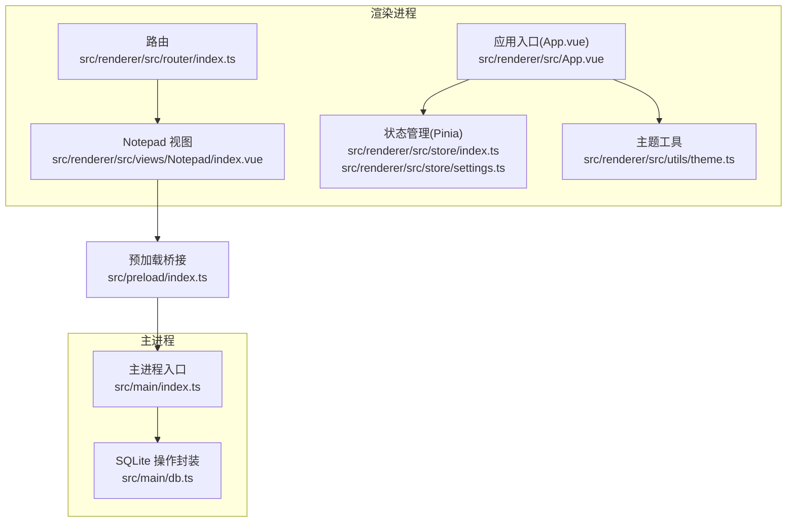
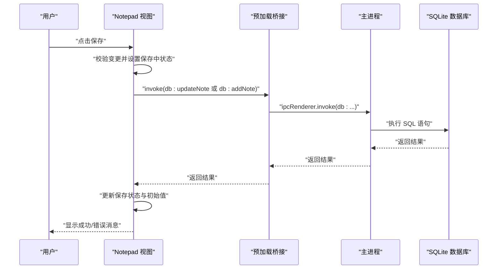
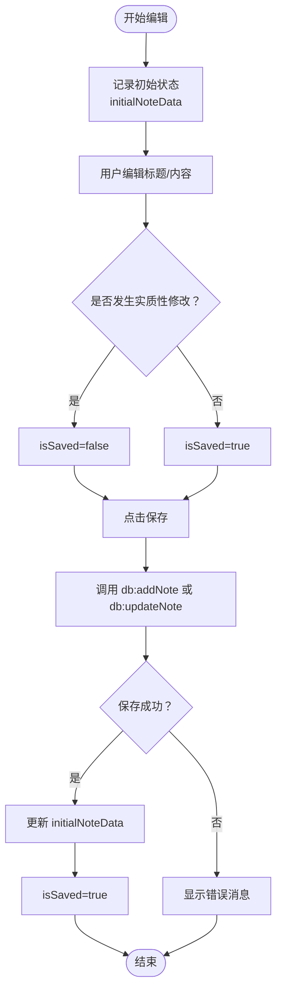
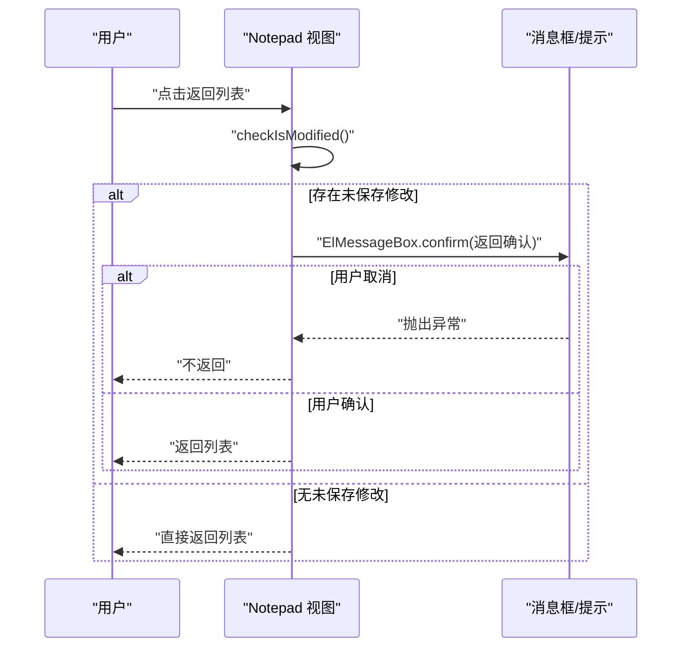
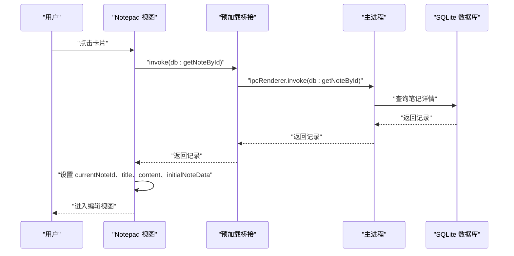
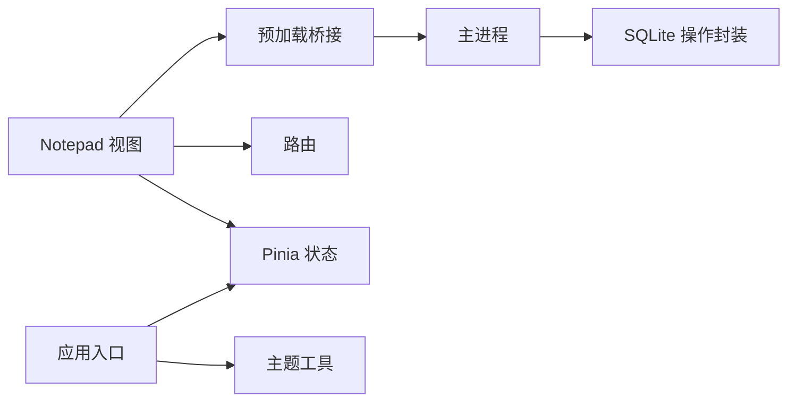

# 状态管理与用户体验

<cite>
**本文引用的文件**
- [src/renderer/src/views/Notepad/index.vue](file://src/renderer/src/views/Notepad/index.vue)
- [src/main/db.ts](file://src/main/db.ts)
- [src/preload/index.ts](file://src/preload/index.ts)
- [src/main/index.ts](file://src/main/index.ts)
- [src/renderer/src/router/index.ts](file://src/renderer/src/router/index.ts)
- [src/renderer/src/store/index.ts](file://src/renderer/src/store/index.ts)
- [src/renderer/src/store/settings.ts](file://src/renderer/src/store/settings.ts)
- [src/renderer/src/App.vue](file://src/renderer/src/App.vue)
- [src/renderer/src/utils/theme.ts](file://src/renderer/src/utils/theme.ts)
- [package.json](file://package.json)
</cite>

## 目录

1. [简介](#简介)
2. [项目结构](#项目结构)
3. [核心组件](#核心组件)
4. [架构总览](#架构总览)
5. [详细组件分析](#详细组件分析)
6. [依赖关系分析](#依赖关系分析)
7. [性能考量](#性能考量)
8. [故障排查指南](#故障排查指南)
9. [结论](#结论)
10. [附录](#附录)

## 简介

本文件围绕本地记事本模块的状态管理与用户体验进行深入解析，重点覆盖：

- 编辑器状态跟踪与保存状态指示
- 用户确认对话框与错误处理机制
- 视图切换逻辑、数据同步策略
- 用户操作反馈与界面状态管理
- 防重复保存、内容变更检测、自动保存机制与离线操作支持
- 用户体验优化建议、交互设计原则、可访问性支持与性能监控指标

## 项目结构

本地记事本模块位于渲染进程的 Vue 单文件组件中，通过预加载桥接暴露的 API 与主进程的 SQLite 数据库交互；同时借助路由与状态管理实现页面导航与主题/设置的持久化。

图表来源

- [src/renderer/src/views/Notepad/index.vue:1-599](file://src/renderer/src/views/Notepad/index.vue#L1-L599)
- [src/renderer/src/router/index.ts:1-79](file://src/renderer/src/router/index.ts#L1-L79)
- [src/renderer/src/store/index.ts:1-10](file://src/renderer/src/store/index.ts#L1-L10)
- [src/renderer/src/store/settings.ts:1-34](file://src/renderer/src/store/settings.ts#L1-L34)
- [src/renderer/src/App.vue:1-47](file://src/renderer/src/App.vue#L1-L47)
- [src/renderer/src/utils/theme.ts:1-70](file://src/renderer/src/utils/theme.ts#L1-L70)
- [src/preload/index.ts:1-37](file://src/preload/index.ts#L1-L37)
- [src/main/index.ts:1-112](file://src/main/index.ts#L1-L112)
- [src/main/db.ts:1-100](file://src/main/db.ts#L1-L100)

章节来源

- [src/renderer/src/views/Notepad/index.vue:1-599](file://src/renderer/src/views/Notepad/index.vue#L1-L599)
- [src/renderer/src/router/index.ts:1-79](file://src/renderer/src/router/index.ts#L1-L79)
- [src/renderer/src/store/index.ts:1-10](file://src/renderer/src/store/index.ts#L1-L10)
- [src/renderer/src/store/settings.ts:1-34](file://src/renderer/src/store/settings.ts#L1-L34)
- [src/renderer/src/App.vue:1-47](file://src/renderer/src/App.vue#L1-L47)
- [src/renderer/src/utils/theme.ts:1-70](file://src/renderer/src/utils/theme.ts#L1-L70)
- [src/preload/index.ts:1-37](file://src/preload/index.ts#L1-L37)
- [src/main/index.ts:1-112](file://src/main/index.ts#L1-L112)
- [src/main/db.ts:1-100](file://src/main/db.ts#L1-L100)

## 核心组件

- 视图组件：本地记事本视图负责列表与编辑两种视图的切换、富文本编辑器集成、保存状态指示、用户确认对话框与错误反馈。
- 数据层：主进程封装 SQLite 操作并通过 IPC 暴露方法，渲染进程通过预加载桥接调用。
- 状态层：Pinia 管理系统设置等全局状态，并使用持久化插件保持跨会话一致性。
- 路由层：基于 Vue Router 的 Hash 模式路由，将“本地记事本”作为子路由之一。

章节来源

- [src/renderer/src/views/Notepad/index.vue:1-599](file://src/renderer/src/views/Notepad/index.vue#L1-L599)
- [src/main/db.ts:1-100](file://src/main/db.ts#L1-L100)
- [src/preload/index.ts:1-37](file://src/preload/index.ts#L1-L37)
- [src/main/index.ts:1-112](file://src/main/index.ts#L1-L112)
- [src/renderer/src/store/index.ts:1-10](file://src/renderer/src/store/index.ts#L1-L10)
- [src/renderer/src/store/settings.ts:1-34](file://src/renderer/src/store/settings.ts#L1-L34)
- [src/renderer/src/router/index.ts:1-79](file://src/renderer/src/router/index.ts#L1-L79)

## 架构总览

渲染进程中的记事本视图通过预加载桥接调用主进程的数据库操作，主进程通过 IPC 响应请求并执行 SQLite 事务。Pinia 管理系统设置（如主题、暗黑模式）并持久化，应用入口监听设置变化以动态更新主题与标题。

图表来源

- [src/renderer/src/views/Notepad/index.vue:312-344](file://src/renderer/src/views/Notepad/index.vue#L312-L344)
- [src/preload/index.ts:5-19](file://src/preload/index.ts#L5-L19)
- [src/main/index.ts:80-85](file://src/main/index.ts#L80-L85)
- [src/main/db.ts:58-99](file://src/main/db.ts#L58-L99)

## 详细组件分析

### 编辑器状态跟踪与保存状态指示

- 状态字段
  - isEditing：控制列表视图与编辑视图的切换
  - currentNoteId：当前编辑笔记的标识
  - noteTitle：笔记标题
  - valueHtml：富文本内容
  - isSaved：保存状态指示
  - saving：保存中加载状态
  - initialNoteData：进入编辑时的初始内容快照，用于变更检测
- 变更检测
  - 标题变更通过 watch 实时检测
  - 富文本变更通过编辑器 onChange 回调触发检测
  - 空内容规范化处理（空字符串、
 
、

）
- 保存流程
  - 新建：调用新增接口并回填 id
  - 更新：调用更新接口
  - 成功后更新 initialNoteData 并置 isSaved 为 true
  - 失败时显示错误消息并保持 isSaved 为 false

图表来源

- [src/renderer/src/views/Notepad/index.vue:168-189](file://src/renderer/src/views/Notepad/index.vue#L168-L189)
- [src/renderer/src/views/Notepad/index.vue:191-207](file://src/renderer/src/views/Notepad/index.vue#L191-L207)
- [src/renderer/src/views/Notepad/index.vue:312-344](file://src/renderer/src/views/Notepad/index.vue#L312-L344)

章节来源

- [src/renderer/src/views/Notepad/index.vue:123-136](file://src/renderer/src/views/Notepad/index.vue#L123-L136)
- [src/renderer/src/views/Notepad/index.vue:168-207](file://src/renderer/src/views/Notepad/index.vue#L168-L207)
- [src/renderer/src/views/Notepad/index.vue:312-344](file://src/renderer/src/views/Notepad/index.vue#L312-L344)

### 用户确认对话框与错误处理机制

- 确认对话框
  - 返回列表：若存在未保存修改，弹出警告确认框，用户拒绝则中断返回
  - 删除笔记：弹出二次确认框，用户拒绝则中断删除
- 错误处理
  - 列表加载失败：显示“读取数据库失败”
  - 加载详情失败：显示“加载笔记详情失败”
  - 保存失败：显示“保存失败，请检查数据库状态”，并记录日志
  - 主进程加载数据库模块失败：记录错误并继续启动窗口

图表来源

- [src/renderer/src/views/Notepad/index.vue:274-290](file://src/renderer/src/views/Notepad/index.vue#L274-L290)
- [src/renderer/src/views/Notepad/index.vue:292-310](file://src/renderer/src/views/Notepad/index.vue#L292-L310)

章节来源

- [src/renderer/src/views/Notepad/index.vue:274-310](file://src/renderer/src/views/Notepad/index.vue#L274-L310)
- [src/main/index.ts:89-92](file://src/main/index.ts#L89-L92)

### 视图切换逻辑与数据同步策略

- 列表视图
  - 展示笔记卡片（标题、创建时间），支持下拉菜单编辑/删除
  - 点击卡片或“创建新笔记”进入编辑视图
- 编辑视图
  - 标题输入区与保存状态指示
  - 集成富文本编辑器（wangEditor），工具栏可配置
  - 保存按钮禁用重复提交（saving 控制）
- 数据同步
  - 进入编辑：根据 id 从数据库加载详情并记录初始状态
  - 返回列表：重新加载列表，确保 UI 与数据库一致
  - 删除：删除后自动刷新列表，必要时退出编辑视图

图表来源

- [src/renderer/src/views/Notepad/index.vue:235-256](file://src/renderer/src/views/Notepad/index.vue#L235-L256)
- [src/preload/index.ts:10-12](file://src/preload/index.ts#L10-L12)
- [src/main/index.ts:83](file://src/main/index.ts#L83)
- [src/main/db.ts:88-92](file://src/main/db.ts#L88-L92)

章节来源

- [src/renderer/src/views/Notepad/index.vue:28-112](file://src/renderer/src/views/Notepad/index.vue#L28-L112)
- [src/renderer/src/views/Notepad/index.vue:235-256](file://src/renderer/src/views/Notepad/index.vue#L235-L256)

### 防重复保存、内容变更检测与自动保存机制

- 防重复保存
  - 保存按钮绑定 loading 状态 saving，避免并发保存
  - 保存成功后才更新初始状态，防止保存后立即返回弹窗
- 内容变更检测
  - 标题变更：watch 监听
  - 富文本变更：编辑器 onChange 回调
  - 空内容规范化：统一空内容表示，避免误判
- 自动保存机制
  - 当前实现为显式保存（点击保存按钮），未内置定时自动保存
  - 建议：在编辑器 onChange 后增加防抖/节流，达到阈值后触发保存（见“用户体验优化建议”）

章节来源

- [src/renderer/src/views/Notepad/index.vue:134-136](file://src/renderer/src/views/Notepad/index.vue#L134-L136)
- [src/renderer/src/views/Notepad/index.vue:168-207](file://src/renderer/src/views/Notepad/index.vue#L168-L207)
- [src/renderer/src/views/Notepad/index.vue:312-344](file://src/renderer/src/views/Notepad/index.vue#L312-L344)

### 离线操作支持

- 数据库文件位于应用用户数据目录，随应用启动初始化
- 主进程在 app.whenReady 之后再加载数据库模块，避免 userData 目录未准备导致的错误
- 即使数据库模块加载失败，仍会创建窗口，保证基本可用性

章节来源

- [src/main/db.ts:7-17](file://src/main/db.ts#L7-L17)
- [src/main/index.ts:75-92](file://src/main/index.ts#L75-L92)

### 用户操作反馈与界面状态管理

- 消息反馈：Element Plus 的 ElMessage 用于成功/错误提示
- 对话框反馈：Element Plus 的 ElMessageBox 用于关键操作确认
- 界面状态：isEditing、isSaved、saving 等响应式状态驱动 UI 切换与视觉反馈

章节来源

- [src/renderer/src/views/Notepad/index.vue:118-119](file://src/renderer/src/views/Notepad/index.vue#L118-L119)
- [src/renderer/src/views/Notepad/index.vue:217-224](file://src/renderer/src/views/Notepad/index.vue#L217-L224)
- [src/renderer/src/views/Notepad/index.vue:337-341](file://src/renderer/src/views/Notepad/index.vue#L337-L341)

### 可访问性支持

- 文档标题与页面标题联动：应用入口监听系统名称变化并同步文档标题
- 主题与暗黑模式：通过 CSS 变量与类名切换实现，便于高对比度与低视力用户
- 键盘友好：富文本编辑器与 Element Plus 组件具备基础键盘导航能力

章节来源

- [src/renderer/src/App.vue:15-37](file://src/renderer/src/App.vue#L15-L37)
- [src/renderer/src/utils/theme.ts:63-69](file://src/renderer/src/utils/theme.ts#L63-L69)

## 依赖关系分析

- 渲染进程依赖
  - 预加载桥接：提供 db 与 log 的 API
  - 主进程：注册 IPC 处理函数，执行 SQLite 操作
  - 路由：将“本地记事本”作为子路由
  - 状态管理：Pinia + 持久化插件
- 第三方库
  - 富文本编辑器：wangEditor
  - UI 组件库：Element Plus
  - 状态管理：Pinia
  - 数据库：sqlite3

图表来源

- [src/renderer/src/views/Notepad/index.vue:1-599](file://src/renderer/src/views/Notepad/index.vue#L1-L599)
- [src/preload/index.ts:1-37](file://src/preload/index.ts#L1-L37)
- [src/main/index.ts:1-112](file://src/main/index.ts#L1-L112)
- [src/main/db.ts:1-100](file://src/main/db.ts#L1-L100)
- [src/renderer/src/router/index.ts:1-79](file://src/renderer/src/router/index.ts#L1-L79)
- [src/renderer/src/store/index.ts:1-10](file://src/renderer/src/store/index.ts#L1-L10)
- [src/renderer/src/App.vue:1-47](file://src/renderer/src/App.vue#L1-L47)
- [src/renderer/src/utils/theme.ts:1-70](file://src/renderer/src/utils/theme.ts#L1-L70)

章节来源

- [package.json:23-37](file://package.json#L23-L37)

## 性能考量

- 数据库查询优化
  - 列表查询仅返回必要字段（id、title、create_time、update_time），避免传输富文本内容
- 编辑器性能
  - 富文本编辑器高度自适应，滚动区域限制在编辑器容器内
- 状态更新
  - 使用浅引用保存编辑器实例，减少不必要的响应式开销
- 网络/离线
  - SQLite 本地存储，无需网络即可运行

章节来源

- [src/main/db.ts:82-86](file://src/main/db.ts#L82-L86)
- [src/renderer/src/views/Notepad/index.vue:102-110](file://src/renderer/src/views/Notepad/index.vue#L102-L110)

## 故障排查指南

- 无法加载笔记列表
  - 检查数据库初始化与路径
  - 查看控制台错误与消息提示
- 保存失败
  - 确认数据库连接状态
  - 查看日志输出定位具体错误
- 返回列表时反复弹窗
  - 确认保存成功后是否正确更新初始状态
- 主进程加载数据库模块失败
  - 查看日志输出，确认 app.whenReady 后再加载模块

章节来源

- [src/main/db.ts:19-35](file://src/main/db.ts#L19-L35)
- [src/main/index.ts:89-92](file://src/main/index.ts#L89-L92)
- [src/renderer/src/views/Notepad/index.vue:217-224](file://src/renderer/src/views/Notepad/index.vue#L217-L224)
- [src/renderer/src/views/Notepad/index.vue:338-341](file://src/renderer/src/views/Notepad/index.vue#L338-L341)

## 结论

本地记事本模块在状态管理与用户体验方面实现了清晰的职责分离：渲染进程负责视图与交互，主进程负责数据持久化，Pinia 管理系统设置并持久化。通过变更检测、确认对话框与错误反馈，提升了用户操作的安全性与可控性。建议后续引入自动保存与性能监控，进一步增强稳定性与可用性。

## 附录

### 用户体验优化建议

- 自动保存
  - 在编辑器 onChange 后加入防抖/节流，达到阈值后触发保存
  - 保存成功后更新初始状态，避免重复提示
- 交互设计原则
  - 明确的保存状态指示与视觉反馈
  - 关键操作（删除、返回列表）均需二次确认
- 可访问性支持
  - 为富文本编辑器提供键盘快捷键提示
  - 支持高对比度主题与字体缩放
- 性能监控指标
  - 编辑器渲染耗时、保存耗时、数据库查询耗时
  - 空闲时的内存占用与 CPU 占用

### 可能的扩展点

- 自动保存：在编辑器 onChange 后触发保存（需防抖/节流）
- 离线缓存：在本地 IndexedDB 中缓存最近编辑的笔记，提升离线体验
- 历史版本：为笔记提供版本管理与回滚功能
- 多标签页：支持多笔记并行编辑与标签页切换
