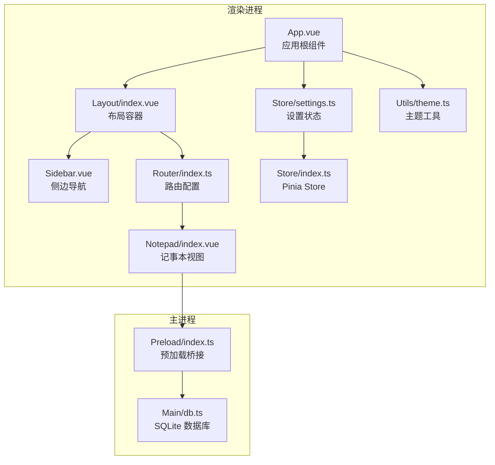
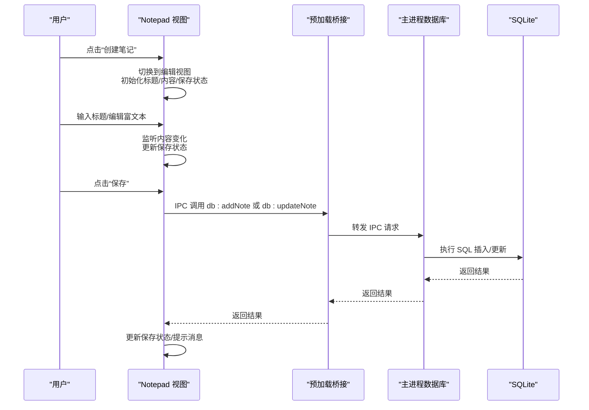
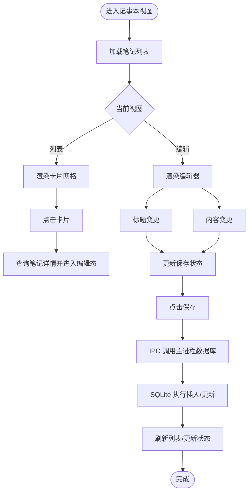
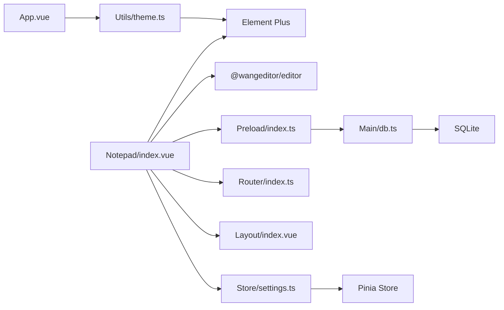

# 用户界面组件

<cite>
**本文引用的文件**
- [index.vue](file://src/renderer/src/views/Notepad/index.vue)
- [index.ts](file://src/renderer/src/router/index.ts)
- [index.vue](file://src/renderer/src/layout/index.vue)
- [Sidebar.vue](file://src/renderer/src/layout/components/Sidebar.vue)
- [App.vue](file://src/renderer/src/App.vue)
- [theme.ts](file://src/renderer/src/utils/theme.ts)
- [settings.ts](file://src/renderer/src/store/settings.ts)
- [index.ts](file://src/renderer/src/store/index.ts)
- [db.ts](file://src/main/db.ts)
- [index.ts](file://src/preload/index.ts)
</cite>

## 目录

1. [简介](#简介)
2. [项目结构](#项目结构)
3. [核心组件](#核心组件)
4. [架构总览](#架构总览)
5. [组件详细分析](#组件详细分析)
6. [依赖关系分析](#依赖关系分析)
7. [性能考量](#性能考量)
8. [故障排查指南](#故障排查指南)
9. [结论](#结论)

## 简介

本文件面向“本地记事本”模块的用户界面组件，系统性阐述笔记列表视图与编辑视图的组件架构、响应式网格布局、卡片式界面元素、富文本编辑器（@wangeditor/editor）集成与样式定制、状态管理与事件处理机制、用户交互流程与视觉反馈系统，并给出组件间通信、数据流与状态同步的技术细节说明。

## 项目结构

记事本模块位于渲染进程的视图层，通过路由挂载在统一布局容器中；数据库访问通过预加载桥接暴露给渲染进程，采用 SQLite 存储笔记数据。

图表来源

- [index.vue:1-599](file://src/renderer/src/views/Notepad/index.vue#L1-L599)
- [index.ts:1-79](file://src/renderer/src/router/index.ts#L1-L79)
- [index.vue:1-232](file://src/renderer/src/layout/index.vue#L1-L232)
- [Sidebar.vue:1-149](file://src/renderer/src/layout/components/Sidebar.vue#L1-L149)
- [App.vue:1-47](file://src/renderer/src/App.vue#L1-L47)
- [theme.ts:1-70](file://src/renderer/src/utils/theme.ts#L1-L70)
- [settings.ts:1-34](file://src/renderer/src/store/settings.ts#L1-L34)
- [index.ts:1-10](file://src/renderer/src/store/index.ts#L1-L10)
- [index.ts:1-37](file://src/preload/index.ts#L1-L37)
- [db.ts:1-100](file://src/main/db.ts#L1-L100)

章节来源

- [index.ts:1-79](file://src/renderer/src/router/index.ts#L1-L79)
- [index.vue:1-232](file://src/renderer/src/layout/index.vue#L1-L232)
- [index.vue:1-599](file://src/renderer/src/views/Notepad/index.vue#L1-L599)

## 核心组件

- 记事本视图（Notepad/index.vue）
  - 负责：列表视图展示、编辑视图渲染、富文本编辑器集成、状态管理与持久化调用、用户交互与视觉反馈。
  - 关键状态：编辑态开关、当前笔记 ID、标题、HTML 内容、保存状态、保存中状态。
  - 关键事件：创建、编辑、删除、返回列表、保存、内容变更监听。
- 布局容器（Layout/index.vue）
  - 负责：页面头部、面包屑、主内容区、暗黑模式切换、侧边栏联动。
- 侧边导航（Sidebar.vue）
  - 负责：菜单项高亮、路由跳转、折叠状态传递。
- 主题与设置（App.vue + theme.ts + settings.ts + store/index.ts）
  - 负责：动态主题色、暗黑模式切换、设置持久化。
- 数据访问（Preload/index.ts + Main/db.ts）
  - 负责：IPC 调用封装、SQLite CRUD 操作。

章节来源

- [index.vue:116-349](file://src/renderer/src/views/Notepad/index.vue#L116-L349)
- [index.vue:1-232](file://src/renderer/src/layout/index.vue#L1-L232)
- [Sidebar.vue:1-149](file://src/renderer/src/layout/components/Sidebar.vue#L1-L149)
- [App.vue:1-47](file://src/renderer/src/App.vue#L1-L47)
- [theme.ts:1-70](file://src/renderer/src/utils/theme.ts#L1-L70)
- [settings.ts:1-34](file://src/renderer/src/store/settings.ts#L1-L34)
- [index.ts:1-10](file://src/renderer/src/store/index.ts#L1-L10)
- [index.ts:1-37](file://src/preload/index.ts#L1-L37)
- [db.ts:1-100](file://src/main/db.ts#L1-L100)

## 架构总览

记事本模块采用“视图组件 + 状态管理 + 主进程桥接 + 数据库”的分层架构：

- 视图层：负责 UI 呈现与用户交互，使用 Element Plus 与 @wangeditor/editor。
- 状态层：使用 Pinia 管理主题与设置等全局状态。
- 通信层：通过预加载桥接暴露 API，渲染进程以 IPC 调用主进程数据库操作。
- 数据层：SQLite 存储笔记元数据与内容。

图表来源

- [index.vue:258-344](file://src/renderer/src/views/Notepad/index.vue#L258-L344)
- [index.ts:5-19](file://src/preload/index.ts#L5-L19)
- [db.ts:58-99](file://src/main/db.ts#L58-L99)

## 组件详细分析

### 列表视图与卡片式布局

- 响应式网格
  - 使用 Element Plus 的栅格系统，支持多断点（xl/lg/md/sm/xs），每行按断点分配列宽，保证在不同屏幕尺寸下的良好体验。
  - 列间距固定，卡片间距统一，底部留白避免滚动遮挡。
- 卡片式界面元素
  - 每个笔记卡片包含标题、创建时间与操作下拉菜单。
  - “创建新笔记”卡片采用虚线边框与悬停高亮，提供明确的入口引导。
  - 卡片具备阴影、圆角、悬停位移与边框高亮等过渡效果，提升交互反馈。
- 空状态
  - 当列表为空时显示空状态占位图与提示语，增强可用性。

章节来源

- [index.vue:27-74](file://src/renderer/src/views/Notepad/index.vue#L27-L74)
- [index.vue:374-495](file://src/renderer/src/views/Notepad/index.vue#L374-L495)

### 编辑视图与富文本编辑器集成

- 编辑器组件
  - 使用 @wangeditor/editor 的 Toolbar 与 Editor 组件，通过 v-model 双向绑定 HTML 内容。
  - 工具栏配置排除全屏功能，聚焦常用编辑能力。
  - 编辑器容器设置边框、圆角与溢出控制，确保内容区域与工具栏协调。
- 样式定制
  - 深色模式下通过全局选择器覆盖编辑器默认变量，保证与主题一致。
  - 工具栏与文本容器的颜色、背景与悬停态均与 Element Plus 设计体系对齐。
- 生命周期与销毁
  - 在组件卸载时销毁编辑器实例，避免内存泄漏。

章节来源

- [index.vue:76-113](file://src/renderer/src/views/Notepad/index.vue#L76-L113)
- [index.vue:146-162](file://src/renderer/src/views/Notepad/index.vue#L146-L162)
- [index.vue:557-581](file://src/renderer/src/views/Notepad/index.vue#L557-L581)
- [index.vue:585-593](file://src/renderer/src/views/Notepad/index.vue#L585-L593)

### 状态管理与事件处理机制

- 视图状态
  - isEditing 控制列表/编辑视图切换。
  - currentNoteId 记录当前编辑笔记 ID，用于区分新建与编辑场景。
  - isSaved 与 saving 控制保存状态指示器与按钮加载态。
- 内容状态
  - noteTitle 与 valueHtml 分别维护标题与富文本 HTML。
  - initialNoteData 记录进入编辑态时的初始值，用于“是否修改”的判定。
- 修改检测与保存状态
  - handleChange 与 watch(title) 结合，仅当标题或内容与初始值不同时标记为未保存。
  - 特殊处理空内容（空段落标签）以避免误判。
- 交互流程
  - 创建：清空标题与内容，记录空初始状态，进入编辑态。
  - 编辑：根据 ID 查询详情，填充标题与内容，记录初始状态，进入编辑态。
  - 返回列表：离开前再次比对，若未保存则弹窗确认。
  - 删除：二次确认后调用删除接口并刷新列表。
  - 保存：根据是否存在 ID 决定新增或更新，成功后更新初始状态并提示。

章节来源

- [index.vue:123-136](file://src/renderer/src/views/Notepad/index.vue#L123-L136)
- [index.vue:168-198](file://src/renderer/src/views/Notepad/index.vue#L168-L198)
- [index.vue:258-290](file://src/renderer/src/views/Notepad/index.vue#L258-L290)
- [index.vue:292-344](file://src/renderer/src/views/Notepad/index.vue#L292-L344)

### 用户交互流程与视觉反馈

- 头部操作区
  - 列表态显示“创建笔记”按钮；编辑态显示“返回列表”、“删除笔记”、“保存笔记”按钮。
  - 保存按钮支持 loading 状态，避免重复提交。
- 保存状态指示器
  - 标题输入区右侧显示“已保存/未保存更改”，并配合图标与颜色变化。
- 下拉菜单
  - 笔记卡片右上角提供“编辑/删除”选项，点击后触发对应动作。
- 消息提示
  - 成功/失败消息通过 Element Plus 的消息组件提示，增强可感知性。

章节来源

- [index.vue:3-25](file://src/renderer/src/views/Notepad/index.vue#L3-L25)
- [index.vue:81-84](file://src/renderer/src/views/Notepad/index.vue#L81-L84)
- [index.vue:51-60](file://src/renderer/src/views/Notepad/index.vue#L51-L60)
- [index.vue:217-224](file://src/renderer/src/views/Notepad/index.vue#L217-L224)
- [index.vue:293-310](file://src/renderer/src/views/Notepad/index.vue#L293-L310)
- [index.vue:312-344](file://src/renderer/src/views/Notepad/index.vue#L312-L344)

### 组件间通信与数据流

- 路由与布局
  - 路由将 Notepad 视图挂载到 Layout 容器，统一处理头部、侧边栏与主内容区。
  - 侧边栏根据当前路由高亮菜单项，支持折叠与主题色联动。
- 状态同步
  - 应用启动时从持久化 Store 读取主题与暗黑模式设置，动态应用到全局 CSS 变量。
  - 主题色与暗黑模式变更通过 watch 同步到 DOM，影响所有组件的视觉表现。
- 数据流
  - 渲染进程通过 window.api.db 调用主进程数据库操作，返回 Promise 结果后更新本地状态。
  - 列表页仅加载必要字段（标题、时间），详情页再按需加载完整内容，兼顾性能与体验。

图表来源

- [index.vue:216-224](file://src/renderer/src/views/Notepad/index.vue#L216-L224)
- [index.vue:235-256](file://src/renderer/src/views/Notepad/index.vue#L235-L256)
- [index.vue:191-207](file://src/renderer/src/views/Notepad/index.vue#L191-L207)
- [index.vue:312-344](file://src/renderer/src/views/Notepad/index.vue#L312-L344)
- [index.ts:5-19](file://src/preload/index.ts#L5-L19)
- [db.ts:58-99](file://src/main/db.ts#L58-L99)

章节来源

- [index.ts:37-55](file://src/renderer/src/router/index.ts#L37-L55)
- [index.vue:1-232](file://src/renderer/src/layout/index.vue#L1-L232)
- [Sidebar.vue:1-149](file://src/renderer/src/layout/components/Sidebar.vue#L1-L149)
- [App.vue:1-47](file://src/renderer/src/App.vue#L1-L47)
- [theme.ts:44-69](file://src/renderer/src/utils/theme.ts#L44-L69)
- [settings.ts:1-34](file://src/renderer/src/store/settings.ts#L1-L34)
- [index.ts:1-10](file://src/renderer/src/store/index.ts#L1-L10)
- [index.ts:1-37](file://src/preload/index.ts#L1-L37)
- [db.ts:1-100](file://src/main/db.ts#L1-L100)

## 依赖关系分析

- 组件耦合
  - Notepad 视图与 Element Plus、@wangeditor/editor 强耦合，但通过配置与样式隔离降低侵入性。
  - 与路由、布局、设置模块松耦合，通过 props 与 store 注入。
- 外部依赖
  - @wangeditor/editor 与 @wangeditor/editor-for-vue 提供富文本能力。
  - sqlite3 作为本地存储后端。
  - Element Plus 提供 UI 组件与主题系统。
- 数据持久化
  - Pinia + pinia-plugin-persistedstate 实现设置与主题的持久化。

图表来源

- [index.vue:118-121](file://src/renderer/src/views/Notepad/index.vue#L118-L121)
- [index.ts:5-19](file://src/preload/index.ts#L5-L19)
- [db.ts:1-100](file://src/main/db.ts#L1-L100)
- [index.ts:1-79](file://src/renderer/src/router/index.ts#L1-L79)
- [index.vue:1-232](file://src/renderer/src/layout/index.vue#L1-L232)
- [settings.ts:1-34](file://src/renderer/src/store/settings.ts#L1-L34)
- [index.ts:1-10](file://src/renderer/src/store/index.ts#L1-L10)
- [App.vue:1-47](file://src/renderer/src/App.vue#L1-L47)
- [theme.ts:1-70](file://src/renderer/src/utils/theme.ts#L1-L70)

章节来源

- [package.json:23-37](file://package.json#L23-L37)

## 性能考量

- 列表渲染优化
  - 列表仅加载必要字段，避免一次性传输富文本内容，减少渲染压力。
- 编辑器实例管理
  - 组件卸载时销毁编辑器，避免内存泄漏与事件残留。
- 空内容处理
  - 对空编辑器内容进行标准化比较，避免不必要的保存提示与网络请求。
- 滚动与布局
  - 主内容区使用滚动容器，避免全局滚动条冲突；编辑器高度自适应视口。

章节来源

- [db.ts:81-86](file://src/main/db.ts#L81-L86)
- [index.vue:157-162](file://src/renderer/src/views/Notepad/index.vue#L157-L162)
- [index.vue:176-189](file://src/renderer/src/views/Notepad/index.vue#L176-L189)
- [index.vue:191-215](file://src/renderer/src/layout/index.vue#L191-L215)

## 故障排查指南

- 无法加载笔记列表
  - 检查数据库连接与初始化日志；确认 userData 目录存在且可写。
  - 查看渲染进程错误提示与控制台输出。
- 保存失败
  - 确认 IPC 调用链路正常；检查主进程数据库操作返回值。
  - 若提示“数据库状态异常”，尝试重启应用或清理用户数据目录。
- 富文本编辑器样式异常
  - 确认深色模式切换逻辑生效；检查全局 CSS 变量覆盖是否正确。
  - 确保 @wangeditor/editor 的样式文件已正确引入。
- 返回列表时误触确认弹窗
  - 检查修改检测逻辑是否正确识别空内容；确认初始状态记录与当前状态一致。

章节来源

- [db.ts:15-35](file://src/main/db.ts#L15-L35)
- [index.vue:217-224](file://src/renderer/src/views/Notepad/index.vue#L217-L224)
- [index.vue:312-344](file://src/renderer/src/views/Notepad/index.vue#L312-L344)
- [index.vue:585-593](file://src/renderer/src/views/Notepad/index.vue#L585-L593)

## 结论

本地记事本模块通过清晰的视图分层、合理的状态管理与完善的 IPC 通信，实现了流畅的笔记浏览与编辑体验。富文本编辑器的集成与样式定制满足了日常写作需求，而响应式网格与卡片式布局提升了信息密度与可读性。建议后续可进一步扩展：支持草稿自动保存、内容搜索与标签分类、导出与导入功能，以及更丰富的编辑器工具配置。
