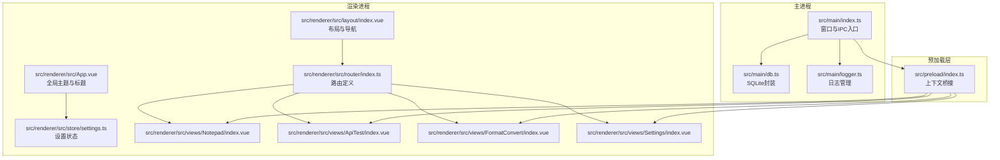
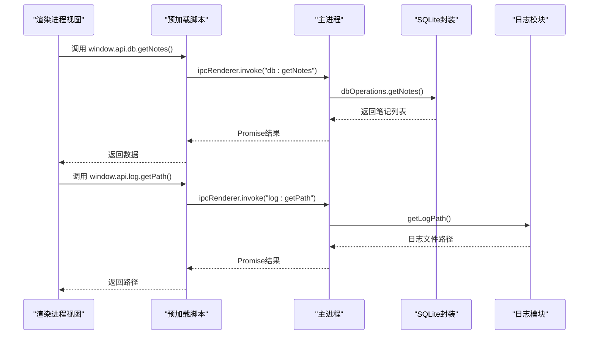
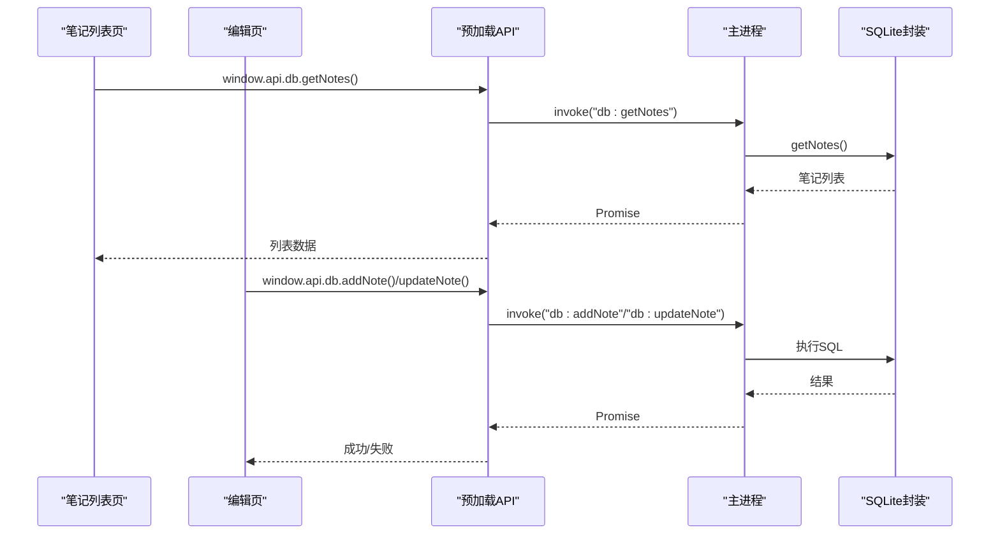
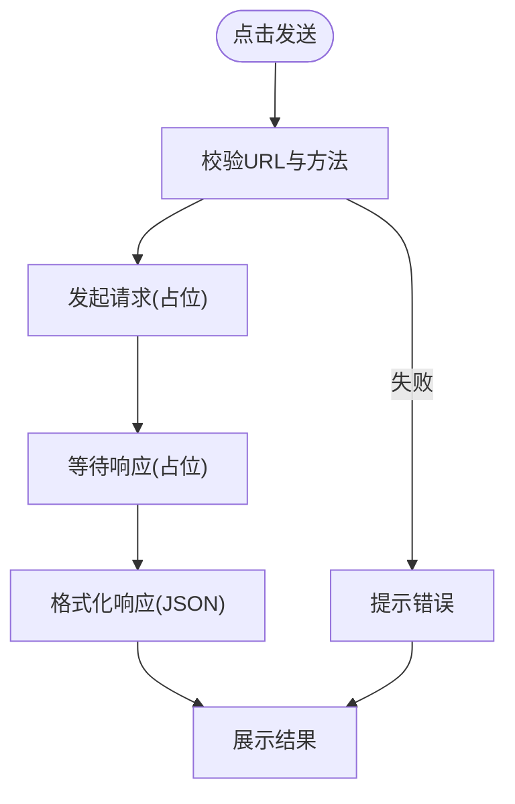
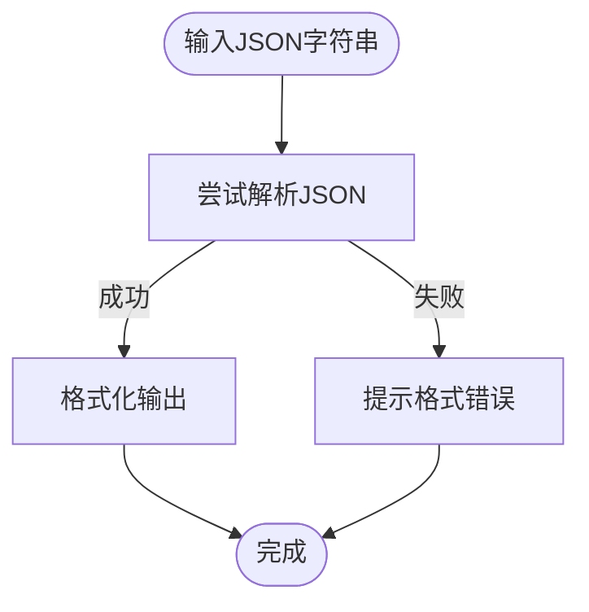
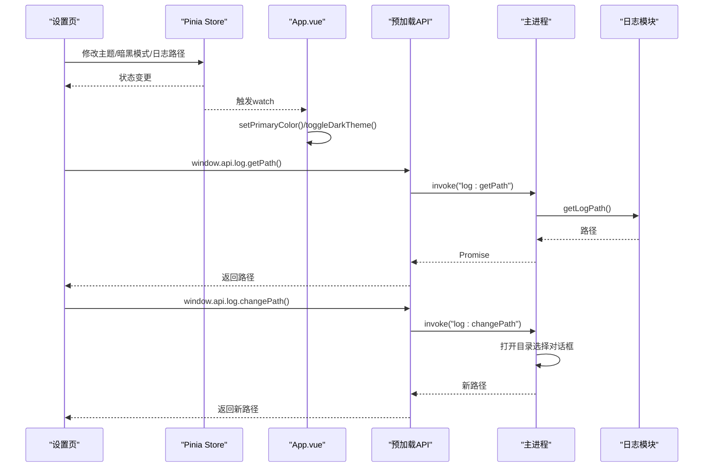
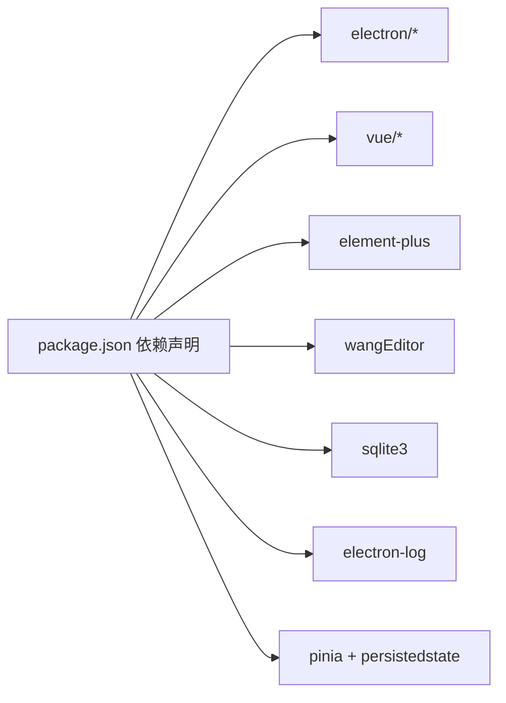

# 核心功能模块

<cite>
**本文引用的文件**   
- [README.md](file://README.md)
- [package.json](file://package.json)
- [src/main/index.ts](file://src/main/index.ts)
- [src/main/db.ts](file://src/main/db.ts)
- [src/main/logger.ts](file://src/main/logger.ts)
- [src/preload/index.ts](file://src/preload/index.ts)
- [src/renderer/src/App.vue](file://src/renderer/src/App.vue)
- [src/renderer/src/router/index.ts](file://src/renderer/src/router/index.ts)
- [src/renderer/src/layout/index.vue](file://src/renderer/src/layout/index.vue)
- [src/renderer/src/views/Notepad/index.vue](file://src/renderer/src/views/Notepad/index.vue)
- [src/renderer/src/views/ApiTest/index.vue](file://src/renderer/src/views/ApiTest/index.vue)
- [src/renderer/src/views/FormatConvert/index.vue](file://src/renderer/src/views/FormatConvert/index.vue)
- [src/renderer/src/views/Settings/index.vue](file://src/renderer/src/views/Settings/index.vue)
- [src/renderer/src/store/settings.ts](file://src/renderer/src/store/settings.ts)
</cite>

## 目录

1. [简介](#简介)
2. [项目结构](#项目结构)
3. [核心组件](#核心组件)
4. [架构总览](#架构总览)
5. [详细组件分析](#详细组件分析)
6. [依赖分析](#依赖分析)
7. [性能考虑](#性能考虑)
8. [故障排查指南](#故障排查指南)
9. [结论](#结论)
10. [附录](#附录)

## 简介

本文件围绕 MyTool 的四个核心功能模块：本地记事本、接口测试工具、格式转换工具与系统设置，提供从架构到实现细节的全景式文档。文档旨在帮助不同经验层次的开发者快速理解模块的设计理念、业务价值、目标用户与使用场景，并给出扩展与定制建议。同时，文档通过架构图与流程图展示模块间协作关系与数据流转，辅以最佳实践与排障建议，帮助团队高效落地与维护。

## 项目结构

MyTool 是基于 Electron + Vue + TypeScript 的桌面应用，采用主进程（Electron 主线程）与渲染进程（Vue 应用）分离的架构。主进程负责窗口管理、IPC 通信、SQLite 数据库初始化与日志管理；渲染进程承载四大功能视图与状态管理，通过预加载脚本暴露受控的 API 给前端使用。

图表来源

- [src/main/index.ts:1-112](file://src/main/index.ts#L1-L112)
- [src/main/db.ts:1-100](file://src/main/db.ts#L1-L100)
- [src/main/logger.ts:1-42](file://src/main/logger.ts#L1-L42)
- [src/preload/index.ts:1-37](file://src/preload/index.ts#L1-L37)
- [src/renderer/src/App.vue:1-47](file://src/renderer/src/App.vue#L1-L47)
- [src/renderer/src/layout/index.ts:1-79](file://src/renderer/src/layout/index.ts#L1-L79)
- [src/renderer/src/router/index.ts:1-79](file://src/renderer/src/router/index.ts#L1-L79)
- [src/renderer/src/store/settings.ts:1-34](file://src/renderer/src/store/settings.ts#L1-L34)
- [src/renderer/src/views/Notepad/index.vue:1-599](file://src/renderer/src/views/Notepad/index.vue#L1-L599)
- [src/renderer/src/views/ApiTest/index.vue:1-163](file://src/renderer/src/views/ApiTest/index.vue#L1-L163)
- [src/renderer/src/views/FormatConvert/index.vue:1-176](file://src/renderer/src/views/FormatConvert/index.vue#L1-L176)
- [src/renderer/src/views/Settings/index.vue:1-198](file://src/renderer/src/views/Settings/index.vue#L1-L198)

章节来源

- [README.md:1-35](file://README.md#L1-L35)
- [package.json:1-61](file://package.json#L1-L61)
- [src/main/index.ts:1-112](file://src/main/index.ts#L1-L112)
- [src/renderer/src/router/index.ts:1-79](file://src/renderer/src/router/index.ts#L1-L79)

## 核心组件

- 本地记事本：基于 SQLite 的富文本笔记管理，支持新建、编辑、删除与列表展示，数据持久化至用户数据目录。
- 接口测试工具：提供简单请求发送与响应展示，便于快速验证 API。
- 格式转换工具：提供 JSON 格式化能力，校验输入并输出美化后的 JSON。
- 系统设置：集中管理应用主题、暗黑模式、自动锁屏、通知开关与日志目录等配置，配置持久化。

章节来源

- [src/renderer/src/views/Notepad/index.vue:1-599](file://src/renderer/src/views/Notepad/index.vue#L1-L599)
- [src/renderer/src/views/ApiTest/index.vue:1-163](file://src/renderer/src/views/ApiTest/index.vue#L1-L163)
- [src/renderer/src/views/FormatConvert/index.vue:1-176](file://src/renderer/src/views/FormatConvert/index.vue#L1-L176)
- [src/renderer/src/views/Settings/index.vue:1-198](file://src/renderer/src/views/Settings/index.vue#L1-L198)
- [src/main/db.ts:1-100](file://src/main/db.ts#L1-L100)
- [src/main/logger.ts:1-42](file://src/main/logger.ts#L1-L42)

## 架构总览

MyTool 的整体架构遵循“主进程 + 渲染进程 + 预加载桥接”的经典 Electron 模式。主进程负责：

- 窗口生命周期与外部链接处理
- IPC 事件注册与数据库、日志相关操作
- 延迟加载数据库模块，避免 app 路径未准备导致的异常

渲染进程负责：

- 路由与布局
- 四大功能视图
- Pinia 状态管理与主题切换
- 通过 window.api 暴露的受限 API 访问主进程能力

图表来源

- [src/preload/index.ts:1-37](file://src/preload/index.ts#L1-L37)
- [src/main/index.ts:75-92](file://src/main/index.ts#L75-L92)
- [src/main/db.ts:82-86](file://src/main/db.ts#L82-L86)
- [src/main/logger.ts:25-27](file://src/main/logger.ts#L25-L27)

## 详细组件分析

### 本地记事本模块

- 功能定位与设计理念
  - 设计目标：提供轻量、易用的富文本笔记管理，强调本地持久化与离线可用性。
  - 数据模型：笔记包含标题、内容、创建时间与更新时间，列表仅返回必要字段以优化性能。
  - 用户体验：卡片式列表、富文本编辑器、保存状态提示与未保存提醒，确保编辑安全。

- 业务价值与目标用户
  - 适合需要快速记录灵感、整理思路、离线写作的个人与小团队成员。
  - 通过 SQLite 本地存储，满足隐私与合规要求。

- 使用场景
  - 快速创建/编辑/删除笔记
  - 在多设备间无需网络即可查看与编辑
  - 作为临时草稿与知识沉淀的容器

- 关键实现要点
  - 预加载桥接：通过 window.api.db 暴露 CRUD 操作，渲染进程以 invoke 方式调用。
  - 富文本编辑器：集成 wangEditor，提供工具栏与编辑区域，支持内容变更监听与保存状态计算。
  - 空内容处理：对编辑器空内容进行统一判定，避免误判为已修改。
  - 销毁时机：组件卸载时销毁编辑器实例，释放资源。

图表来源

- [src/renderer/src/views/Notepad/index.vue:217-344](file://src/renderer/src/views/Notepad/index.vue#L217-L344)
- [src/preload/index.ts:6-13](file://src/preload/index.ts#L6-L13)
- [src/main/index.ts:80-86](file://src/main/index.ts#L80-L86)
- [src/main/db.ts:58-99](file://src/main/db.ts#L58-L99)

章节来源

- [src/renderer/src/views/Notepad/index.vue:1-599](file://src/renderer/src/views/Notepad/index.vue#L1-L599)
- [src/main/db.ts:1-100](file://src/main/db.ts#L1-L100)
- [src/preload/index.ts:1-37](file://src/preload/index.ts#L1-L37)
- [src/main/index.ts:75-92](file://src/main/index.ts#L75-L92)

### 接口测试工具模块

- 功能定位与设计理念
  - 设计目标：提供最小可行的接口测试界面，支持多种 HTTP 方法与响应展示。
  - 用户体验：简洁表单、清晰的输入输出区域，便于快速验证 API。

- 业务价值与目标用户
  - 适合后端/前端工程师在开发阶段快速验证接口行为，或测试第三方服务。

- 使用场景
  - GET/POST/PUT/DELETE 请求发送
  - 响应数据可视化展示
  - 与后端联调时的快速验证

- 关键实现要点
  - 表单结构：方法选择器 + URL 输入 + 发送按钮。
  - 响应展示：文本域展示 JSON，具备滚动与等宽字体。
  - 当前实现为演示占位，后续可接入真实 HTTP 客户端（如 axios）与认证机制。

图表来源

- [src/renderer/src/views/ApiTest/index.vue:51-65](file://src/renderer/src/views/ApiTest/index.vue#L51-L65)

章节来源

- [src/renderer/src/views/ApiTest/index.vue:1-163](file://src/renderer/src/views/ApiTest/index.vue#L1-L163)

### 格式转换工具模块

- 功能定位与设计理念
  - 设计目标：提供 JSON 格式化能力，提升调试与阅读效率。
  - 用户体验：左右分栏输入输出，一键转换，错误提示明确。

- 业务价值与目标用户
  - 适合需要频繁处理 JSON 的开发者与测试人员。

- 使用场景
  - 调试接口返回的 JSON
  - 格式化配置文件或日志中的 JSON 片段
  - 与接口测试工具配合使用

- 关键实现要点
  - 输入校验：捕获解析异常，提示用户修正输入。
  - 输出美化：使用 JSON.stringify 的缩进参数生成易读格式。
  - 交互反馈：成功/失败消息提示。

图表来源

- [src/renderer/src/views/FormatConvert/index.vue:61-70](file://src/renderer/src/views/FormatConvert/index.vue#L61-L70)

章节来源

- [src/renderer/src/views/FormatConvert/index.vue:1-176](file://src/renderer/src/views/FormatConvert/index.vue#L1-L176)

### 系统设置模块

- 功能定位与设计理念
  - 设计目标：集中管理应用外观与行为配置，支持持久化与即时生效。
  - 用户体验：直观的表单项、快捷切换与一键恢复默认。

- 业务价值与目标用户
  - 适合希望个性化应用外观与行为的用户，以及需要集中管理日志位置的运维人员。

- 使用场景
  - 更换主题色与暗黑模式
  - 配置自动锁屏时间与通知开关
  - 查看与更换日志目录

- 关键实现要点
  - 状态管理：Pinia Store 持久化（localStorage），支持恢复默认。
  - 主题联动：应用启动与设置变更时动态切换主色与暗黑主题。
  - 日志管理：通过 IPC 查询/打开日志目录，支持选择新目录并即时生效。

图表来源

- [src/renderer/src/views/Settings/index.vue:74-88](file://src/renderer/src/views/Settings/index.vue#L74-L88)
- [src/renderer/src/App.vue:8-37](file://src/renderer/src/App.vue#L8-L37)
- [src/renderer/src/store/settings.ts:1-34](file://src/renderer/src/store/settings.ts#L1-L34)
- [src/preload/index.ts:14-18](file://src/preload/index.ts#L14-L18)
- [src/main/index.ts:61-73](file://src/main/index.ts#L61-L73)
- [src/main/logger.ts:25-39](file://src/main/logger.ts#L25-L39)

章节来源

- [src/renderer/src/views/Settings/index.vue:1-198](file://src/renderer/src/views/Settings/index.vue#L1-L198)
- [src/renderer/src/App.vue:1-47](file://src/renderer/src/App.vue#L1-L47)
- [src/renderer/src/store/settings.ts:1-34](file://src/renderer/src/store/settings.ts#L1-L34)
- [src/main/logger.ts:1-42](file://src/main/logger.ts#L1-L42)

## 依赖分析

- 外部依赖概览
  - Electron 与工具链：窗口管理、构建与打包
  - Vue 3 生态：路由、状态管理、UI 组件库
  - 富文本编辑器：wangEditor
  - 数据库：sqlite3
  - 日志：electron-log
  - 类型与校验：TypeScript、ESLint、Prettier

- 模块耦合与内聚
  - 本地记事本与数据库：高内聚，通过预加载 API 与主进程 IPC 解耦。
  - 系统设置与主题：高内聚，通过 Pinia Store 与全局 App.vue 协同。
  - 接口测试与格式转换：低耦合，独立视图，未来可共享通用 HTTP 客户端。

图表来源

- [package.json:23-37](file://package.json#L23-L37)

章节来源

- [package.json:1-61](file://package.json#L1-L61)

## 性能考虑

- 数据库访问
  - 列表查询仅返回必要字段，减少传输与渲染压力。
  - 延迟加载数据库模块，避免 app 路径未就绪导致的异常。
- 富文本编辑器
  - 使用浅引用保存编辑器实例，组件卸载时销毁，避免内存泄漏。
  - 对空内容进行特殊处理，减少不必要的保存判断。
- 日志与 IPC
  - 日志按天切分文件，降低单文件体积；支持自定义日志目录。
  - IPC 调用采用 invoke，保证异步与错误处理的一致性。

章节来源

- [src/main/db.ts:82-86](file://src/main/db.ts#L82-L86)
- [src/main/index.ts:75-92](file://src/main/index.ts#L75-L92)
- [src/renderer/src/views/Notepad/index.vue:158-162](file://src/renderer/src/views/Notepad/index.vue#L158-L162)
- [src/main/logger.ts:17-23](file://src/main/logger.ts#L17-L23)

## 故障排查指南

- 无法加载笔记列表
  - 检查数据库模块是否成功加载与表是否存在。
  - 查看主进程日志中关于数据库打开与 SQL 执行的信息。
- 保存笔记失败
  - 确认富文本内容非空或符合空内容规则；检查数据库写入权限。
- 日志目录无法打开或路径无效
  - 通过设置页重新选择目录；确认目录存在且可写。
- 接口测试无法发送请求
  - 当前为演示实现，需接入真实 HTTP 客户端与错误处理。

章节来源

- [src/main/db.ts:20-35](file://src/main/db.ts#L20-L35)
- [src/main/logger.ts:29-39](file://src/main/logger.ts#L29-L39)
- [src/renderer/src/views/ApiTest/index.vue:51-65](file://src/renderer/src/views/ApiTest/index.vue#L51-L65)

## 结论

MyTool 的四个核心模块围绕“本地化、易用性与可扩展性”展开：本地记事本提供稳定的富文本笔记能力；接口测试与格式转换工具满足日常开发与调试需求；系统设置模块则保障个性化与可观测性。通过清晰的主/渲染进程边界与预加载桥接，模块间保持低耦合、高内聚，为后续扩展（如接入真实 HTTP 客户端、增强日志与审计能力、引入更多格式转换类型）提供了良好基础。

## 附录

### 使用指南与最佳实践

- 本地记事本
  - 新建笔记时建议先输入标题，避免空标题带来的识别困难。
  - 编辑过程中注意保存状态提示，离开页面前确认是否保存。
  - 如需批量导入/导出，可在 SQLite 层进行备份与迁移。
- 接口测试工具
  - 建议在开发环境使用 httpbin 或本地 Mock 服务进行测试。
  - 后续可接入 axios 并增加认证头、超时与重试策略。
- 格式转换工具
  - 输入前先复制完整 JSON，避免粘贴片段导致解析失败。
  - 可结合接口测试工具进行联调，快速定位问题。
- 系统设置
  - 主题色与暗黑模式建议统一团队规范，减少视觉差异。
  - 日志目录建议定期清理，避免磁盘占用过高。

### 扩展可能性与自定义选项

- 接口测试工具
  - 引入 axios，支持认证头、Cookie、超时与重试。
  - 增加请求体模板与历史记录。
- 格式转换工具
  - 支持更多格式（XML、YAML、CSV）与双向转换。
  - 增加校验与对比功能。
- 本地记事本
  - 增加标签、分类、搜索与全文检索。
  - 支持 Markdown 富文本与导出 PDF/HTML。
- 系统设置
  - 增加自动更新、崩溃报告与遥测开关。
  - 支持多语言与键盘快捷键配置。
