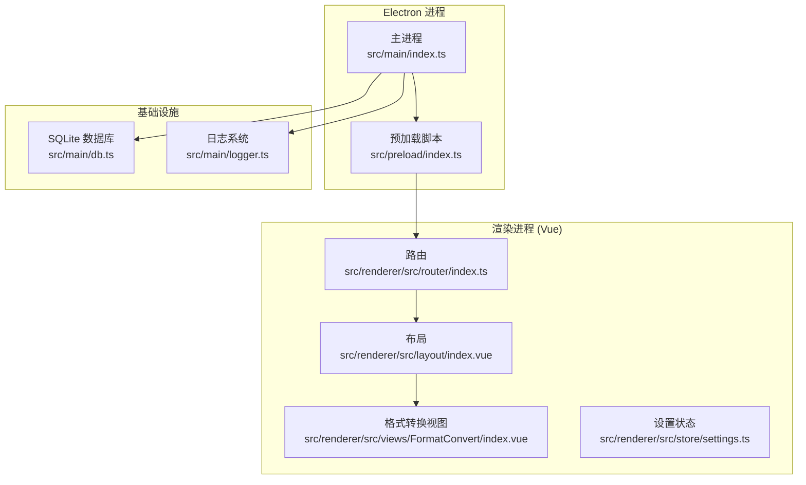
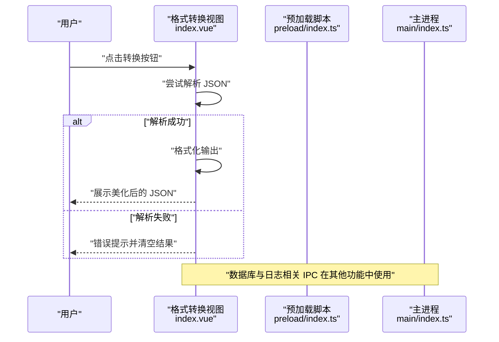
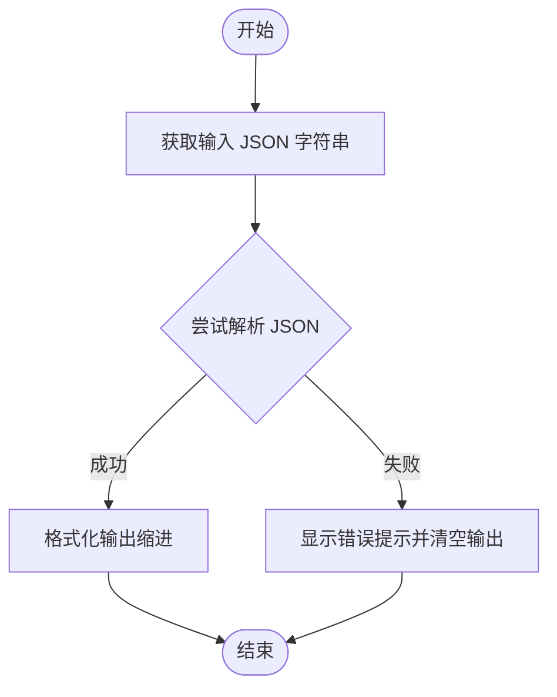
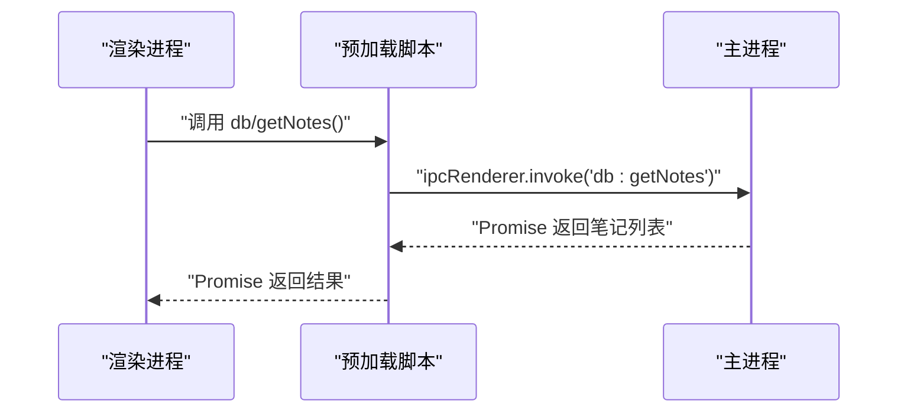
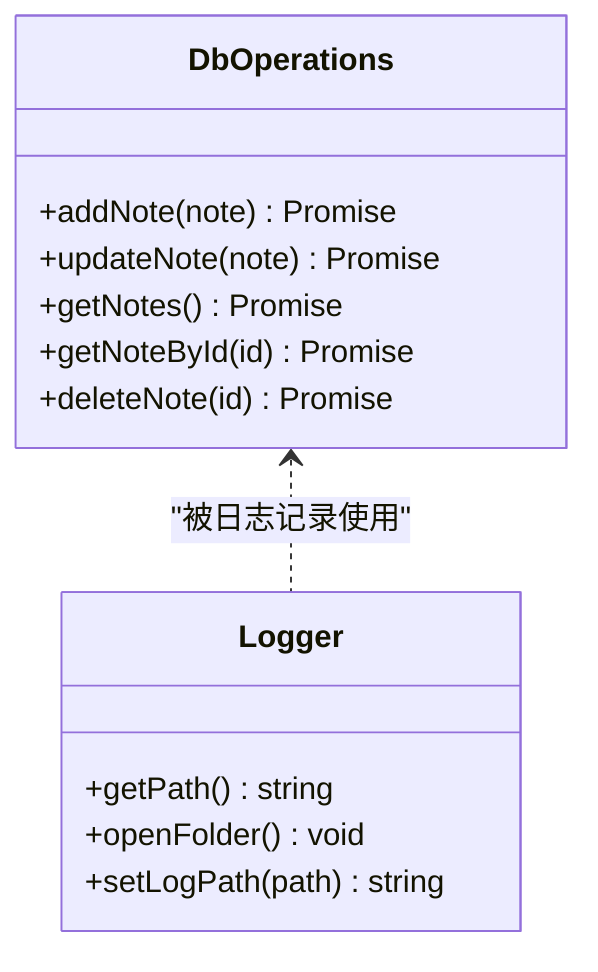
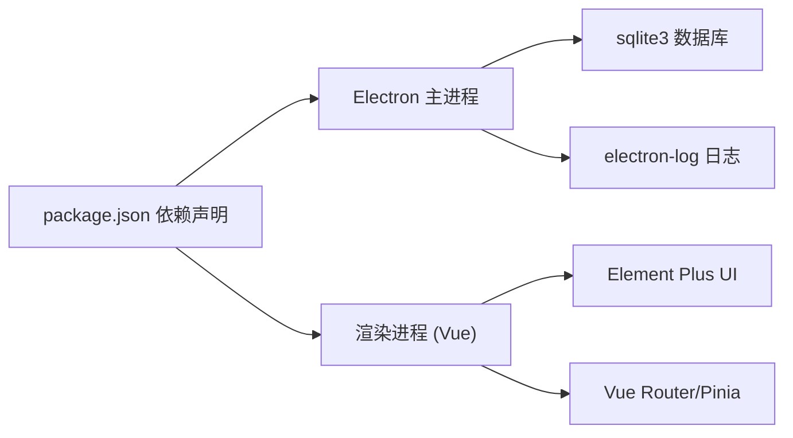

# 格式转换工具模块

<cite>
**本文档引用的文件**
- [README.md](file://README.md)
- [package.json](file://package.json)
- [.trae/documents/architecture.md](file://.trae/documents/architecture.md)
- [src/main/index.ts](file://src/main/index.ts)
- [src/main/db.ts](file://src/main/db.ts)
- [src/main/logger.ts](file://src/main/logger.ts)
- [src/preload/index.ts](file://src/preload/index.ts)
- [src/renderer/src/router/index.ts](file://src/renderer/src/router/index.ts)
- [src/renderer/src/layout/index.vue](file://src/renderer/src/layout/index.vue)
- [src/renderer/src/store/settings.ts](file://src/renderer/src/store/settings.ts)
- [src/renderer/src/views/FormatConvert/index.vue](file://src/renderer/src/views/FormatConvert/index.vue)
</cite>

## 目录

1. [简介](#简介)
2. [项目结构](#项目结构)
3. [核心组件](#核心组件)
4. [架构总览](#架构总览)
5. [详细组件分析](#详细组件分析)
6. [依赖关系分析](#依赖关系分析)
7. [性能考虑](#性能考虑)
8. [故障排除指南](#故障排除指南)
9. [结论](#结论)
10. [附录](#附录)

## 简介

本模块聚焦于“格式转换工具”，当前版本实现了一个基于 Electron + Vue 的桌面应用中的多种格式转换功能。该功能不仅支持基础的 JSON 格式化，还扩展了图片格式转换（PNG/JPEG/WEBP/BMP/ICO）、以及强大的音视频格式转换与精准裁剪功能。

为了保证代码的简洁与高复用性，本模块在前端架构上进行了深度的**组件化与 Hooks 封装**。将文件大小格式化、时长计算、文件保存路径获取、媒体文件加载与进度监听等通用逻辑提取为独立的 Composition API Hooks，极大降低了视图组件的复杂度。

本模块的技术架构采用 Electron 主进程与渲染进程分离的设计，通过 IPC 实现安全通信；前端使用 Vue 3 + TypeScript + Vite 构建，配合 Element Plus 提供交互界面；日志系统基于 electron-log，数据库采用 SQLite3 并通过主进程封装提供安全访问。

## 项目结构

项目采用 Electron + Vue 的分层组织方式，主要目录与职责如下：

- src/main：Electron 主进程代码，负责窗口创建、IPC 注册、数据库初始化与日志配置
- src/preload：预加载脚本，向渲染进程暴露受控的 API
- src/renderer：Vue 渲染进程，包含路由、布局、视图组件与状态管理
- .trae/documents：架构文档与设计说明
- resources：构建资源（图标等）

图表来源

- [src/main/index.ts:1-112](file://src/main/index.ts#L1-L112)
- [src/preload/index.ts:1-37](file://src/preload/index.ts#L1-L37)
- [src/renderer/src/router/index.ts:1-79](file://src/renderer/src/router/index.ts#L1-L79)
- [src/renderer/src/layout/index.vue:1-232](file://src/renderer/src/layout/index.vue#L1-L232)
- [src/renderer/src/views/FormatConvert/index.vue:1-176](file://src/renderer/src/views/FormatConvert/index.vue#L1-L176)
- [src/main/db.ts:1-100](file://src/main/db.ts#L1-L100)
- [src/main/logger.ts:1-42](file://src/main/logger.ts#L1-L42)

章节来源

- [README.md:1-35](file://README.md#L1-L35)
- [package.json:1-61](file://package.json#L1-L61)
- [.trae/documents/architecture.md:1-45](file://.trae/documents/architecture.md#L1-L45)

## 核心组件

- 主进程入口与窗口管理：负责创建主窗口、注册 IPC、延迟加载数据库模块并在 app ready 后初始化
- 预加载脚本：通过 contextBridge 暴露受限 API 至渲染进程，确保安全隔离
- 路由与布局：提供页面导航、面包屑与页面切换动画
- 格式转换视图：实现 JSON、图片、音视频等多种文件的解析、转换和输出。包含原生媒体预览组件、进度追踪及错误反馈。
- Hooks 封装层：
  - `useFormat`：提供文件大小和时间秒数的通用格式化。
  - `useFileSave`：基于系统全局配置，封装原生的文件保存对话框与静默保存逻辑。
  - `useMediaConvert`：封装音视频转换的 IPC 调用、状态管理（进度、时长等）和内存清理。
- 数据库与日志：SQLite 数据库存储与按日切分的日志文件管理

章节来源

- [src/main/index.ts:1-112](file://src/main/index.ts#L1-L112)
- [src/preload/index.ts:1-37](file://src/preload/index.ts#L1-L37)
- [src/renderer/src/router/index.ts:1-79](file://src/renderer/src/router/index.ts#L1-L79)
- [src/renderer/src/layout/index.vue:1-232](file://src/renderer/src/layout/index.vue#L1-L232)
- [src/renderer/src/views/FormatConvert/index.vue:1-176](file://src/renderer/src/views/FormatConvert/index.vue#L1-L176)
- [src/main/db.ts:1-100](file://src/main/db.ts#L1-L100)
- [src/main/logger.ts:1-42](file://src/main/logger.ts#L1-L42)

## 架构总览

下图展示了从用户操作到数据处理与结果呈现的整体流程，以及主进程与渲染进程之间的 IPC 交互。

图表来源

- [src/renderer/src/views/FormatConvert/index.vue:61-70](file://src/renderer/src/views/FormatConvert/index.vue#L61-L70)
- [src/preload/index.ts:1-37](file://src/preload/index.ts#L1-L37)
- [src/main/index.ts:58-92](file://src/main/index.ts#L58-L92)

## 详细组件分析

### 组件一：格式转换视图（JSON 格式化）

- 功能概述
  - 提供左侧 JSON 输入区与右侧格式化输出区
  - 用户点击转换按钮后，尝试解析输入字符串为 JSON 对象，并以缩进格式输出
  - 解析失败时给出错误提示并清空输出
- 关键流程
  - 输入校验与解析
  - 成功时序列化为带缩进的 JSON 字符串
  - 错误捕获与消息反馈
- UI 与交互
  - 使用 Element Plus 的输入框与滚动条组件
  - 响应式布局与主题适配
- 扩展建议
  - 支持文件上传与批量处理
  - 增加转换进度与结果预览
  - 引入多格式转换算法（XML、CSV、YAML 等）

图表来源

- [src/renderer/src/views/FormatConvert/index.vue:61-70](file://src/renderer/src/views/FormatConvert/index.vue#L61-L70)

章节来源

- [src/renderer/src/views/FormatConvert/index.vue:1-176](file://src/renderer/src/views/FormatConvert/index.vue#L1-L176)

### 组件二：主进程与 IPC 通信

- 主进程职责
  - 创建窗口、注册 IPC、延迟加载数据库模块
  - 暴露日志路径查询、打开日志目录与修改日志路径的 IPC 处理函数
- 预加载脚本
  - 通过 contextBridge 暴露受限 API 至渲染进程，避免直接暴露 Node.js 能力
- 安全与隔离
  - 在启用上下文隔离时，仅暴露受控 API；未启用时降级处理

图表来源

- [src/preload/index.ts:6-13](file://src/preload/index.ts#L6-L13)
- [src/main/index.ts:81-85](file://src/main/index.ts#L81-L85)

章节来源

- [src/main/index.ts:1-112](file://src/main/index.ts#L1-L112)
- [src/preload/index.ts:1-37](file://src/preload/index.ts#L1-L37)

### 组件三：数据库与日志（为后续扩展做准备）

- 数据库
  - 使用 sqlite3 在应用用户数据目录创建本地数据库文件
  - 提供笔记表的增删改查操作封装，返回 Promise
- 日志
  - 基于 electron-log，按日切分日志文件
  - 支持动态变更日志目录并记录变更信息

图表来源

- [src/main/db.ts:58-99](file://src/main/db.ts#L58-L99)
- [src/main/logger.ts:25-39](file://src/main/logger.ts#L25-L39)

章节来源

- [src/main/db.ts:1-100](file://src/main/db.ts#L1-L100)
- [src/main/logger.ts:1-42](file://src/main/logger.ts#L1-L42)

### 组件四：路由与布局

- 路由
  - 定义了登录、接口测试、格式转换、记事本、系统设置等页面
  - 使用 Hash 模式，支持页面标题动态设置
- 布局
  - 提供侧边栏折叠、面包屑导航与页面切换动画
  - 集成设置状态管理，支持主题与暗黑模式切换

章节来源

- [src/renderer/src/router/index.ts:1-79](file://src/renderer/src/router/index.ts#L1-L79)
- [src/renderer/src/layout/index.vue:1-232](file://src/renderer/src/layout/index.vue#L1-L232)
- [src/renderer/src/store/settings.ts:1-34](file://src/renderer/src/store/settings.ts#L1-L34)

## 依赖关系分析

- 技术栈
  - 前端：Vue 3 + TypeScript + Vite + Element Plus + Vue Router + Pinia
  - 打包与构建：electron-builder
  - 工具与库：axios、electron-log、sqlite3、@wangeditor/editor 等
- 模块耦合
  - 渲染进程通过预加载脚本与主进程进行受控通信
  - 数据库与日志作为主进程服务被渲染进程间接调用
  - 路由与布局为视图层提供统一入口与导航

图表来源

- [package.json:23-38](file://package.json#L23-L38)
- [package.json:40-58](file://package.json#L40-L58)

章节来源

- [package.json:1-61](file://package.json#L1-L61)
- [.trae/documents/architecture.md:16-34](file://.trae/documents/architecture.md#L16-L34)

## 性能考虑

- 当前 JSON 格式化为纯前端处理，复杂度近似 O(n)，其中 n 为输入字符串长度
- 大体积 JSON 文本可能导致解析与序列化耗时增加，建议：
  - 对超大文本进行分段处理或异步执行
  - 使用 Web Workers 将解析与格式化移出主线程
  - 对频繁操作进行节流/防抖
- UI 层面
  - 使用滚动容器限制高度，避免长文本导致渲染卡顿
  - 缩略预览与完整查看分离，减少不必要的重排

## 故障排除指南

- JSON 解析失败
  - 现象：点击转换后提示错误且输出为空
  - 原因：输入字符串不符合 JSON 规范
  - 处理：检查语法、引号与逗号，修正后重试
- 日志路径变更无效
  - 现象：修改日志目录后仍写入默认目录
  - 原因：自定义目录不可写或路径未生效
  - 处理：确认目录权限与路径正确，重启应用后验证
- 数据库初始化失败
  - 现象：应用启动时报数据库打开失败
  - 原因：用户数据目录不可用或权限不足
  - 处理：检查应用数据目录是否存在与可写，必要时手动创建

章节来源

- [src/renderer/src/views/FormatConvert/index.vue:66-69](file://src/renderer/src/views/FormatConvert/index.vue#L66-L69)
- [src/main/logger.ts:14-39](file://src/main/logger.ts#L14-L39)
- [src/main/db.ts:20-35](file://src/main/db.ts#L20-L35)

## 结论

当前“格式转换工具”实现了简洁可靠的 JSON 格式化功能，具备良好的用户体验与错误反馈。其架构设计为后续扩展多格式转换（XML、CSV、YAML 等）提供了清晰的扩展点：通过在主进程新增格式解析与转换算法，并在渲染进程提供文件上传、批量处理、进度监控与结果预览的 UI，即可快速实现完整的多格式转换工具。

## 附录

### 格式兼容性矩阵（当前与建议）

- 当前支持
  - JSON：解析与美化输出
- 建议扩展
  - XML：解析与格式化
  - CSV：解析与美化输出
  - YAML：解析与美化输出
  - HTML：格式化与标签补全（可选）

### 转换性能优化策略

- 异步处理：将解析与格式化放入 Worker 或后台任务
- 分页/分块：对超大文件进行分块处理并增量输出
- 缓存中间结果：对重复输入进行缓存以提升响应速度
- UI 优化：使用虚拟滚动与懒加载减少渲染压力

### 错误处理与异常恢复机制

- 输入校验：在前端进行基本格式检查
- 异常捕获：统一 try/catch 并提示用户
- 日志记录：记录关键错误与异常堆栈，便于定位问题
- 回退策略：解析失败时清空输出并引导用户修正输入

### 实际示例与最佳实践

- 示例场景
  - 将压缩后的 JSON 进行美化以便阅读与调试
  - 批量格式化多个 JSON 片段并导出结果
- 最佳实践
  - 输入前先进行语法检查
  - 对大文件采用分块处理与进度条
  - 提供撤销与重试机制
  - 输出结果支持复制与下载
