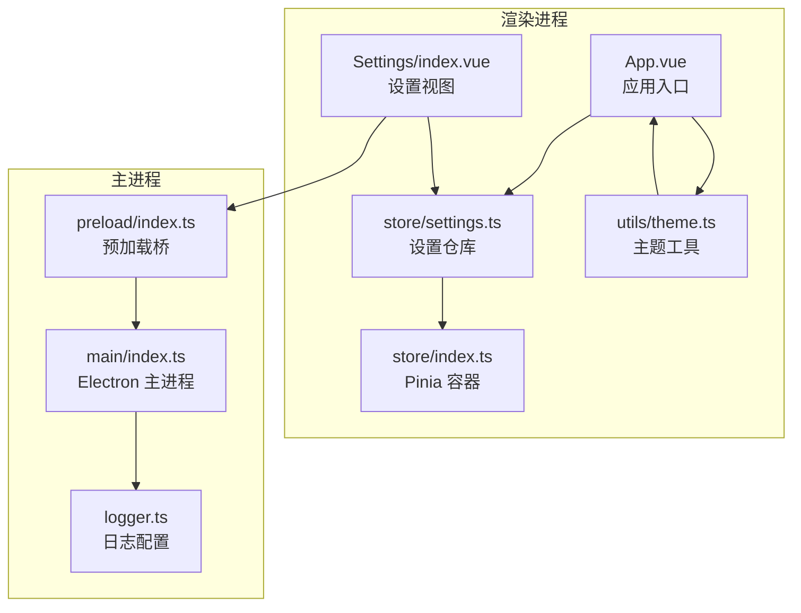
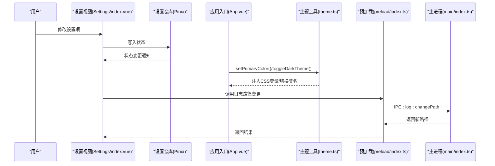
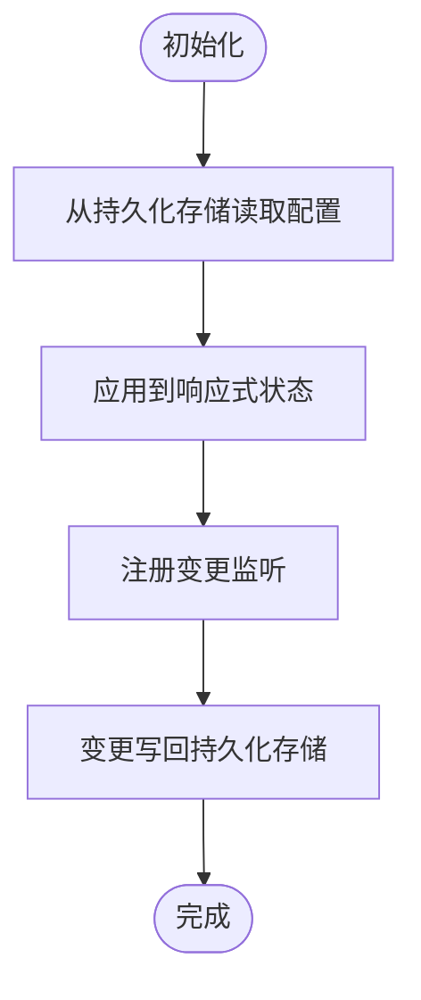
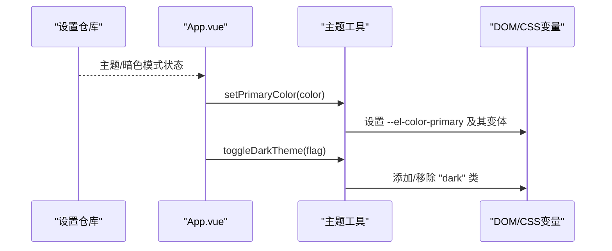
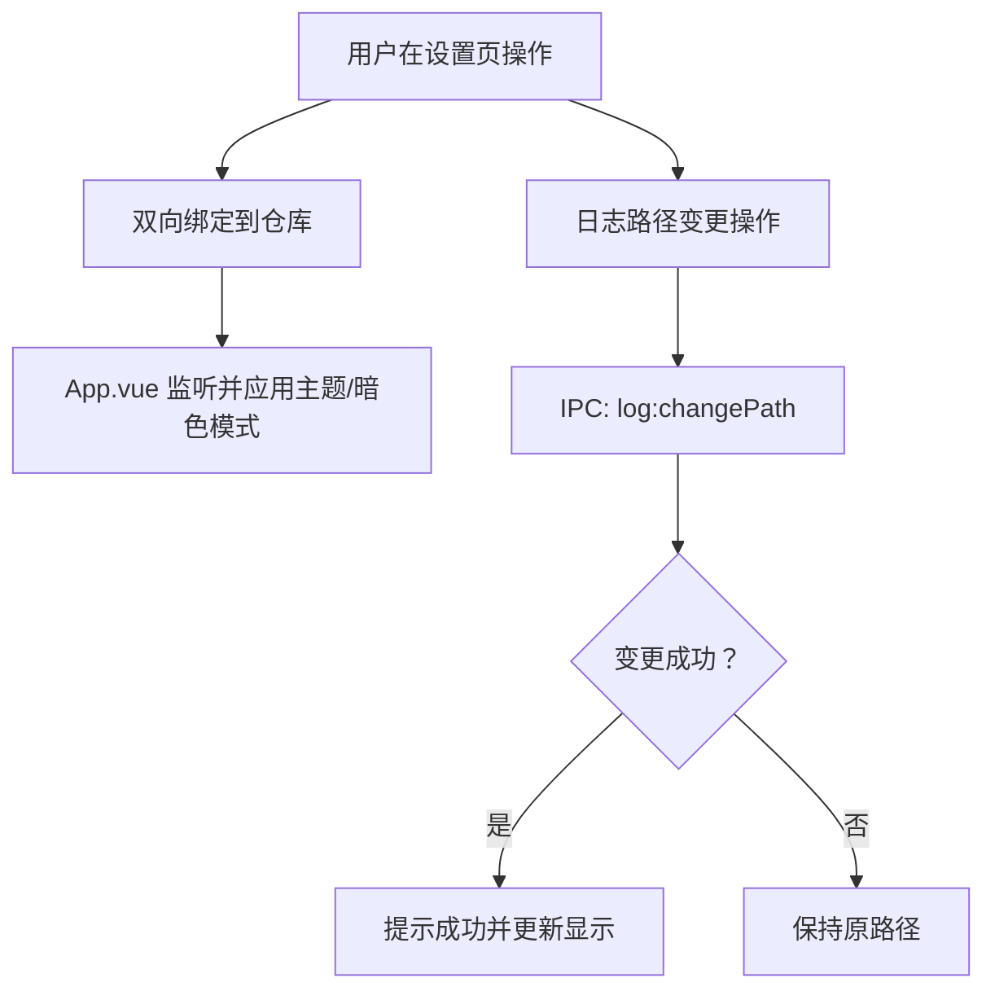
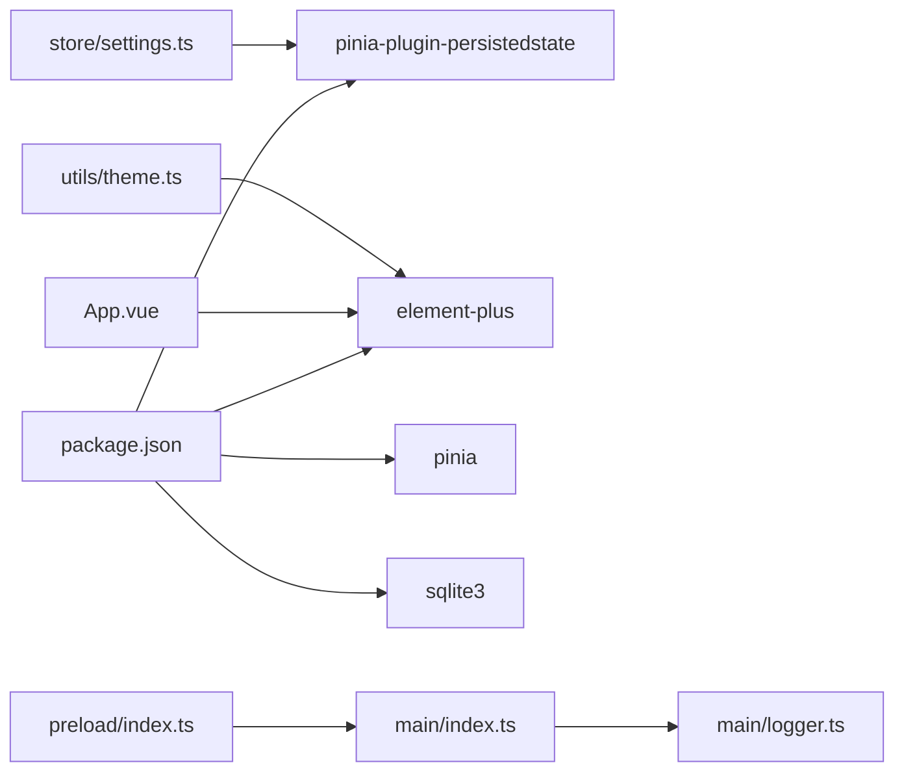

# 系统设置模块

<cite>
**本文引用的文件**
- [src/renderer/src/store/settings.ts](file://src/renderer/src/store/settings.ts)
- [src/renderer/src/store/index.ts](file://src/renderer/src/store/index.ts)
- [src/renderer/src/utils/theme.ts](file://src/renderer/src/utils/theme.ts)
- [src/renderer/src/views/Settings/index.vue](file://src/renderer/src/views/Settings/index.vue)
- [src/renderer/src/App.vue](file://src/renderer/src/App.vue)
- [src/renderer/src/main.ts](file://src/renderer/src/main.ts)
- [src/preload/index.ts](file://src/preload/index.ts)
- [src/main/index.ts](file://src/main/index.ts)
- [src/main/logger.ts](file://src/main/logger.ts)
- [package.json](file://package.json)
</cite>

## 目录

1. [简介](#简介)
2. [项目结构](#项目结构)
3. [核心组件](#核心组件)
4. [架构总览](#架构总览)
5. [详细组件分析](#详细组件分析)
6. [依赖关系分析](#依赖关系分析)
7. [性能考虑](#性能考虑)
8. [故障排除指南](#故障排除指南)
9. [结论](#结论)
10. [附录](#附录)

## 简介

本文件为系统设置模块的权威技术文档，面向用户体验设计师与系统管理员，聚焦以下目标：

- 主题定制：支持主题色选择、动态生成 Element Plus 色彩变体、暗色模式切换。
- 配置持久化：基于 Pinia 持久化插件，自动落盘至浏览器本地存储，确保重启后恢复。
- 实时生效：通过响应式监听与 DOM 属性注入，实现所见即所得的即时反馈。
- 设置 API：提供日志路径变更等系统级设置接口，支持目录选择与打开。
- 配置备份与恢复：基于持久化存储的可移植性，便于导出导入。
- 迁移策略与优化：给出升级与性能优化建议。

## 项目结构

系统设置模块位于渲染进程侧，采用“状态仓库 + 工具函数 + 视图组件”的分层组织：

- 状态层：Pinia 设置仓库，集中管理主题、暗色模式、系统名称、锁屏时间、通知开关等。
- 工具层：主题工具函数，负责动态注入 CSS 变量与 Element Plus 色彩变体。
- 视图层：设置页面组件，提供表单控件与操作按钮，绑定状态仓库。
- 应用入口：在挂载时读取持久化配置并应用；通过监听器实现实时生效。
- 主进程桥接：通过预加载脚本暴露安全的 IPC 接口，供设置页面调用系统能力。

图表来源

- [src/renderer/src/App.vue:1-46](file://src/renderer/src/App.vue#L1-L46)
- [src/renderer/src/views/Settings/index.vue:1-198](file://src/renderer/src/views/Settings/index.vue#L1-L198)
- [src/renderer/src/store/settings.ts:1-34](file://src/renderer/src/store/settings.ts#L1-L34)
- [src/renderer/src/utils/theme.ts:1-70](file://src/renderer/src/utils/theme.ts#L1-L70)
- [src/renderer/src/store/index.ts:1-10](file://src/renderer/src/store/index.ts#L1-L10)
- [src/preload/index.ts:1-37](file://src/preload/index.ts#L1-L37)
- [src/main/index.ts:1-112](file://src/main/index.ts#L1-L112)
- [src/main/logger.ts:1-42](file://src/main/logger.ts#L1-L42)

章节来源

- [src/renderer/src/store/settings.ts:1-34](file://src/renderer/src/store/settings.ts#L1-L34)
- [src/renderer/src/store/index.ts:1-10](file://src/renderer/src/store/index.ts#L1-L10)
- [src/renderer/src/utils/theme.ts:1-70](file://src/renderer/src/utils/theme.ts#L1-L70)
- [src/renderer/src/views/Settings/index.vue:1-198](file://src/renderer/src/views/Settings/index.vue#L1-L198)
- [src/renderer/src/App.vue:1-46](file://src/renderer/src/App.vue#L1-L46)
- [src/renderer/src/main.ts:1-24](file://src/renderer/src/main.ts#L1-L24)
- [src/preload/index.ts:1-37](file://src/preload/index.ts#L1-L37)
- [src/main/index.ts:1-112](file://src/main/index.ts#L1-L112)
- [src/main/logger.ts:1-42](file://src/main/logger.ts#L1-L42)

## 核心组件

- 设置仓库（Pinia）：集中存放系统名称、主题色、暗色模式、锁屏时间、通知开关，并提供重置方法。启用持久化以保证跨会话一致性。
- 主题工具：动态设置 Element Plus 主色及其浅/深变体，切换暗色类名，实现主题即时生效。
- 设置视图：提供输入框、颜色选择器、开关、下拉框等控件，绑定仓库状态；提供保存与重置按钮。
- 应用入口：在挂载时读取持久化配置并应用；通过 watch 监听变化，驱动主题与暗色模式实时更新。
- 预加载与主进程：通过 IPC 暴露日志路径查询、打开与变更能力，供设置页调用。

章节来源

- [src/renderer/src/store/settings.ts:1-34](file://src/renderer/src/store/settings.ts#L1-L34)
- [src/renderer/src/utils/theme.ts:1-70](file://src/renderer/src/utils/theme.ts#L1-L70)
- [src/renderer/src/views/Settings/index.vue:1-198](file://src/renderer/src/views/Settings/index.vue#L1-L198)
- [src/renderer/src/App.vue:1-46](file://src/renderer/src/App.vue#L1-L46)
- [src/preload/index.ts:1-37](file://src/preload/index.ts#L1-L37)
- [src/main/index.ts:61-73](file://src/main/index.ts#L61-L73)
- [src/main/logger.ts:25-39](file://src/main/logger.ts#L25-L39)

## 架构总览

系统设置模块遵循“状态驱动界面、工具函数驱动主题、IPC 驱动系统能力”的分层架构。状态由 Pinia 管理并持久化；主题通过 CSS 变量注入；系统能力通过预加载桥与主进程交互。

图表来源

- [src/renderer/src/views/Settings/index.vue:74-88](file://src/renderer/src/views/Settings/index.vue#L74-L88)
- [src/renderer/src/App.vue:8-37](file://src/renderer/src/App.vue#L8-L37)
- [src/renderer/src/utils/theme.ts:44-69](file://src/renderer/src/utils/theme.ts#L44-L69)
- [src/preload/index.ts:14-18](file://src/preload/index.ts#L14-L18)
- [src/main/index.ts:63-73](file://src/main/index.ts#L63-L73)

## 详细组件分析

### 设置仓库（Pinia）

- 数据模型
  - sysName: 字符串，系统显示名称
  - theme: 字符串，十六进制颜色值，如 #1677ff
  - darkMode: 布尔值，是否启用暗色模式
  - lockTime: 字符串，锁屏时间选项（10/30/60/never）
  - notify: 布尔值，是否接收系统通知
- 持久化策略
  - 通过 Pinia 插件持久化至浏览器本地存储，键空间隔离，避免与其他模块冲突。
- 重置逻辑
  - 提供 resetSettings 方法，一键恢复默认值。

图表来源

- [src/renderer/src/store/settings.ts:4-32](file://src/renderer/src/store/settings.ts#L4-L32)
- [src/renderer/src/store/index.ts:1-10](file://src/renderer/src/store/index.ts#L1-L10)

章节来源

- [src/renderer/src/store/settings.ts:1-34](file://src/renderer/src/store/settings.ts#L1-L34)
- [src/renderer/src/store/index.ts:1-10](file://src/renderer/src/store/index.ts#L1-L10)

### 主题工具（动态主题与暗色模式）

- 主题色注入
  - 将主色写入 documentElement 的 CSS 变量，同时生成多级浅色与深色变体，满足 Element Plus 的交互态需求。
- 暗色模式切换
  - 在 documentElement 上添加/移除 dark 类名，配合 Element Plus 暗色主题 CSS 变量实现整体风格切换。
- 实时生效
  - App.vue 在挂载时应用一次；随后通过 watch 监听仓库中的主题与暗色模式，触发工具函数即时更新。

图表来源

- [src/renderer/src/App.vue:8-37](file://src/renderer/src/App.vue#L8-L37)
- [src/renderer/src/utils/theme.ts:44-69](file://src/renderer/src/utils/theme.ts#L44-L69)

章节来源

- [src/renderer/src/utils/theme.ts:1-70](file://src/renderer/src/utils/theme.ts#L1-L70)
- [src/renderer/src/App.vue:1-46](file://src/renderer/src/App.vue#L1-L46)

### 设置视图（表单与交互）

- 表单项
  - 系统名称：输入框，支持实时标题联动。
  - 主题颜色：颜色选择器，绑定主题色。
  - 暗黑模式：开关，绑定暗色模式。
  - 锁屏时间：下拉选择，支持“永不”等选项。
  - 通知开关：开关，控制通知。
  - 日志位置：输入框 + 更改按钮 + 打开目录按钮，调用 IPC 变更日志目录。
- 操作行为
  - 保存：提示“配置已保存”，实际持久化由插件自动完成。
  - 重置：调用仓库 resetSettings，恢复默认值。

图表来源

- [src/renderer/src/views/Settings/index.vue:66-114](file://src/renderer/src/views/Settings/index.vue#L66-L114)
- [src/preload/index.ts:14-18](file://src/preload/index.ts#L14-L18)
- [src/main/index.ts:63-73](file://src/main/index.ts#L63-L73)

章节来源

- [src/renderer/src/views/Settings/index.vue:1-198](file://src/renderer/src/views/Settings/index.vue#L1-L198)

### 应用入口（初始化与监听）

- 首次应用：在挂载时读取持久化配置，设置主题、暗色模式与窗口标题。
- 实时监听：通过 watch 监听 sysName、theme、darkMode，分别更新标题、主题与暗色模式。
- 依赖注入：在 main.ts 中注册 Element Plus 与全局样式，确保主题工具可用。

章节来源

- [src/renderer/src/App.vue:1-46](file://src/renderer/src/App.vue#L1-L46)
- [src/renderer/src/main.ts:1-24](file://src/renderer/src/main.ts#L1-L24)

### 预加载与主进程（日志路径设置）

- 预加载桥：暴露 db 与 log 两类 IPC 接口，统一在 window.api 下提供。
- 主进程处理：
  - log:getPath：返回当前日志文件路径。
  - log:openFolder：打开日志所在目录。
  - log:changePath：弹出目录选择对话框，若用户确认则更新日志目录并返回新路径。

章节来源

- [src/preload/index.ts:1-37](file://src/preload/index.ts#L1-L37)
- [src/main/index.ts:61-73](file://src/main/index.ts#L61-L73)
- [src/main/logger.ts:25-39](file://src/main/logger.ts#L25-L39)

## 依赖关系分析

- 状态持久化：Pinia 插件将 settings 模块状态持久化至浏览器本地存储，键空间隔离，避免冲突。
- 主题依赖：Element Plus 暗色主题 CSS 变量与自定义 CSS 变量共同驱动视觉效果。
- IPC 依赖：设置页通过预加载桥访问主进程能力，实现系统级配置变更。
- 外部依赖：包管理文件声明了 Pinia、pinia-plugin-persistedstate、Element Plus、sqlite3 等关键依赖。

图表来源

- [package.json:23-38](file://package.json#L23-L38)
- [src/renderer/src/store/settings.ts:1-34](file://src/renderer/src/store/settings.ts#L1-L34)
- [src/renderer/src/App.vue:1-46](file://src/renderer/src/App.vue#L1-L46)
- [src/renderer/src/utils/theme.ts:1-70](file://src/renderer/src/utils/theme.ts#L1-L70)
- [src/preload/index.ts:1-37](file://src/preload/index.ts#L1-L37)
- [src/main/index.ts:1-112](file://src/main/index.ts#L1-L112)
- [src/main/logger.ts:1-42](file://src/main/logger.ts#L1-L42)

章节来源

- [package.json:1-61](file://package.json#L1-L61)

## 性能考虑

- 状态粒度：设置项数量较少，Pinia 持久化带来的开销可忽略；建议保持现状，避免过度拆分。
- 主题计算：颜色变体计算为纯前端运算，频率低；建议在主题变更时批量更新，减少多次重排。
- 监听策略：watch 仅针对必要字段，避免无关状态引发的重复渲染。
- 存储策略：持久化存储为浏览器本地存储，容量有限；建议定期清理或限制非关键项。
- 渲染优化：设置页为一次性表单，无需复杂虚拟滚动；保持现有结构即可。

## 故障排除指南

- 主题未生效
  - 检查是否正确调用主题工具函数；确认 Element Plus CSS 已加载。
  - 确认 watch 是否正常触发；检查仓库状态是否被持久化覆盖。
- 暗色模式异常
  - 检查 documentElement 是否存在 dark 类；确认主进程未强制覆盖。
- 日志路径变更无效
  - 确认预加载桥已正确暴露 IPC；检查主进程对话框是否被取消；验证返回路径是否更新。
- 配置未持久化
  - 检查 Pinia 是否启用持久化插件；确认浏览器本地存储未被清理。
- 页面空白或样式错乱
  - 检查 main.ts 中 Element Plus 与全局样式的引入顺序；确认 CSS 变量命名一致。

章节来源

- [src/renderer/src/utils/theme.ts:44-69](file://src/renderer/src/utils/theme.ts#L44-L69)
- [src/renderer/src/App.vue:8-37](file://src/renderer/src/App.vue#L8-L37)
- [src/preload/index.ts:14-18](file://src/preload/index.ts#L14-L18)
- [src/main/index.ts:63-73](file://src/main/index.ts#L63-L73)
- [src/renderer/src/store/index.ts:1-10](file://src/renderer/src/store/index.ts#L1-L10)

## 结论

系统设置模块以 Pinia 为核心，结合主题工具与 IPC 能力，实现了主题定制、暗色模式切换与系统级配置变更的闭环。通过持久化与实时监听，确保用户体验的一致性与即时性。建议在后续版本中：

- 增加配置导出/导入功能，提升可移植性。
- 引入主题校验与默认值回退策略，增强健壮性。
- 对高频变更项进行节流，降低不必要的重渲染。

## 附录

### 设置 API 接口清单

- 日志路径查询
  - 方法：log.getPath
  - 用途：获取当前日志文件路径
- 日志目录打开
  - 方法：log.openFolder
  - 用途：打开日志所在目录
- 日志目录变更
  - 方法：log.changePath
  - 用途：弹出目录选择对话框，返回新路径；若取消则返回原路径

章节来源

- [src/preload/index.ts:14-18](file://src/preload/index.ts#L14-L18)
- [src/main/index.ts:61-73](file://src/main/index.ts#L61-L73)
- [src/main/logger.ts:25-39](file://src/main/logger.ts#L25-L39)

### 配置文件结构与持久化

- 持久化键：由 Pinia 持久化插件自动管理，键空间隔离，避免冲突。
- 存储介质：浏览器本地存储（localStorage/sessionStorage），受浏览器隐私设置影响。
- 迁移策略：升级时保留旧键，新增键以默认值补齐；提供一键重置以恢复出厂设置。

章节来源

- [src/renderer/src/store/index.ts:1-10](file://src/renderer/src/store/index.ts#L1-L10)
- [src/renderer/src/store/settings.ts:30-32](file://src/renderer/src/store/settings.ts#L30-L32)

### 主题扩展方法与个性化定制

- 自定义主题色
  - 在设置页选择颜色，或直接修改仓库中的主题色字段，工具函数将自动生成变体。
- 暗色模式
  - 通过开关切换，工具函数将切换 dark 类名，配合 Element Plus 暗色主题。
- 系统名称
  - 修改系统名称将同步更新窗口标题，增强品牌识别。

章节来源

- [src/renderer/src/views/Settings/index.vue:9-40](file://src/renderer/src/views/Settings/index.vue#L9-L40)
- [src/renderer/src/App.vue:15-21](file://src/renderer/src/App.vue#L15-L21)

### 配置备份与恢复

- 备份
  - 导出浏览器本地存储中的持久化键值；或记录当前仓库快照。
- 恢复
  - 在新环境导入相同键值；或调用重置方法后手动重建配置。

章节来源

- [src/renderer/src/store/index.ts:1-10](file://src/renderer/src/store/index.ts#L1-L10)
- [src/renderer/src/store/settings.ts:13-19](file://src/renderer/src/store/settings.ts#L13-L19)
