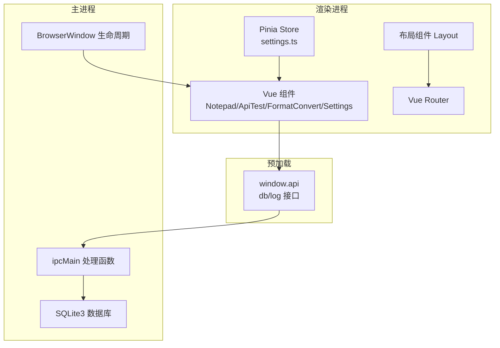
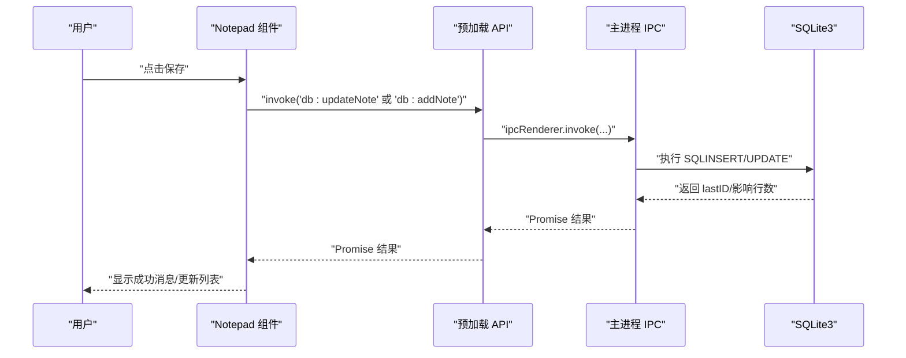
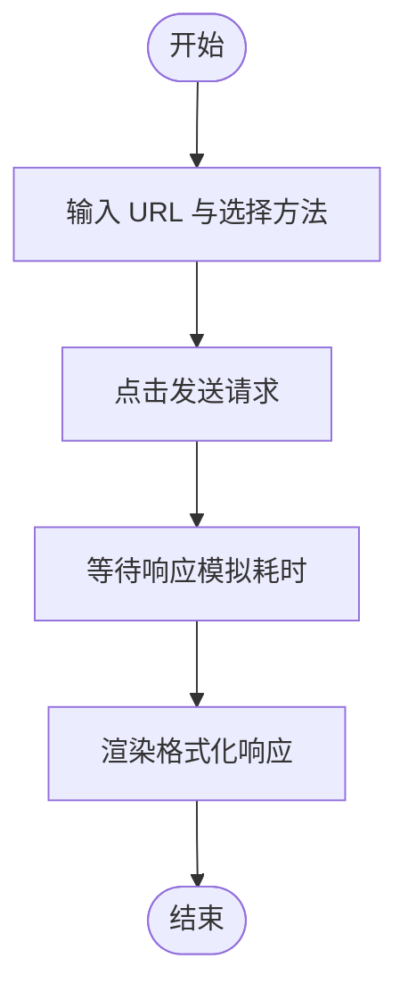
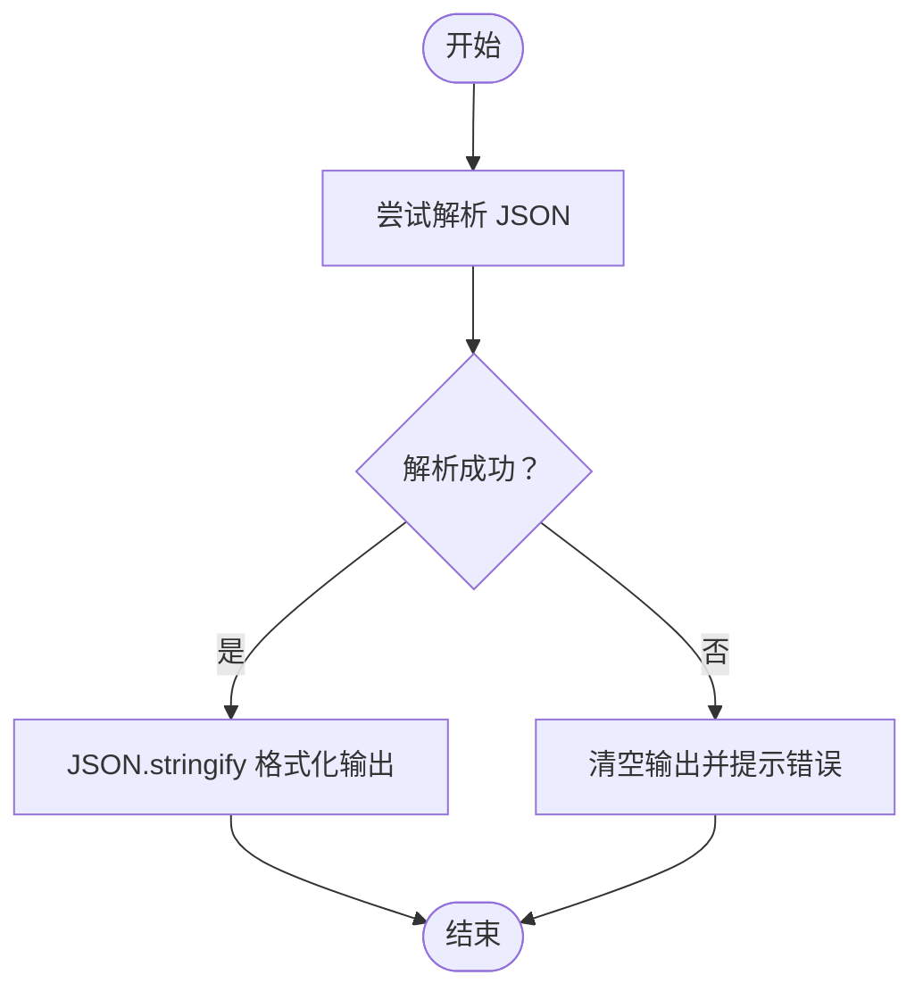
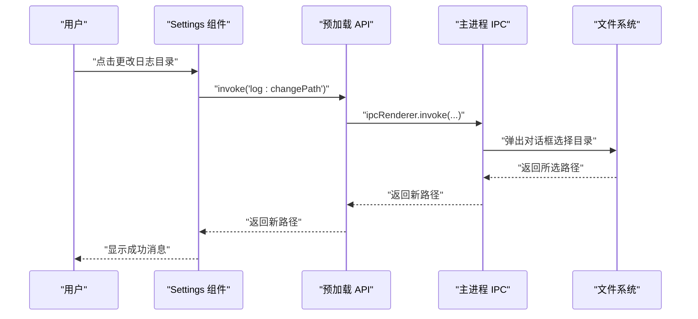
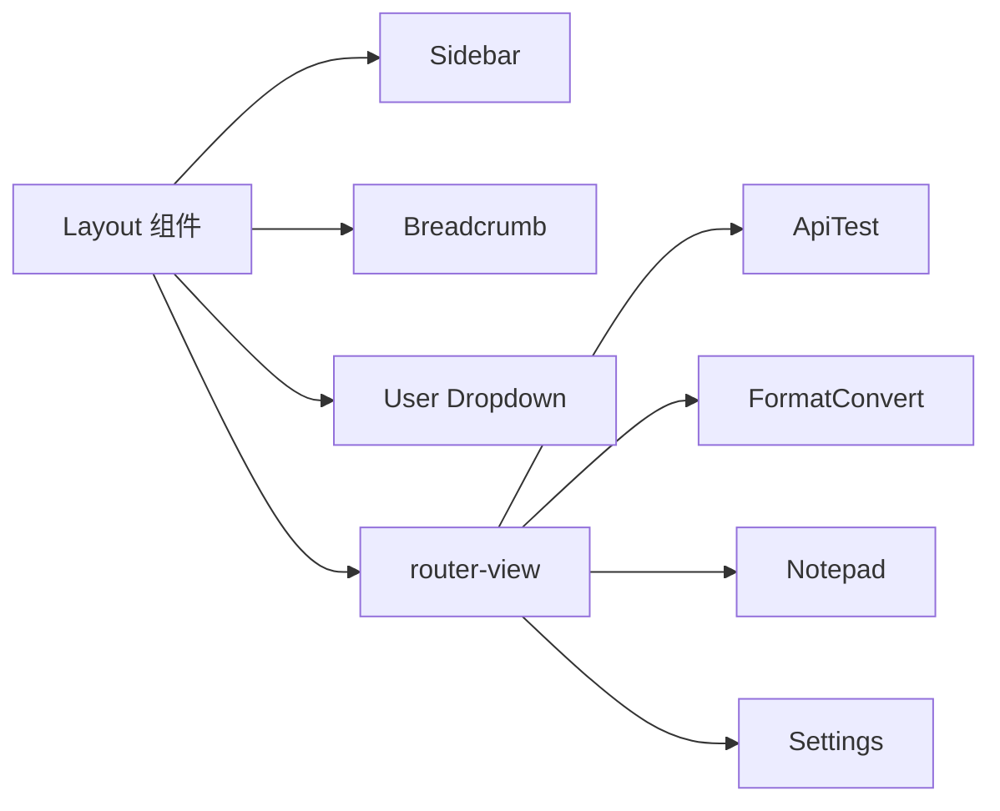
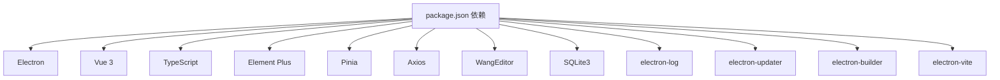

# 项目概述

<cite>
**本文档引用的文件**
- [README.md](file://README.md)
- [package.json](file://package.json)
- [electron.vite.config.ts](file://electron.vite.config.ts)
- [src/main/index.ts](file://src/main/index.ts)
- [src/main/db.ts](file://src/main/db.ts)
- [src/preload/index.ts](file://src/preload/index.ts)
- [src/renderer/src/main.ts](file://src/renderer/src/main.ts)
- [src/renderer/src/router/index.ts](file://src/renderer/src/router/index.ts)
- [src/renderer/src/store/index.ts](file://src/renderer/src/store/index.ts)
- [src/renderer/src/store/settings.ts](file://src/renderer/src/store/settings.ts)
- [src/renderer/src/layout/index.vue](file://src/renderer/src/layout/index.vue)
- [src/renderer/src/views/Notepad/index.vue](file://src/renderer/src/views/Notepad/index.vue)
- [src/renderer/src/views/ApiTest/index.vue](file://src/renderer/src/views/ApiTest/index.vue)
- [src/renderer/src/views/FormatConvert/index.vue](file://src/renderer/src/views/FormatConvert/index.vue)
- [src/renderer/src/views/Settings/index.vue](file://src/renderer/src/views/Settings/index.vue)
</cite>

## 目录

1. [简介](#简介)
2. [项目结构](#项目结构)
3. [核心组件](#核心组件)
4. [架构总览](#架构总览)
5. [详细组件分析](#详细组件分析)
6. [依赖关系分析](#依赖关系分析)
7. [性能考虑](#性能考虑)
8. [故障排查指南](#故障排查指南)
9. [结论](#结论)

## 简介

MyTool 是一个基于 Electron + Vue + TypeScript 的跨平台桌面应用程序，面向开发者与工程师提供日常开发辅助能力。项目采用主进程-渲染进程分离设计，结合 MVVM 架构与 IPC 通信机制，实现四大功能模块：本地记事本、接口测试工具、格式转换工具与系统设置。

- 应用目标：提供轻量、易用、可扩展的本地工具集，支持多平台打包与发布。
- 技术栈：Electron 39、Vue 3、TypeScript、Pinia、Element Plus、SQLite3、WangEditor。
- 架构模式：MVVM（模型-视图-视图模型），通过路由与状态管理解耦界面与业务逻辑。
- 通信机制：主进程暴露 IPC 处理函数，预加载脚本通过 contextBridge 暴露受控 API，渲染进程以 invoke/call 方式调用。

## 项目结构

项目采用“主进程 + 预加载 + 渲染进程”三层结构，配合 Electron-Vite 构建工具链，实现开发期热更新与生产期高效打包。

```mermaid
graph TB
subgraph "主进程"
MIDX["src/main/index.ts"]
MDB["src/main/db.ts"]
end
subgraph "预加载"
PIDX["src/preload/index.ts"]
end
subgraph "渲染进程"
RMAIN["src/renderer/src/main.ts"]
ROUTER["src/renderer/src/router/index.ts"]
STORE["src/renderer/src/store/index.ts"]
SETSTORE["src/renderer/src/store/settings.ts"]
LAYOUT["src/renderer/src/layout/index.vue"]
NOTEPAD["src/renderer/src/views/Notepad/index.vue"]
APITEST["src/renderer/src/views/ApiTest/index.vue"]
FORMAT["src/renderer/src/views/FormatConvert/index.vue"]
SETTINGS["src/renderer/src/views/Settings/index.vue"]
end
MIDX --> MDB
PIDX <- --> RMAIN
RMAIN --> ROUTER
RMAIN --> STORE
STORE --> SETSTORE
LAYOUT --> ROUTER
LAYOUT --> SETSTORE
NOTEPAD --> PIDX
SETTINGS --> PIDX
```

**图表来源**

- [src/main/index.ts:1-112](file://src/main/index.ts#L1-L112)
- [src/main/db.ts:1-100](file://src/main/db.ts#L1-L100)
- [src/preload/index.ts:1-37](file://src/preload/index.ts#L1-L37)
- [src/renderer/src/main.ts:1-24](file://src/renderer/src/main.ts#L1-L24)
- [src/renderer/src/router/index.ts:1-79](file://src/renderer/src/router/index.ts#L1-L79)
- [src/renderer/src/store/index.ts:1-10](file://src/renderer/src/store/index.ts#L1-L10)
- [src/renderer/src/store/settings.ts:1-34](file://src/renderer/src/store/settings.ts#L1-L34)
- [src/renderer/src/layout/index.vue:1-232](file://src/renderer/src/layout/index.vue#L1-L232)
- [src/renderer/src/views/Notepad/index.vue:1-599](file://src/renderer/src/views/Notepad/index.vue#L1-L599)
- [src/renderer/src/views/ApiTest/index.vue:1-163](file://src/renderer/src/views/ApiTest/index.vue#L1-L163)
- [src/renderer/src/views/FormatConvert/index.vue:1-176](file://src/renderer/src/views/FormatConvert/index.vue#L1-L176)
- [src/renderer/src/views/Settings/index.vue:1-198](file://src/renderer/src/views/Settings/index.vue#L1-L198)

**章节来源**

- [README.md:1-35](file://README.md#L1-L35)
- [package.json:1-61](file://package.json#L1-L61)
- [electron.vite.config.ts:1-27](file://electron.vite.config.ts#L1-L27)

## 核心组件

- 主进程入口与生命周期：负责窗口创建、菜单栏隐藏、DevTools 快捷键优化、IPC 事件注册与数据库模块按需加载。
- 预加载层：通过 contextBridge 暴露受限 API，封装数据库与日志相关 IPC 调用，确保渲染进程仅能访问白名单方法。
- 渲染进程应用：基于 Vue 3 + TypeScript，使用 Element Plus UI 框架与 Pinia 状态管理；布局组件承载导航与面包屑，四大功能页分别实现具体业务。
- 数据库层：SQLite3 存储本地记事本数据，主进程初始化数据库并提供 CRUD 操作的 IPC 接口。
- 构建配置：Electron-Vite 提供主进程外部化 sqlite3、渲染进程别名与开发服务器端口等配置。

**章节来源**

- [src/main/index.ts:1-112](file://src/main/index.ts#L1-L112)
- [src/preload/index.ts:1-37](file://src/preload/index.ts#L1-L37)
- [src/renderer/src/main.ts:1-24](file://src/renderer/src/main.ts#L1-L24)
- [src/renderer/src/router/index.ts:1-79](file://src/renderer/src/router/index.ts#L1-L79)
- [src/renderer/src/store/index.ts:1-10](file://src/renderer/src/store/index.ts#L1-L10)
- [src/renderer/src/store/settings.ts:1-34](file://src/renderer/src/store/settings.ts#L1-L34)
- [src/renderer/src/layout/index.vue:1-232](file://src/renderer/src/layout/index.vue#L1-L232)
- [src/main/db.ts:1-100](file://src/main/db.ts#L1-L100)
- [electron.vite.config.ts:1-27](file://electron.vite.config.ts#L1-L27)

## 架构总览

MyTool 采用典型的 Electron MVVM 架构：主进程负责系统级资源与安全边界，预加载层作为桥接，渲染进程承载 UI 与交互。四大功能模块通过路由组织，共享统一布局与状态管理。



**图表来源**

- [src/renderer/src/views/Notepad/index.vue:1-599](file://src/renderer/src/views/Notepad/index.vue#L1-L599)
- [src/renderer/src/views/ApiTest/index.vue:1-163](file://src/renderer/src/views/ApiTest/index.vue#L1-L163)
- [src/renderer/src/views/FormatConvert/index.vue:1-176](file://src/renderer/src/views/FormatConvert/index.vue#L1-L176)
- [src/renderer/src/views/Settings/index.vue:1-198](file://src/renderer/src/views/Settings/index.vue#L1-L198)
- [src/renderer/src/layout/index.vue:1-232](file://src/renderer/src/layout/index.vue#L1-L232)
- [src/renderer/src/store/settings.ts:1-34](file://src/renderer/src/store/settings.ts#L1-L34)
- [src/renderer/src/router/index.ts:1-79](file://src/renderer/src/router/index.ts#L1-L79)
- [src/preload/index.ts:1-37](file://src/preload/index.ts#L1-L37)
- [src/main/index.ts:1-112](file://src/main/index.ts#L1-L112)
- [src/main/db.ts:1-100](file://src/main/db.ts#L1-L100)

## 详细组件分析

### 本地记事本（Notepad）

- 功能特性：支持新建、编辑、删除、列表展示富文本笔记；使用 WangEditor 实现富文本编辑；SQLite3 存储笔记标题、内容与时间戳。
- MVVM 实践：组件内维护编辑状态与变更检测，通过 window.api.db 调用主进程 IPC 完成持久化。
- 用户体验：网格卡片式列表、下拉菜单操作、保存状态提示、离开前二次确认避免误删。



**图表来源**

- [src/renderer/src/views/Notepad/index.vue:312-344](file://src/renderer/src/views/Notepad/index.vue#L312-L344)
- [src/preload/index.ts:6-13](file://src/preload/index.ts#L6-L13)
- [src/main/index.ts:80-86](file://src/main/index.ts#L80-L86)
- [src/main/db.ts:58-99](file://src/main/db.ts#L58-L99)

**章节来源**

- [src/renderer/src/views/Notepad/index.vue:1-599](file://src/renderer/src/views/Notepad/index.vue#L1-L599)
- [src/main/db.ts:1-100](file://src/main/db.ts#L1-L100)

### 接口测试工具（ApiTest）

- 功能特性：支持 GET/POST/PUT/DELETE 请求方式，输入 URL 与发送按钮，展示格式化响应结果。
- MVVM 实践：表单字段绑定到组件状态，发送请求后异步更新响应区域，使用 Element Plus 表单与输入组件。
- 示例流程：输入示例 URL，点击发送，组件在短暂延迟后展示模拟响应 JSON。



**图表来源**

- [src/renderer/src/views/ApiTest/index.vue:51-65](file://src/renderer/src/views/ApiTest/index.vue#L51-L65)

**章节来源**

- [src/renderer/src/views/ApiTest/index.vue:1-163](file://src/renderer/src/views/ApiTest/index.vue#L1-L163)

### 格式转换工具（FormatConvert）

- 功能特性：将输入的 JSON 字符串格式化为可读的缩进格式；错误时提示格式非法并清空输出。
- MVVM 实践：输入与输出双向绑定，转换按钮触发解析与序列化，使用 Element Plus 输入框与滚动条组件。



**图表来源**

- [src/renderer/src/views/FormatConvert/index.vue:61-70](file://src/renderer/src/views/FormatConvert/index.vue#L61-L70)

**章节来源**

- [src/renderer/src/views/FormatConvert/index.vue:1-176](file://src/renderer/src/views/FormatConvert/index.vue#L1-L176)

### 系统设置（Settings）

- 功能特性：集中管理应用名称、主题色、暗黑模式、自动锁屏时间、通知开关与日志目录位置。
- MVVM 实践：Pinia Store settings.ts 提供响应式状态与持久化；通过 window.api.log 与主进程交互，动态变更日志目录并打开所在文件夹。
- 数据持久化：使用 pinia-plugin-persistedstate 插件，自动同步至 localStorage。



**图表来源**

- [src/renderer/src/views/Settings/index.vue:78-84](file://src/renderer/src/views/Settings/index.vue#L78-L84)
- [src/preload/index.ts:14-18](file://src/preload/index.ts#L14-L18)
- [src/main/index.ts:61-73](file://src/main/index.ts#L61-L73)

**章节来源**

- [src/renderer/src/views/Settings/index.vue:1-198](file://src/renderer/src/views/Settings/index.vue#L1-L198)
- [src/renderer/src/store/settings.ts:1-34](file://src/renderer/src/store/settings.ts#L1-L34)

### 布局与导航（Layout + Router）

- 布局组件：提供侧边栏折叠、面包屑导航、快捷暗黑模式切换与用户下拉菜单。
- 路由配置：定义四大功能页与登录页，设置页面标题与图标；重定向到接口测试页作为首页。
- 状态管理：全局 Pinia Store 与 settings store 协同，实现主题与模式的跨组件共享。



**图表来源**

- [src/renderer/src/layout/index.vue:1-232](file://src/renderer/src/layout/index.vue#L1-L232)
- [src/renderer/src/router/index.ts:3-56](file://src/renderer/src/router/index.ts#L3-L56)

**章节来源**

- [src/renderer/src/layout/index.vue:1-232](file://src/renderer/src/layout/index.vue#L1-L232)
- [src/renderer/src/router/index.ts:1-79](file://src/renderer/src/router/index.ts#L1-L79)
- [src/renderer/src/store/index.ts:1-10](file://src/renderer/src/store/index.ts#L1-L10)

## 依赖关系分析

- 构建与运行时依赖：Electron、Vue 3、TypeScript、Element Plus、Pinia、Axios、WangEditor、SQLite3、electron-log、electron-updater、electron-builder。
- 开发工具：ESLint、Prettier、Vite、electron-vite、TypeScript 类型检查。
- 项目脚本：开发、构建、跨平台打包、类型检查与格式化。



**图表来源**

- [package.json:23-59](file://package.json#L23-L59)

**章节来源**

- [package.json:1-61](file://package.json#L1-L61)

## 性能考虑

- 数据库查询优化：笔记列表仅返回必要字段，避免传输富文本内容，降低网络与序列化开销。
- 渲染进程资源控制：预加载层限制 API 暴露面，减少不必要的上下文暴露。
- 构建优化：主进程外部化 sqlite3，避免打包体积膨胀；开发服务器启用 HMR，提升迭代效率。
- UI 交互：富文本编辑器使用 shallowRef 引用，避免深层响应式带来的性能损耗；列表与编辑器均采用滚动容器与虚拟化策略（如可用）。

**章节来源**

- [src/main/db.ts:82-86](file://src/main/db.ts#L82-L86)
- [src/preload/index.ts:1-37](file://src/preload/index.ts#L1-L37)
- [electron.vite.config.ts:7-11](file://electron.vite.config.ts#L7-L11)
- [src/renderer/src/views/Notepad/index.vue:164-166](file://src/renderer/src/views/Notepad/index.vue#L164-L166)

## 故障排查指南

- 日志目录变更失败：检查主进程对话框权限与路径有效性；确认 window.api.log.changePath 返回值与当前日志路径一致。
- 数据库无法打开：确认 userData 目录存在且具备写权限；查看日志输出定位 sqlite3 初始化错误。
- 预加载 API 未生效：确认 contextIsolation 启用且在 try/catch 中正确暴露 window.electron 与 window.api。
- 跨平台打包问题：根据平台调整 electron-builder 参数与签名配置；开发阶段使用 electron-vite dev，生产阶段使用 electron-vite build。

**章节来源**

- [src/main/index.ts:61-73](file://src/main/index.ts#L61-L73)
- [src/main/db.ts:10-17](file://src/main/db.ts#L10-L17)
- [src/preload/index.ts:24-36](file://src/preload/index.ts#L24-L36)

## 结论

MyTool 以清晰的分层架构与 MVVM 设计，将本地记事本、接口测试、格式转换与系统设置整合为统一的桌面工具集。通过主进程-渲染进程分离与受控 IPC 通信，既保证了安全性，又提升了开发体验。建议后续扩展包括：接口测试的认证与历史记录、富文本编辑器的插件化与导出、设置项的远程配置下发与版本迁移策略。
