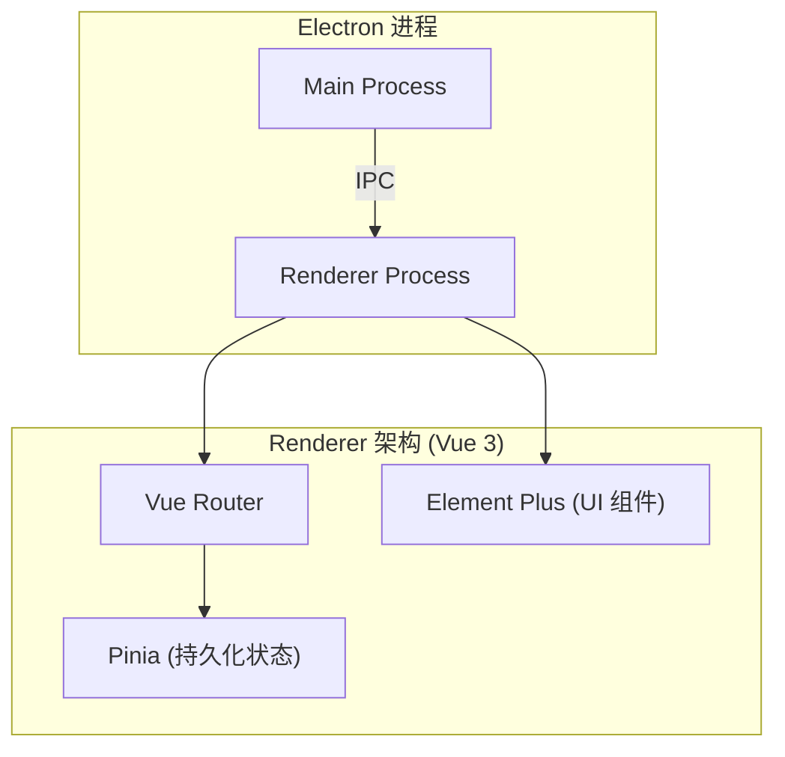

# My Tool - 技术架构文档

## 1. 架构设计



## 2. 技术栈说明

- **前端框架**: Vue@3 + TypeScript + Vite
- **UI 库**: Element Plus@2
- **图标库**: `@element-plus/icons-vue` (全局注册)
- **状态管理**: Pinia + `pinia-plugin-persistedstate`
- **路由管理**: Vue Router (Hash 模式，防白屏)
- **CSS 预处理**: SCSS (利用 scoped 和 CSS 变量)
- **打包工具**: electron-builder

## 3. 路由定义

| 路由路径          | 页面组件                                         | 备注                      |
| ----------------- | ------------------------------------------------ | ------------------------- |
| `/login`          | `src/renderer/src/views/Login/index.vue`         | 独立登录页面              |
| `/`               | `src/renderer/src/layout/index.vue`              | 核心布局外壳              |
| `/api-test`       | `src/renderer/src/views/ApiTest/index.vue`       | 接口测试工具 (默认首页)   |
| `/format-convert` | `src/renderer/src/views/FormatConvert/index.vue` | 格式转换工具              |
| `/notepad`        | `src/renderer/src/views/Notepad/index.vue`       | 本地记事本 (富文本编辑器) |
| `/settings`       | `src/renderer/src/views/Settings/index.vue`      | 系统设置页面 (菜单底部)   |

## 4. API 与状态定义

**系统设置 Store (持久化)**

```typescript
interface SystemSettings {
  sysName: string
  theme: string
  darkMode: boolean
  lockTime: string
  notify: boolean
}
```

## 5. 项目目录结构关键点

```text
src/renderer/src/
├── assets/         # 存放 electron.svg 等静态资源
├── layout/         # 整体外壳组件 (侧边栏、Header)
├── router/         # 路由配置
├── store/          # Pinia 配置
└── views/          # 各个独立工具页面
```

## 6. UI 定制方案

- **重置 Element Plus 默认样式**:
  - `el-card`: 重写 `.el-card` 为 `border: none; border-radius: 12px; box-shadow: ...`
  - `el-menu`: 针对 `:deep(.el-menu--collapse)` 重写子项为 `width: 48px; height: 48px; margin: 8px auto; border-radius: 12px;` 强制居中对齐。
  - `.logo`: 侧边栏的顶部标志区域添加 `white-space: nowrap; overflow: hidden;` 防止折叠动画时闪烁。
