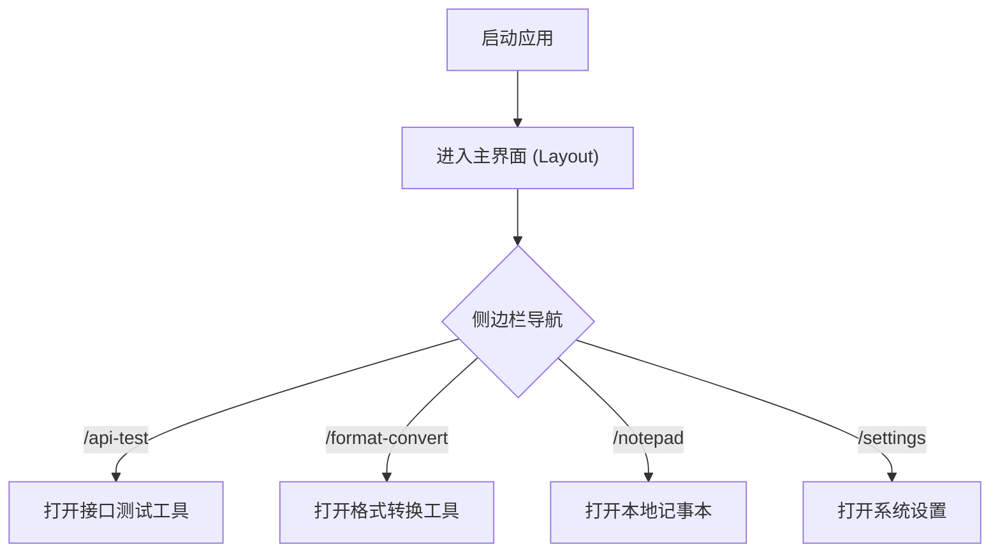

# My Tool - 小工具集合客户端 PRD

## 1. 产品概述

My Tool 是一个基于 Electron + Vue 3 的轻量级桌面端极客小工具集合软件。
主要为开发者或重度电脑用户提供一系列高效的本地小工具，采用白灰配色的极简风格，界面对标现代设计工具（如 Notion、Arc）。

## 2. 核心功能

### 2.1 用户角色

本产品为纯本地桌面端工具，无复杂的用户角色系统，使用者即为本地管理员。

### 2.2 功能模块

1. **全局布局 (Layout)**：极简左侧菜单栏（支持折叠/展开）、顶部状态栏。
2. **接口测试工具**：轻量级的 HTTP API 测试面板。
3. **格式转换工具**：JSON 格式化等数据处理工具。
4. **系统设置**：全局主题、行为偏好配置。

### 2.3 页面详情

| 页面名称   | 模块名称   | 功能描述                                                           |
| ---------- | ---------- | ------------------------------------------------------------------ |
| 布局外壳   | 左侧菜单栏 | 极简白灰风格，支持折叠展开，菜单项呈圆角胶囊状，底部固定“设置”入口 |
| 接口测试   | 请求面板   | 支持 GET/POST 等方法的 URL 输入与发送，下发显示高亮返回结果        |
| 格式转换   | 转换面板   | 左右两栏输入输出框，中间带转换按钮，用于 JSON 校验与美化           |
| 本地记事本 | 富文本编辑 | 支持图文混排的本地笔记功能，利用富文本编辑器实现记录               |
| 系统设置   | 偏好设置   | 系统名称修改、暗黑模式切换、主题色选择等表单                       |

## 3. 核心流程

## 4. 用户界面设计 (参考图级优化)

### 4.1 设计风格

- **主色调**：极致的白（`#ffffff`）与淡灰底色（`#f5f7fa`）。
- **文字颜色**：避免纯黑，使用温和的深灰（`#1f2225`, `#606266`）。
- **组件风格**：
  - 侧边栏与主内容区无缝衔接或仅用极细边框（`1px solid #eef0f4`）分隔。
  - 卡片全面去除生硬边框，采用 **12px 大圆角**。
  - 卡片使用**高级弥散阴影**：`0 1px 2px -2px rgba(0, 0, 0, 0.08), 0 3px 6px 0 rgba(0, 0, 0, 0.06), 0 5px 12px 4px rgba(0, 0, 0, 0.04)`。
- **菜单交互**：胶囊状圆角块（`border-radius: 8px`），悬停淡蓝色背景，选中态加深蓝字并加粗。

### 4.2 页面设计概览

| 页面名称 | 模块名称 | UI 元素规范                                  |
| -------- | -------- | -------------------------------------------- |
| Layout   | 侧边栏   | 纯白背景，折叠时图标绝对居中，选中项蓝底蓝字 |
| Layout   | 顶部栏   | 极细下阴影，含折叠按钮与面包屑               |
| 任意工具 | 内容卡片 | 12px圆角 + 高级弥散阴影 + 无边框设计         |

### 4.3 响应式要求

由于是桌面端应用（Electron），主要适配大屏（1024px 以上），需确保侧边栏收缩时的动画丝滑且布局不崩。
